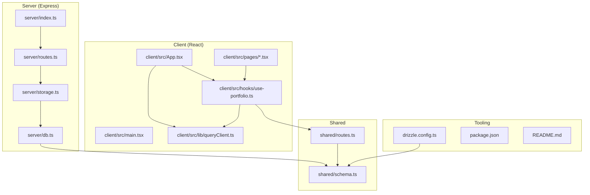
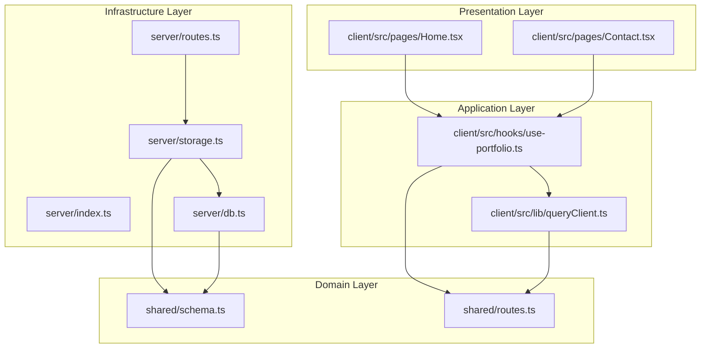
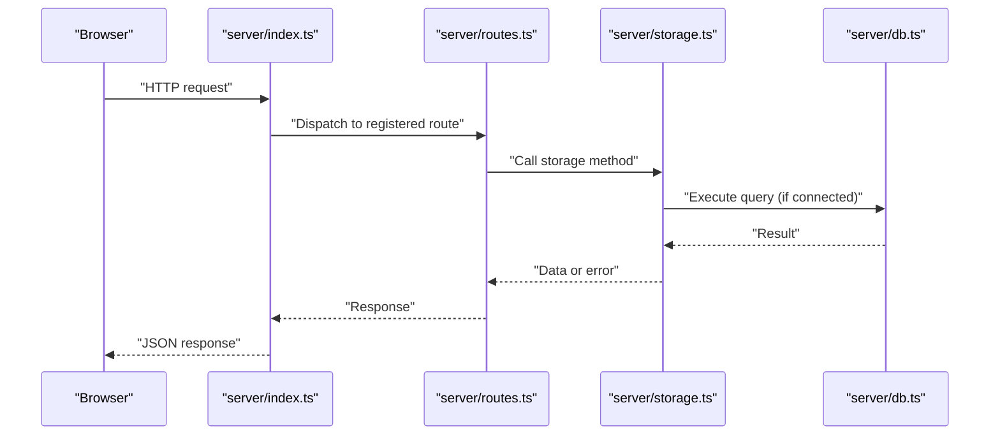
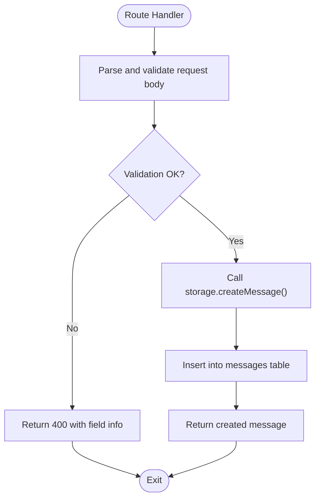
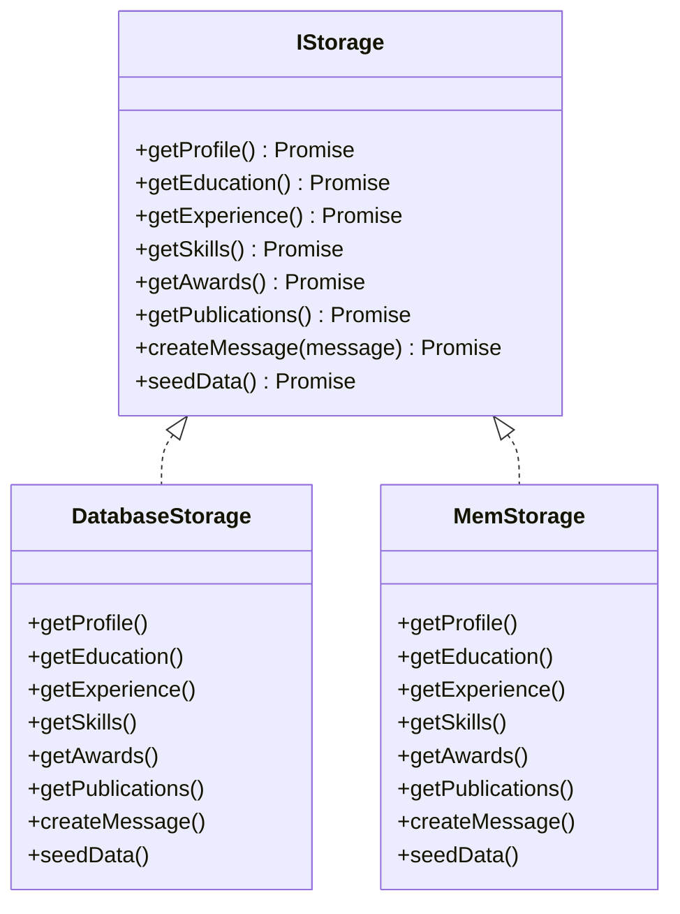
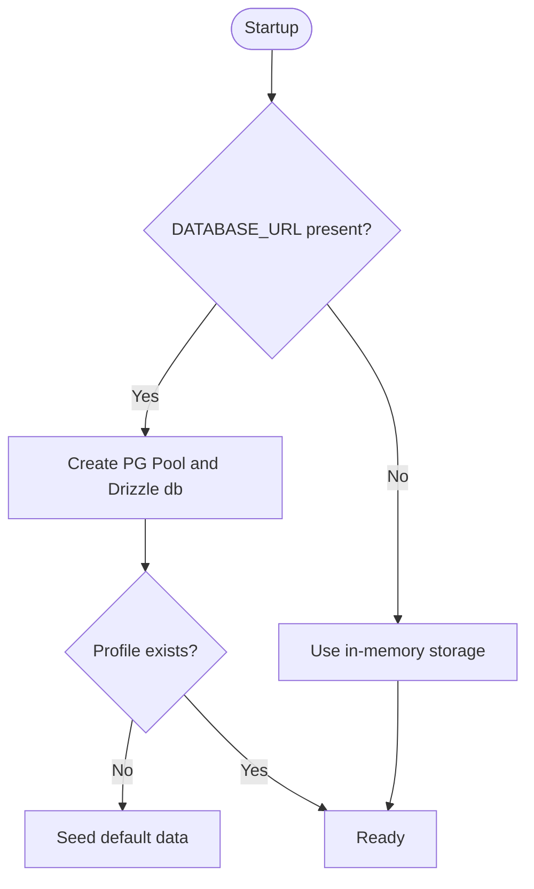
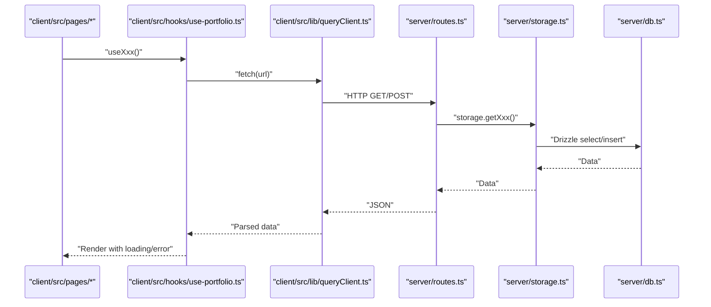
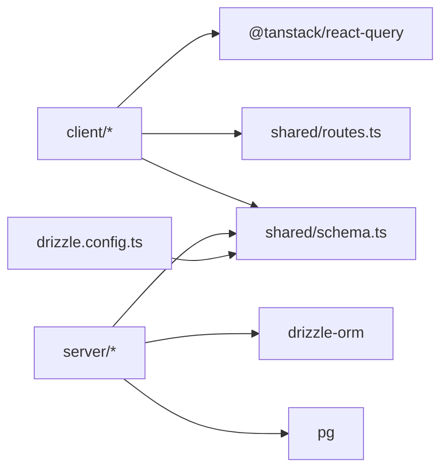

# Architecture Overview

<cite>
**Referenced Files in This Document**
- [README.md](file://README.md)
- [package.json](file://package.json)
- [server/index.ts](file://server/index.ts)
- [server/db.ts](file://server/db.ts)
- [server/storage.ts](file://server/storage.ts)
- [server/routes.ts](file://server/routes.ts)
- [shared/schema.ts](file://shared/schema.ts)
- [shared/routes.ts](file://shared/routes.ts)
- [drizzle.config.ts](file://drizzle.config.ts)
- [client/src/main.tsx](file://client/src/main.tsx)
- [client/src/App.tsx](file://client/src/App.tsx)
- [client/src/lib/queryClient.ts](file://client/src/lib/queryClient.ts)
- [client/src/hooks/use-portfolio.ts](file://client/src/hooks/use-portfolio.ts)
- [client/src/pages/Home.tsx](file://client/src/pages/Home.tsx)
- [client/src/pages/Contact.tsx](file://client/src/pages/Contact.tsx)
</cite>

## Table of Contents
1. [Introduction](#introduction)
2. [Project Structure](#project-structure)
3. [Core Components](#core-components)
4. [Architecture Overview](#architecture-overview)
5. [Detailed Component Analysis](#detailed-component-analysis)
6. [Dependency Analysis](#dependency-analysis)
7. [Performance Considerations](#performance-considerations)
8. [Troubleshooting Guide](#troubleshooting-guide)
9. [Conclusion](#conclusion)

## Introduction
This document describes the architecture of the Personal Showcase portfolio application as a full-stack React + Express system. The application follows a layered architecture:
- Presentation layer (React components)
- Application layer (React Query hooks)
- Domain layer (shared schemas and API definitions)
- Infrastructure layer (database connections and storage implementations)

It supports dual storage providers: PostgreSQL via Drizzle ORM with automatic seeding, and an in-memory fallback for local development. The system exposes a REST-like API with typed endpoints defined centrally and consumed by the frontend.

## Project Structure
The repository is organized into four primary areas:
- client: React frontend with routing, UI components, and React Query integration
- server: Express API server, route registration, storage abstraction, and database connection
- shared: Shared data schemas and API route definitions
- root scripts and configs: Build, dev, and database tooling

**Diagram sources**
- [client/src/App.tsx](file://client/src/App.tsx#L1-L51)
- [client/src/main.tsx](file://client/src/main.tsx#L1-L6)
- [client/src/lib/queryClient.ts](file://client/src/lib/queryClient.ts#L1-L58)
- [client/src/hooks/use-portfolio.ts](file://client/src/hooks/use-portfolio.ts#L1-L115)
- [client/src/pages/Home.tsx](file://client/src/pages/Home.tsx#L1-L144)
- [client/src/pages/Contact.tsx](file://client/src/pages/Contact.tsx#L1-L178)
- [server/index.ts](file://server/index.ts#L1-L103)
- [server/routes.ts](file://server/routes.ts#L1-L66)
- [server/storage.ts](file://server/storage.ts#L1-L323)
- [server/db.ts](file://server/db.ts#L1-L12)
- [shared/schema.ts](file://shared/schema.ts#L1-L86)
- [shared/routes.ts](file://shared/routes.ts#L1-L112)
- [drizzle.config.ts](file://drizzle.config.ts#L1-L15)
- [package.json](file://package.json#L1-L114)

**Section sources**
- [README.md](file://README.md#L58-L71)
- [package.json](file://package.json#L1-L114)

## Core Components
- Frontend entry and routing:
  - Root rendering and global providers (React Query, tooltips, toasts)
  - Page-level components for each portfolio section
- Application layer (React Query):
  - Centralized API request wrapper and query/mutation helpers
  - Typed hooks for each resource (profile, education, experience, skills, awards, publications, contact)
- Domain layer (shared):
  - Drizzle table definitions and Zod insert schemas
  - API route definitions with response/input schemas
- Infrastructure layer (backend):
  - Express server with logging middleware and error handling
  - Storage interface and two implementations: PostgreSQL-backed and in-memory
  - Database connection via Drizzle and optional seeding

**Section sources**
- [client/src/main.tsx](file://client/src/main.tsx#L1-L6)
- [client/src/App.tsx](file://client/src/App.tsx#L1-L51)
- [client/src/lib/queryClient.ts](file://client/src/lib/queryClient.ts#L1-L58)
- [client/src/hooks/use-portfolio.ts](file://client/src/hooks/use-portfolio.ts#L1-L115)
- [shared/schema.ts](file://shared/schema.ts#L1-L86)
- [shared/routes.ts](file://shared/routes.ts#L1-L112)
- [server/index.ts](file://server/index.ts#L1-L103)
- [server/storage.ts](file://server/storage.ts#L1-L323)
- [server/db.ts](file://server/db.ts#L1-L12)

## Architecture Overview
The system enforces a layered architecture with clear boundaries:
- Presentation layer: React components and pages
- Application layer: React Query hooks encapsulate data fetching and submission
- Domain layer: Shared schemas and API definitions
- Infrastructure layer: Storage abstraction with dual providers

**Diagram sources**
- [client/src/pages/Home.tsx](file://client/src/pages/Home.tsx#L1-L144)
- [client/src/pages/Contact.tsx](file://client/src/pages/Contact.tsx#L1-L178)
- [client/src/hooks/use-portfolio.ts](file://client/src/hooks/use-portfolio.ts#L1-L115)
- [client/src/lib/queryClient.ts](file://client/src/lib/queryClient.ts#L1-L58)
- [shared/routes.ts](file://shared/routes.ts#L1-L112)
- [shared/schema.ts](file://shared/schema.ts#L1-L86)
- [server/index.ts](file://server/index.ts#L1-L103)
- [server/routes.ts](file://server/routes.ts#L1-L66)
- [server/storage.ts](file://server/storage.ts#L1-L323)
- [server/db.ts](file://server/db.ts#L1-L12)

## Detailed Component Analysis

### Backend Express Server
- Initializes Express, JSON parsing, and request logging
- Registers routes and sets up static serving in production or Vite dev server in development
- Exposes a unified port for both API and client
- Centralized error handler returning standardized JSON errors

**Diagram sources**
- [server/index.ts](file://server/index.ts#L1-L103)
- [server/routes.ts](file://server/routes.ts#L1-L66)
- [server/storage.ts](file://server/storage.ts#L1-L323)
- [server/db.ts](file://server/db.ts#L1-L12)

**Section sources**
- [server/index.ts](file://server/index.ts#L1-L103)

### API Routing and Validation
- Registers GET endpoints for profile, education, experience, skills, awards, and publications
- Registers POST endpoint for contact submissions with Zod-based input validation
- Uses shared API definitions for path, method, input, and response schemas

**Diagram sources**
- [server/routes.ts](file://server/routes.ts#L48-L62)
- [shared/routes.ts](file://shared/routes.ts#L88-L99)
- [shared/schema.ts](file://shared/schema.ts#L58-L64)

**Section sources**
- [server/routes.ts](file://server/routes.ts#L1-L66)
- [shared/routes.ts](file://shared/routes.ts#L1-L112)
- [shared/schema.ts](file://shared/schema.ts#L1-L86)

### Storage Abstraction and Repository Pattern
- IStorage defines the contract for all data access methods
- DatabaseStorage implements IStorage using Drizzle ORM against PostgreSQL
- MemStorage implements IStorage using in-memory arrays
- A single exported storage instance selects the provider based on DATABASE_URL

**Diagram sources**
- [server/storage.ts](file://server/storage.ts#L9-L323)

**Section sources**
- [server/storage.ts](file://server/storage.ts#L1-L323)

### Database Connection and Seeding
- Drizzle connection created from DATABASE_URL; null when absent
- Automatic seeding on startup if no profile exists
- Drizzle config requires DATABASE_URL and points to shared schema

**Diagram sources**
- [server/db.ts](file://server/db.ts#L1-L12)
- [server/storage.ts](file://server/storage.ts#L60-L225)
- [drizzle.config.ts](file://drizzle.config.ts#L1-L15)

**Section sources**
- [server/db.ts](file://server/db.ts#L1-L12)
- [server/storage.ts](file://server/storage.ts#L60-L225)
- [drizzle.config.ts](file://drizzle.config.ts#L1-L15)

### Frontend Data Access and Queries
- React Query centralizes HTTP requests and caching behavior
- usePortfolio hooks encapsulate fetching and validation using shared API schemas
- Contact form uses mutation hook with optimistic UX and toast feedback

**Diagram sources**
- [client/src/hooks/use-portfolio.ts](file://client/src/hooks/use-portfolio.ts#L1-L115)
- [client/src/lib/queryClient.ts](file://client/src/lib/queryClient.ts#L1-L58)
- [server/routes.ts](file://server/routes.ts#L1-L66)
- [server/storage.ts](file://server/storage.ts#L1-L323)
- [server/db.ts](file://server/db.ts#L1-L12)

**Section sources**
- [client/src/hooks/use-portfolio.ts](file://client/src/hooks/use-portfolio.ts#L1-L115)
- [client/src/lib/queryClient.ts](file://client/src/lib/queryClient.ts#L1-L58)
- [client/src/pages/Home.tsx](file://client/src/pages/Home.tsx#L1-L144)
- [client/src/pages/Contact.tsx](file://client/src/pages/Contact.tsx#L1-L178)

### Shared Domain Contracts
- shared/schema.ts defines database tables and Zod insert schemas for validation
- shared/routes.ts defines API endpoints, HTTP methods, paths, input schemas, and response schemas
- These artifacts are consumed by both server and client for type-safe integration

**Section sources**
- [shared/schema.ts](file://shared/schema.ts#L1-L86)
- [shared/routes.ts](file://shared/routes.ts#L1-L112)

## Dependency Analysis
- Client depends on:
  - React Query for caching and network handling
  - Shared schemas and API definitions for typing and validation
- Server depends on:
  - Drizzle ORM and PostgreSQL driver
  - Shared schema definitions for table models
- Tooling:
  - Drizzle Kit for migrations and schema generation
  - Vite for dev server and build pipeline

**Diagram sources**
- [client/src/lib/queryClient.ts](file://client/src/lib/queryClient.ts#L1-L58)
- [client/src/hooks/use-portfolio.ts](file://client/src/hooks/use-portfolio.ts#L1-L115)
- [shared/routes.ts](file://shared/routes.ts#L1-L112)
- [shared/schema.ts](file://shared/schema.ts#L1-L86)
- [server/storage.ts](file://server/storage.ts#L1-L323)
- [drizzle.config.ts](file://drizzle.config.ts#L1-L15)

**Section sources**
- [package.json](file://package.json#L1-L114)
- [drizzle.config.ts](file://drizzle.config.ts#L1-L15)

## Performance Considerations
- Client-side caching: React Query is configured with infinite staleTime and no retries/refetch to minimize unnecessary network calls during typical browsing.
- Minimal overhead: In-memory provider avoids network latency for local development; PostgreSQL provider scales to production needs.
- Request logging: Server logs API calls with timing and response shape for observability.

[No sources needed since this section provides general guidance]

## Troubleshooting Guide
- No database configured:
  - Symptom: Data loads from in-memory provider; seeding runs on first request.
  - Action: Set DATABASE_URL and run the migration script to use PostgreSQL.
- Validation errors on contact form:
  - Symptom: 400 responses with field-specific messages.
  - Action: Ensure input matches shared insert schema; client validates via Zod before sending.
- API errors:
  - Symptom: 500 responses with standardized JSON error payload.
  - Action: Check server logs for stack traces; ensure routes are registered and storage is initialized.

**Section sources**
- [server/index.ts](file://server/index.ts#L65-L77)
- [server/routes.ts](file://server/routes.ts#L48-L62)
- [shared/routes.ts](file://shared/routes.ts#L19-L30)

## Conclusion
The Personal Showcase application cleanly separates concerns across layers:
- Presentation (React) consumes typed hooks
- Application (React Query) manages data fetching and submission
- Domain (shared) defines schemas and API contracts
- Infrastructure (Express + Drizzle) implements storage with a repository-style abstraction

The dual storage provider approach enables seamless development and production deployment, with automatic seeding and plug-and-play database configuration.