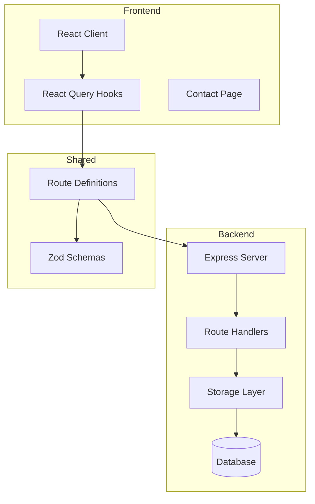
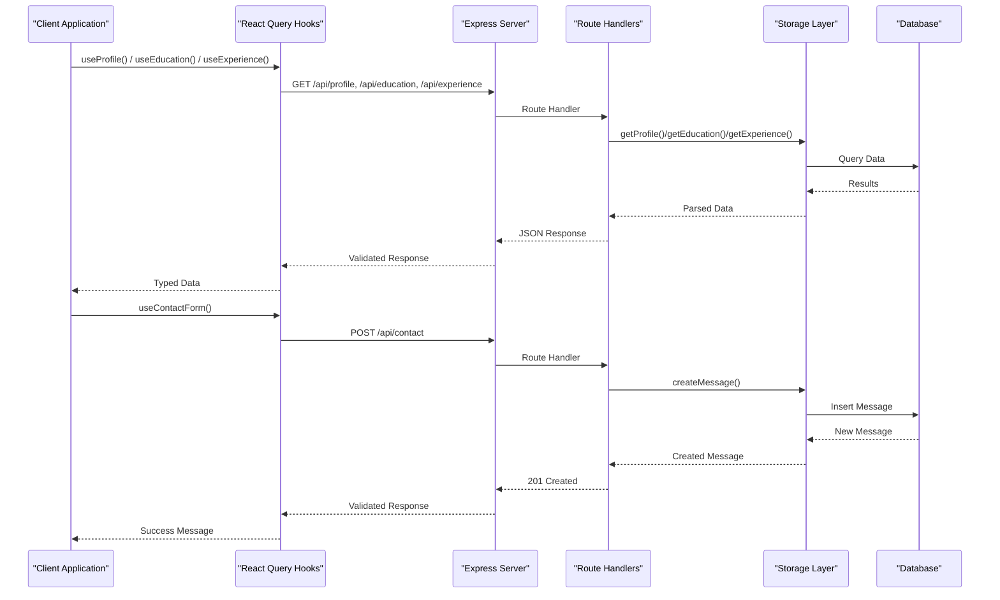
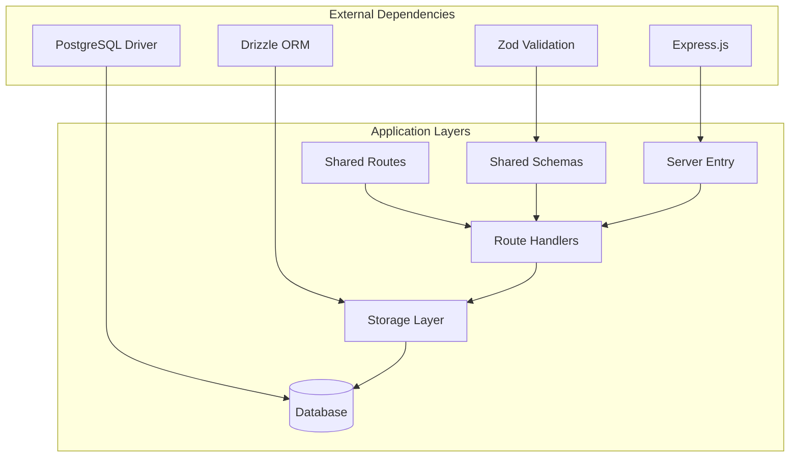

# API Endpoints

<cite>
**Referenced Files in This Document**
- [server/index.ts](file://server/index.ts)
- [server/routes.ts](file://server/routes.ts)
- [server/storage.ts](file://server/storage.ts)
- [server/db.ts](file://server/db.ts)
- [shared/routes.ts](file://shared/routes.ts)
- [shared/schema.ts](file://shared/schema.ts)
- [client/src/hooks/use-portfolio.ts](file://client/src/hooks/use-portfolio.ts)
- [client/src/pages/Contact.tsx](file://client/src/pages/Contact.tsx)
- [README.md](file://README.md)
</cite>

## Table of Contents
1. [Introduction](#introduction)
2. [Project Structure](#project-structure)
3. [Core Components](#core-components)
4. [Architecture Overview](#architecture-overview)
5. [Detailed Endpoint Documentation](#detailed-endpoint-documentation)
6. [Shared Route Definitions](#shared-route-definitions)
7. [Dependency Analysis](#dependency-analysis)
8. [Performance Considerations](#performance-considerations)
9. [Troubleshooting Guide](#troubleshooting-guide)
10. [Conclusion](#conclusion)

## Introduction
This document provides comprehensive API documentation for the Personal Showcase portfolio application. The backend exposes REST endpoints for retrieving personal information, academic background, professional experience, technical expertise, achievements, research publications, and handling contact form submissions. The API follows a consistent design pattern with shared route definitions and strict request/response validation using Zod schemas.

The application supports dual storage modes:
- PostgreSQL with Drizzle ORM for production deployments
- In-memory storage for local development and testing

## Project Structure
The API is organized into three main layers:
- Backend server with Express.js
- Shared route definitions and validation schemas
- Frontend client consuming the API with React Query



**Diagram sources**
- [server/index.ts](file://server/index.ts#L1-L103)
- [server/routes.ts](file://server/routes.ts#L1-L66)
- [shared/routes.ts](file://shared/routes.ts#L1-L112)

**Section sources**
- [README.md](file://README.md#L1-L71)
- [server/index.ts](file://server/index.ts#L1-L103)

## Core Components
The API consists of several core components working together:

### Route Definition System
The shared route definitions provide:
- HTTP method and URL path constants
- Request input validation schemas
- Response schema definitions with status codes
- Utility functions for URL building

### Storage Abstraction
The storage layer provides:
- DatabaseStorage for PostgreSQL with Drizzle ORM
- MemStorage for in-memory fallback
- Automatic data seeding on startup
- Consistent CRUD operations across both storage types

### Validation Layer
Zod schemas ensure:
- Request payload validation before processing
- Response payload validation for consistency
- Type-safe data structures across the application boundary

**Section sources**
- [shared/routes.ts](file://shared/routes.ts#L1-L112)
- [shared/schema.ts](file://shared/schema.ts#L1-L86)
- [server/storage.ts](file://server/storage.ts#L1-L323)

## Architecture Overview
The API follows a layered architecture with clear separation of concerns:



**Diagram sources**
- [client/src/hooks/use-portfolio.ts](file://client/src/hooks/use-portfolio.ts#L1-L115)
- [server/routes.ts](file://server/routes.ts#L15-L62)
- [server/storage.ts](file://server/storage.ts#L22-L58)

## Detailed Endpoint Documentation

### GET /api/profile
Retrieves personal profile information including name, title, bio, contact details, and professional links.

**Endpoint Details:**
- Method: GET
- Path: `/api/profile`
- Authentication: Not required
- Response Status: 200 OK, 404 Not Found

**Request Parameters:**
- None

**Response Schema (200 OK):**
```typescript
{
  id: number,
  name: string,
  title: string,
  bio: string,
  email: string,
  location: string,
  linkedin?: string,
  orcid?: string,
  scopus?: string
}
```

**Example Request:**
```bash
curl -X GET http://localhost:5001/api/profile
```

**Example Response:**
```json
{
  "id": 1,
  "name": "NL. Swathi",
  "title": "Pharm D | PhD Scholar",
  "bio": "Dedicated researcher specializing in molecular docking...",
  "email": "nlswathi2001@gmail.com",
  "location": "Chittoor, Andhra Pradesh, India",
  "linkedin": "https://linkedin.com/in/swathi-naraganti-06ba64203",
  "orcid": "0000-0002-3695-0732",
  "scopus": "58336556300"
}
```

**Error Scenarios:**
- 404 Not Found: Profile data not available (only occurs if database is empty and seeding fails)

**Common Usage Patterns:**
- Initial page load to display personal information
- Contact page pre-fill with profile data
- Social media integration for sharing

**Section sources**
- [server/routes.ts](file://server/routes.ts#L15-L21)
- [shared/routes.ts](file://shared/routes.ts#L33-L42)
- [shared/schema.ts](file://shared/schema.ts#L7-L17)

### GET /api/education
Retrieves academic background information including degrees, institutions, years, and details.

**Endpoint Details:**
- Method: GET
- Path: `/api/education`
- Authentication: Not required
- Response Status: 200 OK

**Request Parameters:**
- None

**Response Schema (200 OK):**
```typescript
Array<{
  id: number,
  degree: string,
  institution: string,
  year: string,
  details?: string
}>
```

**Example Request:**
```bash
curl -X GET http://localhost:5001/api/education
```

**Example Response:**
```json
[
  {
    "id": 1,
    "degree": "PhD",
    "institution": "Manipal College of Nursing, Manipal Academy of Higher Education",
    "year": "Current",
    "details": "Manipal, Karnataka, India"
  },
  {
    "id": 2,
    "degree": "Pharm D (Doctor Of Pharmacy)",
    "institution": "Jawaharlal Nehru Technological University, Anantapuramu",
    "year": "2025",
    "details": "Chittoor, India"
  }
]
```

**Error Scenarios:**
- No errors expected - returns empty array if no data available

**Common Usage Patterns:**
- Academic timeline display
- Resume/CV generation
- Educational background section rendering

**Section sources**
- [server/routes.ts](file://server/routes.ts#L23-L26)
- [shared/routes.ts](file://shared/routes.ts#L44-L51)
- [shared/schema.ts](file://shared/schema.ts#L19-L25)

### GET /api/experience
Retrieves professional experience information including roles, companies, periods, and descriptions.

**Endpoint Details:**
- Method: GET
- Path: `/api/experience`
- Authentication: Not required
- Response Status: 200 OK

**Request Parameters:**
- None

**Response Schema (200 OK):**
```typescript
Array<{
  id: number,
  role: string,
  company: string,
  period: string,
  description?: string
}>
```

**Example Request:**
```bash
curl -X GET http://localhost:5001/api/experience
```

**Example Response:**
```json
[
  {
    "id": 1,
    "role": "Research Mentor and Article Editor",
    "company": "The Good Research Project",
    "period": "June 2024 - Present",
    "description": "Led and coordinated multiple research projects..."
  }
]
```

**Error Scenarios:**
- No errors expected - returns empty array if no data available

**Common Usage Patterns:**
- Professional timeline display
- Career progression visualization
- Experience section for job applications

**Section sources**
- [server/routes.ts](file://server/routes.ts#L28-L31)
- [shared/routes.ts](file://shared/routes.ts#L52-L60)
- [shared/schema.ts](file://shared/schema.ts#L27-L33)

### GET /api/skills
Retrieves technical expertise categorized into skill groups with associated items.

**Endpoint Details:**
- Method: GET
- Path: `/api/skills`
- Authentication: Not required
- Response Status: 200 OK

**Request Parameters:**
- None

**Response Schema (200 OK):**
```typescript
Array<{
  id: number,
  category: string,
  items: string[]
}>
```

**Example Request:**
```bash
curl -X GET http://localhost:5001/api/skills
```

**Example Response:**
```json
[
  {
    "id": 1,
    "category": "Computational Biology",
    "items": ["Molecular Docking", "Virtual Screening", "Library Preparation", "Systems Biology"]
  }
]
```

**Error Scenarios:**
- No errors expected - returns empty array if no data available

**Common Usage Patterns:**
- Skills matrix display
- Technical competency assessment
- Resume/CV skills section

**Section sources**
- [server/routes.ts](file://server/routes.ts#L33-L36)
- [shared/routes.ts](file://shared/routes.ts#L61-L69)
- [shared/schema.ts](file://shared/schema.ts#L35-L39)

### GET /api/awards
Retrieves achievement and award information including titles, issuers, dates, and descriptions.

**Endpoint Details:**
- Method: GET
- Path: `/api/awards`
- Authentication: Not required
- Response Status: 200 OK

**Request Parameters:**
- None

**Response Schema (200 OK):**
```typescript
Array<{
  id: number,
  title: string,
  issuer: string,
  date: string,
  description?: string
}>
```

**Example Request:**
```bash
curl -X GET http://localhost:5001/api/awards
```

**Example Response:**
```json
[
  {
    "id": 1,
    "title": "INSPIRE Award",
    "issuer": "Andhra Pradesh Government",
    "date": "Jul 2017",
    "description": "Awarded to top 1% students after Intermediate Examination"
  }
]
```

**Error Scenarios:**
- No errors expected - returns empty array if no data available

**Common Usage Patterns:**
- Achievement showcase
- Recognition display
- CV honors section

**Section sources**
- [server/routes.ts](file://server/routes.ts#L38-L41)
- [shared/routes.ts](file://shared/routes.ts#L70-L78)
- [shared/schema.ts](file://shared/schema.ts#L41-L47)

### GET /api/publications
Retrieves research publication information including titles, journals, years, links, and authors.

**Endpoint Details:**
- Method: GET
- Path: `/api/publications`
- Authentication: Not required
- Response Status: 200 OK

**Request Parameters:**
- None

**Response Schema (200 OK):**
```typescript
Array<{
  id: number,
  title: string,
  journal?: string,
  year?: string,
  link?: string,
  authors?: string
}>
```

**Example Request:**
```bash
curl -X GET http://localhost:5001/api/publications
```

**Example Response:**
```json
[
  {
    "id": 1,
    "title": "Review of Pancreatic Cells Trans Differentiation in Diabetes Treatment",
    "journal": "Internet",
    "year": "2022",
    "link": "https://www.lcebyhkzz.cn//article/view/856/328.php",
    "authors": "Swathi NL, et al."
  }
]
```

**Error Scenarios:**
- No errors expected - returns empty array if no data available

**Common Usage Patterns:**
- Research portfolio display
- Academic CV section
- Publication archive

**Section sources**
- [server/routes.ts](file://server/routes.ts#L43-L46)
- [shared/routes.ts](file://shared/routes.ts#L79-L87)
- [shared/schema.ts](file://shared/schema.ts#L49-L56)

### POST /api/contact
Handles contact form submissions with validation and persistence.

**Endpoint Details:**
- Method: POST
- Path: `/api/contact`
- Authentication: Not required
- Response Status: 201 Created, 400 Bad Request

**Request Body Schema:**
```typescript
{
  name: string,    // Required, min length 1
  email: string,   // Required, valid email format
  message: string  // Required, min length 1
}
```

**Example Request:**
```bash
curl -X POST http://localhost:5001/api/contact \
  -H "Content-Type: application/json" \
  -d '{
    "name": "John Doe",
    "email": "john@example.com",
    "message": "Hello, I would like to discuss potential collaboration opportunities."
  }'
```

**Example Response (201 Created):**
```json
{
  "id": 1,
  "name": "John Doe",
  "email": "john@example.com",
  "message": "Hello, I would like to discuss potential collaboration opportunities.",
  "createdAt": "2024-01-15T10:30:00.000Z"
}
```

**Error Scenarios:**
- 400 Bad Request: Validation failed
  - Field: "name" - missing or invalid
  - Field: "email" - missing, invalid format, or invalid
  - Field: "message" - missing or invalid

**Common Usage Patterns:**
- Contact form submission
- Lead generation
- Communication pipeline

**Section sources**
- [server/routes.ts](file://server/routes.ts#L48-L62)
- [shared/routes.ts](file://shared/routes.ts#L88-L99)
- [shared/schema.ts](file://shared/schema.ts#L58-L64)

## Shared Route Definitions
The shared route definitions provide a centralized source of truth for API specifications, ensuring consistency between frontend and backend implementations.

### Route Definition Structure
Each endpoint definition includes:
- HTTP method constant
- Complete URL path
- Input validation schema (for POST endpoints)
- Response schemas mapped to status codes
- Type-safe response definitions

### Validation Schema Integration
The shared definitions integrate with Zod schemas for:
- Request payload validation before processing
- Response payload validation for consistency
- Type inference for frontend consumption

### URL Building Utility
The shared module provides a URL builder utility for dynamic path construction with parameter substitution.

**Section sources**
- [shared/routes.ts](file://shared/routes.ts#L1-L112)
- [shared/schema.ts](file://shared/schema.ts#L1-L86)

## Dependency Analysis
The API demonstrates excellent separation of concerns with clear dependency relationships:



**Diagram sources**
- [server/index.ts](file://server/index.ts#L1-L103)
- [server/routes.ts](file://server/routes.ts#L1-L66)
- [server/storage.ts](file://server/storage.ts#L1-L323)
- [shared/routes.ts](file://shared/routes.ts#L1-L112)
- [shared/schema.ts](file://shared/schema.ts#L1-L86)

**Section sources**
- [server/index.ts](file://server/index.ts#L1-L103)
- [server/routes.ts](file://server/routes.ts#L1-L66)
- [server/storage.ts](file://server/storage.ts#L1-L323)

## Performance Considerations
The API is designed with several performance optimizations:

### Caching Strategy
- React Query provides built-in caching for GET requests
- Automatic cache invalidation on successful mutations
- Efficient re-fetching strategies for updated data

### Database Optimization
- Single query per endpoint for data retrieval
- Minimal data transfer with selective field selection
- Connection pooling for PostgreSQL deployments

### Memory Efficiency
- In-memory storage for development reduces database overhead
- Automatic data seeding prevents repeated initialization
- Lightweight JSON serialization for responses

### Scalability Factors
- Stateless API design allows horizontal scaling
- Database abstraction enables storage migration
- Modular architecture supports feature expansion

## Troubleshooting Guide

### Common Issues and Solutions

**Database Connection Problems:**
- Symptom: API returns 500 errors or empty responses
- Solution: Verify DATABASE_URL environment variable and database connectivity
- Check: Database credentials, network connectivity, and schema migration status

**Validation Errors (400 Bad Request):**
- Symptom: Contact form submissions fail validation
- Common causes: Missing required fields, invalid email format
- Solution: Ensure all required fields are present and properly formatted

**CORS Issues:**
- Symptom: Frontend requests blocked by browser security
- Solution: Configure CORS headers in Express middleware
- Note: Development server runs on localhost:5001, ensure frontend matches

**Data Seeding Failures:**
- Symptom: Empty collections despite successful API calls
- Cause: Database not properly initialized or seeded
- Solution: Run `npm run db:push` to apply schema migrations

### Debugging Tips
- Enable verbose logging in development mode
- Use browser developer tools to inspect network requests
- Monitor server logs for detailed error information
- Test individual endpoints with curl commands

**Section sources**
- [server/index.ts](file://server/index.ts#L65-L76)
- [server/storage.ts](file://server/storage.ts#L60-L225)
- [README.md](file://README.md#L46-L56)

## Conclusion
The Personal Showcase API provides a robust, type-safe, and scalable foundation for portfolio applications. Its architecture emphasizes:

- **Consistency**: Shared route definitions ensure uniform behavior across frontend and backend
- **Reliability**: Comprehensive validation and error handling improve system stability
- **Flexibility**: Dual storage modes support various deployment scenarios
- **Maintainability**: Clear separation of concerns facilitates future enhancements

The API's design patterns and validation strategies serve as excellent examples for building production-ready backend services with modern JavaScript/TypeScript stacks.