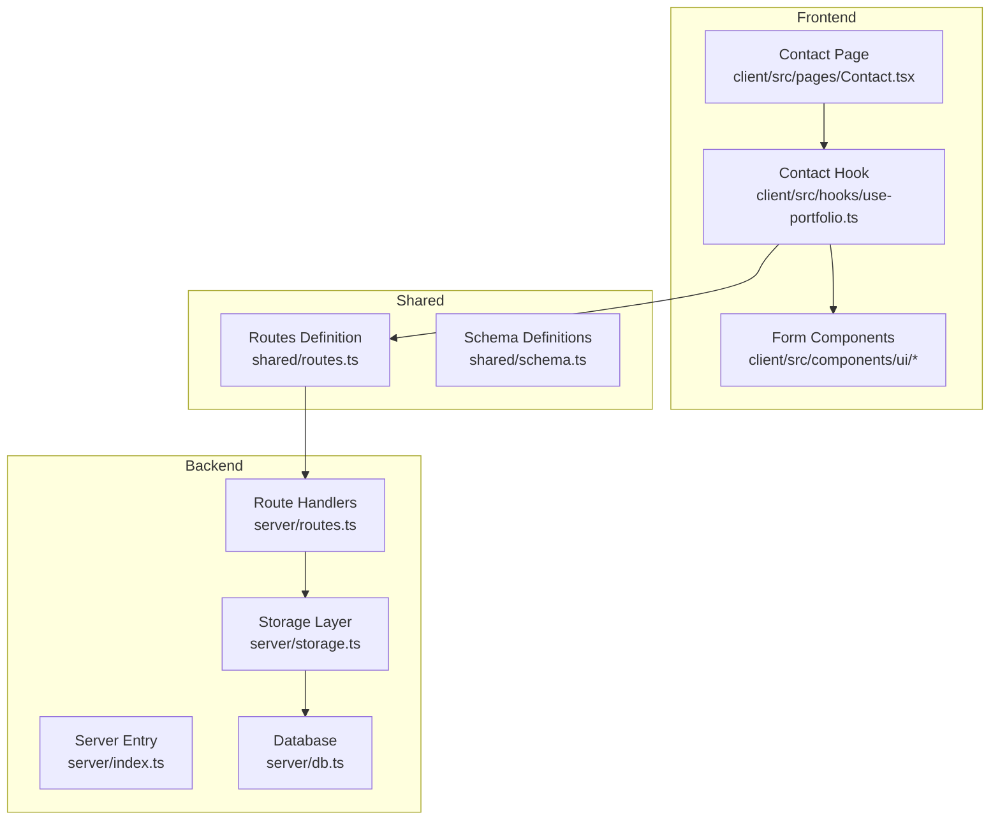
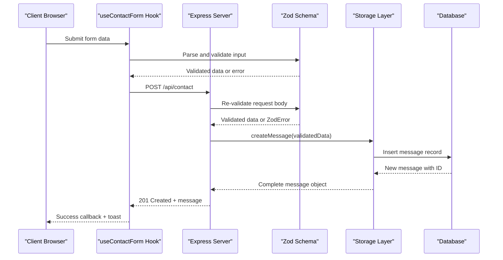
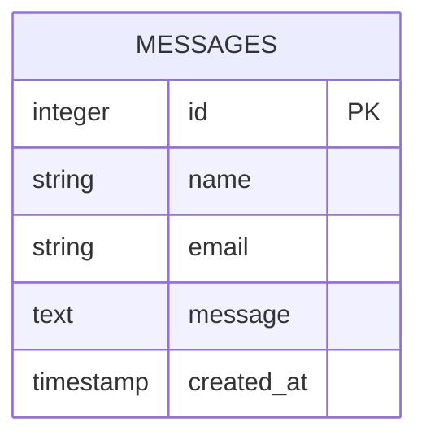
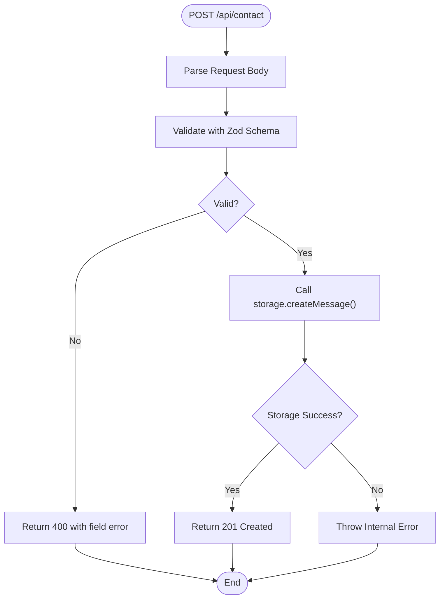
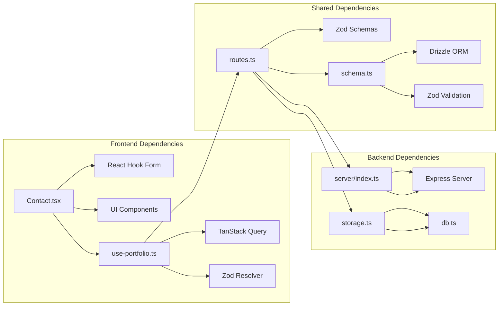

# Contact Form Endpoint

<cite>
**Referenced Files in This Document**
- [server/index.ts](file://server/index.ts)
- [server/routes.ts](file://server/routes.ts)
- [server/storage.ts](file://server/storage.ts)
- [server/db.ts](file://server/db.ts)
- [shared/routes.ts](file://shared/routes.ts)
- [shared/schema.ts](file://shared/schema.ts)
- [client/src/pages/Contact.tsx](file://client/src/pages/Contact.tsx)
- [client/src/hooks/use-portfolio.ts](file://client/src/hooks/use-portfolio.ts)
</cite>

## Table of Contents
1. [Introduction](#introduction)
2. [Project Structure](#project-structure)
3. [Core Components](#core-components)
4. [Architecture Overview](#architecture-overview)
5. [Detailed Component Analysis](#detailed-component-analysis)
6. [Dependency Analysis](#dependency-analysis)
7. [Performance Considerations](#performance-considerations)
8. [Troubleshooting Guide](#troubleshooting-guide)
9. [Conclusion](#conclusion)
10. [Appendices](#appendices)

## Introduction
This document provides comprehensive API documentation for the contact form submission endpoint. It covers the POST /api/contact endpoint, including request body validation, Zod schema requirements, response handling, and the complete message creation process. It also includes frontend integration examples, validation feedback mechanisms, and best practices for form handling and user experience.

## Project Structure
The contact form endpoint spans three main areas:
- Backend API server with Express and route registration
- Shared schema definitions for validation and type safety
- Frontend React components with React Hook Form and TanStack Query integration



**Diagram sources**
- [client/src/pages/Contact.tsx](file://client/src/pages/Contact.tsx#L1-L172)
- [client/src/hooks/use-portfolio.ts](file://client/src/hooks/use-portfolio.ts#L1-L115)
- [shared/routes.ts](file://shared/routes.ts#L1-L112)
- [shared/schema.ts](file://shared/schema.ts#L1-L86)
- [server/index.ts](file://server/index.ts#L1-L103)
- [server/routes.ts](file://server/routes.ts#L1-L66)
- [server/storage.ts](file://server/storage.ts#L1-L323)
- [server/db.ts](file://server/db.ts#L1-L12)

**Section sources**
- [server/index.ts](file://server/index.ts#L1-L103)
- [server/routes.ts](file://server/routes.ts#L1-L66)
- [shared/routes.ts](file://shared/routes.ts#L1-L112)
- [shared/schema.ts](file://shared/schema.ts#L1-L86)
- [client/src/pages/Contact.tsx](file://client/src/pages/Contact.tsx#L1-L172)
- [client/src/hooks/use-portfolio.ts](file://client/src/hooks/use-portfolio.ts#L1-L115)

## Core Components
The contact form endpoint consists of several interconnected components:

### Backend Route Handler
The POST /api/contact endpoint is implemented in the route handler with comprehensive validation and error handling.

### Shared Validation Schema
Zod schemas define the exact structure and validation rules for contact form submissions.

### Storage Implementation
Dual storage backend supporting both PostgreSQL database and in-memory storage for development.

### Frontend Integration
React components with form validation and mutation handling using TanStack Query.

**Section sources**
- [server/routes.ts](file://server/routes.ts#L48-L62)
- [shared/schema.ts](file://shared/schema.ts#L58-L74)
- [server/storage.ts](file://server/storage.ts#L54-L58)
- [client/src/pages/Contact.tsx](file://client/src/pages/Contact.tsx#L24-L37)

## Architecture Overview
The contact form submission follows a clear request-response flow with validation at multiple layers.



**Diagram sources**
- [client/src/hooks/use-portfolio.ts](file://client/src/hooks/use-portfolio.ts#L82-L99)
- [server/routes.ts](file://server/routes.ts#L48-L62)
- [shared/schema.ts](file://shared/schema.ts#L74)
- [server/storage.ts](file://server/storage.ts#L54-L58)
- [server/db.ts](file://server/db.ts#L1-L12)

## Detailed Component Analysis

### API Endpoint Definition
The contact form endpoint is defined in the shared routes configuration with explicit method, path, input schema, and response definitions.

**Endpoint Specification:**
- Method: POST
- Path: /api/contact
- Input Schema: insertMessageSchema
- Success Response: 201 Created with message object
- Error Response: 400 Bad Request with validation error

**Section sources**
- [shared/routes.ts](file://shared/routes.ts#L88-L98)

### Request Body Validation
The contact form data structure is defined in the shared schema with strict validation rules:



**Validation Rules:**
- name: Required string (non-empty)
- email: Required string (valid email format)
- message: Required text (non-empty)

**Section sources**
- [shared/schema.ts](file://shared/schema.ts#L58-L64)
- [shared/schema.ts](file://shared/schema.ts#L74)

### Backend Route Implementation
The server route handles contact form submissions with comprehensive error handling:



**Diagram sources**
- [server/routes.ts](file://server/routes.ts#L48-L62)

**Section sources**
- [server/routes.ts](file://server/routes.ts#L48-L62)

### Storage Integration
The storage layer provides dual implementation support:

**Database Storage (Production):**
- Uses PostgreSQL via Drizzle ORM
- Inserts message records with automatic ID generation
- Returns complete message object with timestamps

**Memory Storage (Development):**
- In-memory implementation for local development
- Generates sequential IDs and timestamps
- Provides identical interface for testing

**Section sources**
- [server/storage.ts](file://server/storage.ts#L22-L58)
- [server/storage.ts](file://server/storage.ts#L228-L320)
- [server/db.ts](file://server/db.ts#L1-L12)

### Frontend Integration
The React frontend implements comprehensive form handling:

**Form Setup:**
- Uses React Hook Form with Zod resolver
- Pre-populated default values for name, email, and message
- Real-time validation feedback with FormMessage components

**Mutation Handling:**
- TanStack Query useContactForm hook manages async operations
- Automatic Zod validation before sending requests
- Toast notifications for success and error states
- Form reset on successful submission

**Section sources**
- [client/src/pages/Contact.tsx](file://client/src/pages/Contact.tsx#L24-L37)
- [client/src/hooks/use-portfolio.ts](file://client/src/hooks/use-portfolio.ts#L78-L114)

## Dependency Analysis



**Diagram sources**
- [client/src/pages/Contact.tsx](file://client/src/pages/Contact.tsx#L1-L172)
- [client/src/hooks/use-portfolio.ts](file://client/src/hooks/use-portfolio.ts#L1-L115)
- [shared/routes.ts](file://shared/routes.ts#L1-L112)
- [shared/schema.ts](file://shared/schema.ts#L1-L86)
- [server/index.ts](file://server/index.ts#L1-L103)
- [server/routes.ts](file://server/routes.ts#L1-L66)
- [server/storage.ts](file://server/storage.ts#L1-L323)
- [server/db.ts](file://server/db.ts#L1-L12)

**Section sources**
- [shared/routes.ts](file://shared/routes.ts#L1-L112)
- [shared/schema.ts](file://shared/schema.ts#L1-L86)
- [server/routes.ts](file://server/routes.ts#L1-L66)
- [server/storage.ts](file://server/storage.ts#L1-L323)

## Performance Considerations
- **Validation Efficiency**: Zod validation occurs twice (frontend and backend) but provides robust type safety and prevents invalid data from reaching the database
- **Database Connection**: Production environment uses connection pooling for optimal resource utilization
- **Response Time**: Simple INSERT operation with minimal overhead
- **Caching**: No caching implemented for contact form submissions (appropriate for ephemeral data)

## Troubleshooting Guide

### Common Validation Errors
**Field-specific error responses:**
- Name validation failures: Returns 400 with field path "name"
- Email validation failures: Returns 400 with field path "email" 
- Message validation failures: Returns 400 with field path "message"

**Error Response Format:**
```json
{
  "message": "Error message describing the validation failure",
  "field": "name"  // Field path causing the error
}
```

### Server-side Error Handling
**Database Unavailable:**
- Error thrown when database connection fails
- Results in 500 Internal Server Error response

**Network Issues:**
- Frontend handles network failures gracefully
- User receives appropriate error messaging through toast notifications

### Frontend Error Handling
**Client-side Validation:**
- Immediate feedback for form field errors
- Real-time validation as users type
- Form submission blocked until all validations pass

**Mutation Error States:**
- Error boundaries prevent application crashes
- User-friendly error messages via toast notifications
- Form remains editable for corrections

**Section sources**
- [server/routes.ts](file://server/routes.ts#L53-L61)
- [client/src/hooks/use-portfolio.ts](file://client/src/hooks/use-portfolio.ts#L91-L112)

## Conclusion
The contact form endpoint provides a robust, type-safe, and user-friendly solution for handling user communications. The implementation ensures data integrity through comprehensive validation, provides clear error feedback, and offers excellent user experience through real-time validation and responsive feedback mechanisms. The dual storage approach enables seamless development and production deployment while maintaining consistent behavior across environments.

## Appendices

### API Reference

**Endpoint:** POST /api/contact
**Authentication:** Not required
**Content-Type:** application/json

**Request Body:**
```json
{
  "name": "string",
  "email": "string",
  "message": "string"
}
```

**Success Response (201 Created):**
```json
{
  "id": 1,
  "name": "John Doe",
  "email": "john@example.com",
  "message": "Hello there!",
  "createdAt": "2024-01-01T00:00:00Z"
}
```

**Validation Error (400 Bad Request):**
```json
{
  "message": "Error message describing the validation failure",
  "field": "name"
}
```

**Internal Server Error (500):**
```json
{
  "message": "Internal Server Error"
}
```

### Frontend Integration Examples

**Basic Form Submission:**
```typescript
const { mutate: sendMessage, isPending } = useContactForm();

const handleSubmit = (formData) => {
  sendMessage(formData, {
    onSuccess: () => {
      // Reset form and show success
      form.reset();
    },
    onError: (error) => {
      // Handle error display
      console.error('Submission failed:', error.message);
    }
  });
};
```

**Best Practices:**
- Always use the provided Zod resolver for consistent validation
- Implement loading states during submission
- Provide clear success/error feedback to users
- Reset form state after successful submission
- Handle network errors gracefully with user-friendly messages