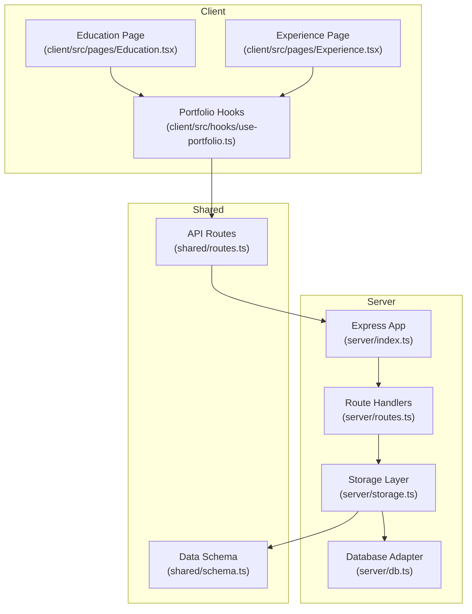
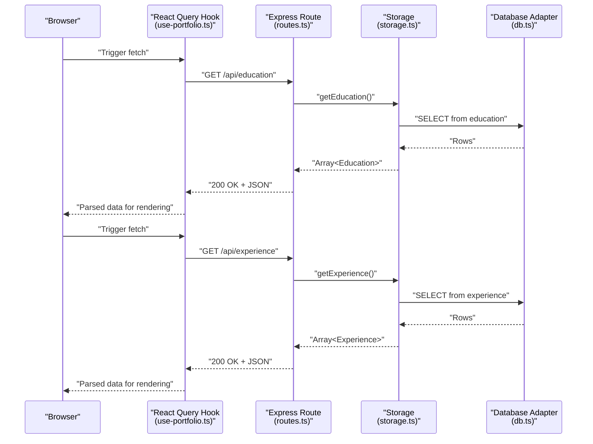
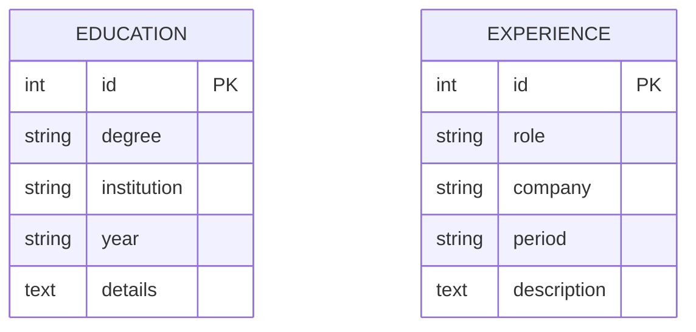
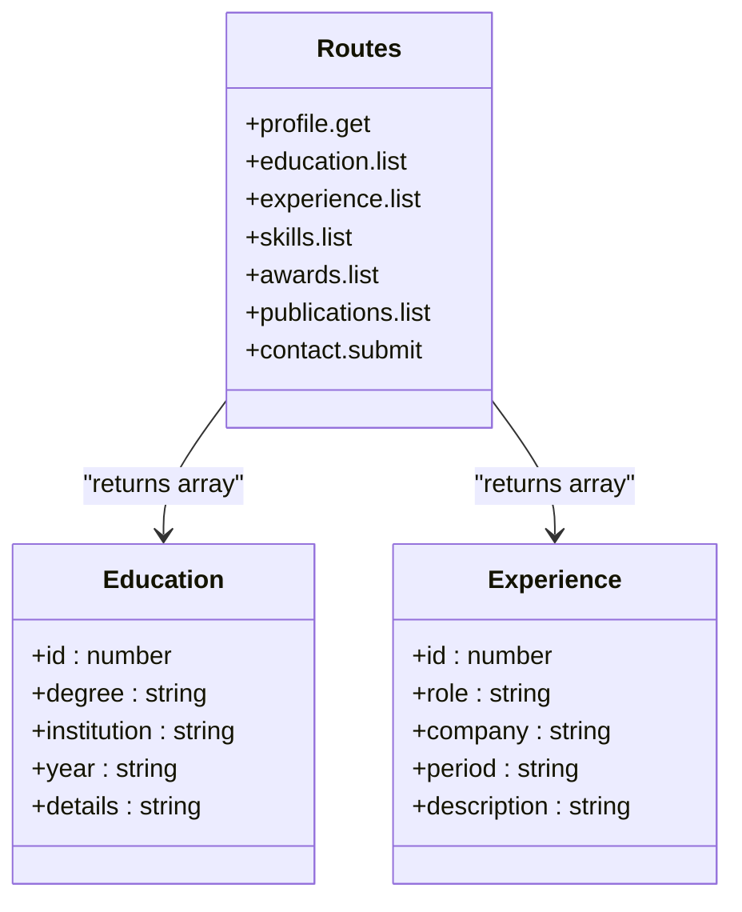
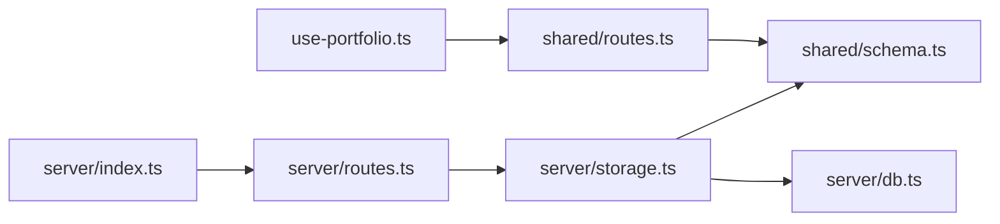

# Educational & Experience Endpoints

<cite>
**Referenced Files in This Document**
- [server/index.ts](file://server/index.ts)
- [server/routes.ts](file://server/routes.ts)
- [server/storage.ts](file://server/storage.ts)
- [server/db.ts](file://server/db.ts)
- [shared/routes.ts](file://shared/routes.ts)
- [shared/schema.ts](file://shared/schema.ts)
- [client/src/hooks/use-portfolio.ts](file://client/src/hooks/use-portfolio.ts)
- [client/src/pages/Education.tsx](file://client/src/pages/Education.tsx)
- [client/src/pages/Experience.tsx](file://client/src/pages/Experience.tsx)
</cite>

## Table of Contents
1. [Introduction](#introduction)
2. [Project Structure](#project-structure)
3. [Core Components](#core-components)
4. [Architecture Overview](#architecture-overview)
5. [Detailed Component Analysis](#detailed-component-analysis)
6. [Dependency Analysis](#dependency-analysis)
7. [Performance Considerations](#performance-considerations)
8. [Troubleshooting Guide](#troubleshooting-guide)
9. [Conclusion](#conclusion)

## Introduction
This document provides comprehensive API documentation for the educational and professional experience endpoints used by the personal showcase application. It covers:
- Endpoint definitions and request/response formats
- Data structures for both endpoints
- Current behavior (no query parameters)
- Frontend integration patterns
- Error handling and validation
- Architectural context and data flow

## Project Structure
The application follows a clear separation of concerns:
- Backend (Express server) exposes REST endpoints and delegates data access to storage implementations.
- Shared schema and route definitions define data contracts and API surface.
- Frontend (React) consumes the API via React Query hooks and renders educational and experience timelines.

**Diagram sources**
- [server/index.ts](file://server/index.ts#L1-L103)
- [server/routes.ts](file://server/routes.ts#L1-L66)
- [server/storage.ts](file://server/storage.ts#L1-L323)
- [server/db.ts](file://server/db.ts#L1-L12)
- [shared/routes.ts](file://shared/routes.ts#L1-L112)
- [shared/schema.ts](file://shared/schema.ts#L1-L86)
- [client/src/hooks/use-portfolio.ts](file://client/src/hooks/use-portfolio.ts#L1-L115)
- [client/src/pages/Education.tsx](file://client/src/pages/Education.tsx#L1-L70)
- [client/src/pages/Experience.tsx](file://client/src/pages/Experience.tsx#L1-L64)

**Section sources**
- [server/index.ts](file://server/index.ts#L1-L103)
- [server/routes.ts](file://server/routes.ts#L1-L66)
- [shared/routes.ts](file://shared/routes.ts#L1-L112)
- [shared/schema.ts](file://shared/schema.ts#L1-L86)
- [client/src/hooks/use-portfolio.ts](file://client/src/hooks/use-portfolio.ts#L1-L115)
- [client/src/pages/Education.tsx](file://client/src/pages/Education.tsx#L1-L70)
- [client/src/pages/Experience.tsx](file://client/src/pages/Experience.tsx#L1-L64)

## Core Components
- API Endpoints
  - GET /api/education: Returns an array of educational entries.
  - GET /api/experience: Returns an array of professional experience entries.
- Data Contracts
  - Education: degree, institution, year, details.
  - Experience: role, company, period, description.
- Frontend Integration
  - React Query hooks fetch and cache data.
  - Pages render timelines with skeleton loaders and animations.

**Section sources**
- [shared/routes.ts](file://shared/routes.ts#L43-L60)
- [shared/schema.ts](file://shared/schema.ts#L19-L33)
- [client/src/hooks/use-portfolio.ts](file://client/src/hooks/use-portfolio.ts#L18-L40)
- [client/src/pages/Education.tsx](file://client/src/pages/Education.tsx#L1-L70)
- [client/src/pages/Experience.tsx](file://client/src/pages/Experience.tsx#L1-L64)

## Architecture Overview
The backend exposes two GET endpoints that delegate to a storage layer. The storage layer either uses a PostgreSQL-backed implementation or an in-memory implementation depending on environment configuration. The frontend consumes these endpoints via React Query hooks and renders the data in timeline layouts.

**Diagram sources**
- [server/routes.ts](file://server/routes.ts#L23-L31)
- [server/storage.ts](file://server/storage.ts#L29-L37)
- [server/db.ts](file://server/db.ts#L1-L12)
- [client/src/hooks/use-portfolio.ts](file://client/src/hooks/use-portfolio.ts#L18-L40)

## Detailed Component Analysis

### GET /api/education
- Purpose: Retrieve academic background including degrees, institutions, dates, and achievements.
- Method: GET
- Path: /api/education
- Authentication: Not required
- Response Format: Array of Education objects
- Response Status: 200 OK
- Error Handling: None defined in route handler; server-level error middleware returns 500 with a message if unhandled exceptions occur.

Data Model: Education
- Fields
  - id: integer (primary key)
  - degree: string (non-null)
  - institution: string (non-null)
  - year: string (non-null)
  - details: string (nullable)

Validation and Parsing
- Frontend parsing: The hook validates the response against the shared Education schema before returning to components.
- Backend parsing: No explicit input validation is performed for this endpoint; the response is the raw stored data.

Current Behavior
- No query parameters are supported.
- Results are returned as-is from storage.

Integration Pattern
- Frontend uses a dedicated hook to fetch and parse the data.
- The Education page renders a vertical timeline with animated cards and skeleton loaders during loading.

Common Use Cases
- Displaying a chronological academic timeline.
- Filtering client-side by degree or institution (if needed) after receiving the full dataset.

Example Request/Response
- Request: GET /api/education
- Response: Array of Education objects (see Data Model)

**Section sources**
- [shared/routes.ts](file://shared/routes.ts#L43-L50)
- [shared/schema.ts](file://shared/schema.ts#L19-L25)
- [server/routes.ts](file://server/routes.ts#L23-L26)
- [server/storage.ts](file://server/storage.ts#L29-L32)
- [client/src/hooks/use-portfolio.ts](file://client/src/hooks/use-portfolio.ts#L18-L28)
- [client/src/pages/Education.tsx](file://client/src/pages/Education.tsx#L1-L70)

### GET /api/experience
- Purpose: Retrieve professional timeline data including positions, companies, responsibilities, and duration.
- Method: GET
- Path: /api/experience
- Authentication: Not required
- Response Format: Array of Experience objects
- Response Status: 200 OK
- Error Handling: None defined in route handler; server-level error middleware returns 500 with a message if unhandled exceptions occur.

Data Model: Experience
- Fields
  - id: integer (primary key)
  - role: string (non-null)
  - company: string (non-null)
  - period: string (non-null)
  - description: string (nullable)

Validation and Parsing
- Frontend parsing: The hook validates the response against the shared Experience schema before returning to components.
- Backend parsing: No explicit input validation is performed for this endpoint; the response is the raw stored data.

Current Behavior
- No query parameters are supported.
- Results are returned as-is from storage.

Integration Pattern
- Frontend uses a dedicated hook to fetch and parse the data.
- The Experience page renders a series of cards with animated entries and skeleton loaders during loading.

Common Use Cases
- Displaying a chronological professional timeline.
- Filtering client-side by role or company (if needed) after receiving the full dataset.

Example Request/Response
- Request: GET /api/experience
- Response: Array of Experience objects (see Data Model)

**Section sources**
- [shared/routes.ts](file://shared/routes.ts#L52-L59)
- [shared/schema.ts](file://shared/schema.ts#L27-L33)
- [server/routes.ts](file://server/routes.ts#L28-L31)
- [server/storage.ts](file://server/storage.ts#L34-L37)
- [client/src/hooks/use-portfolio.ts](file://client/src/hooks/use-portfolio.ts#L30-L40)
- [client/src/pages/Experience.tsx](file://client/src/pages/Experience.tsx#L1-L64)

### Data Structures

**Diagram sources**
- [shared/schema.ts](file://shared/schema.ts#L19-L33)

**Section sources**
- [shared/schema.ts](file://shared/schema.ts#L19-L33)

### API Definitions

**Diagram sources**
- [shared/routes.ts](file://shared/routes.ts#L32-L99)
- [shared/schema.ts](file://shared/schema.ts#L78-L84)

**Section sources**
- [shared/routes.ts](file://shared/routes.ts#L32-L99)
- [shared/schema.ts](file://shared/schema.ts#L78-L84)

## Dependency Analysis
- Backend routing depends on shared route definitions and storage implementations.
- Storage implementations depend on the shared schema and database adapter.
- Frontend hooks depend on shared route definitions and Zod schemas for runtime validation.

**Diagram sources**
- [client/src/hooks/use-portfolio.ts](file://client/src/hooks/use-portfolio.ts#L1-L115)
- [shared/routes.ts](file://shared/routes.ts#L1-L112)
- [shared/schema.ts](file://shared/schema.ts#L1-L86)
- [server/index.ts](file://server/index.ts#L1-L103)
- [server/routes.ts](file://server/routes.ts#L1-L66)
- [server/storage.ts](file://server/storage.ts#L1-L323)
- [server/db.ts](file://server/db.ts#L1-L12)

**Section sources**
- [server/index.ts](file://server/index.ts#L1-L103)
- [server/routes.ts](file://server/routes.ts#L1-L66)
- [server/storage.ts](file://server/storage.ts#L1-L323)
- [server/db.ts](file://server/db.ts#L1-L12)
- [shared/routes.ts](file://shared/routes.ts#L1-L112)
- [shared/schema.ts](file://shared/schema.ts#L1-L86)
- [client/src/hooks/use-portfolio.ts](file://client/src/hooks/use-portfolio.ts#L1-L115)

## Performance Considerations
- Current implementation performs straightforward SELECT queries without pagination or sorting.
- For large datasets, consider:
  - Adding server-side pagination and sorting parameters.
  - Implementing client-side caching and deduplication.
  - Optimizing database queries with indexes on frequently filtered fields.
- The frontend uses React Query, which provides built-in caching and refetching strategies.

[No sources needed since this section provides general guidance]

## Troubleshooting Guide
- Server-level errors
  - Unhandled exceptions result in a 500 Internal Server Error with a generic message.
  - Check server logs for stack traces.
- Frontend validation errors
  - If the response does not match the expected schema, the hook throws an error during parsing.
  - Verify that the backend returns the correct data shape and that the shared schema aligns with the stored data.
- Environment configuration
  - If DATABASE_URL is set, the app connects to PostgreSQL; otherwise, it uses an in-memory storage.
  - Confirm environment variables and connection string validity when encountering database-related issues.

**Section sources**
- [server/index.ts](file://server/index.ts#L65-L76)
- [server/storage.ts](file://server/storage.ts#L322-L323)
- [client/src/hooks/use-portfolio.ts](file://client/src/hooks/use-portfolio.ts#L18-L28)

## Conclusion
The educational and experience endpoints provide a clean, minimal API surface for rendering academic and professional timelines. The current implementation focuses on simplicity and reliability, with robust frontend validation and basic error handling. Future enhancements could include query parameters for filtering and sorting, pagination, and richer validation feedback.