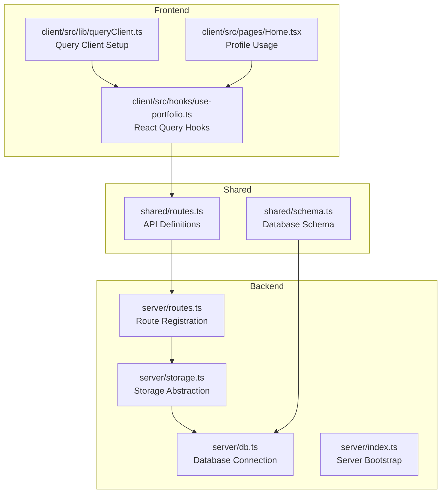
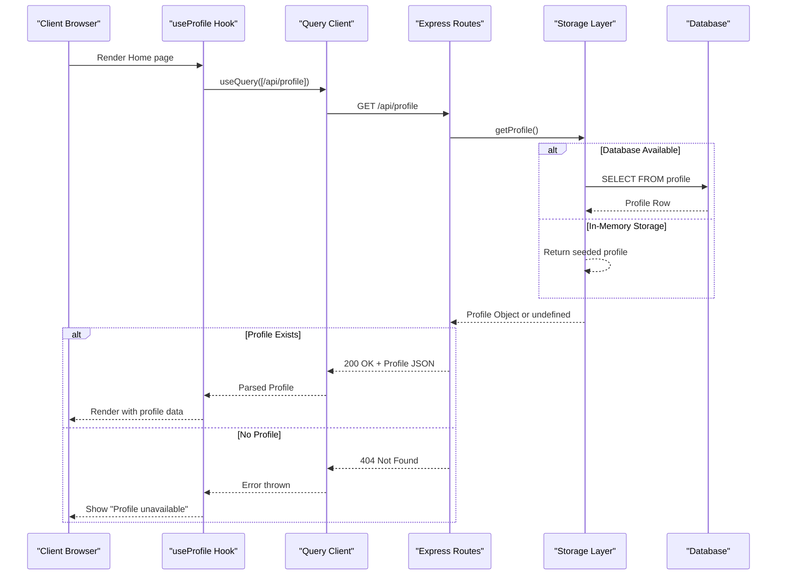
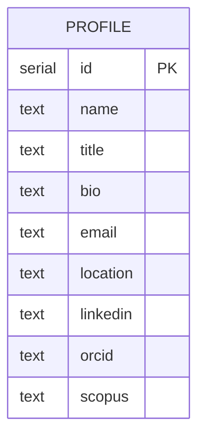
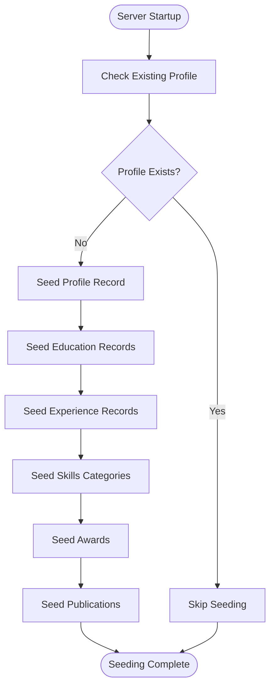
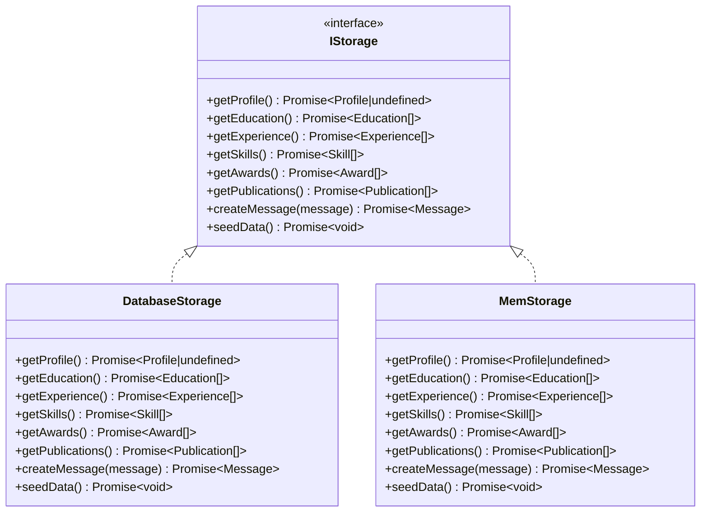
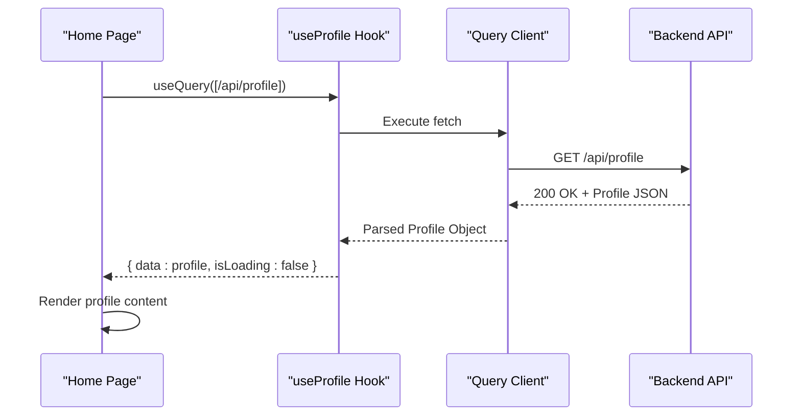
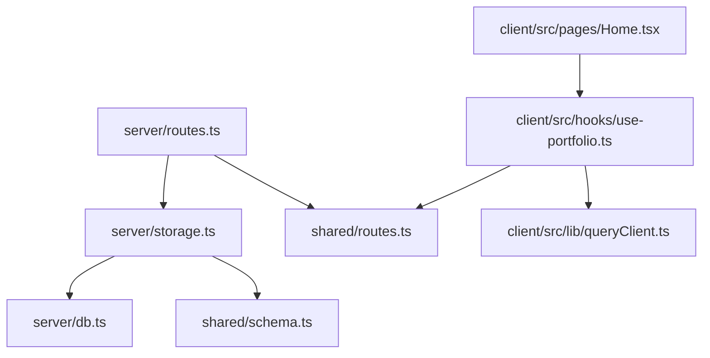

# Profile Endpoints

<cite>
**Referenced Files in This Document**
- [server/index.ts](file://server/index.ts)
- [server/routes.ts](file://server/routes.ts)
- [server/storage.ts](file://server/storage.ts)
- [server/db.ts](file://server/db.ts)
- [shared/routes.ts](file://shared/routes.ts)
- [shared/schema.ts](file://shared/schema.ts)
- [client/src/hooks/use-portfolio.ts](file://client/src/hooks/use-portfolio.ts)
- [client/src/lib/queryClient.ts](file://client/src/lib/queryClient.ts)
- [client/src/pages/Home.tsx](file://client/src/pages/Home.tsx)
</cite>

## Table of Contents
1. [Introduction](#introduction)
2. [Project Structure](#project-structure)
3. [Core Components](#core-components)
4. [Architecture Overview](#architecture-overview)
5. [Detailed Component Analysis](#detailed-component-analysis)
6. [Dependency Analysis](#dependency-analysis)
7. [Performance Considerations](#performance-considerations)
8. [Troubleshooting Guide](#troubleshooting-guide)
9. [Conclusion](#conclusion)

## Introduction
This document provides comprehensive API documentation for the profile-related endpoints, focusing on the GET /api/profile endpoint. It explains the endpoint's request parameters, response schema, error handling, and the underlying data model. It also documents the data seeding process and demonstrates how frontend applications consume this endpoint using React Query patterns.

## Project Structure
The project follows a clear separation of concerns:
- Backend: Express server with route registration, storage abstraction, and database integration
- Shared: API route definitions and Zod schemas for type-safe validation
- Frontend: React application using TanStack Query for data fetching and caching

**Diagram sources**
- [server/routes.ts](file://server/routes.ts#L1-L66)
- [server/storage.ts](file://server/storage.ts#L1-L323)
- [server/db.ts](file://server/db.ts#L1-L12)
- [shared/routes.ts](file://shared/routes.ts#L1-L112)
- [shared/schema.ts](file://shared/schema.ts#L1-L86)
- [client/src/hooks/use-portfolio.ts](file://client/src/hooks/use-portfolio.ts#L1-L76)
- [client/src/lib/queryClient.ts](file://client/src/lib/queryClient.ts#L1-L57)
- [client/src/pages/Home.tsx](file://client/src/pages/Home.tsx#L1-L154)

**Section sources**
- [server/index.ts](file://server/index.ts#L1-L103)
- [server/routes.ts](file://server/routes.ts#L1-L66)
- [shared/routes.ts](file://shared/routes.ts#L1-L112)

## Core Components
This section focuses on the profile endpoint and its supporting components.

- Endpoint: GET /api/profile
- Purpose: Retrieve the primary profile record for display on the homepage and other sections
- Authentication: Not required
- Response Types:
  - 200 OK: Profile object
  - 404 Not Found: Error object with message field

The profile endpoint is defined centrally and consumed by both the backend route handler and the frontend hooks.

**Section sources**
- [shared/routes.ts](file://shared/routes.ts#L32-L42)
- [server/routes.ts](file://server/routes.ts#L15-L21)
- [client/src/hooks/use-portfolio.ts](file://client/src/hooks/use-portfolio.ts#L6-L16)

## Architecture Overview
The profile endpoint follows a layered architecture:
- Route Layer: Defines the HTTP endpoint and delegates to storage
- Storage Layer: Provides an abstraction over database or in-memory storage
- Database Layer: Uses Drizzle ORM with PostgreSQL when configured
- Frontend Layer: Uses React Query to fetch and cache profile data

**Diagram sources**
- [server/routes.ts](file://server/routes.ts#L15-L21)
- [server/storage.ts](file://server/storage.ts#L22-L27)
- [server/db.ts](file://server/db.ts#L1-L12)
- [client/src/hooks/use-portfolio.ts](file://client/src/hooks/use-portfolio.ts#L6-L16)

## Detailed Component Analysis

### GET /api/profile Endpoint
- Method: GET
- Path: /api/profile
- Request Parameters: None
- Response Schema (200 OK):
  - Profile object with the following fields:
    - id: integer
    - name: string
    - title: string
    - bio: string
    - email: string
    - location: string
    - linkedin: string (optional)
    - orcid: string (optional)
    - scopus: string (optional)
- Error Responses:
  - 404 Not Found: { message: string }

Implementation Details:
- The route handler calls storage.getProfile() and returns either the profile object or a 404 error if no profile exists.
- The shared route definition provides Zod schemas for response validation.

Practical Examples:
- Successful Response (200 OK):
  - Body: { id: 1, name: "NL. Swathi", title: "Pharm D | PhD Scholar", bio: "Dedicated researcher...", email: "nlswathi2001@gmail.com", location: "Chittoor, Andhra Pradesh, India", linkedin: "https://linkedin.com/in/swathi-naraganti-06ba64203", orcid: "0000-0002-3695-0732", scopus: "58336556300" }
- 404 Error Scenario:
  - Status: 404
  - Body: { message: "Profile not found" }

**Section sources**
- [shared/routes.ts](file://shared/routes.ts#L32-L42)
- [shared/schema.ts](file://shared/schema.ts#L7-L17)
- [server/routes.ts](file://server/routes.ts#L15-L21)

### Profile Data Model
The profile entity is defined in the shared schema and mapped to a PostgreSQL table using Drizzle ORM.

**Diagram sources**
- [shared/schema.ts](file://shared/schema.ts#L7-L17)

**Section sources**
- [shared/schema.ts](file://shared/schema.ts#L7-L17)

### Data Seeding Process
The storage layer seeds profile data during server startup when no existing profile is present. The seeding process inserts a predefined profile record along with related education, experience, skills, awards, and publications.

Key behaviors:
- Startup seeding occurs before registering routes
- Seeding checks for existing profile to avoid duplication
- Two storage implementations:
  - DatabaseStorage: Uses PostgreSQL via Drizzle ORM
  - MemStorage: Uses in-memory arrays for local development

**Diagram sources**
- [server/storage.ts](file://server/storage.ts#L60-L225)

**Section sources**
- [server/routes.ts](file://server/routes.ts#L12-L13)
- [server/storage.ts](file://server/storage.ts#L60-L225)

### Storage Implementation
The storage layer abstracts data access with two implementations:
- DatabaseStorage: Connects to PostgreSQL using Drizzle ORM
- MemStorage: Provides in-memory fallback for development

**Diagram sources**
- [server/storage.ts](file://server/storage.ts#L9-L20)
- [server/storage.ts](file://server/storage.ts#L22-L226)
- [server/storage.ts](file://server/storage.ts#L228-L320)

**Section sources**
- [server/storage.ts](file://server/storage.ts#L9-L20)
- [server/storage.ts](file://server/storage.ts#L22-L226)
- [server/storage.ts](file://server/storage.ts#L228-L320)

### Frontend Consumption Patterns
The frontend consumes the profile endpoint using React Query hooks with the following patterns:

- useProfile hook:
  - Uses useQuery with queryKey set to [/api/profile]
  - Handles 404 by returning null instead of throwing
  - Parses response using the shared Zod schema for type safety
  - Integrates with the global query client for caching and error handling

- Home page integration:
  - Uses the profile data to render hero section content
  - Displays loading skeletons while data is fetching
  - Shows a placeholder message when profile is unavailable

**Diagram sources**
- [client/src/hooks/use-portfolio.ts](file://client/src/hooks/use-portfolio.ts#L6-L16)
- [client/src/pages/Home.tsx](file://client/src/pages/Home.tsx#L14-L103)

**Section sources**
- [client/src/hooks/use-portfolio.ts](file://client/src/hooks/use-portfolio.ts#L6-L16)
- [client/src/lib/queryClient.ts](file://client/src/lib/queryClient.ts#L27-L42)
- [client/src/pages/Home.tsx](file://client/src/pages/Home.tsx#L14-L103)

## Dependency Analysis
The profile endpoint relies on several interconnected components:

**Diagram sources**
- [server/routes.ts](file://server/routes.ts#L1-L66)
- [server/storage.ts](file://server/storage.ts#L1-L323)
- [server/db.ts](file://server/db.ts#L1-L12)
- [shared/routes.ts](file://shared/routes.ts#L1-L112)
- [shared/schema.ts](file://shared/schema.ts#L1-L86)
- [client/src/hooks/use-portfolio.ts](file://client/src/hooks/use-portfolio.ts#L1-L76)
- [client/src/lib/queryClient.ts](file://client/src/lib/queryClient.ts#L1-L57)
- [client/src/pages/Home.tsx](file://client/src/pages/Home.tsx#L1-L154)

**Section sources**
- [server/routes.ts](file://server/routes.ts#L1-L66)
- [server/storage.ts](file://server/storage.ts#L1-L323)
- [shared/routes.ts](file://shared/routes.ts#L1-L112)

## Performance Considerations
- Single Record Retrieval: The profile endpoint fetches a single record, minimizing database load
- Caching Strategy: React Query caches responses indefinitely (staleTime: Infinity) to reduce network requests
- Storage Abstraction: The dual-storage design allows switching between in-memory and database-backed storage without changing client code
- Startup Seeding: Data is seeded once at server startup to avoid repeated writes during development

## Troubleshooting Guide
Common issues and resolutions:

- 404 Not Found Response:
  - Cause: No profile record exists in storage
  - Resolution: Ensure server has completed seeding or manually insert a profile record
  - Verification: Check server logs for seeding completion messages

- Database Connection Issues:
  - Cause: DATABASE_URL environment variable missing or invalid
  - Resolution: Set DATABASE_URL to a valid PostgreSQL connection string or remove it to use in-memory storage
  - Verification: Confirm DATABASE_URL presence in environment variables

- Frontend Loading States:
  - Symptom: Profile content appears blank initially
  - Cause: Network latency or server startup timing
  - Resolution: The frontend displays loading skeletons until data arrives

- Type Validation Errors:
  - Cause: Profile data does not match expected schema
  - Resolution: Verify database schema matches shared schema definitions

**Section sources**
- [server/routes.ts](file://server/routes.ts#L15-L21)
- [server/storage.ts](file://server/storage.ts#L60-L225)
- [client/src/hooks/use-portfolio.ts](file://client/src/hooks/use-portfolio.ts#L6-L16)

## Conclusion
The GET /api/profile endpoint provides a robust, type-safe mechanism for retrieving profile data across the application stack. Its design emphasizes simplicity, scalability, and developer experience through shared schemas, React Query integration, and flexible storage implementations. The endpoint serves as the foundation for the homepage and other sections requiring personal information display.