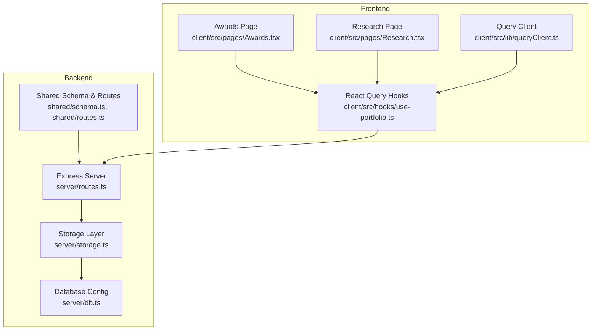
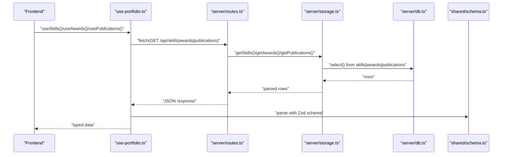
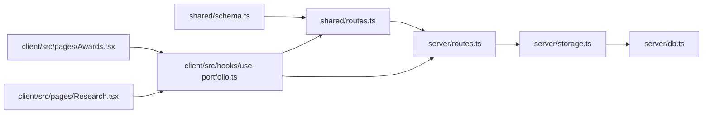

# Skills, Awards & Publications Endpoints

<cite>
**Referenced Files in This Document**
- [routes.ts](file://server/routes.ts)
- [storage.ts](file://server/storage.ts)
- [schema.ts](file://shared/schema.ts)
- [routes.ts](file://shared/routes.ts)
- [db.ts](file://server/db.ts)
- [use-portfolio.ts](file://client/src/hooks/use-portfolio.ts)
- [Awards.tsx](file://client/src/pages/Awards.tsx)
- [Research.tsx](file://client/src/pages/Research.tsx)
- [queryClient.ts](file://client/src/lib/queryClient.ts)
- [README.md](file://README.md)
</cite>

## Table of Contents
1. [Introduction](#introduction)
2. [Project Structure](#project-structure)
3. [Core Components](#core-components)
4. [Architecture Overview](#architecture-overview)
5. [Detailed Component Analysis](#detailed-component-analysis)
6. [Dependency Analysis](#dependency-analysis)
7. [Performance Considerations](#performance-considerations)
8. [Troubleshooting Guide](#troubleshooting-guide)
9. [Conclusion](#conclusion)

## Introduction
This document provides detailed API documentation for the skills, awards, and publications endpoints used by the portfolio application. It explains the GET endpoints for retrieving categorized technical expertise, achievement records, and research publications. It covers data structures, categorization patterns, sorting mechanisms, validation and error handling, and integration with frontend components.

## Project Structure
The API endpoints are defined and registered in the backend and consumed by the frontend via shared route definitions and typed schemas. The backend supports both a PostgreSQL-backed storage and an in-memory fallback for local development.

**Diagram sources**
- [routes.ts](file://server/routes.ts#L1-L66)
- [storage.ts](file://server/storage.ts#L1-L323)
- [schema.ts](file://shared/schema.ts#L1-L86)
- [routes.ts](file://shared/routes.ts#L1-L112)
- [db.ts](file://server/db.ts#L1-L12)
- [use-portfolio.ts](file://client/src/hooks/use-portfolio.ts#L1-L115)
- [Awards.tsx](file://client/src/pages/Awards.tsx#L1-L71)
- [Research.tsx](file://client/src/pages/Research.tsx#L1-L81)
- [queryClient.ts](file://client/src/lib/queryClient.ts#L1-L58)

**Section sources**
- [README.md](file://README.md#L1-L71)
- [routes.ts](file://server/routes.ts#L1-L66)
- [storage.ts](file://server/storage.ts#L1-L323)
- [schema.ts](file://shared/schema.ts#L1-L86)
- [routes.ts](file://shared/routes.ts#L1-L112)
- [db.ts](file://server/db.ts#L1-L12)
- [use-portfolio.ts](file://client/src/hooks/use-portfolio.ts#L1-L115)
- [Awards.tsx](file://client/src/pages/Awards.tsx#L1-L71)
- [Research.tsx](file://client/src/pages/Research.tsx#L1-L81)
- [queryClient.ts](file://client/src/lib/queryClient.ts#L1-L58)

## Core Components
- Backend routes: Expose GET endpoints for skills, awards, and publications.
- Storage layer: Implements retrieval from PostgreSQL (via Drizzle ORM) or in-memory fallback.
- Shared schema and routes: Define typed data models and API response shapes.
- Frontend hooks: Fetch and parse responses using Zod schemas and React Query.

Key responsibilities:
- Skills endpoint: Returns categorized technical expertise with arrays of tags.
- Awards endpoint: Returns achievement records with issuer and date metadata.
- Publications endpoint: Returns research works with titles, authors, journals, years, and links.

**Section sources**
- [routes.ts](file://server/routes.ts#L33-L46)
- [storage.ts](file://server/storage.ts#L39-L52)
- [schema.ts](file://shared/schema.ts#L35-L56)
- [routes.ts](file://shared/routes.ts#L61-L87)
- [use-portfolio.ts](file://client/src/hooks/use-portfolio.ts#L43-L76)

## Architecture Overview
The backend registers three GET endpoints that delegate to the storage layer. Responses are typed using shared Zod schemas. The frontend consumes these endpoints via React Query hooks, parsing responses with the same shared schemas.

**Diagram sources**
- [routes.ts](file://server/routes.ts#L33-L46)
- [storage.ts](file://server/storage.ts#L39-L52)
- [db.ts](file://server/db.ts#L1-L12)
- [schema.ts](file://shared/schema.ts#L35-L56)
- [use-portfolio.ts](file://client/src/hooks/use-portfolio.ts#L43-L76)

## Detailed Component Analysis

### Skills Endpoint: GET /api/skills
Purpose:
- Retrieve categorized technical expertise data.

Endpoint definition:
- Method: GET
- Path: /api/skills
- Response: Array of skill categories with associated tags

Data model:
- Category: Text label for grouping skills
- Items: Array of tag strings representing specific skills

Categorization and sorting:
- Categories are stored as-is; no explicit ordering is enforced by the backend.
- Sorting is determined by the order returned by the storage layer.

Validation and error handling:
- No input validation required for GET requests.
- Errors are handled by the storage layer returning empty arrays when the database is unavailable.

Frontend integration:
- Fetched via useSkills hook.
- Parsed using the shared skills schema.

Example response shape:
- Array of objects with category and items fields.

Common display patterns:
- Grouped lists by category with tag chips or badges.
- Filtering and search within items.

**Section sources**
- [routes.ts](file://server/routes.ts#L33-L36)
- [storage.ts](file://server/storage.ts#L39-L42)
- [schema.ts](file://shared/schema.ts#L35-L39)
- [routes.ts](file://shared/routes.ts#L61-L68)
- [use-portfolio.ts](file://client/src/hooks/use-portfolio.ts#L43-L52)

### Awards Endpoint: GET /api/awards
Purpose:
- Retrieve achievement and recognition records.

Endpoint definition:
- Method: GET
- Path: /api/awards
- Response: Array of award records

Data model:
- Title: Achievement name
- Issuer: Organization or event that granted the award
- Date: Issue date or year
- Description: Optional narrative details

Categorization and sorting:
- No explicit categorization is defined in the schema.
- Sorting is determined by the storage layer’s order.

Validation and error handling:
- No input validation required for GET requests.
- Errors are handled by returning empty arrays when the database is unavailable.

Frontend integration:
- Fetched via useAwards hook.
- Parsed using the shared awards schema.

Example response shape:
- Array of award objects with title, issuer, date, and optional description.

Common display patterns:
- Grid cards with icons, issuer badges, and date highlights.
- Optional description expansion.

**Section sources**
- [routes.ts](file://server/routes.ts#L38-L41)
- [storage.ts](file://server/storage.ts#L44-L47)
- [schema.ts](file://shared/schema.ts#L41-L47)
- [routes.ts](file://shared/routes.ts#L70-L78)
- [use-portfolio.ts](file://client/src/hooks/use-portfolio.ts#L55-L64)
- [Awards.tsx](file://client/src/pages/Awards.tsx#L1-L71)

### Publications Endpoint: GET /api/publications
Purpose:
- Retrieve research publications with metadata and links.

Endpoint definition:
- Method: GET
- Path: /api/publications
- Response: Array of publication records

Data model:
- Title: Publication title
- Journal: Publication venue or journal name
- Year: Publication year
- Link: External URL to the publication
- Authors: Author list or identifier

Categorization and sorting:
- No explicit categorization is defined in the schema.
- Sorting is determined by the storage layer’s order.

Validation and error handling:
- No input validation required for GET requests.
- Errors are handled by returning empty arrays when the database is unavailable.

Frontend integration:
- Fetched via usePublications hook.
- Parsed using the shared publications schema.

Example response shape:
- Array of publication objects with title, journal, year, link, and authors.

Common display patterns:
- List cards with year badges, author attribution, optional journal emphasis, and external link buttons.

**Section sources**
- [routes.ts](file://server/routes.ts#L43-L46)
- [storage.ts](file://server/storage.ts#L49-L52)
- [schema.ts](file://shared/schema.ts#L49-L56)
- [routes.ts](file://shared/routes.ts#L79-L87)
- [use-portfolio.ts](file://client/src/hooks/use-portfolio.ts#L67-L76)
- [Research.tsx](file://client/src/pages/Research.tsx#L1-L81)

## Dependency Analysis
The backend depends on shared schemas and routes for typing and endpoint definitions. The storage layer abstracts database access and provides an in-memory fallback. The frontend consumes these endpoints through typed hooks and schemas.

**Diagram sources**
- [schema.ts](file://shared/schema.ts#L1-L86)
- [routes.ts](file://shared/routes.ts#L1-L112)
- [routes.ts](file://server/routes.ts#L1-L66)
- [storage.ts](file://server/storage.ts#L1-L323)
- [db.ts](file://server/db.ts#L1-L12)
- [use-portfolio.ts](file://client/src/hooks/use-portfolio.ts#L1-L115)
- [Awards.tsx](file://client/src/pages/Awards.tsx#L1-L71)
- [Research.tsx](file://client/src/pages/Research.tsx#L1-L81)

**Section sources**
- [schema.ts](file://shared/schema.ts#L1-L86)
- [routes.ts](file://shared/routes.ts#L1-L112)
- [routes.ts](file://server/routes.ts#L1-L66)
- [storage.ts](file://server/storage.ts#L1-L323)
- [db.ts](file://server/db.ts#L1-L12)
- [use-portfolio.ts](file://client/src/hooks/use-portfolio.ts#L1-L115)
- [Awards.tsx](file://client/src/pages/Awards.tsx#L1-L71)
- [Research.tsx](file://client/src/pages/Research.tsx#L1-L81)

## Performance Considerations
- Data retrieval is straightforward SELECT queries; performance primarily depends on database size and indexing.
- In-memory fallback avoids network overhead during development but does not reflect production performance characteristics.
- Consider adding database indexes on frequently queried columns if scaling to large datasets.
- Caching strategies can be introduced at the frontend using React Query’s caching options.

[No sources needed since this section provides general guidance]

## Troubleshooting Guide
Common issues and resolutions:
- Database connectivity:
  - If DATABASE_URL is unset, the application uses an in-memory storage fallback. Verify environment configuration for production.
- Empty responses:
  - When the database is unavailable, storage methods return empty arrays. Confirm database availability and connection string.
- Frontend parsing errors:
  - The frontend uses Zod schemas to parse responses. Ensure the backend response structure matches the shared schemas.
- Network errors:
  - The frontend throws descriptive errors when responses are not OK. Inspect browser console and network tab for status codes and messages.

**Section sources**
- [README.md](file://README.md#L46-L56)
- [storage.ts](file://server/storage.ts#L39-L52)
- [use-portfolio.ts](file://client/src/hooks/use-portfolio.ts#L43-L76)
- [queryClient.ts](file://client/src/lib/queryClient.ts#L3-L8)

## Conclusion
The skills, awards, and publications endpoints provide a clean, typed interface for retrieving categorized professional and academic content. Their design leverages shared schemas for consistency, supports flexible storage backends, and integrates seamlessly with the frontend via typed hooks and React Query. Extending these endpoints—such as adding filtering, pagination, or sorting—can be done by updating the storage layer and shared schemas while maintaining backward compatibility.