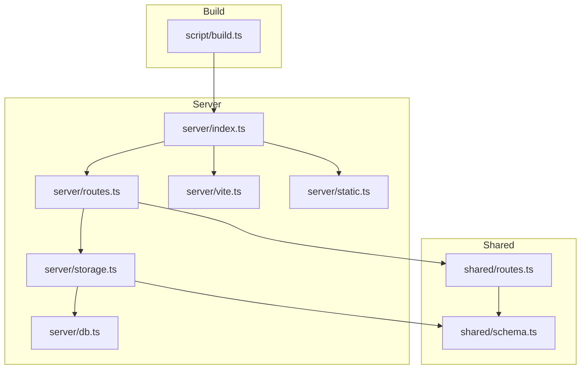
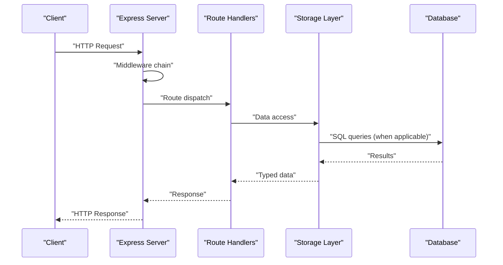
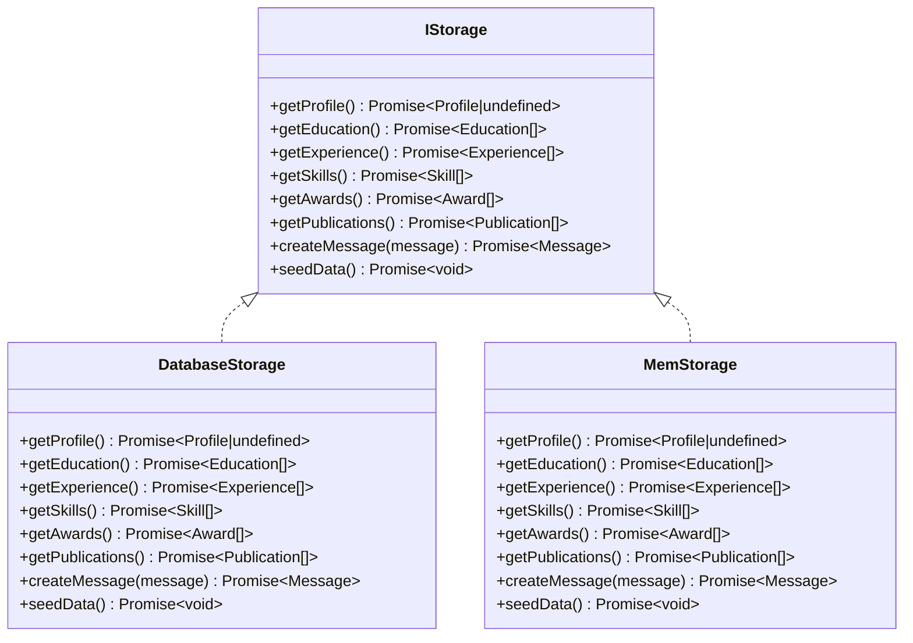
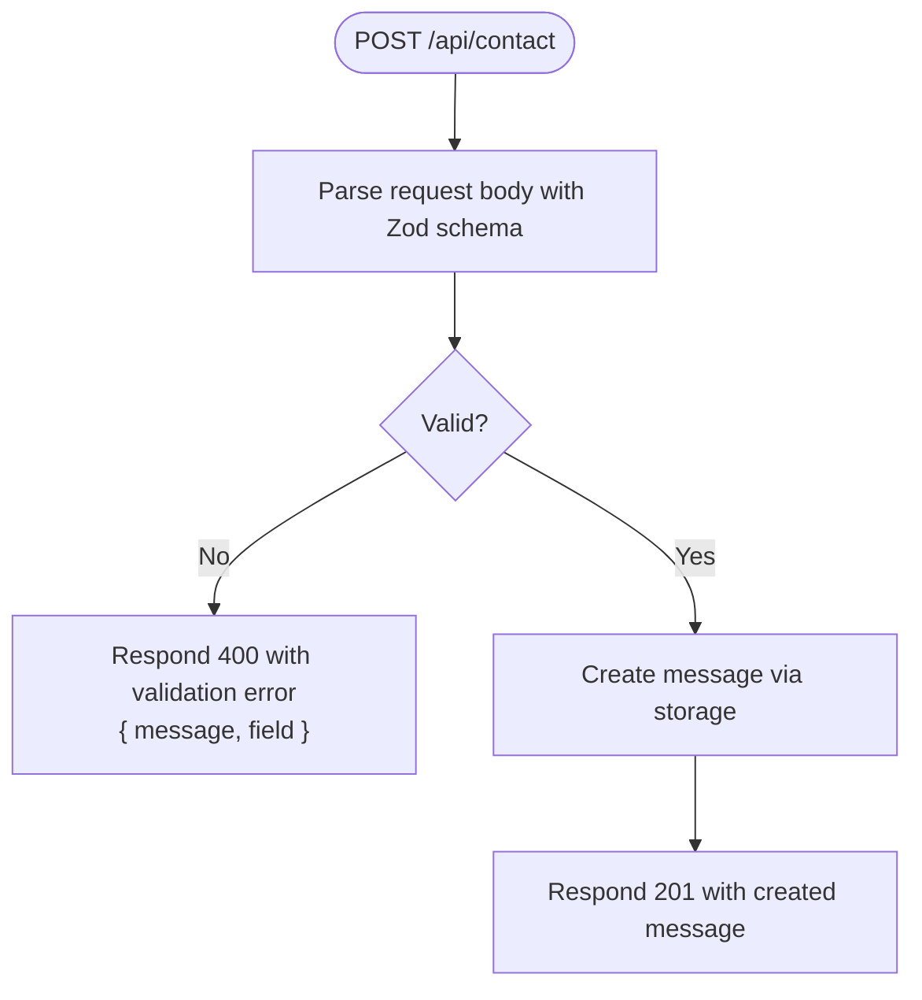
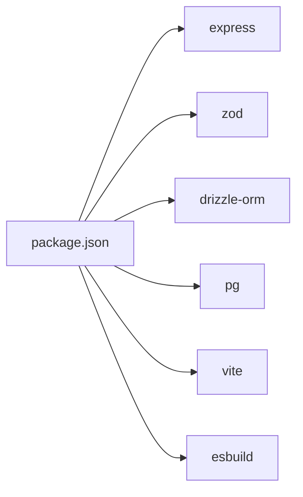

# Backend API

<cite>
**Referenced Files in This Document**
- [server/index.ts](file://server/index.ts)
- [server/routes.ts](file://server/routes.ts)
- [shared/routes.ts](file://shared/routes.ts)
- [shared/schema.ts](file://shared/schema.ts)
- [server/storage.ts](file://server/storage.ts)
- [server/db.ts](file://server/db.ts)
- [server/static.ts](file://server/static.ts)
- [server/vite.ts](file://server/vite.ts)
- [script/build.ts](file://script/build.ts)
- [package.json](file://package.json)
- [README.md](file://README.md)
</cite>

## Table of Contents
1. [Introduction](#introduction)
2. [Project Structure](#project-structure)
3. [Core Components](#core-components)
4. [Architecture Overview](#architecture-overview)
5. [Detailed Component Analysis](#detailed-component-analysis)
6. [Dependency Analysis](#dependency-analysis)
7. [Performance Considerations](#performance-considerations)
8. [Troubleshooting Guide](#troubleshooting-guide)
9. [Conclusion](#conclusion)
10. [Appendices](#appendices)

## Introduction
This document provides comprehensive backend API documentation for the Express server implementation. It covers server initialization, middleware configuration, request processing pipeline, all API endpoints, Zod schema validation, error handling, response formatting, development vs production environment differences, static asset serving, and the integration with the storage abstraction layer. It also includes request/response examples, status codes, and common error scenarios.

## Project Structure
The backend is organized into modular files under the server directory, with shared schemas and routes defined in the shared directory. The build process bundles the server for production while building the client assets.

**Diagram sources**
- [server/index.ts](file://server/index.ts#L1-L103)
- [server/routes.ts](file://server/routes.ts#L1-L66)
- [server/storage.ts](file://server/storage.ts#L1-L323)
- [server/db.ts](file://server/db.ts#L1-L12)
- [server/vite.ts](file://server/vite.ts#L1-L59)
- [server/static.ts](file://server/static.ts#L1-L20)
- [shared/routes.ts](file://shared/routes.ts#L1-L112)
- [shared/schema.ts](file://shared/schema.ts#L1-L86)
- [script/build.ts](file://script/build.ts#L1-L68)

**Section sources**
- [server/index.ts](file://server/index.ts#L1-L103)
- [server/routes.ts](file://server/routes.ts#L1-L66)
- [shared/routes.ts](file://shared/routes.ts#L1-L112)
- [shared/schema.ts](file://shared/schema.ts#L1-L86)
- [server/storage.ts](file://server/storage.ts#L1-L323)
- [server/db.ts](file://server/db.ts#L1-L12)
- [server/static.ts](file://server/static.ts#L1-L20)
- [server/vite.ts](file://server/vite.ts#L1-L59)
- [script/build.ts](file://script/build.ts#L1-L68)
- [package.json](file://package.json#L1-L114)
- [README.md](file://README.md#L1-L71)

## Core Components
- Express server initialization and HTTP server creation
- Middleware stack: JSON parsing with raw body capture, URL-encoded parsing, request logging, global error handler
- Route registration for profile, education, experience, skills, awards, publications, and contact submission
- Storage abstraction layer with PostgreSQL-backed and in-memory implementations
- Development and production environment handling with Vite SSR and static asset serving
- Zod schema-driven validation and response typing

**Section sources**
- [server/index.ts](file://server/index.ts#L1-L103)
- [server/routes.ts](file://server/routes.ts#L1-L66)
- [server/storage.ts](file://server/storage.ts#L1-L323)
- [shared/routes.ts](file://shared/routes.ts#L1-L112)
- [shared/schema.ts](file://shared/schema.ts#L1-L86)

## Architecture Overview
The server initializes Express, registers routes, sets up middleware, and conditionally serves static assets or Vite middleware depending on the environment. The storage layer abstracts data access and supports seeding.

**Diagram sources**
- [server/index.ts](file://server/index.ts#L15-L60)
- [server/routes.ts](file://server/routes.ts#L15-L62)
- [server/storage.ts](file://server/storage.ts#L22-L58)
- [server/db.ts](file://server/db.ts#L7-L12)

## Detailed Component Analysis

### Server Initialization and Middleware Pipeline
- JSON parsing with raw body capture for signature verification or replay protection
- URL-encoded parsing for form submissions
- Request logging middleware that captures JSON responses for API endpoints and logs timing
- Global error handler that responds with structured JSON errors and prevents duplicate headers
- Environment-aware static/Vite setup:
  - Production: serve prebuilt client static assets and fallback to index.html
  - Development: inject Vite middlewares and SSR index.html with HMR support
- Port binding to environment variable or default

Key behaviors:
- Raw body capture is attached to the incoming message for downstream use
- Logging is filtered to /api paths and includes response payload and duration
- Error handling ensures consistent JSON error responses and avoids header-sent errors

**Section sources**
- [server/index.ts](file://server/index.ts#L15-L102)

### Route Registration and Endpoint Definitions
All endpoints are registered against the Express app and delegate to the storage layer. Responses are typed via Zod schemas defined in shared routes.

Endpoints:
- GET /api/profile
  - Purpose: Retrieve personal profile information
  - Behavior: Returns the first profile record or 404 if not found
  - Responses: 200 with profile object, 404 with not found message
- GET /api/education
  - Purpose: List academic background entries
  - Behavior: Returns an array of education records
  - Responses: 200 with array of education objects
- GET /api/experience
  - Purpose: List professional experience entries
  - Behavior: Returns an array of experience records
  - Responses: 200 with array of experience objects
- GET /api/skills
  - Purpose: List categorized skills
  - Behavior: Returns an array of skills records
  - Responses: 200 with array of skills objects
- GET /api/awards
  - Purpose: List awards and honors
  - Behavior: Returns an array of awards records
  - Responses: 200 with array of awards objects
- GET /api/publications
  - Purpose: List research publications
  - Behavior: Returns an array of publications records
  - Responses: 200 with array of publications objects
- POST /api/contact
  - Purpose: Submit contact form data
  - Validation: Zod schema validates input fields
  - Behavior: On success, inserts a message and returns the created record with 201
  - Errors: 400 with validation error details on schema failure

Validation and typing:
- Input schemas are derived from shared database schemas and exposed via shared routes
- Response schemas define expected shapes for each endpoint

**Section sources**
- [server/routes.ts](file://server/routes.ts#L15-L62)
- [shared/routes.ts](file://shared/routes.ts#L32-L99)
- [shared/schema.ts](file://shared/schema.ts#L68-L86)

### Storage Abstraction Layer
The storage layer defines an interface and two implementations:
- DatabaseStorage: Uses Drizzle ORM with PostgreSQL
- MemStorage: In-memory implementation for local development

Responsibilities:
- CRUD-like methods for profile, education, experience, skills, awards, publications, and message creation
- Automatic seeding on startup when storage is empty
- Switching behavior based on DATABASE_URL presence

**Diagram sources**
- [server/storage.ts](file://server/storage.ts#L9-L22)
- [server/storage.ts](file://server/storage.ts#L22-L226)
- [server/storage.ts](file://server/storage.ts#L228-L320)

**Section sources**
- [server/storage.ts](file://server/storage.ts#L1-L323)
- [server/db.ts](file://server/db.ts#L1-L12)

### Zod Schema Validation System
- Database schemas are defined in shared schema and mapped to Zod insert/update schemas
- Shared routes expose typed input and response schemas for each endpoint
- Validation is performed on POST /api/contact using the input schema
- Validation errors return structured JSON with message and optional field path

**Diagram sources**
- [server/routes.ts](file://server/routes.ts#L48-L62)
- [shared/routes.ts](file://shared/routes.ts#L88-L98)
- [shared/schema.ts](file://shared/schema.ts#L74)

**Section sources**
- [shared/schema.ts](file://shared/schema.ts#L1-L86)
- [shared/routes.ts](file://shared/routes.ts#L1-L112)
- [server/routes.ts](file://server/routes.ts#L48-L62)

### Error Handling Strategies
- Centralized error handler catches thrown errors and responds with JSON
- Status code resolution: uses explicit status/statusCode or defaults to 500
- Prevents duplicate headers by checking res.headersSent
- Logs internal server errors for debugging

Common scenarios:
- Validation failures on POST /api/contact return 400 with a message and field
- Not found on GET /api/profile returns 404 with a message
- Database unavailability triggers a 500 error

**Section sources**
- [server/index.ts](file://server/index.ts#L65-L76)
- [server/routes.ts](file://server/routes.ts#L17-L19)

### Static Asset Serving and Development vs Production
- Production mode:
  - Serves prebuilt client assets from server/public
  - Falls back to index.html for SPA routing
  - Requires build step before starting
- Development mode:
  - Injects Vite middlewares for SSR and HMR
  - Serves index.html with transformed template
  - Hot reloads client-side changes

Environment detection:
- NODE_ENV controls static vs Vite setup
- PORT determines listening address and port

**Section sources**
- [server/index.ts](file://server/index.ts#L78-L92)
- [server/static.ts](file://server/static.ts#L5-L19)
- [server/vite.ts](file://server/vite.ts#L11-L58)
- [script/build.ts](file://script/build.ts#L35-L62)
- [package.json](file://package.json#L6-L12)

### Request/Response Examples and Status Codes

- GET /api/profile
  - Success: 200 with profile object
  - Not Found: 404 with message
- GET /api/education
  - Success: 200 with array of education objects
- GET /api/experience
  - Success: 200 with array of experience objects
- GET /api/skills
  - Success: 200 with array of skills objects
- GET /api/awards
  - Success: 200 with array of awards objects
- GET /api/publications
  - Success: 200 with array of publications objects
- POST /api/contact
  - Success: 201 with created message object
  - Validation Error: 400 with { message, field }
  - Internal Error: 500 with { message }

Example request body for POST /api/contact:
- name: string
- email: string
- message: string

Example response for GET /api/profile:
- id: number
- name: string
- title: string
- bio: string
- email: string
- location: string
- linkedin: string (optional)
- orcid: string (optional)
- scopus: string (optional)

**Section sources**
- [shared/routes.ts](file://shared/routes.ts#L32-L99)
- [shared/schema.ts](file://shared/schema.ts#L7-L64)
- [server/routes.ts](file://server/routes.ts#L15-L62)

## Dependency Analysis
The server depends on Express, Zod, Drizzle ORM, and PostgreSQL. Build-time dependencies include Vite and esbuild. Development and production differ in asset serving and bundling strategy.

**Diagram sources**
- [package.json](file://package.json#L13-L104)

**Section sources**
- [package.json](file://package.json#L1-L114)
- [script/build.ts](file://script/build.ts#L7-L33)

## Performance Considerations
- Database connection pooling is configured conditionally based on DATABASE_URL
- Build script bundles server dependencies to reduce cold start overhead
- Logging middleware captures response payloads and durations for API endpoints
- Static asset serving is optimized for production with prebuilt assets

[No sources needed since this section provides general guidance]

## Troubleshooting Guide
Common issues and resolutions:
- Missing DATABASE_URL:
  - Symptom: In-memory storage used; seeded data appears on startup
  - Resolution: Set DATABASE_URL and run database migration script
- Build directory missing in production:
  - Symptom: Error indicating build directory not found
  - Resolution: Run the build script before starting production
- Validation errors on POST /api/contact:
  - Symptom: 400 response with message and field
  - Resolution: Ensure required fields are present and match schema expectations
- Database connectivity issues:
  - Symptom: 500 errors during data access
  - Resolution: Verify DATABASE_URL and network connectivity

**Section sources**
- [server/static.ts](file://server/static.ts#L7-L11)
- [server/routes.ts](file://server/routes.ts#L48-L62)
- [server/storage.ts](file://server/storage.ts#L54-L58)
- [README.md](file://README.md#L46-L56)

## Conclusion
The backend provides a robust, schema-driven API with clear separation of concerns, environment-aware asset serving, and a flexible storage abstraction. Zod ensures strong validation and predictable responses, while the error handling strategy maintains consistent behavior across endpoints. The architecture supports both development and production environments effectively.

[No sources needed since this section summarizes without analyzing specific files]

## Appendices

### Environment Variables and Ports
- NODE_ENV: Controls development vs production behavior
- DATABASE_URL: Enables PostgreSQL-backed storage; otherwise in-memory storage is used
- PORT: Listening port for the server; defaults to 5001

**Section sources**
- [server/index.ts](file://server/index.ts#L88-L92)
- [server/db.ts](file://server/db.ts#L7-L9)
- [README.md](file://README.md#L48-L56)

### Build and Start Scripts
- Development: Starts Express with tsx and enables hot reloading
- Build: Produces a bundled server artifact for production
- Start: Runs the production server with NODE_ENV=production

**Section sources**
- [package.json](file://package.json#L6-L12)
- [script/build.ts](file://script/build.ts#L35-L62)