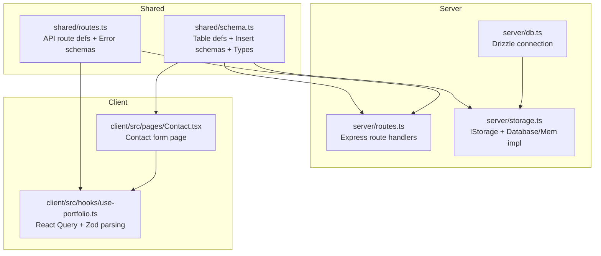
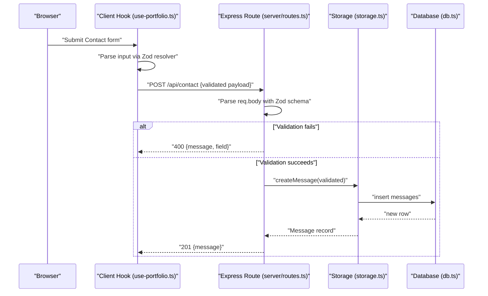
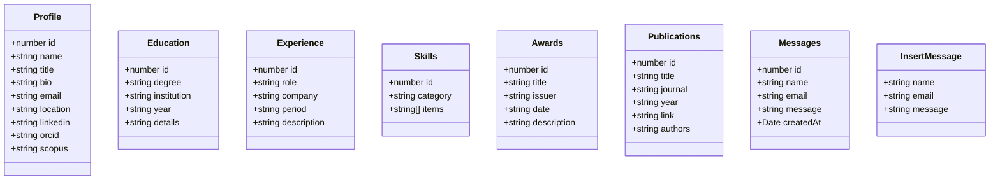
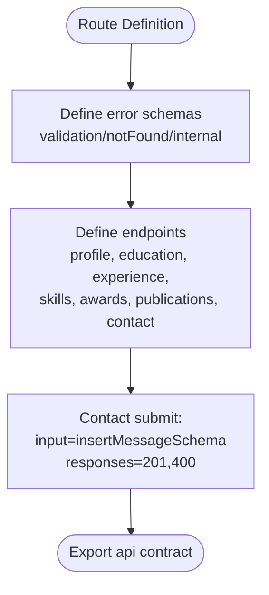
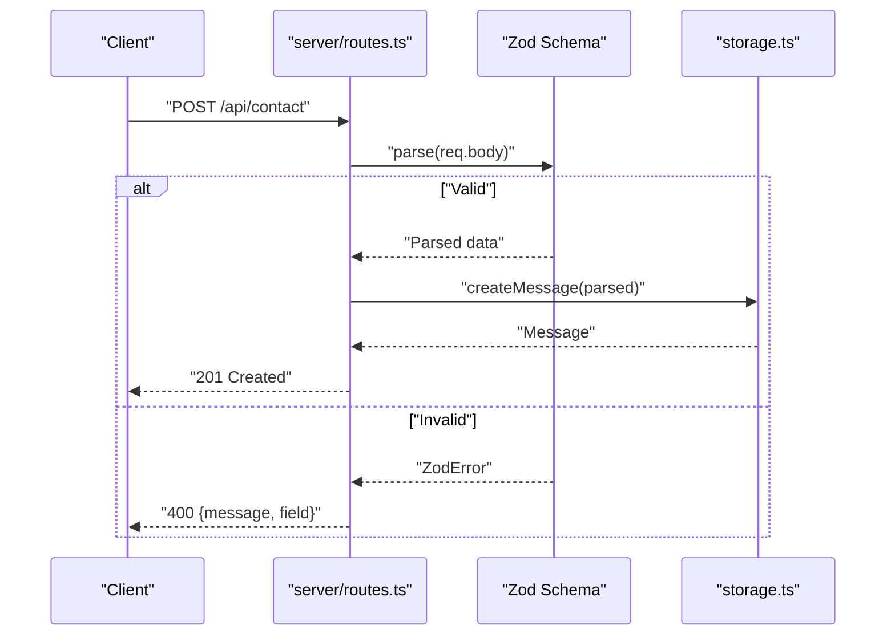
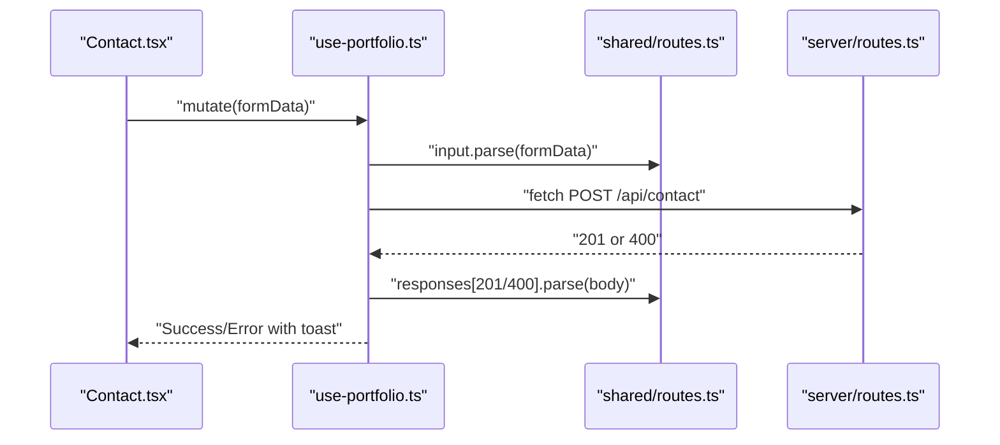
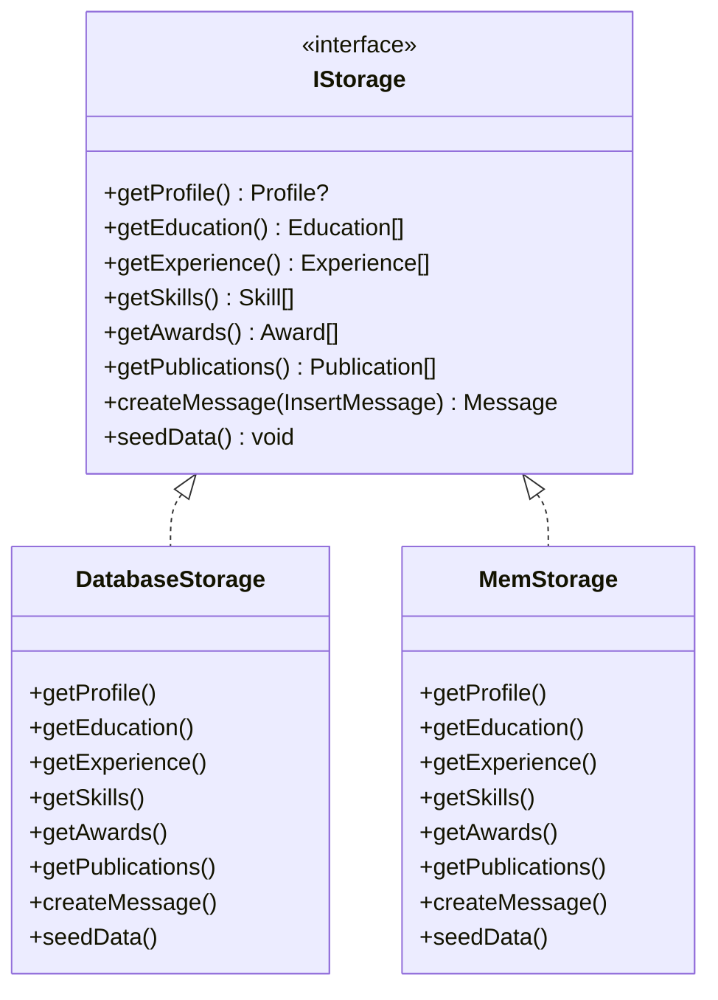
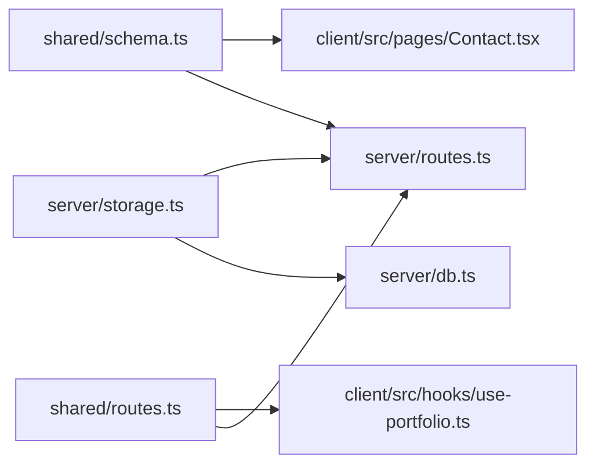

# Data Validation and Schema

<cite>
**Referenced Files in This Document**
- [schema.ts](file://shared/schema.ts)
- [routes.ts](file://shared/routes.ts)
- [routes.ts](file://server/routes.ts)
- [storage.ts](file://server/storage.ts)
- [db.ts](file://server/db.ts)
- [Contact.tsx](file://client/src/pages/Contact.tsx)
- [use-portfolio.ts](file://client/src/hooks/use-portfolio.ts)
- [README.md](file://README.md)
</cite>

## Table of Contents
1. [Introduction](#introduction)
2. [Project Structure](#project-structure)
3. [Core Components](#core-components)
4. [Architecture Overview](#architecture-overview)
5. [Detailed Component Analysis](#detailed-component-analysis)
6. [Dependency Analysis](#dependency-analysis)
7. [Performance Considerations](#performance-considerations)
8. [Troubleshooting Guide](#troubleshooting-guide)
9. [Conclusion](#conclusion)

## Introduction
This document explains the Zod-based data validation system used across the client-server boundary. It covers schema definitions for Profile, Education, Experience, Skills, Awards, Publications, and Contact messages, the validation pipeline, error handling strategies, and response formatting for validation failures. It also details how shared schemas ensure type safety and outlines best practices for extending the validation system.

## Project Structure
The validation system is centered around shared schemas and route definitions that are imported by both the server and client. The server performs runtime validation on incoming requests, while the client validates form inputs and API responses.

**Diagram sources**
- [schema.ts](file://shared/schema.ts#L1-L86)
- [routes.ts](file://shared/routes.ts#L1-L112)
- [routes.ts](file://server/routes.ts#L1-L66)
- [storage.ts](file://server/storage.ts#L1-L323)
- [db.ts](file://server/db.ts#L1-L12)
- [Contact.tsx](file://client/src/pages/Contact.tsx#L1-L178)
- [use-portfolio.ts](file://client/src/hooks/use-portfolio.ts#L1-L115)

**Section sources**
- [README.md](file://README.md#L1-L71)
- [schema.ts](file://shared/schema.ts#L1-L86)
- [routes.ts](file://shared/routes.ts#L1-L112)
- [routes.ts](file://server/routes.ts#L1-L66)
- [storage.ts](file://server/storage.ts#L1-L323)
- [db.ts](file://server/db.ts#L1-L12)
- [Contact.tsx](file://client/src/pages/Contact.tsx#L1-L178)
- [use-portfolio.ts](file://client/src/hooks/use-portfolio.ts#L1-L115)

## Core Components
- Shared schema definitions: Define database tables and derived Zod insert schemas for runtime validation.
- Route definitions: Describe API endpoints, input schemas, and response schemas for type-safe client-server contracts.
- Server-side validation: Uses Zod to parse and validate request bodies; handles validation errors and returns structured error responses.
- Client-side validation: Uses Zod resolvers for forms and Zod parsing for API responses and errors.

Key validation artifacts:
- Insert schemas for all domain entities (Profile, Education, Experience, Skills, Awards, Publications, Messages).
- API route definitions with input and response Zod schemas.
- Error schemas for validation, not-found, and internal errors.

**Section sources**
- [schema.ts](file://shared/schema.ts#L68-L86)
- [routes.ts](file://shared/routes.ts#L19-L99)
- [routes.ts](file://server/routes.ts#L48-L62)
- [use-portfolio.ts](file://client/src/hooks/use-portfolio.ts#L78-L115)
- [Contact.tsx](file://client/src/pages/Contact.tsx#L25-L38)

## Architecture Overview
The validation pipeline ensures type safety across the client-server boundary using shared Zod schemas. The client validates user input and API responses, while the server validates incoming requests and returns structured error responses on failure.

**Diagram sources**
- [use-portfolio.ts](file://client/src/hooks/use-portfolio.ts#L78-L115)
- [routes.ts](file://server/routes.ts#L48-L62)
- [storage.ts](file://server/storage.ts#L54-L58)
- [db.ts](file://server/db.ts#L1-L12)

## Detailed Component Analysis

### Shared Schemas and Types
- Table definitions: Each domain entity is defined as a Drizzle table with typed columns.
- Insert schemas: Generated from tables using a helper to omit auto-generated fields (e.g., id, createdAt).
- Types: Inferred select and insert types enable strong typing across client and server.

**Diagram sources**
- [schema.ts](file://shared/schema.ts#L7-L64)
- [schema.ts](file://shared/schema.ts#L78-L86)

**Section sources**
- [schema.ts](file://shared/schema.ts#L7-L64)
- [schema.ts](file://shared/schema.ts#L68-L86)

### API Route Definitions and Error Schemas
- Error schemas: Standardized shapes for validation, not-found, and internal errors.
- Route definitions: Each endpoint specifies method, path, input schema, and response schemas.
- Contact endpoint: Uses the insert message schema for input and defines 201 and 400 responses.

**Diagram sources**
- [routes.ts](file://shared/routes.ts#L19-L99)

**Section sources**
- [routes.ts](file://shared/routes.ts#L19-L99)

### Server-Side Validation Pipeline
- Registration: Routes are registered against an Express app; seed data is initialized.
- Contact handler: Parses request body with the contact input schema; on success, persists via storage; on ZodError, returns a structured 400 response with message and optional field path.

**Diagram sources**
- [routes.ts](file://server/routes.ts#L48-L62)

**Section sources**
- [routes.ts](file://server/routes.ts#L7-L66)
- [routes.ts](file://server/routes.ts#L48-L62)

### Client-Side Validation and Parsing
- Contact page: Uses react-hook-form with a Zod resolver bound to the insert message schema; submits validated data.
- Hooks: For each endpoint, the hook fetches data and parses responses with Zod schemas; for mutations, it validates inputs locally and parses error/response payloads.

**Diagram sources**
- [Contact.tsx](file://client/src/pages/Contact.tsx#L25-L38)
- [use-portfolio.ts](file://client/src/hooks/use-portfolio.ts#L78-L115)
- [routes.ts](file://shared/routes.ts#L88-L99)
- [routes.ts](file://server/routes.ts#L48-L62)

**Section sources**
- [Contact.tsx](file://client/src/pages/Contact.tsx#L25-L38)
- [use-portfolio.ts](file://client/src/hooks/use-portfolio.ts#L78-L115)
- [routes.ts](file://shared/routes.ts#L88-L99)

### Data Flow Across Storage Layers
- Database vs Memory: The storage abstraction supports both a database-backed implementation and an in-memory fallback. The database implementation uses Drizzle ORM; the memory implementation simulates persistence for local development.

**Diagram sources**
- [storage.ts](file://server/storage.ts#L9-L323)
- [db.ts](file://server/db.ts#L1-L12)

**Section sources**
- [storage.ts](file://server/storage.ts#L9-L323)
- [db.ts](file://server/db.ts#L1-L12)

## Dependency Analysis
- Shared schemas and routes are the single source of truth for validation contracts.
- Server routes depend on shared schemas for input parsing.
- Client hooks depend on shared schemas for input validation and response parsing.
- Storage depends on shared types for compile-time correctness.
- Database connection is optional; when absent, the system falls back to in-memory storage.

**Diagram sources**
- [schema.ts](file://shared/schema.ts#L1-L86)
- [routes.ts](file://shared/routes.ts#L1-L112)
- [routes.ts](file://server/routes.ts#L1-L66)
- [storage.ts](file://server/storage.ts#L1-L323)
- [db.ts](file://server/db.ts#L1-L12)
- [Contact.tsx](file://client/src/pages/Contact.tsx#L1-L178)
- [use-portfolio.ts](file://client/src/hooks/use-portfolio.ts#L1-L115)

**Section sources**
- [schema.ts](file://shared/schema.ts#L1-L86)
- [routes.ts](file://shared/routes.ts#L1-L112)
- [routes.ts](file://server/routes.ts#L1-L66)
- [storage.ts](file://server/storage.ts#L1-L323)
- [db.ts](file://server/db.ts#L1-L12)
- [Contact.tsx](file://client/src/pages/Contact.tsx#L1-L178)
- [use-portfolio.ts](file://client/src/hooks/use-portfolio.ts#L1-L115)

## Performance Considerations
- Centralized validation reduces duplication and improves maintainability.
- Using Zod’s parser on the server avoids manual checks and minimizes runtime overhead.
- Client-side parsing prevents unnecessary network calls with invalid payloads.
- Seeding data on startup avoids repeated initialization costs during development.

[No sources needed since this section provides general guidance]

## Troubleshooting Guide
Common validation failures and handling:
- Validation errors: The server returns a 400 with a message and an optional field path derived from the first Zod error. The client displays a toast with the error message.
- Not found: Profile retrieval returns a 404 with a standardized message shape.
- Internal errors: The server throws unexpected errors, which propagate to the client as generic failures.

Examples of validation errors:
- Missing required fields: The server responds with a message indicating the first missing field and its path.
- Incorrect types: The server responds with a message indicating the first invalid field and its path.

Best practices:
- Extend shared schemas in the schema file to keep client and server in sync.
- Add custom validations to shared schemas for domain-specific rules.
- Keep error schemas consistent to simplify client-side handling.
- Prefer Zod parsing for both inputs and responses to ensure type safety.

**Section sources**
- [routes.ts](file://server/routes.ts#L48-L62)
- [use-portfolio.ts](file://client/src/hooks/use-portfolio.ts#L91-L112)
- [routes.ts](file://shared/routes.ts#L19-L30)

## Conclusion
The Zod-based validation system enforces type safety across the client-server boundary using shared schemas and route definitions. The server validates incoming requests and returns structured error responses, while the client validates user inputs and API responses. This design simplifies maintenance, improves reliability, and provides a consistent developer experience.