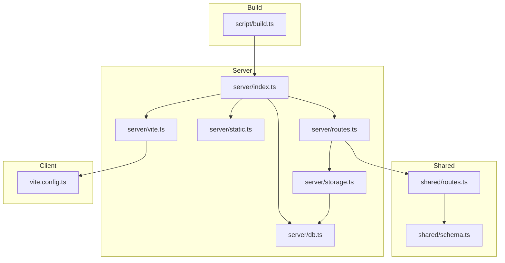
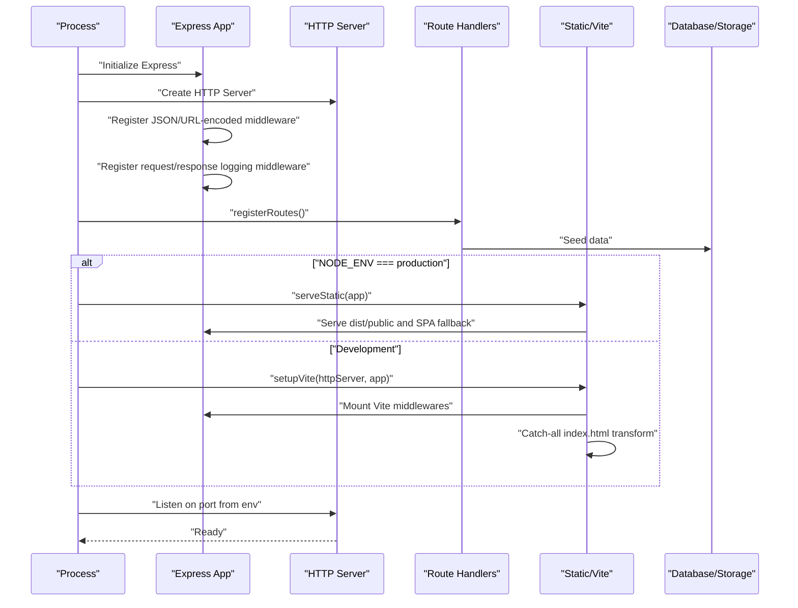
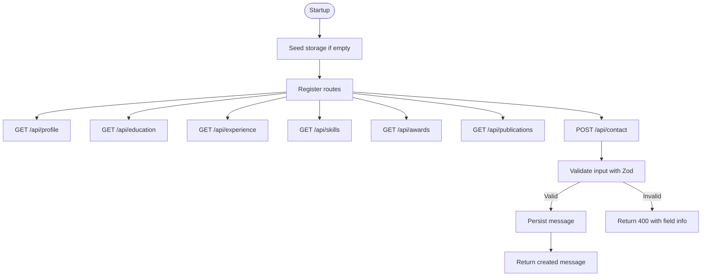
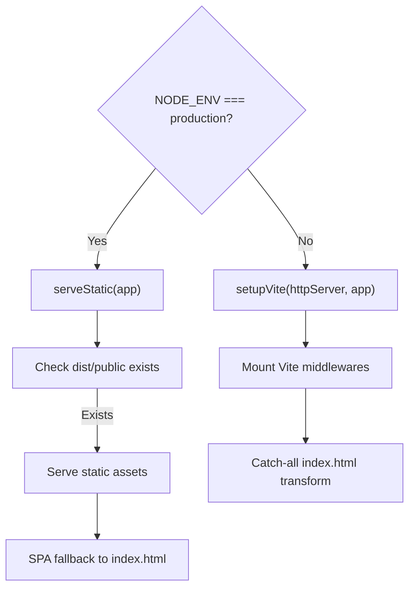
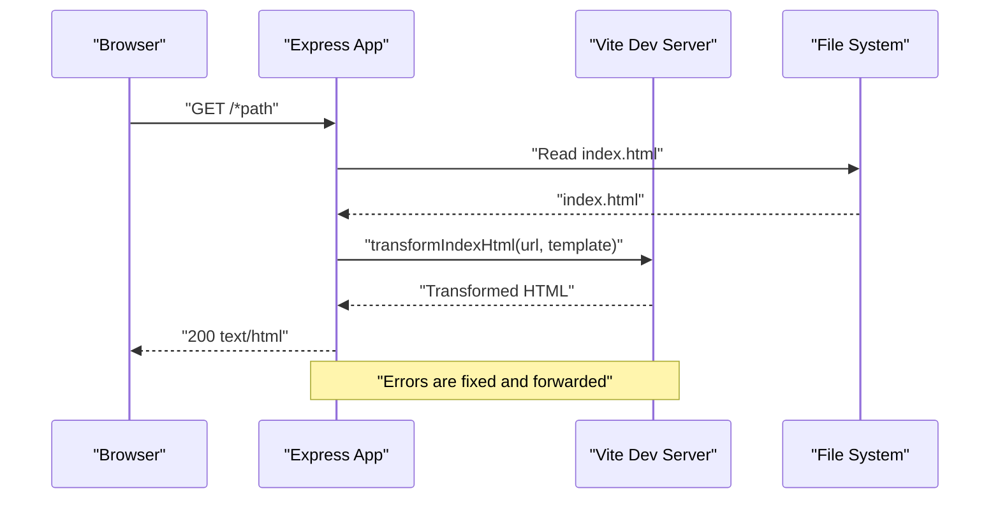
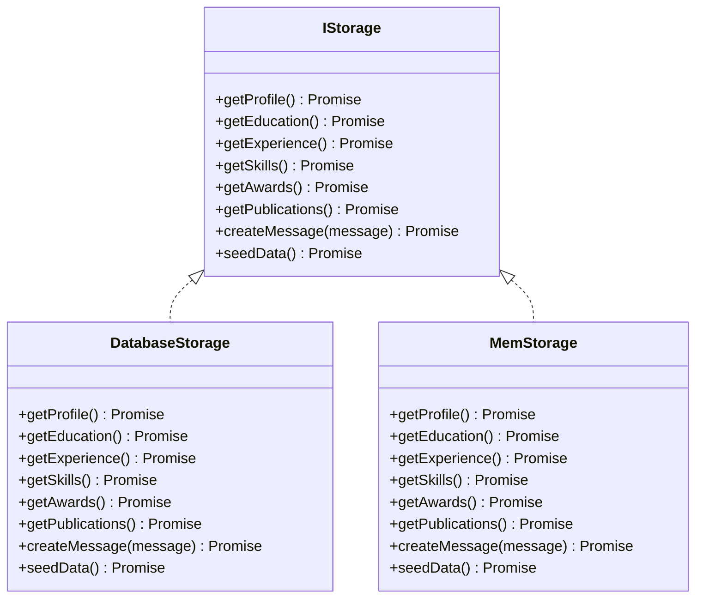
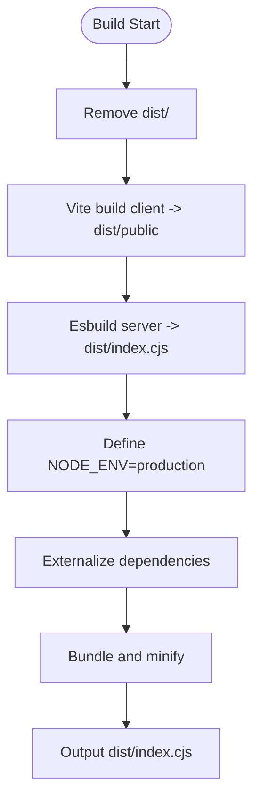
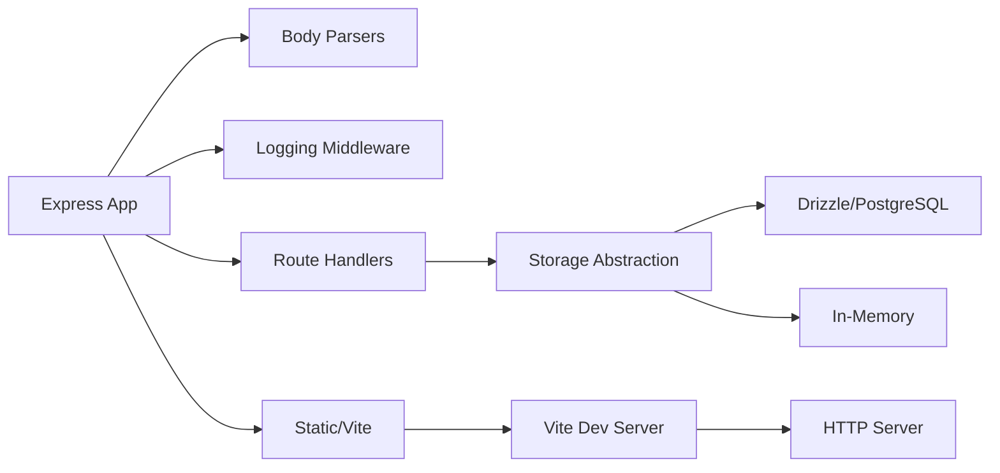

# Server Setup and Configuration

<cite>
**Referenced Files in This Document**
- [server/index.ts](file://server/index.ts)
- [server/vite.ts](file://server/vite.ts)
- [server/static.ts](file://server/static.ts)
- [server/routes.ts](file://server/routes.ts)
- [server/storage.ts](file://server/storage.ts)
- [server/db.ts](file://server/db.ts)
- [shared/routes.ts](file://shared/routes.ts)
- [shared/schema.ts](file://shared/schema.ts)
- [vite.config.ts](file://vite.config.ts)
- [package.json](file://package.json)
- [script/build.ts](file://script/build.ts)
- [README.md](file://README.md)
</cite>

## Table of Contents
1. [Introduction](#introduction)
2. [Project Structure](#project-structure)
3. [Core Components](#core-components)
4. [Architecture Overview](#architecture-overview)
5. [Detailed Component Analysis](#detailed-component-analysis)
6. [Dependency Analysis](#dependency-analysis)
7. [Performance Considerations](#performance-considerations)
8. [Troubleshooting Guide](#troubleshooting-guide)
9. [Conclusion](#conclusion)
10. [Appendices](#appendices)

## Introduction
This document explains how the Express server is initialized, configured, and integrated with the Vite development environment. It covers environment-aware behavior (development vs production), middleware setup, static asset serving, HTTP server configuration, and the relationship between server and client applications. It also documents environment variable handling, port configuration, and server lifecycle management, along with practical examples and troubleshooting guidance.

## Project Structure
The server is organized around a small set of modules:
- Entry point initializes Express, HTTP server, middleware, routes, and environment-specific behavior.
- Vite integration enables development-time hot module replacement and SSR-like HTML injection.
- Static asset serving is handled differently in development versus production.
- Routes expose a REST API backed by either a PostgreSQL database or an in-memory fallback.
- Shared modules define API routes and data schemas used by both server and client.

**Diagram sources**
- [server/index.ts](file://server/index.ts#L1-L103)
- [server/routes.ts](file://server/routes.ts#L1-L66)
- [server/static.ts](file://server/static.ts#L1-L20)
- [server/vite.ts](file://server/vite.ts#L1-L59)
- [server/storage.ts](file://server/storage.ts#L1-L323)
- [server/db.ts](file://server/db.ts#L1-L12)
- [shared/routes.ts](file://shared/routes.ts#L1-L112)
- [shared/schema.ts](file://shared/schema.ts#L1-L86)
- [vite.config.ts](file://vite.config.ts#L1-L41)
- [script/build.ts](file://script/build.ts#L1-L68)

**Section sources**
- [server/index.ts](file://server/index.ts#L1-L103)
- [vite.config.ts](file://vite.config.ts#L1-L41)
- [package.json](file://package.json#L1-L114)

## Core Components
- Express application and HTTP server creation with a shared HTTP server instance for Vite HMR.
- Centralized logging utility with formatted timestamps.
- Request/response middleware for structured logging and response capture.
- Route registration for profile, education, experience, skills, awards, publications, and contact submission.
- Environment-aware static asset serving:
  - Production: Serve prebuilt assets from a public directory and fall back to index.html for SPA routing.
  - Development: Use Vite middleware and inject index.html with HMR support.
- Vite integration for development with SSR-like HTML transform and dynamic index.html refresh.
- Build pipeline that compiles the client and bundles the server for production.

**Section sources**
- [server/index.ts](file://server/index.ts#L1-L103)
- [server/routes.ts](file://server/routes.ts#L1-L66)
- [server/static.ts](file://server/static.ts#L1-L20)
- [server/vite.ts](file://server/vite.ts#L1-L59)
- [script/build.ts](file://script/build.ts#L1-L68)

## Architecture Overview
The server initializes an Express app and an HTTP server. Middleware is registered early to capture request timing and response bodies. Routes are registered, followed by environment-specific asset serving. In development, Vite middleware is mounted and a catch-all handler serves index.html with transformed HTML. In production, static assets are served from a public directory with SPA fallback.

**Diagram sources**
- [server/index.ts](file://server/index.ts#L62-L102)
- [server/routes.ts](file://server/routes.ts#L7-L65)
- [server/static.ts](file://server/static.ts#L5-L19)
- [server/vite.ts](file://server/vite.ts#L11-L58)

## Detailed Component Analysis

### Express Initialization and Lifecycle
- Creates an Express app and an HTTP server instance.
- Registers JSON and URL-encoded parsers with a raw body buffer hook for signature verification scenarios.
- Adds a request/response logging middleware that captures response bodies and logs API requests with durations.
- Registers a global error handler that returns standardized JSON errors.
- Conditionally mounts Vite middleware in development or static assets in production.
- Starts listening on a configurable port with host binding for container/network compatibility.

Key behaviors:
- Port selection defaults to an environment-specified value or a predefined fallback.
- Host binding to 0.0.0.0 ensures accessibility from network contexts.
- Logging middleware wraps response JSON to capture payload for API logs.

**Section sources**
- [server/index.ts](file://server/index.ts#L6-L102)

### Middleware Setup
- Body parsing with raw body capture for potential webhook or signed request verification.
- URL-encoded parser for form submissions.
- Request/response logging middleware:
  - Wraps res.json to capture response body.
  - Emits a log line on response finish with method, path, status, duration, and optional response payload.
  - Filters logs to API paths only.
- Global error handler:
  - Infers status from error properties or defaults to 500.
  - Prevents duplicate headers when headers were already sent.
  - Returns JSON error response.

**Section sources**
- [server/index.ts](file://server/index.ts#L15-L76)

### Route Registration and API Contracts
- Registers GET endpoints for profile, education, experience, skills, awards, and publications.
- Registers POST endpoint for contact submission with Zod-based input validation.
- Uses shared route definitions and schemas to enforce API contracts and response types.
- Seeds storage on startup to populate default data when storage is empty.

**Diagram sources**
- [server/routes.ts](file://server/routes.ts#L12-L62)
- [shared/routes.ts](file://shared/routes.ts#L32-L98)

**Section sources**
- [server/routes.ts](file://server/routes.ts#L1-L66)
- [shared/routes.ts](file://shared/routes.ts#L1-L112)

### Static Asset Serving and SPA Routing
- Production mode:
  - Validates presence of the build output directory.
  - Serves static assets from a public directory.
  - Falls back to index.html for any unmatched route to enable client-side routing.
- Development mode:
  - Vite middleware is mounted to handle asset resolution and HMR.
  - A catch-all route transforms index.html via Vite and injects a cache-busting query parameter to ensure fresh client scripts.

**Diagram sources**
- [server/index.ts](file://server/index.ts#L81-L86)
- [server/static.ts](file://server/static.ts#L5-L19)
- [server/vite.ts](file://server/vite.ts#L11-L58)

**Section sources**
- [server/static.ts](file://server/static.ts#L1-L20)
- [server/vite.ts](file://server/vite.ts#L1-L59)

### Vite Integration for Development
- Creates a Vite server in middleware mode with HMR bound to the HTTP server.
- Mounts Vite middlewares into Express.
- Implements a catch-all route that:
  - Reads index.html from disk (ensuring live reloads).
  - Injects a cache-busting query parameter for the main script.
  - Transforms the HTML via Vite and sends it as text/html.
  - Delegates stack traces to Vite’s fixer and forwards errors to Express.

**Diagram sources**
- [server/vite.ts](file://server/vite.ts#L34-L57)

**Section sources**
- [server/vite.ts](file://server/vite.ts#L1-L59)
- [vite.config.ts](file://vite.config.ts#L1-L41)

### Data Layer and Storage Abstraction
- Defines an interface for storage operations and two implementations:
  - Database-backed storage using Drizzle ORM and PostgreSQL.
  - In-memory storage for local development without a database.
- Automatically seeds default data on startup when the database is empty.
- Exposes methods for retrieving profile, education, experience, skills, awards, publications, and creating messages.

**Diagram sources**
- [server/storage.ts](file://server/storage.ts#L9-L32)
- [server/storage.ts](file://server/storage.ts#L22-L226)
- [server/storage.ts](file://server/storage.ts#L228-L320)

**Section sources**
- [server/storage.ts](file://server/storage.ts#L1-L323)
- [server/db.ts](file://server/db.ts#L1-L12)
- [shared/schema.ts](file://shared/schema.ts#L1-L86)

### Build Pipeline and Production Deployment
- Client build via Vite into a public output directory.
- Server bundling via esbuild:
  - Externalizes most dependencies to reduce bundle size.
  - Whitelists a curated set of dependencies to minimize openat syscalls and improve cold start.
  - Defines NODE_ENV for production during build.
  - Produces a CJS bundle for Node.js runtime.

**Diagram sources**
- [script/build.ts](file://script/build.ts#L35-L62)

**Section sources**
- [script/build.ts](file://script/build.ts#L1-L68)
- [vite.config.ts](file://vite.config.ts#L30-L33)

## Dependency Analysis
- Express application depends on:
  - Body parsing middleware for JSON and URL-encoded payloads.
  - Logging middleware for request/response telemetry.
  - Route handlers for API endpoints.
  - Environment-specific asset serving (static or Vite).
- Routes depend on:
  - Storage abstraction for data access.
  - Shared route definitions and Zod schemas for API contracts.
- Storage depends on:
  - Drizzle ORM and PostgreSQL pool when DATABASE_URL is present.
  - In-memory fallback otherwise.
- Vite integration depends on:
  - Vite configuration and plugins.
  - HTTP server instance for HMR.

**Diagram sources**
- [server/index.ts](file://server/index.ts#L15-L86)
- [server/routes.ts](file://server/routes.ts#L1-L66)
- [server/storage.ts](file://server/storage.ts#L1-L323)
- [server/vite.ts](file://server/vite.ts#L1-L59)
- [server/db.ts](file://server/db.ts#L1-L12)

**Section sources**
- [server/index.ts](file://server/index.ts#L1-L103)
- [server/routes.ts](file://server/routes.ts#L1-L66)
- [server/storage.ts](file://server/storage.ts#L1-L323)
- [server/db.ts](file://server/db.ts#L1-L12)
- [server/vite.ts](file://server/vite.ts#L1-L59)

## Performance Considerations
- Cold start optimization:
  - The server build whitelists a curated set of dependencies to reduce external module loading overhead.
  - Minification and CJS output reduce runtime overhead in production.
- Network binding:
  - Binding to 0.0.0.0 allows the server to be reachable from containers and networks.
- Logging overhead:
  - Response body capture occurs only for API paths and only when enabled by the logging middleware.
- Asset serving:
  - Production static serving avoids Node-based transformations, reducing latency.
  - Development uses Vite middleware with HMR, which adds overhead but improves DX.

[No sources needed since this section provides general guidance]

## Troubleshooting Guide
Common issues and resolutions:
- Port conflicts or firewall restrictions:
  - The server listens on a configurable port and binds to 0.0.0.0. Ensure the port is open and not blocked by the environment.
  - Reference: [server/index.ts](file://server/index.ts#L92-L101)
- Missing build directory in production:
  - Static serving validates the existence of the public directory. Ensure the client is built before starting the server.
  - Reference: [server/static.ts](file://server/static.ts#L5-L11)
- Database connectivity:
  - Without DATABASE_URL, the application uses in-memory storage. Verify environment variables if expecting database-backed storage.
  - Reference: [server/storage.ts](file://server/storage.ts#L322), [server/db.ts](file://server/db.ts#L7-L11)
- Vite errors in development:
  - Vite errors cause the process to exit. Check Vite logs and plugin configurations.
  - Reference: [server/vite.ts](file://server/vite.ts#L21-L27)
- API validation failures:
  - Contact endpoint returns structured validation errors with field information.
  - Reference: [server/routes.ts](file://server/routes.ts#L48-L62), [shared/routes.ts](file://shared/routes.ts#L88-L98)
- Startup seeding not occurring:
  - Seeding runs on startup when storage is empty. Confirm database availability or environment configuration.
  - Reference: [server/routes.ts](file://server/routes.ts#L12-L13), [server/storage.ts](file://server/storage.ts#L60-L225)

**Section sources**
- [server/index.ts](file://server/index.ts#L92-L101)
- [server/static.ts](file://server/static.ts#L5-L11)
- [server/storage.ts](file://server/storage.ts#L322-L323)
- [server/db.ts](file://server/db.ts#L7-L11)
- [server/vite.ts](file://server/vite.ts#L21-L27)
- [server/routes.ts](file://server/routes.ts#L48-L62)
- [shared/routes.ts](file://shared/routes.ts#L88-L98)

## Conclusion
The server setup integrates Express with Vite for a smooth development experience while maintaining a robust production deployment pipeline. Environment variables control behavior, middleware provides observability, and the storage abstraction supports both database-backed and in-memory modes. The architecture cleanly separates concerns and offers predictable startup, logging, and asset serving across environments.

[No sources needed since this section summarizes without analyzing specific files]

## Appendices

### Environment Variables and Configuration
- NODE_ENV:
  - Controls development vs production behavior for asset serving and build definitions.
  - Reference: [server/index.ts](file://server/index.ts#L81-L86), [script/build.ts](file://script/build.ts#L55-L57)
- PORT:
  - Determines the port the server listens on. Defaults to a non-standard port in development.
  - Reference: [server/index.ts](file://server/index.ts#L92-L92)
- DATABASE_URL:
  - Enables PostgreSQL-backed storage. Absent means in-memory fallback.
  - Reference: [server/storage.ts](file://server/storage.ts#L322), [server/db.ts](file://server/db.ts#L7-L11)

**Section sources**
- [server/index.ts](file://server/index.ts#L81-L92)
- [script/build.ts](file://script/build.ts#L55-L57)
- [server/storage.ts](file://server/storage.ts#L322-L322)
- [server/db.ts](file://server/db.ts#L7-L11)

### Server Startup Procedures
- Development:
  - Run the development script to start the server with hot reloading.
  - Reference: [package.json](file://package.json#L6-L12)
- Production:
  - Build the client and server, then start the production bundle.
  - Reference: [package.json](file://package.json#L6-L12), [script/build.ts](file://script/build.ts#L35-L62)

**Section sources**
- [package.json](file://package.json#L6-L12)
- [script/build.ts](file://script/build.ts#L35-L62)

### API Definitions and Contracts
- Shared route definitions enumerate endpoints, methods, paths, and response schemas.
- Reference: [shared/routes.ts](file://shared/routes.ts#L32-L98)

**Section sources**
- [shared/routes.ts](file://shared/routes.ts#L32-L98)