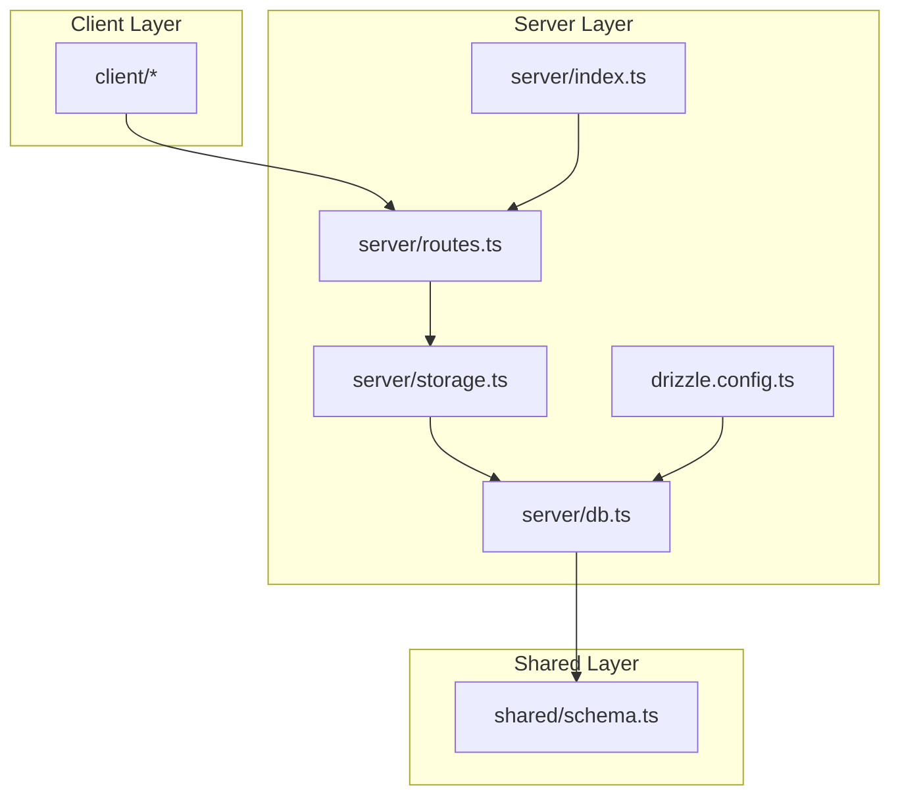
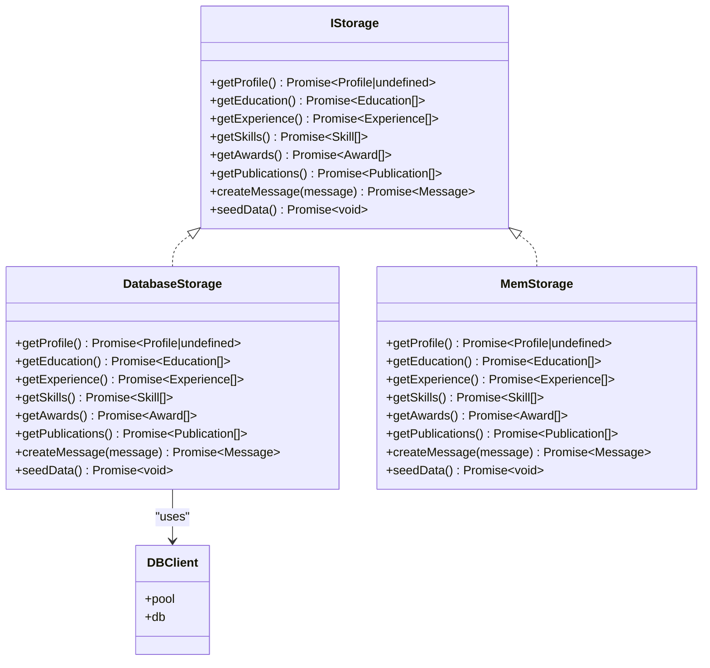
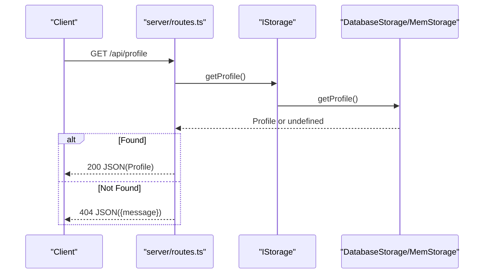
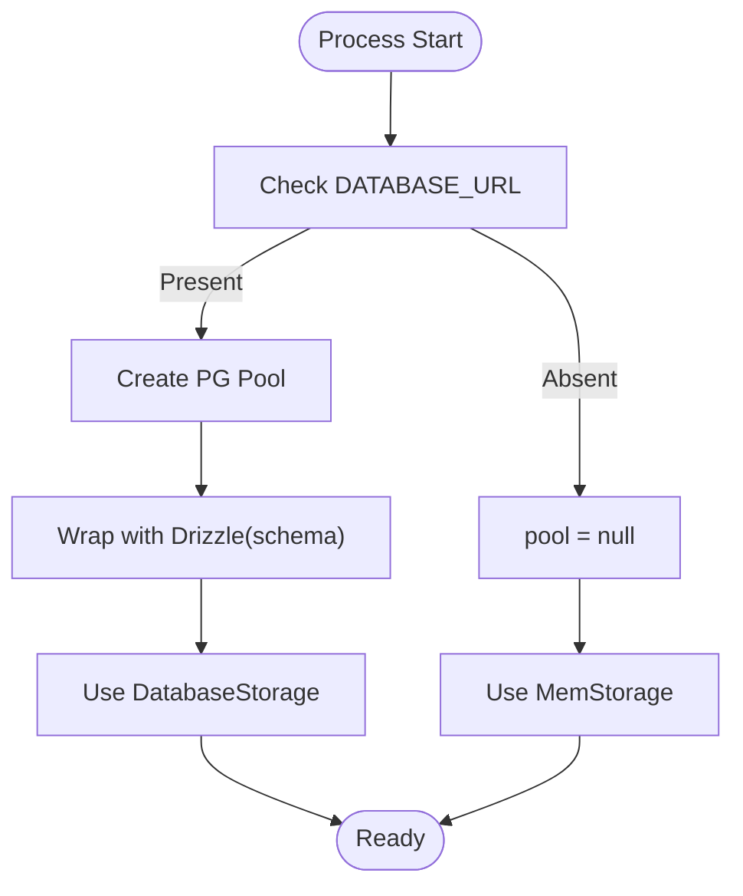
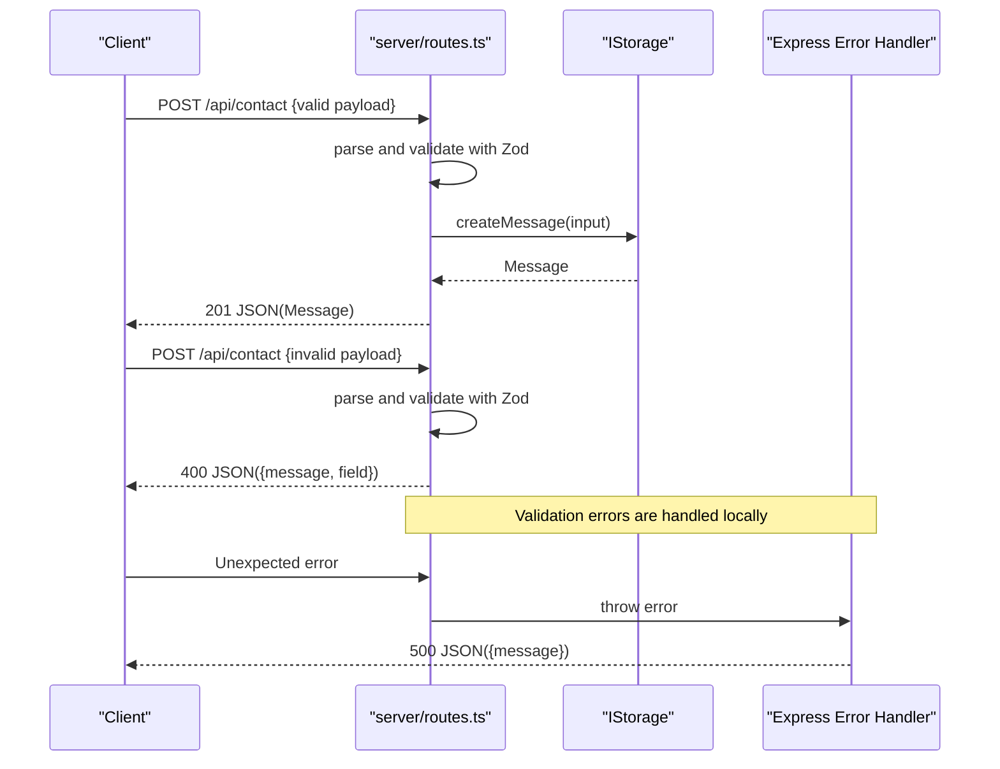
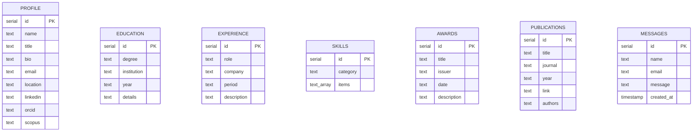
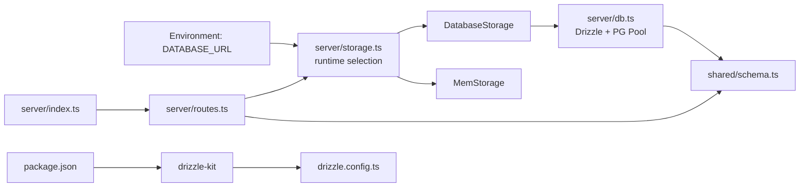

# Storage Integration

<cite>
**Referenced Files in This Document**
- [server/storage.ts](file://server/storage.ts)
- [server/db.ts](file://server/db.ts)
- [shared/schema.ts](file://shared/schema.ts)
- [server/routes.ts](file://server/routes.ts)
- [server/index.ts](file://server/index.ts)
- [drizzle.config.ts](file://drizzle.config.ts)
- [shared/routes.ts](file://shared/routes.ts)
- [package.json](file://package.json)
- [README.md](file://README.md)
</cite>

## Table of Contents
1. [Introduction](#introduction)
2. [Project Structure](#project-structure)
3. [Core Components](#core-components)
4. [Architecture Overview](#architecture-overview)
5. [Detailed Component Analysis](#detailed-component-analysis)
6. [Dependency Analysis](#dependency-analysis)
7. [Performance Considerations](#performance-considerations)
8. [Troubleshooting Guide](#troubleshooting-guide)
9. [Conclusion](#conclusion)
10. [Appendices](#appendices)

## Introduction
This document explains the storage abstraction layer and database integration for the portfolio application. It covers the repository-style storage interface, the in-memory storage used during development, and the PostgreSQL-backed implementation for production. It also documents the storage interface methods, database connection management via Drizzle ORM and the Node PG pool, data access patterns, seed data functionality, error propagation from storage to API layers, and practical guidance for migrations and performance.

## Project Structure
The storage integration spans three primary areas:
- Shared schema definitions that describe tables and types used by both in-memory and database storage.
- Storage implementations that expose a unified interface for data access.
- Server-side routes and application bootstrap that wire storage into the API and handle errors.

**Diagram sources**
- [server/storage.ts](file://server/storage.ts#L1-L323)
- [server/db.ts](file://server/db.ts#L1-L12)
- [shared/schema.ts](file://shared/schema.ts#L1-L86)
- [server/routes.ts](file://server/routes.ts#L1-L66)
- [server/index.ts](file://server/index.ts#L1-L103)
- [drizzle.config.ts](file://drizzle.config.ts#L1-L15)

**Section sources**
- [server/storage.ts](file://server/storage.ts#L1-L323)
- [server/db.ts](file://server/db.ts#L1-L12)
- [shared/schema.ts](file://shared/schema.ts#L1-L86)
- [server/routes.ts](file://server/routes.ts#L1-L66)
- [server/index.ts](file://server/index.ts#L1-L103)
- [drizzle.config.ts](file://drizzle.config.ts#L1-L15)
- [README.md](file://README.md#L46-L56)

## Core Components
- Storage interface and implementations:
  - IStorage defines the contract for retrieving lists and creating messages, plus seeding.
  - DatabaseStorage implements IStorage using Drizzle ORM against PostgreSQL.
  - MemStorage implements IStorage using in-memory arrays for development.
  - A runtime selection chooses DatabaseStorage when DATABASE_URL is present; otherwise MemStorage is used.
- Database connection management:
  - A Node PG Pool is created from DATABASE_URL when available.
  - Drizzle wraps the pool with schema bindings to produce a typed db client.
- Schema definitions:
  - Tables for profile, education, experience, skills, awards, publications, and messages.
  - Zod insert schemas for input validation.
  - TypeScript types for all entities and insert shapes.
- Routes and API wiring:
  - Routes call storage methods and propagate errors to the centralized error handler.
  - SeedData is invoked on server startup.
- Migration configuration:
  - Drizzle Kit config reads DATABASE_URL and points to shared schema and migrations output.

**Section sources**
- [server/storage.ts](file://server/storage.ts#L9-L323)
- [server/db.ts](file://server/db.ts#L1-L12)
- [shared/schema.ts](file://shared/schema.ts#L1-L86)
- [server/routes.ts](file://server/routes.ts#L1-L66)
- [drizzle.config.ts](file://drizzle.config.ts#L1-L15)

## Architecture Overview
The storage layer sits between the API routes and the database. The routes depend on the storage abstraction, which in turn depends on the database client. The schema module provides shared table definitions and validation.

**Diagram sources**
- [server/storage.ts](file://server/storage.ts#L9-L323)
- [server/db.ts](file://server/db.ts#L1-L12)

## Detailed Component Analysis

### Storage Interface and Implementations
- IStorage defines a repository-style contract for:
  - Retrieving collections: profile, education, experience, skills, awards, publications.
  - Creating messages.
  - Seeding default data.
- DatabaseStorage:
  - Uses Drizzle ORM to select all rows from each table.
  - Inserts new messages and returns the inserted row.
  - Throws a clear error if the database client is unavailable.
  - Seeds default data only if no profile exists.
- MemStorage:
  - Maintains in-memory arrays for each entity and a monotonically increasing id counter for messages.
  - Implements the same interface with pure in-memory operations.
  - Seeds default data into memory on first call.

**Diagram sources**
- [server/routes.ts](file://server/routes.ts#L15-L21)
- [server/storage.ts](file://server/storage.ts#L22-L58)

**Section sources**
- [server/storage.ts](file://server/storage.ts#L9-L323)

### Database Connection Management
- Connection creation:
  - A Node PG Pool is instantiated from DATABASE_URL when present.
  - Drizzle wraps the pool with the shared schema to create a typed db client.
- Null safety:
  - Both pool and db are null when DATABASE_URL is absent, ensuring graceful fallback to in-memory storage.
- Drizzle Kit configuration:
  - Enforces DATABASE_URL presence and sets migrations output and schema path.

**Diagram sources**
- [server/db.ts](file://server/db.ts#L7-L11)
- [drizzle.config.ts](file://drizzle.config.ts#L3-L5)

**Section sources**
- [server/db.ts](file://server/db.ts#L1-L12)
- [drizzle.config.ts](file://drizzle.config.ts#L1-L15)

### Data Access Patterns and API Wiring
- Routes:
  - SeedData is invoked at startup.
  - GET endpoints call storage methods and return 200 with data or 404 when appropriate.
  - POST /api/contact validates input with Zod, calls storage.createMessage, and returns 201 on success or 400 on validation errors.
- Error propagation:
  - Validation errors are caught and returned as structured JSON with a field hint.
  - Unhandled errors bubble to the centralized Express error handler, which logs and responds with a generic message and status.

**Diagram sources**
- [server/routes.ts](file://server/routes.ts#L48-L62)
- [server/index.ts](file://server/index.ts#L65-L76)

**Section sources**
- [server/routes.ts](file://server/routes.ts#L1-L66)
- [server/index.ts](file://server/index.ts#L65-L76)

### Seed Data Functionality
- Behavior:
  - DatabaseStorage: Seeds profile, education, experience, skills, awards, and publications if no profile exists.
  - MemStorage: Seeds in-memory arrays if no profile exists.
- Invocation:
  - Routes call storage.seedData() during server initialization.

**Section sources**
- [server/storage.ts](file://server/storage.ts#L60-L225)
- [server/routes.ts](file://server/routes.ts#L12-L13)

### Transaction Handling
- Current implementation:
  - Individual inserts are executed separately; there is no explicit transaction block spanning multiple inserts in seedData.
- Recommendations:
  - Wrap seedData operations in a transaction to ensure atomicity.
  - Use a transaction per write operation when inserting messages to maintain consistency under concurrent loads.

[No sources needed since this section provides general guidance]

### Error Propagation from Storage to API Layers
- DatabaseStorage throws when db is unavailable, which propagates to routes and is handled by the global error handler.
- Validation errors are caught in routes and returned as structured JSON with a field hint.
- Unhandled exceptions are logged centrally and responded to with a generic message.

**Section sources**
- [server/storage.ts](file://server/storage.ts#L54-L58)
- [server/routes.ts](file://server/routes.ts#L53-L61)
- [server/index.ts](file://server/index.ts#L65-L76)

### Examples of Storage Operations
- Retrieve profile:
  - Route: GET /api/profile
  - Storage: getProfile()
- List experiences:
  - Route: GET /api/experience
  - Storage: getExperience()
- Submit contact message:
  - Route: POST /api/contact
  - Storage: createMessage()

**Section sources**
- [server/routes.ts](file://server/routes.ts#L15-L46)
- [shared/routes.ts](file://shared/routes.ts#L32-L99)
- [server/storage.ts](file://server/storage.ts#L22-L58)

### Database Schema Relationships
The schema defines seven tables with no explicit foreign keys. The relationships are conceptual and implied by the application’s domain (e.g., profile is singular, others are lists). The schema also exposes Zod insert schemas and TypeScript types for strong typing across layers.

**Diagram sources**
- [shared/schema.ts](file://shared/schema.ts#L7-L64)

**Section sources**
- [shared/schema.ts](file://shared/schema.ts#L1-L86)

### Migration Procedures
- Prerequisites:
  - Set DATABASE_URL in the environment.
- Generate and apply migrations:
  - Use the provided script to push schema changes to the database.
- Drizzle Kit configuration:
  - Ensures migrations output folder and schema path are correct and enforces DATABASE_URL presence.

**Section sources**
- [README.md](file://README.md#L46-L56)
- [drizzle.config.ts](file://drizzle.config.ts#L1-L15)
- [package.json](file://package.json#L11-L11)

## Dependency Analysis
- Runtime selection:
  - server/storage.ts selects DatabaseStorage or MemStorage based on DATABASE_URL.
- Schema dependency:
  - server/db.ts imports shared schema to bind Drizzle.
- Routes dependency:
  - server/routes.ts imports storage and shared route definitions.
- Tooling dependency:
  - package.json scripts orchestrate dev, build, start, and db:push.

**Diagram sources**
- [server/storage.ts](file://server/storage.ts#L322-L323)
- [server/db.ts](file://server/db.ts#L1-L12)
- [shared/schema.ts](file://shared/schema.ts#L1-L86)
- [server/routes.ts](file://server/routes.ts#L1-L66)
- [server/index.ts](file://server/index.ts#L1-L103)
- [drizzle.config.ts](file://drizzle.config.ts#L1-L15)
- [package.json](file://package.json#L11-L11)

**Section sources**
- [server/storage.ts](file://server/storage.ts#L322-L323)
- [server/db.ts](file://server/db.ts#L1-L12)
- [shared/schema.ts](file://shared/schema.ts#L1-L86)
- [server/routes.ts](file://server/routes.ts#L1-L66)
- [server/index.ts](file://server/index.ts#L1-L103)
- [drizzle.config.ts](file://drizzle.config.ts#L1-L15)
- [package.json](file://package.json#L11-L11)

## Performance Considerations
- Connection pooling:
  - Node PG Pool manages connections; ensure DATABASE_URL is set in production to enable pooling.
- Query patterns:
  - Current reads fetch entire tables; consider adding pagination or filtering for large datasets.
- Write patterns:
  - Messages are inserted individually; batching could reduce overhead for bulk submissions.
- Caching:
  - Consider caching frequently accessed profile and static lists to reduce database load.
- Logging and monitoring:
  - Centralized logging captures API response bodies and durations; use this to identify slow endpoints.

[No sources needed since this section provides general guidance]

## Troubleshooting Guide
- Database not available:
  - Symptoms: Errors thrown when creating messages or accessing storage.
  - Resolution: Ensure DATABASE_URL is set and reachable; confirm the pool is initialized.
- Validation failures on contact form:
  - Symptoms: 400 responses with a field hint.
  - Resolution: Match the input shape to insertMessageSchema; check required fields.
- Unexpected server errors:
  - Symptoms: 500 responses with a generic message.
  - Resolution: Inspect server logs for stack traces; ensure proper error handling in routes.

**Section sources**
- [server/storage.ts](file://server/storage.ts#L54-L58)
- [server/routes.ts](file://server/routes.ts#L53-L61)
- [server/index.ts](file://server/index.ts#L65-L76)

## Conclusion
The storage layer cleanly separates data access concerns behind a simple interface, enabling seamless switching between in-memory and PostgreSQL-backed implementations. Drizzle ORM and Node PG Pool provide robust database connectivity, while Zod schemas ensure strong input validation. The seed functionality simplifies onboarding, and the centralized error handling ensures predictable API responses. Following the migration and performance recommendations will help scale the system reliably.

## Appendices

### API Surface Summary
- GET /api/profile → 200 Profile | 404
- GET /api/education → 200 Education[]
- GET /api/experience → 200 Experience[]
- GET /api/skills → 200 Skill[]
- GET /api/awards → 200 Award[]
- GET /api/publications → 200 Publication[]
- POST /api/contact → 201 Message | 400 Validation Error | 500 Internal Server Error

**Section sources**
- [shared/routes.ts](file://shared/routes.ts#L32-L99)
- [server/routes.ts](file://server/routes.ts#L15-L46)
- [server/index.ts](file://server/index.ts#L65-L76)