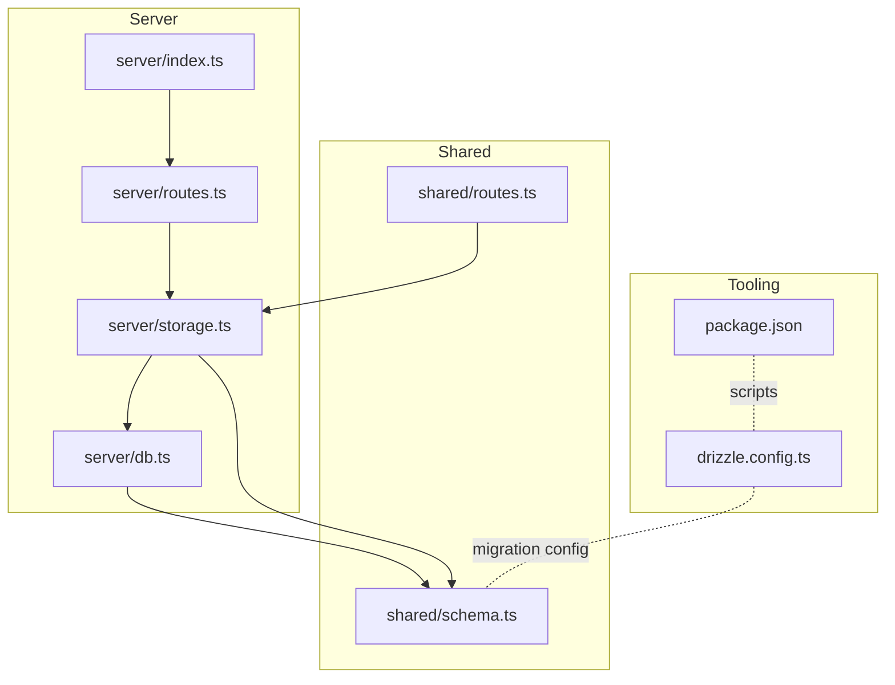
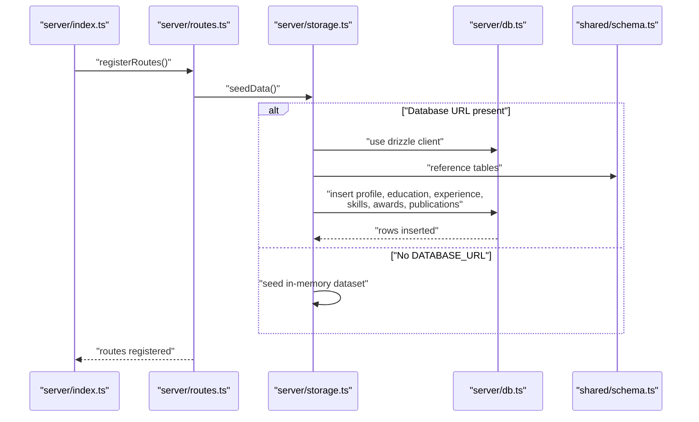
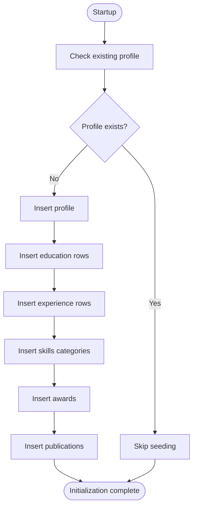
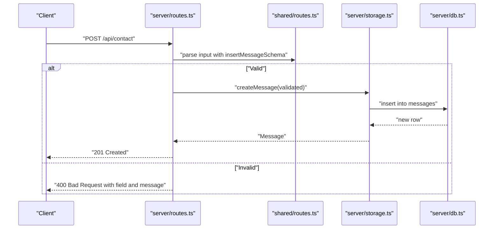
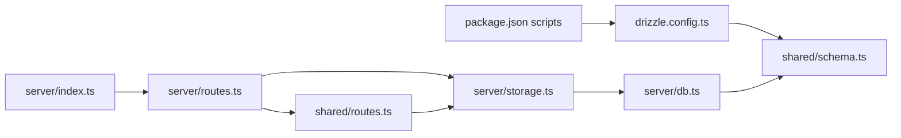

# Data Seeding

<cite>
**Referenced Files in This Document**
- [drizzle.config.ts](file://drizzle.config.ts)
- [schema.ts](file://shared/schema.ts)
- [db.ts](file://server/db.ts)
- [storage.ts](file://server/storage.ts)
- [routes.ts](file://server/routes.ts)
- [index.ts](file://server/index.ts)
- [routes.ts (shared)](file://shared/routes.ts)
- [package.json](file://package.json)
- [README.md](file://README.md)
</cite>

## Table of Contents
1. [Introduction](#introduction)
2. [Project Structure](#project-structure)
3. [Core Components](#core-components)
4. [Architecture Overview](#architecture-overview)
5. [Detailed Component Analysis](#detailed-component-analysis)
6. [Dependency Analysis](#dependency-analysis)
7. [Performance Considerations](#performance-considerations)
8. [Troubleshooting Guide](#troubleshooting-guide)
9. [Conclusion](#conclusion)
10. [Appendices](#appendices)

## Introduction
This document explains the automatic data seeding and initial data population process in the Personal Showcase application. It covers the seed data structure, the automatic insertion mechanism during application startup, and how Zod schemas validate incoming data. It also describes the relationship between the seed data and the database schema, provides examples of the initial dataset structure, outlines the seeding algorithm, and offers guidance on adding or modifying seed data. Finally, it addresses development workflow implications, data persistence across deployments, and balancing static content with dynamic data management.

## Project Structure
The seeding logic is implemented in the backend storage layer and orchestrated at application startup. The database schema is defined in a shared module and consumed by both the database connection and the storage layer. The application conditionally seeds data depending on whether a real database is available.

**Diagram sources**
- [index.ts](file://server/index.ts#L62-L102)
- [routes.ts](file://server/routes.ts#L7-L65)
- [storage.ts](file://server/storage.ts#L1-L323)
- [db.ts](file://server/db.ts#L1-L12)
- [schema.ts](file://shared/schema.ts#L1-L86)
- [routes.ts (shared)](file://shared/routes.ts#L1-L112)
- [drizzle.config.ts](file://drizzle.config.ts#L1-L15)
- [package.json](file://package.json#L6-L12)

**Section sources**
- [README.md](file://README.md#L46-L56)
- [drizzle.config.ts](file://drizzle.config.ts#L1-L15)
- [schema.ts](file://shared/schema.ts#L1-L86)
- [db.ts](file://server/db.ts#L1-L12)
- [storage.ts](file://server/storage.ts#L1-L323)
- [routes.ts](file://server/routes.ts#L1-L66)
- [routes.ts (shared)](file://shared/routes.ts#L1-L112)
- [package.json](file://package.json#L6-L12)

## Core Components
- Database schema definition and Zod insert schemas: Defines tables and auto-generated insert-time Zod schemas for validation.
- Database connection: Provides a Drizzle client bound to the schema.
- Storage abstraction: Implements both in-memory and database-backed storage with a seedData method.
- Application startup: Calls seedData at startup to populate initial data when storage is empty.
- API routes: Expose endpoints for profile, education, experience, skills, awards, publications, and contact submission with Zod validation.

Key responsibilities:
- Schema layer: Ensures data shape and constraints align with database tables.
- Storage layer: Encapsulates retrieval, persistence, and seeding logic.
- Routes layer: Orchestrates seeding and exposes validated endpoints.
- Tooling: Drizzle Kit configuration and scripts support migrations and development.

**Section sources**
- [schema.ts](file://shared/schema.ts#L1-L86)
- [db.ts](file://server/db.ts#L1-L12)
- [storage.ts](file://server/storage.ts#L1-L323)
- [routes.ts](file://server/routes.ts#L12-L13)
- [routes.ts (shared)](file://shared/routes.ts#L88-L98)

## Architecture Overview
The seeding pipeline runs at application startup. If a database connection exists, the DatabaseStorage seedData inserts default records into each table. If no database is available, the application falls back to in-memory storage, which seeds an identical dataset in memory.

**Diagram sources**
- [index.ts](file://server/index.ts#L62-L102)
- [routes.ts](file://server/routes.ts#L7-L13)
- [storage.ts](file://server/storage.ts#L60-L225)
- [db.ts](file://server/db.ts#L1-L12)
- [schema.ts](file://shared/schema.ts#L7-L56)

## Detailed Component Analysis

### Seed Data Structure and Relationship to Database Schema
The seed data mirrors the table definitions and Zod insert schemas. Each table’s insert schema omits auto-generated fields (such as id and createdAt) to enforce that only provided fields are inserted.

- Profile: name, title, bio, email, location, optional social identifiers.
- Education: degree, institution, year, details.
- Experience: role, company, period, description.
- Skills: category, items array.
- Awards: title, issuer, date, description.
- Publications: title, journal, year, link, authors.
- Messages: name, email, message; createdAt is server-assigned.

Validation:
- Zod insert schemas are generated from the schema definitions and omit fields that the database auto-generates.
- API routes validate incoming contact submissions using the insertMessage schema.

Seed data format examples:
- Profile: single row seeded once per database initialization.
- Education, Experience, Awards, Publications: arrays of rows.
- Skills: category with an array of items.
- Messages: submitted via POST endpoint and stored with a server-generated timestamp.

Relationship to schema:
- Seed data keys match column names and types defined in the schema.
- Zod insert schemas ensure strict validation before insertion.

**Section sources**
- [schema.ts](file://shared/schema.ts#L7-L56)
- [schema.ts](file://shared/schema.ts#L68-L74)
- [storage.ts](file://server/storage.ts#L66-L224)
- [routes.ts (shared)](file://shared/routes.ts#L88-L98)

### Automatic Insertion During Database Initialization
The seeding occurs at application startup by calling the storage.seedData method. The logic checks if a profile already exists; if not, it inserts default data into all relevant tables.

Algorithm outline:
1. Check if a profile record exists.
2. If none exists:
   - Insert profile record.
   - Insert multiple education records.
   - Insert multiple experience records.
   - Insert multiple skills categories with item arrays.
   - Insert multiple awards.
   - Insert multiple publications.
3. If a profile exists, skip seeding.

**Diagram sources**
- [routes.ts](file://server/routes.ts#L12-L13)
- [storage.ts](file://server/storage.ts#L60-L225)

**Section sources**
- [routes.ts](file://server/routes.ts#L12-L13)
- [storage.ts](file://server/storage.ts#L60-L225)

### Data Validation Using Zod Schemas
Validation is enforced in two places:
- Database seeding: Uses the generated insert schemas to validate data shapes before insertion.
- API endpoints: Validate incoming requests using Zod before persisting data.

Contact form validation:
- The POST /api/contact endpoint parses the request body against the insertMessage schema.
- On validation failure, responds with a structured error payload indicating the issue and affected field.

**Diagram sources**
- [routes.ts](file://server/routes.ts#L48-L62)
- [routes.ts (shared)](file://shared/routes.ts#L88-L98)
- [storage.ts](file://server/storage.ts#L54-L58)
- [db.ts](file://server/db.ts#L1-L12)

**Section sources**
- [routes.ts](file://server/routes.ts#L48-L62)
- [routes.ts (shared)](file://shared/routes.ts#L88-L98)
- [schema.ts](file://shared/schema.ts#L74)

### How New Data Can Be Added or Modified
To add or modify seed data:
- Edit the seedData method in the storage layer to update or append new rows.
- Ensure keys match the schema and adhere to the insert schemas (excluding auto-generated fields).
- For dynamic content (e.g., contact messages), use the existing POST /api/contact endpoint, which validates input via Zod and persists to the database.

Guidelines:
- Keep seed data aligned with the schema definitions.
- Use arrays for multi-row inserts (education, experience, skills, awards, publications).
- For single-row inserts (profile), ensure uniqueness constraints are respected.
- Validate any new fields with the corresponding insert schema.

**Section sources**
- [storage.ts](file://server/storage.ts#L60-L225)
- [schema.ts](file://shared/schema.ts#L68-L74)
- [routes.ts (shared)](file://shared/routes.ts#L88-L98)

## Dependency Analysis
The seeding process depends on:
- Drizzle ORM for database operations.
- Zod schemas for validation.
- Environment configuration to choose between database and in-memory storage.
- Drizzle Kit configuration for migrations.

**Diagram sources**
- [package.json](file://package.json#L6-L12)
- [drizzle.config.ts](file://drizzle.config.ts#L1-L15)
- [schema.ts](file://shared/schema.ts#L1-L86)
- [index.ts](file://server/index.ts#L62-L102)
- [routes.ts](file://server/routes.ts#L7-L13)
- [storage.ts](file://server/storage.ts#L1-L323)
- [db.ts](file://server/db.ts#L1-L12)
- [routes.ts (shared)](file://shared/routes.ts#L1-L112)

**Section sources**
- [package.json](file://package.json#L6-L12)
- [drizzle.config.ts](file://drizzle.config.ts#L1-L15)
- [schema.ts](file://shared/schema.ts#L1-L86)
- [db.ts](file://server/db.ts#L1-L12)
- [storage.ts](file://server/storage.ts#L1-L323)
- [routes.ts](file://server/routes.ts#L7-L13)
- [routes.ts (shared)](file://shared/routes.ts#L1-L112)

## Performance Considerations
- Seeding runs once at startup and only when the profile table is empty, minimizing overhead.
- In-memory storage avoids database round-trips during development, improving responsiveness.
- For production with a real database, ensure the seeding operation completes before serving traffic to avoid partial reads.

[No sources needed since this section provides general guidance]

## Troubleshooting Guide
Common issues and resolutions:
- No data visible in the UI:
  - Confirm seeding ran by checking logs around application startup.
  - Verify that the profile table is empty or that the application is not falling back to in-memory storage unintentionally.
- Database seeding errors:
  - Ensure DATABASE_URL is set and reachable.
  - Confirm the schema matches the database state; use the provided script to synchronize.
- Validation failures on contact form:
  - Review the returned field and message to correct the input according to the insertMessage schema.

Operational tips:
- Use the development script to run locally without a database (in-memory fallback).
- Use the production script with a real database and run the migration script to keep schema and seed data synchronized.

**Section sources**
- [README.md](file://README.md#L46-L56)
- [routes.ts](file://server/routes.ts#L48-L62)
- [routes.ts (shared)](file://shared/routes.ts#L88-L98)
- [package.json](file://package.json#L6-L12)

## Conclusion
The Personal Showcase application implements a robust, environment-aware seeding mechanism. At startup, it automatically populates default content when storage is empty, ensuring a ready-to-use experience. Zod schemas provide strong validation for both seed data and API inputs. The design cleanly separates concerns between schema, storage, and routing, enabling straightforward extension and maintenance. Developers can confidently add or modify seed data while preserving data integrity and a smooth development workflow.

[No sources needed since this section summarizes without analyzing specific files]

## Appendices

### Initial Dataset Structure Examples
- Profile: Single record with personal and professional metadata.
- Education: Array of academic entries.
- Experience: Array of professional roles.
- Skills: Array of categories with item arrays.
- Awards: Array of honors.
- Publications: Array of scholarly works.
- Messages: Submitted contact entries with timestamps.

These structures are defined by the schema and validated by the insert schemas before insertion.

**Section sources**
- [schema.ts](file://shared/schema.ts#L7-L56)
- [schema.ts](file://shared/schema.ts#L68-L74)
- [storage.ts](file://server/storage.ts#L66-L224)