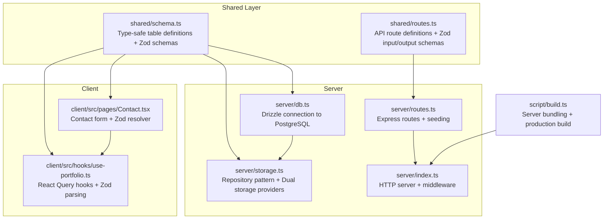
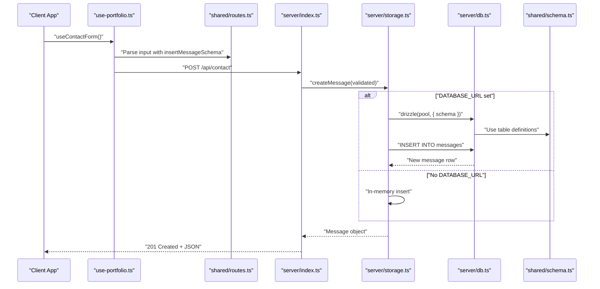
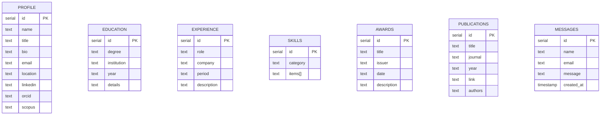
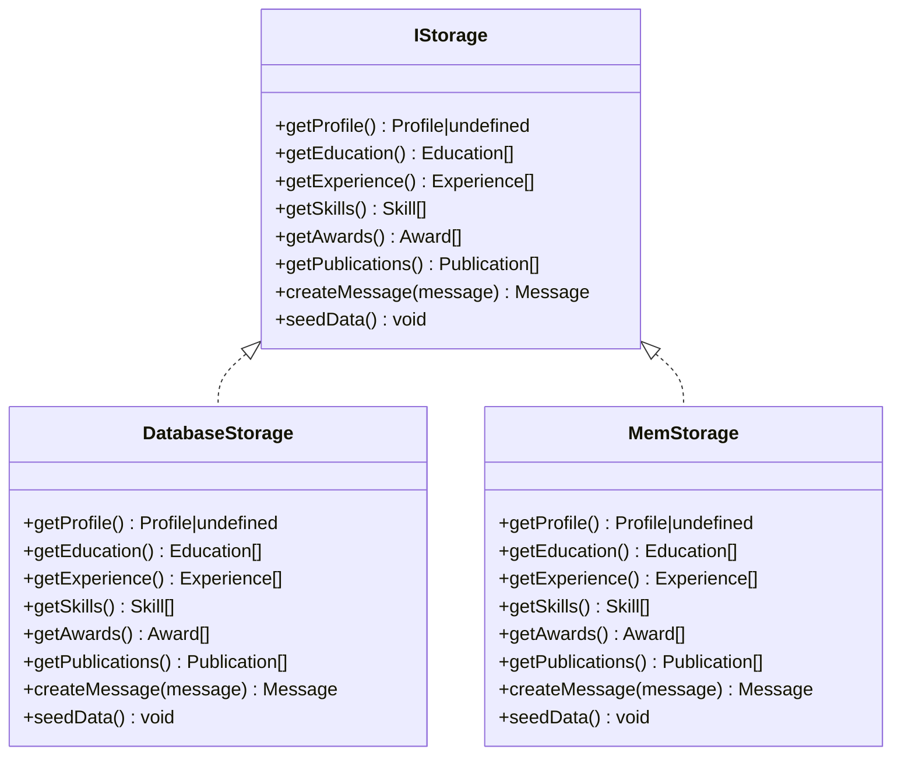
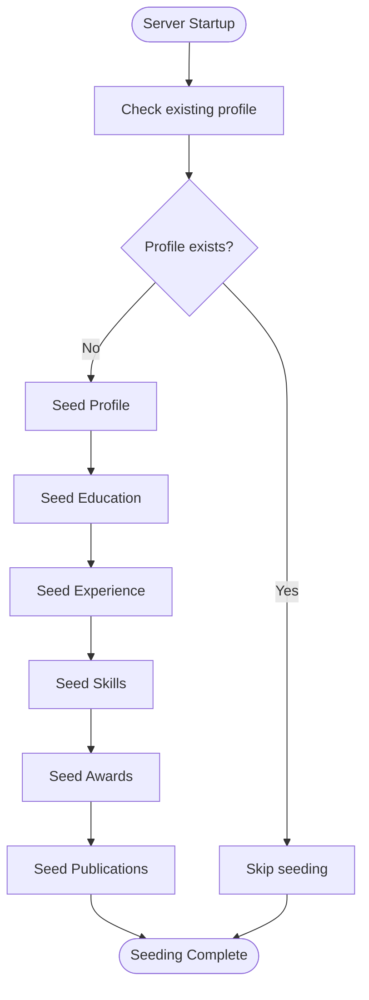
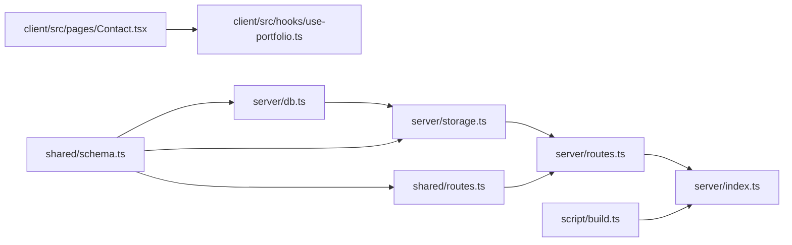

# Database Design

<cite>
**Referenced Files in This Document**
- [drizzle.config.ts](file://drizzle.config.ts)
- [schema.ts](file://shared/schema.ts)
- [db.ts](file://server/db.ts)
- [storage.ts](file://server/storage.ts)
- [routes.ts](file://server/routes.ts)
- [index.ts](file://server/index.ts)
- [routes.ts](file://shared/routes.ts)
- [Contact.tsx](file://client/src/pages/Contact.tsx)
- [use-portfolio.ts](file://client/src/hooks/use-portfolio.ts)
- [build.ts](file://script/build.ts)
- [package.json](file://package.json)
- [tsconfig.json](file://tsconfig.json)
</cite>

## Table of Contents
1. [Introduction](#introduction)
2. [Project Structure](#project-structure)
3. [Core Components](#core-components)
4. [Architecture Overview](#architecture-overview)
5. [Detailed Component Analysis](#detailed-component-analysis)
6. [Dependency Analysis](#dependency-analysis)
7. [Performance Considerations](#performance-considerations)
8. [Troubleshooting Guide](#troubleshooting-guide)
9. [Conclusion](#conclusion)
10. [Appendices](#appendices)

## Introduction
This document provides comprehensive data model documentation for the Personal Showcase database schema. It details all entity relationships, field definitions, data types, constraints, and indexing strategies. It also explains the Drizzle ORM configuration, database migration management, the repository pattern implementation with dual storage providers (PostgreSQL and in-memory), automatic seeding, validation rules, and the type-safe schema definitions shared between frontend and backend.

## Project Structure
The project follows a monorepo-like structure with a shared schema definition, a server-side API and storage layer, a client-side React application, and build tooling. The database schema is defined centrally and consumed by both server and client.

**Diagram sources**
- [schema.ts](file://shared/schema.ts#L1-L86)
- [routes.ts](file://shared/routes.ts#L1-L112)
- [db.ts](file://server/db.ts#L1-L12)
- [storage.ts](file://server/storage.ts#L1-L323)
- [routes.ts](file://server/routes.ts#L1-L66)
- [index.ts](file://server/index.ts#L1-L103)
- [Contact.tsx](file://client/src/pages/Contact.tsx#L1-L178)
- [use-portfolio.ts](file://client/src/hooks/use-portfolio.ts#L1-L115)
- [build.ts](file://script/build.ts#L1-L68)

**Section sources**
- [schema.ts](file://shared/schema.ts#L1-L86)
- [db.ts](file://server/db.ts#L1-L12)
- [storage.ts](file://server/storage.ts#L1-L323)
- [routes.ts](file://server/routes.ts#L1-L66)
- [index.ts](file://server/index.ts#L1-L103)
- [routes.ts](file://shared/routes.ts#L1-L112)
- [Contact.tsx](file://client/src/pages/Contact.tsx#L1-L178)
- [use-portfolio.ts](file://client/src/hooks/use-portfolio.ts#L1-L115)
- [build.ts](file://script/build.ts#L1-L68)
- [package.json](file://package.json#L1-L114)
- [tsconfig.json](file://tsconfig.json#L1-L24)

## Core Components
This section documents the database entities, their fields, constraints, and how they relate to each other. It also covers the repository pattern, dual storage providers, and validation.

- Entities and Fields
  - Profile: id (serial, PK), name (text, not null), title (text, not null), bio (text, not null), email (text, not null), location (text, not null), linkedin (text), orcid (text), scopus (text)
  - Education: id (serial, PK), degree (text, not null), institution (text, not null), year (text, not null), details (text)
  - Experience: id (serial, PK), role (text, not null), company (text, not null), period (text, not null), description (text)
  - Skills: id (serial, PK), category (text, not null), items (text[], not null)
  - Awards: id (serial, PK), title (text, not null), issuer (text, not null), date (text, not null), description (text)
  - Publications: id (serial, PK), title (text, not null), journal (text), year (text), link (text), authors (text)
  - Messages: id (serial, PK), name (text, not null), email (text, not null), message (text, not null), created_at (timestamp, default now)

- Constraints and Indexing
  - Primary keys are auto-incrementing serial integers on all tables.
  - Not-null constraints are enforced on required fields as listed above.
  - No explicit indexes are defined in the schema; defaults apply.
  - Arrays are supported for skills items.

- Validation and Types
  - Zod insert schemas are generated from Drizzle tables and exposed for runtime validation.
  - Frontend and backend share the same schema definitions for type safety and validation.

- Repository Pattern and Storage Providers
  - IStorage interface defines methods for retrieving data and creating messages, plus seeding.
  - DatabaseStorage uses Drizzle ORM to query PostgreSQL.
  - MemStorage provides an in-memory implementation for local development without a database.
  - Factory-style selection chooses DatabaseStorage when DATABASE_URL is present, otherwise MemStorage.

- Automatic Seeding
  - On server startup, storage.seedData() is invoked to populate initial data if not already present.
  - Seeding inserts predefined profile, education, experience, skills, awards, and publications records.

- API Exposure
  - Routes expose GET endpoints for profile, education, experience, skills, awards, and publications.
  - POST /api/contact validates input using Zod and persists messages via storage.

**Section sources**
- [schema.ts](file://shared/schema.ts#L7-L64)
- [schema.ts](file://shared/schema.ts#L68-L86)
- [storage.ts](file://server/storage.ts#L9-L226)
- [routes.ts](file://server/routes.ts#L12-L13)
- [routes.ts](file://server/routes.ts#L15-L46)
- [routes.ts](file://server/routes.ts#L48-L62)
- [routes.ts](file://shared/routes.ts#L32-L99)

## Architecture Overview
The system uses a shared schema to define tables and Zod schemas, enabling type-safe validation on both frontend and backend. The server exposes REST endpoints backed by a repository pattern with dual storage providers. The client consumes these endpoints using React Query and Zod parsing.

**Diagram sources**
- [routes.ts](file://shared/routes.ts#L88-L98)
- [routes.ts](file://server/routes.ts#L48-L62)
- [storage.ts](file://server/storage.ts#L54-L58)
- [db.ts](file://server/db.ts#L1-L12)
- [schema.ts](file://shared/schema.ts#L58-L64)

**Section sources**
- [routes.ts](file://shared/routes.ts#L1-L112)
- [routes.ts](file://server/routes.ts#L1-L66)
- [storage.ts](file://server/storage.ts#L1-L323)
- [db.ts](file://server/db.ts#L1-L12)
- [schema.ts](file://shared/schema.ts#L1-L86)

## Detailed Component Analysis

### Data Model and Relationships
The schema defines seven tables with no foreign key relationships among them. Each table is self-contained, representing a distinct domain concept.

- Primary Keys: All tables use serial id as the primary key.
- Relationships: None defined; denormalized design favors simplicity and fast reads.
- Indexing: No explicit indexes; consider adding indexes on frequently filtered columns (e.g., email on profile, year on education/publications) for performance.

**Diagram sources**
- [schema.ts](file://shared/schema.ts#L7-L64)

**Section sources**
- [schema.ts](file://shared/schema.ts#L7-L64)

### Drizzle ORM Configuration
- Dialect: PostgreSQL configured via drizzle.config.ts.
- Schema Path: Points to shared/schema.ts for centralized table definitions.
- Credentials: Uses DATABASE_URL environment variable.
- Migration Tooling: Drizzle Kit is included; migrations folder is configured.

**Section sources**
- [drizzle.config.ts](file://drizzle.config.ts#L1-L15)
- [package.json](file://package.json#L97-L97)

### Database Migration Management
- Drizzle Kit is configured to manage migrations against PostgreSQL.
- The schema file is referenced centrally, ensuring migrations reflect the shared definitions.
- Migration commands are available via npm scripts.

**Section sources**
- [drizzle.config.ts](file://drizzle.config.ts#L7-L14)
- [package.json](file://package.json#L11-L11)

### Repository Pattern and Storage Providers
- IStorage Interface: Defines data access methods and seeding.
- DatabaseStorage:
  - Uses drizzle with a PostgreSQL connection pool.
  - Implements getters for all entities and message creation.
  - Seeds data only if no profile exists.
- MemStorage:
  - Provides in-memory collections for all entities.
  - Generates IDs and timestamps for messages.
  - Seeds identical initial data to DatabaseStorage.
- Factory Selection:
  - Selects DatabaseStorage when DATABASE_URL is present.
  - Falls back to MemStorage otherwise.

**Diagram sources**
- [storage.ts](file://server/storage.ts#L9-L323)

**Section sources**
- [storage.ts](file://server/storage.ts#L9-L323)

### Automatic Seeding Process
- Startup Hook: routes.ts invokes storage.seedData() during server initialization.
- Conditional Seeding: Only seeds if no profile exists.
- Data Population: Inserts predefined profile, education, experience, skills, awards, and publications.

**Diagram sources**
- [routes.ts](file://server/routes.ts#L12-L13)
- [storage.ts](file://server/storage.ts#L60-L225)

**Section sources**
- [routes.ts](file://server/routes.ts#L12-L13)
- [storage.ts](file://server/storage.ts#L60-L225)

### Data Validation Rules and Business Logic Constraints
- Zod Schemas:
  - Generated from Drizzle tables for insert operations.
  - Exposed for runtime validation on both frontend and backend.
- Frontend Validation:
  - Contact form uses zodResolver with insertMessageSchema.
  - React Hook Form handles field-level validation and submission.
- Backend Validation:
  - Routes parse request bodies with shared Zod schemas.
  - Errors are caught and returned with structured messages and field metadata.
- Business Logic:
  - Messages include a creation timestamp by default.
  - Skills items are arrays of text values.
  - Seeding ensures consistent initial data across environments.

**Section sources**
- [schema.ts](file://shared/schema.ts#L68-L86)
- [routes.ts](file://shared/routes.ts#L88-L98)
- [routes.ts](file://server/routes.ts#L48-L62)
- [Contact.tsx](file://client/src/pages/Contact.tsx#L25-L38)
- [use-portfolio.ts](file://client/src/hooks/use-portfolio.ts#L79-L114)

### Type-Safe Schema Definitions Shared Between Frontend and Backend
- Centralized Definitions:
  - shared/schema.ts exports table definitions and Zod insert schemas.
  - shared/routes.ts reuses these schemas to define API input/output types.
- Frontend Consumption:
  - Client pages import insertMessageSchema for form validation.
  - React Query hooks parse responses using the same Zod schemas.
- Backend Consumption:
  - Routes validate incoming requests using shared Zod schemas.
  - Storage operations rely on Drizzle ORM types inferred from shared tables.

**Section sources**
- [schema.ts](file://shared/schema.ts#L1-L86)
- [routes.ts](file://shared/routes.ts#L1-L112)
- [Contact.tsx](file://client/src/pages/Contact.tsx#L3-L3)
- [use-portfolio.ts](file://client/src/hooks/use-portfolio.ts#L1-L2)

## Dependency Analysis
The following diagram shows key dependencies among modules and their roles in the data flow.

**Diagram sources**
- [schema.ts](file://shared/schema.ts#L1-L86)
- [db.ts](file://server/db.ts#L1-L12)
- [storage.ts](file://server/storage.ts#L1-L323)
- [routes.ts](file://shared/routes.ts#L1-L112)
- [routes.ts](file://server/routes.ts#L1-L66)
- [index.ts](file://server/index.ts#L1-L103)
- [Contact.tsx](file://client/src/pages/Contact.tsx#L1-L178)
- [use-portfolio.ts](file://client/src/hooks/use-portfolio.ts#L1-L115)
- [build.ts](file://script/build.ts#L1-L68)

**Section sources**
- [schema.ts](file://shared/schema.ts#L1-L86)
- [db.ts](file://server/db.ts#L1-L12)
- [storage.ts](file://server/storage.ts#L1-L323)
- [routes.ts](file://shared/routes.ts#L1-L112)
- [routes.ts](file://server/routes.ts#L1-L66)
- [index.ts](file://server/index.ts#L1-L103)
- [Contact.tsx](file://client/src/pages/Contact.tsx#L1-L178)
- [use-portfolio.ts](file://client/src/hooks/use-portfolio.ts#L1-L115)
- [build.ts](file://script/build.ts#L1-L68)

## Performance Considerations
- Current State
  - No explicit indexes are defined in the schema.
  - Queries are simple selects and inserts without joins.
- Recommendations
  - Add indexes on frequently filtered columns (e.g., email on profile, year on education/publications).
  - Consider partial indexes for active or recent records if applicable.
  - Monitor query plans and adjust indexes based on usage patterns.
- Storage Provider Impact
  - MemStorage is suitable for development and small datasets.
  - DatabaseStorage scales with PostgreSQL capabilities and indexing strategies.

[No sources needed since this section provides general guidance]

## Troubleshooting Guide
- Database Connectivity
  - Ensure DATABASE_URL is set when using PostgreSQL.
  - Verify connection pool initialization and schema binding.
- Seeding Issues
  - Seeding runs only once per server lifecycle; restart the server to re-seed.
  - Confirm that the profile table is empty before expecting seeding.
- Validation Errors
  - Frontend validation errors are surfaced via React Hook Form.
  - Backend validation errors return structured messages with field information.
- Build and Runtime
  - Production builds bundle server code; ensure dependencies are correctly handled.
  - Environment variables must be present for production deployment.

**Section sources**
- [db.ts](file://server/db.ts#L7-L11)
- [routes.ts](file://server/routes.ts#L12-L13)
- [routes.ts](file://server/routes.ts#L54-L59)
- [build.ts](file://script/build.ts#L49-L61)

## Conclusion
The Personal Showcase database design centers on a shared, type-safe schema with Drizzle ORM and a repository pattern supporting dual storage providers. The schema is intentionally denormalized for simplicity, with straightforward validation and automatic seeding. The architecture enables seamless development and production deployments while maintaining strong typing and validation across the stack.

[No sources needed since this section summarizes without analyzing specific files]

## Appendices

### Appendix A: API Endpoints and Validation
- GET /api/profile: Returns profile data; 404 if not found.
- GET /api/education: Returns education list.
- GET /api/experience: Returns experience list.
- GET /api/skills: Returns skills list.
- GET /api/awards: Returns awards list.
- GET /api/publications: Returns publications list.
- POST /api/contact: Validates and persists messages; returns 400 with field details on validation failure.

**Section sources**
- [routes.ts](file://server/routes.ts#L15-L46)
- [routes.ts](file://server/routes.ts#L48-L62)
- [routes.ts](file://shared/routes.ts#L32-L99)

### Appendix B: Build and Deployment Notes
- Development: Use dev script to run the server with hot reload.
- Production: Build script bundles the server and client; start script runs the production server.
- Environment: Ensure NODE_ENV and PORT are configured appropriately.

**Section sources**
- [package.json](file://package.json#L6-L11)
- [build.ts](file://script/build.ts#L1-L68)
- [index.ts](file://server/index.ts#L88-L101)