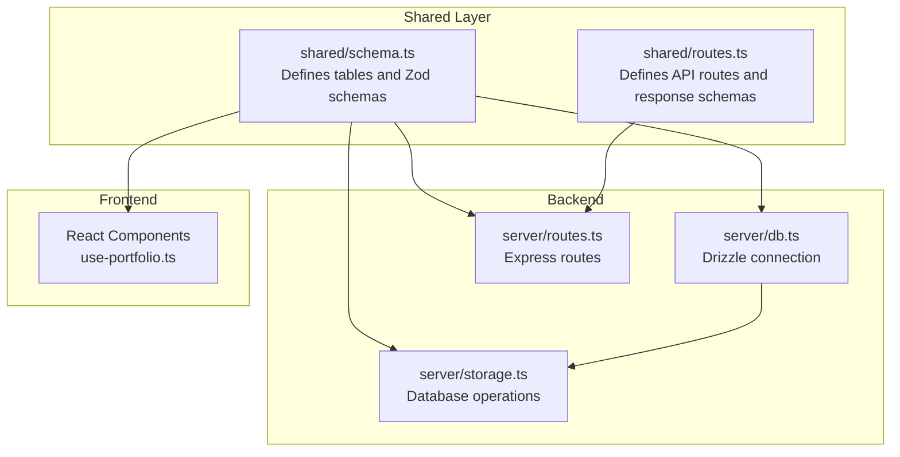
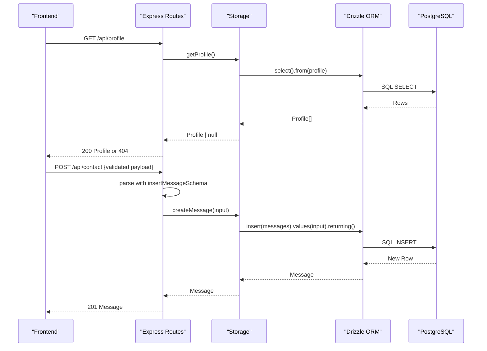
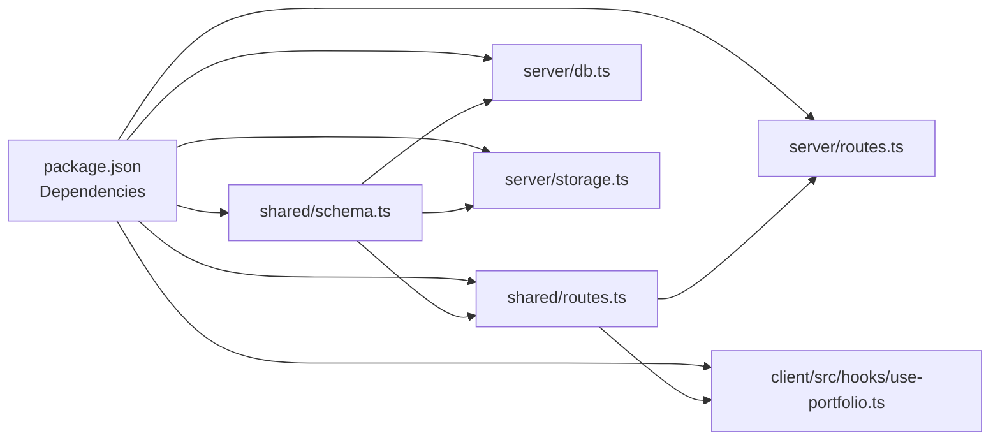

# Schema Definition

<cite>
**Referenced Files in This Document**
- [shared/schema.ts](file://shared/schema.ts)
- [shared/routes.ts](file://shared/routes.ts)
- [server/db.ts](file://server/db.ts)
- [server/storage.ts](file://server/storage.ts)
- [server/routes.ts](file://server/routes.ts)
- [drizzle.config.ts](file://drizzle.config.ts)
- [package.json](file://package.json)
</cite>

## Table of Contents
1. [Introduction](#introduction)
2. [Project Structure](#project-structure)
3. [Core Components](#core-components)
4. [Architecture Overview](#architecture-overview)
5. [Detailed Component Analysis](#detailed-component-analysis)
6. [Dependency Analysis](#dependency-analysis)
7. [Performance Considerations](#performance-considerations)
8. [Troubleshooting Guide](#troubleshooting-guide)
9. [Conclusion](#conclusion)

## Introduction
This document provides comprehensive data model documentation for the Personal Showcase database schema definitions. It details the Drizzle ORM table definitions using the pgTable function, describes field types (serial, text, integer, boolean, timestamp), and explains notNull constraints and optional fields. It also covers type inference patterns using $inferSelect and Zod schema creation with createInsertSchema for automatic validation. Finally, it explains how the shared schema enables type safety across frontend and backend components.

## Project Structure
The schema definitions live in a shared module consumed by both the backend and frontend. The backend connects to PostgreSQL via Drizzle ORM and exposes REST endpoints. The frontend consumes these endpoints and validates responses using Zod schemas derived from the shared schema.

**Diagram sources**
- [shared/schema.ts](file://shared/schema.ts#L1-L86)
- [shared/routes.ts](file://shared/routes.ts#L1-L112)
- [server/db.ts](file://server/db.ts#L1-L12)
- [server/storage.ts](file://server/storage.ts#L1-L323)
- [server/routes.ts](file://server/routes.ts#L1-L66)

**Section sources**
- [shared/schema.ts](file://shared/schema.ts#L1-L86)
- [shared/routes.ts](file://shared/routes.ts#L1-L112)
- [server/db.ts](file://server/db.ts#L1-L12)
- [server/storage.ts](file://server/storage.ts#L1-L323)
- [server/routes.ts](file://server/routes.ts#L1-L66)

## Core Components
This section documents each table definition, including field names, data types, constraints, and validation rules. It also explains the Drizzle ORM table definitions and the Zod schemas used for validation.

- profile
  - Fields:
    - id: serial, primary key
    - name: text, not null
    - title: text, not null
    - bio: text, not null
    - email: text, not null
    - location: text, not null
    - linkedin: text, optional
    - orcid: text, optional
    - scopus: text, optional
  - Validation: insertProfileSchema omits id and is generated from the profile table definition.

- education
  - Fields:
    - id: serial, primary key
    - degree: text, not null
    - institution: text, not null
    - year: text, not null
    - details: text, optional
  - Validation: insertEducationSchema omits id.

- experience
  - Fields:
    - id: serial, primary key
    - role: text, not null
    - company: text, not null
    - period: text, not null
    - description: text, optional
  - Validation: insertExperienceSchema omits id.

- skills
  - Fields:
    - id: serial, primary key
    - category: text, not null
    - items: text[], not null (array of text)
  - Validation: insertSkillSchema omits id.

- awards
  - Fields:
    - id: serial, primary key
    - title: text, not null
    - issuer: text, not null
    - date: text, not null
    - description: text, optional
  - Validation: insertAwardSchema omits id.

- publications
  - Fields:
    - id: serial, primary key
    - title: text, not null
    - journal: text, optional
    - year: text, optional
    - link: text, optional
    - authors: text, optional
  - Validation: insertPublicationSchema omits id.

- messages
  - Fields:
    - id: serial, primary key
    - name: text, not null
    - email: text, not null
    - message: text, not null
    - createdAt: timestamp, default now
  - Validation: insertMessageSchema omits id and createdAt.

Type inference:
- $inferSelect is used to derive TypeScript types for each table’s selected row shape.
- $inferInsert is used implicitly via createInsertSchema to derive insertion types.

Zod schema creation:
- createInsertSchema is used to generate Zod schemas for insert operations, omitting auto-generated fields (id, createdAt).

**Section sources**
- [shared/schema.ts](file://shared/schema.ts#L7-L17)
- [shared/schema.ts](file://shared/schema.ts#L19-L25)
- [shared/schema.ts](file://shared/schema.ts#L27-L33)
- [shared/schema.ts](file://shared/schema.ts#L35-L39)
- [shared/schema.ts](file://shared/schema.ts#L41-L47)
- [shared/schema.ts](file://shared/schema.ts#L49-L56)
- [shared/schema.ts](file://shared/schema.ts#L58-L64)
- [shared/schema.ts](file://shared/schema.ts#L68-L74)
- [shared/schema.ts](file://shared/schema.ts#L78-L85)

## Architecture Overview
The schema is designed as a shared contract between frontend and backend. The backend uses Drizzle ORM to connect to PostgreSQL and expose REST endpoints. The frontend consumes these endpoints and validates responses using Zod schemas derived from the shared schema. This ensures type safety across the stack.

**Diagram sources**
- [server/routes.ts](file://server/routes.ts#L15-L21)
- [server/routes.ts](file://server/routes.ts#L48-L62)
- [server/storage.ts](file://server/storage.ts#L23-L27)
- [server/storage.ts](file://server/storage.ts#L54-L58)
- [server/db.ts](file://server/db.ts#L11-L11)
- [shared/schema.ts](file://shared/schema.ts#L58-L64)

## Detailed Component Analysis

### Drizzle ORM Table Definitions
Each table is defined using the pgTable function with explicit field types and constraints. Primary keys are defined using serial with primaryKey(), and notNull constraints are applied to required fields. Optional fields omit notNull. Arrays are supported via text().array().notNull().

- profile: serial id, multiple text fields with notNull except optional social links.
- education: serial id, notNull degree, institution, year; optional details.
- experience: serial id, notNull role, company, period; optional description.
- skills: serial id, notNull category and items array.
- awards: serial id, notNull title, issuer, date; optional description.
- publications: serial id, notNull title; optional journal, year, link, authors.
- messages: serial id, notNull name, email, message; createdAt defaults to now.

Type inference:
- $inferSelect is used to derive TypeScript types for each table’s selected row shape.
- $inferInsert is used implicitly via createInsertSchema to derive insertion types.

Validation:
- createInsertSchema generates Zod schemas for insert operations, omitting auto-generated fields.

**Section sources**
- [shared/schema.ts](file://shared/schema.ts#L7-L17)
- [shared/schema.ts](file://shared/schema.ts#L19-L25)
- [shared/schema.ts](file://shared/schema.ts#L27-L33)
- [shared/schema.ts](file://shared/schema.ts#L35-L39)
- [shared/schema.ts](file://shared/schema.ts#L41-L47)
- [shared/schema.ts](file://shared/schema.ts#L49-L56)
- [shared/schema.ts](file://shared/schema.ts#L58-L64)
- [shared/schema.ts](file://shared/schema.ts#L78-L85)

### Frontend Type Safety and Validation
The frontend uses the shared schema to validate API responses and request payloads. The use-portfolio hook demonstrates how responses are parsed using Zod schemas defined in shared/routes.ts, which reference the shared schema types.

- useProfile parses the 200 response using z.custom<typeof profile.$inferSelect>().
- useEducation, useExperience, useSkills, useAwards, usePublications similarly parse arrays of inferred types.
- useContactForm validates the contact submission payload using api.contact.submit.input, which is insertMessageSchema.

This ensures that frontend components receive strongly typed data and that invalid payloads are caught early.

**Section sources**
- [shared/routes.ts](file://shared/routes.ts#L38-L41)
- [shared/routes.ts](file://shared/routes.ts#L48-L49)
- [shared/routes.ts](file://shared/routes.ts#L57-L58)
- [shared/routes.ts](file://shared/routes.ts#L66-L67)
- [shared/routes.ts](file://shared/routes.ts#L84-L85)
- [client/src/hooks/use-portfolio.ts](file://client/src/hooks/use-portfolio.ts#L13-L13)
- [client/src/hooks/use-portfolio.ts](file://client/src/hooks/use-portfolio.ts#L25-L25)
- [client/src/hooks/use-portfolio.ts](file://client/src/hooks/use-portfolio.ts#L37-L37)
- [client/src/hooks/use-portfolio.ts](file://client/src/hooks/use-portfolio.ts#L49-L49)
- [client/src/hooks/use-portfolio.ts](file://client/src/hooks/use-portfolio.ts#L61-L61)
- [client/src/hooks/use-portfolio.ts](file://client/src/hooks/use-portfolio.ts#L73-L73)
- [client/src/hooks/use-portfolio.ts](file://client/src/hooks/use-portfolio.ts#L84-L84)
- [client/src/hooks/use-portfolio.ts](file://client/src/hooks/use-portfolio.ts#L98-L98)

### Backend Database Operations
The backend uses Drizzle ORM to perform database operations. The storage layer encapsulates CRUD operations for each table, returning strongly typed results inferred from the schema.

- getProfile selects from profile; returns Profile or undefined.
- getEducation, getExperience, getSkills, getAwards, getPublications select from respective tables; return arrays of inferred types.
- createMessage inserts into messages with validated input and returns the inserted Message.

The storage layer also seeds default data on startup when no DATABASE_URL is present.

**Section sources**
- [server/storage.ts](file://server/storage.ts#L23-L27)
- [server/storage.ts](file://server/storage.ts#L29-L32)
- [server/storage.ts](file://server/storage.ts#L34-L37)
- [server/storage.ts](file://server/storage.ts#L39-L42)
- [server/storage.ts](file://server/storage.ts#L44-L47)
- [server/storage.ts](file://server/storage.ts#L49-L52)
- [server/storage.ts](file://server/storage.ts#L54-L58)
- [server/storage.ts](file://server/storage.ts#L60-L225)

### API Route Definitions and Validation
The shared routes module defines API endpoints and response schemas. Each endpoint references the shared schema types for strict parsing and validation.

- GET /api/profile returns a single Profile inferred type.
- GET /api/education, /api/experience, /api/skills, /api/awards, /api/publications return arrays of their respective inferred types.
- POST /api/contact accepts insertMessageSchema and returns a newly created Message.

The backend routes module implements these endpoints, parsing request bodies with Zod and returning structured responses.

**Section sources**
- [shared/routes.ts](file://shared/routes.ts#L32-L42)
- [shared/routes.ts](file://shared/routes.ts#L43-L51)
- [shared/routes.ts](file://shared/routes.ts#L52-L60)
- [shared/routes.ts](file://shared/routes.ts#L61-L69)
- [shared/routes.ts](file://shared/routes.ts#L70-L78)
- [shared/routes.ts](file://shared/routes.ts#L79-L87)
- [shared/routes.ts](file://shared/routes.ts#L88-L99)
- [server/routes.ts](file://server/routes.ts#L15-L21)
- [server/routes.ts](file://server/routes.ts#L23-L26)
- [server/routes.ts](file://server/routes.ts#L28-L31)
- [server/routes.ts](file://server/routes.ts#L33-L36)
- [server/routes.ts](file://server/routes.ts#L38-L41)
- [server/routes.ts](file://server/routes.ts#L43-L46)
- [server/routes.ts](file://server/routes.ts#L48-L62)

## Dependency Analysis
The schema is a central dependency for both frontend and backend. The backend depends on Drizzle ORM and PostgreSQL, while the frontend depends on Zod for validation. The shared module ensures consistency across the stack.

**Diagram sources**
- [package.json](file://package.json#L49-L50)
- [package.json](file://package.json#L76-L76)
- [shared/schema.ts](file://shared/schema.ts#L1-L3)
- [shared/routes.ts](file://shared/routes.ts#L1-L17)
- [server/db.ts](file://server/db.ts#L1-L3)
- [server/storage.ts](file://server/storage.ts#L1-L7)
- [server/routes.ts](file://server/routes.ts#L1-L6)
- [client/src/hooks/use-portfolio.ts](file://client/src/hooks/use-portfolio.ts#L1-L4)

**Section sources**
- [package.json](file://package.json#L49-L50)
- [package.json](file://package.json#L76-L76)
- [shared/schema.ts](file://shared/schema.ts#L1-L3)
- [shared/routes.ts](file://shared/routes.ts#L1-L17)
- [server/db.ts](file://server/db.ts#L1-L3)
- [server/storage.ts](file://server/storage.ts#L1-L7)
- [server/routes.ts](file://server/routes.ts#L1-L6)
- [client/src/hooks/use-portfolio.ts](file://client/src/hooks/use-portfolio.ts#L1-L4)

## Performance Considerations
- Using $inferSelect and createInsertSchema ensures compile-time validation and reduces runtime errors, improving reliability.
- Arrays in skills.items reduce duplication and simplify storage for multi-valued attributes.
- Default timestamps (createdAt) eliminate the need for manual timestamp handling in insertions.
- The shared schema minimizes code duplication and potential inconsistencies across frontend and backend.

## Troubleshooting Guide
Common issues and resolutions:
- Missing DATABASE_URL:
  - Symptom: Application falls back to in-memory storage.
  - Resolution: Set DATABASE_URL and run the database push script to initialize the schema.
- Validation errors on contact form:
  - Symptom: 400 Bad Request with validation error details.
  - Resolution: Ensure required fields (name, email, message) are provided and correctly formatted.
- Type mismatches:
  - Symptom: TypeScript compilation errors when using inferred types.
  - Resolution: Verify that shared/schema.ts and shared/routes.ts are in sync and re-run type checks.

**Section sources**
- [README.md](file://README.md#L48-L51)
- [server/routes.ts](file://server/routes.ts#L53-L61)
- [shared/schema.ts](file://shared/schema.ts#L78-L85)
- [shared/routes.ts](file://shared/routes.ts#L19-L30)

## Conclusion
The Personal Showcase schema leverages Drizzle ORM and Zod to provide a robust, type-safe data model shared between frontend and backend. The schema definitions, combined with inferred types and generated Zod schemas, ensure consistent validation and reliable data flow across the application. This approach simplifies maintenance, reduces errors, and improves developer experience.