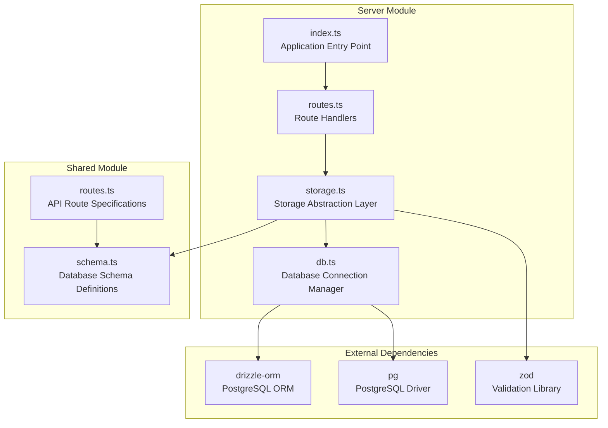
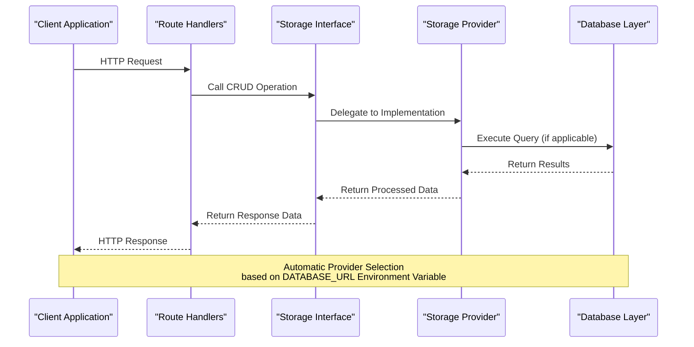
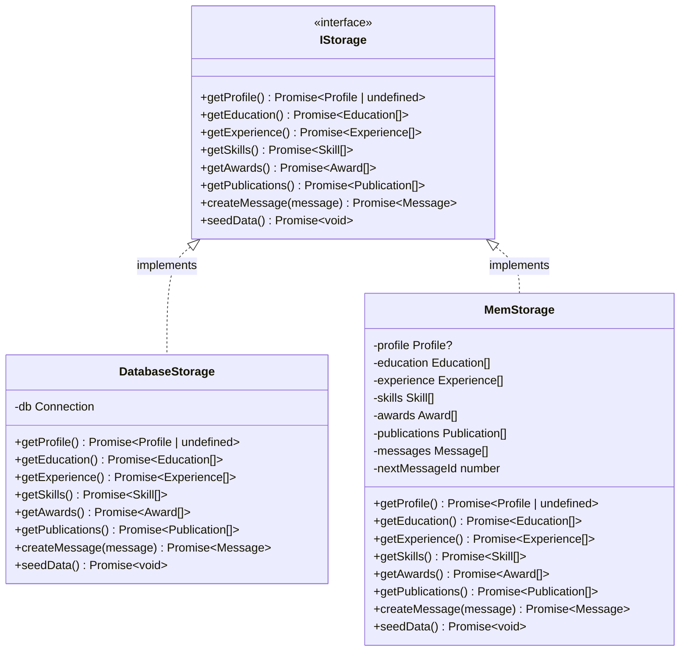
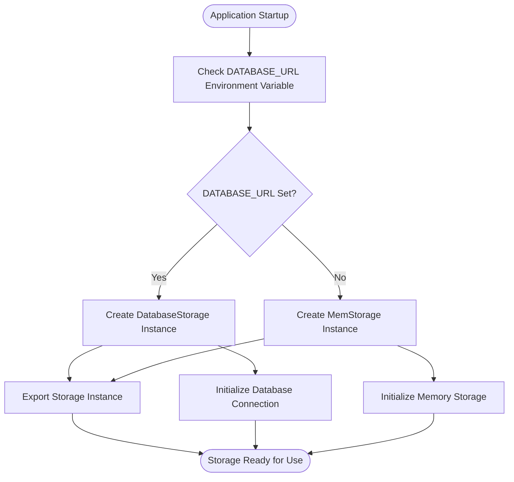
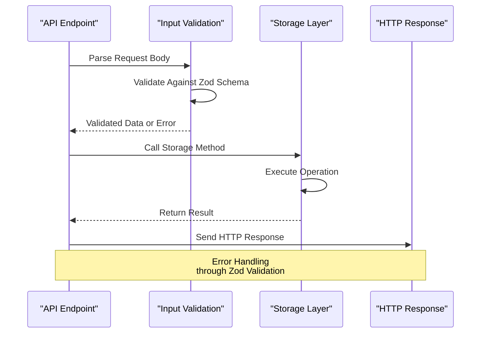
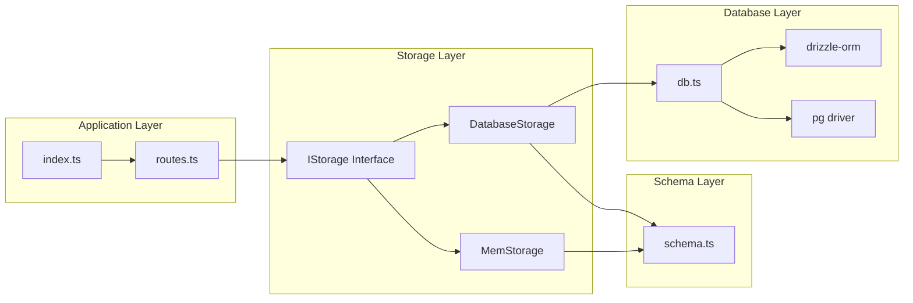

# Storage Abstraction

<cite>
**Referenced Files in This Document**
- [storage.ts](file://server/storage.ts)
- [db.ts](file://server/db.ts)
- [schema.ts](file://shared/schema.ts)
- [routes.ts](file://server/routes.ts)
- [index.ts](file://server/index.ts)
- [routes.ts](file://shared/routes.ts)
- [README.md](file://README.md)
- [package.json](file://package.json)
- [drizzle.config.ts](file://drizzle.config.ts)
</cite>

## Table of Contents
1. [Introduction](#introduction)
2. [Project Structure](#project-structure)
3. [Core Components](#core-components)
4. [Architecture Overview](#architecture-overview)
5. [Detailed Component Analysis](#detailed-component-analysis)
6. [Dependency Analysis](#dependency-analysis)
7. [Performance Considerations](#performance-considerations)
8. [Troubleshooting Guide](#troubleshooting-guide)
9. [Conclusion](#conclusion)

## Introduction

The Personal Showcase application implements a sophisticated storage abstraction layer that follows the repository pattern to provide flexible data persistence capabilities. This abstraction enables seamless switching between PostgreSQL (production) and in-memory storage (development) through a factory pattern, ensuring optimal development experience while maintaining production-grade reliability.

The storage layer is designed around a clean separation of concerns, where the presentation layer interacts with a unified interface regardless of the underlying storage mechanism. This design facilitates testing, scalability, and deployment flexibility across different environments.

## Project Structure

The storage abstraction is organized within the server module, with supporting components distributed across the shared module for schema definitions and route specifications.

**Diagram sources**
- [storage.ts](file://server/storage.ts#L1-L323)
- [db.ts](file://server/db.ts#L1-L12)
- [schema.ts](file://shared/schema.ts#L1-L86)

**Section sources**
- [storage.ts](file://server/storage.ts#L1-L323)
- [db.ts](file://server/db.ts#L1-L12)
- [schema.ts](file://shared/schema.ts#L1-L86)

## Core Components

The storage abstraction consists of three primary components that work together to provide a unified data access interface:

### Abstract Storage Interface (IStorage)

The `IStorage` interface defines the contract for all storage implementations, establishing a consistent API for data operations across different storage mechanisms.

**Method Signatures:**
- `getProfile(): Promise<Profile | undefined>`
- `getEducation(): Promise<Education[]>`
- `getExperience(): Promise<Experience[]>`
- `getSkills(): Promise<Skill[]>`
- `getAwards(): Promise<Award[]>`
- `getPublications(): Promise<Publication[]>`
- `createMessage(message: InsertMessage): Promise<Message>`
- `seedData(): Promise<void>`

### Database Storage Implementation (DatabaseStorage)

The `DatabaseStorage` class implements persistent storage using PostgreSQL through Drizzle ORM, providing robust data persistence for production environments.

**Key Features:**
- Full CRUD operations backed by PostgreSQL
- Automatic data seeding during application startup
- Comprehensive error handling for database operations
- Type-safe operations using generated TypeScript types

### In-Memory Storage Implementation (MemStorage)

The `MemStorage` class provides ephemeral storage suitable for development and testing scenarios, offering fast data access without external dependencies.

**Key Features:**
- Pure JavaScript object storage with automatic ID generation
- Complete data lifecycle management within application memory
- Seamless integration with the same interface contract
- Ideal for rapid prototyping and automated testing

**Section sources**
- [storage.ts](file://server/storage.ts#L9-L20)
- [storage.ts](file://server/storage.ts#L22-L226)
- [storage.ts](file://server/storage.ts#L228-L320)

## Architecture Overview

The storage abstraction follows a layered architecture pattern that separates concerns between data access, business logic, and presentation layers.

**Diagram sources**
- [routes.ts](file://server/routes.ts#L15-L62)
- [storage.ts](file://server/storage.ts#L322-L323)
- [db.ts](file://server/db.ts#L7-L11)

The architecture implements a factory pattern where the storage provider is dynamically selected based on environment configuration, ensuring optimal performance and resource utilization across different deployment scenarios.

## Detailed Component Analysis

### Storage Interface Design

The `IStorage` interface establishes a comprehensive contract for data access operations, ensuring consistency across different storage implementations while maintaining type safety through TypeScript generics.

**Diagram sources**
- [storage.ts](file://server/storage.ts#L9-L20)
- [storage.ts](file://server/storage.ts#L22-L226)
- [storage.ts](file://server/storage.ts#L228-L320)

### Factory Pattern Implementation

The storage provider selection follows a factory pattern that automatically chooses between PostgreSQL and in-memory storage based on environment configuration.

**Diagram sources**
- [storage.ts](file://server/storage.ts#L322-L323)
- [db.ts](file://server/db.ts#L7-L11)

### Database Storage Implementation

The `DatabaseStorage` class provides robust data persistence using PostgreSQL through Drizzle ORM, offering production-ready features including connection pooling, transaction support, and comprehensive error handling.

**Implementation Details:**
- Uses Drizzle ORM for type-safe database operations
- Implements connection pooling for optimal performance
- Provides automatic data seeding during application initialization
- Handles database connectivity errors gracefully

**Section sources**
- [storage.ts](file://server/storage.ts#L22-L226)
- [db.ts](file://server/db.ts#L1-L12)

### In-Memory Storage Implementation

The `MemStorage` class offers a lightweight alternative for development and testing scenarios, providing fast data access without external dependencies while maintaining the same interface contract.

**Implementation Details:**
- Maintains data in memory using JavaScript arrays and objects
- Automatically generates unique IDs for new records
- Provides comprehensive CRUD operations using pure JavaScript
- Includes automatic data seeding with realistic sample data

**Section sources**
- [storage.ts](file://server/storage.ts#L228-L320)

### Route Integration

The storage abstraction integrates seamlessly with the Express.js routing system, providing consistent data access patterns across all API endpoints.

**Diagram sources**
- [routes.ts](file://server/routes.ts#L48-L62)
- [routes.ts](file://server/routes.ts#L15-L46)

**Section sources**
- [routes.ts](file://server/routes.ts#L1-L66)

## Dependency Analysis

The storage abstraction layer maintains loose coupling between components while providing strong type safety and consistent behavior across different storage implementations.

**Diagram sources**
- [storage.ts](file://server/storage.ts#L1-L323)
- [db.ts](file://server/db.ts#L1-L12)
- [schema.ts](file://shared/schema.ts#L1-L86)
- [routes.ts](file://server/routes.ts#L1-L66)
- [index.ts](file://server/index.ts#L1-L103)

**Section sources**
- [storage.ts](file://server/storage.ts#L1-L323)
- [db.ts](file://server/db.ts#L1-L12)
- [schema.ts](file://shared/schema.ts#L1-L86)

## Performance Considerations

The storage abstraction layer is designed with performance optimization in mind, providing different strategies for various deployment scenarios:

### Development Environment Optimizations
- **In-Memory Storage**: Eliminates database connection overhead and provides instant response times
- **Automatic Seeding**: Reduces setup time by pre-populating development data
- **Connection Pooling**: Optimizes database connections in production environments

### Production Environment Optimizations
- **Connection Pooling**: Efficiently manages database connections for concurrent requests
- **Type-Safe Operations**: Reduces runtime errors through compile-time type checking
- **Transaction Support**: Ensures data consistency and atomic operations

### Scalability Features
- **Interface-Based Design**: Enables easy replacement of storage providers
- **Environment-Based Configuration**: Supports seamless deployment across different environments
- **Error Handling**: Provides graceful degradation and recovery mechanisms

## Troubleshooting Guide

### Common Issues and Solutions

**Database Connection Problems**
- Verify `DATABASE_URL` environment variable is properly configured
- Check PostgreSQL server availability and network connectivity
- Ensure database credentials and permissions are correct

**Storage Provider Selection Issues**
- Confirm environment variable precedence in your deployment platform
- Verify that the factory pattern is correctly evaluating the environment variable
- Check for typos in environment variable names

**Data Seeding Failures**
- Ensure database migrations are applied before attempting to seed data
- Verify that the database user has sufficient privileges for seeding operations
- Check for existing data conflicts during seed operations

**Performance Issues**
- Monitor database connection pool utilization in production environments
- Consider implementing caching strategies for frequently accessed data
- Optimize database queries and indexes for better performance

**Section sources**
- [README.md](file://README.md#L46-L56)
- [drizzle.config.ts](file://drizzle.config.ts#L1-L14)
- [storage.ts](file://server/storage.ts#L60-L63)

## Conclusion

The Personal Showcase application's storage abstraction layer demonstrates excellent software engineering practices through its implementation of the repository pattern, factory pattern, and interface-based design. This architecture provides significant advantages in terms of flexibility, maintainability, and scalability.

The dual storage approach enables seamless development and production workflows, while the comprehensive error handling and validation strategies ensure robust operation across different environments. The type-safe implementation through TypeScript and Zod provides compile-time guarantees and improved developer experience.

This storage abstraction serves as an exemplary model for building scalable, maintainable applications that can adapt to changing requirements and deployment scenarios while maintaining high performance and reliability standards.