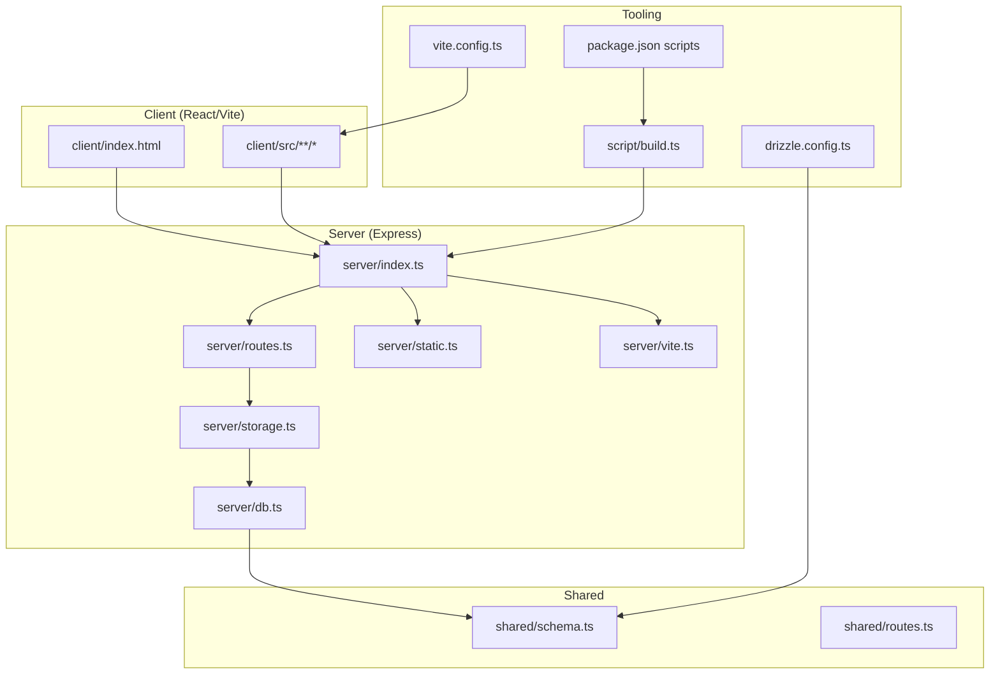
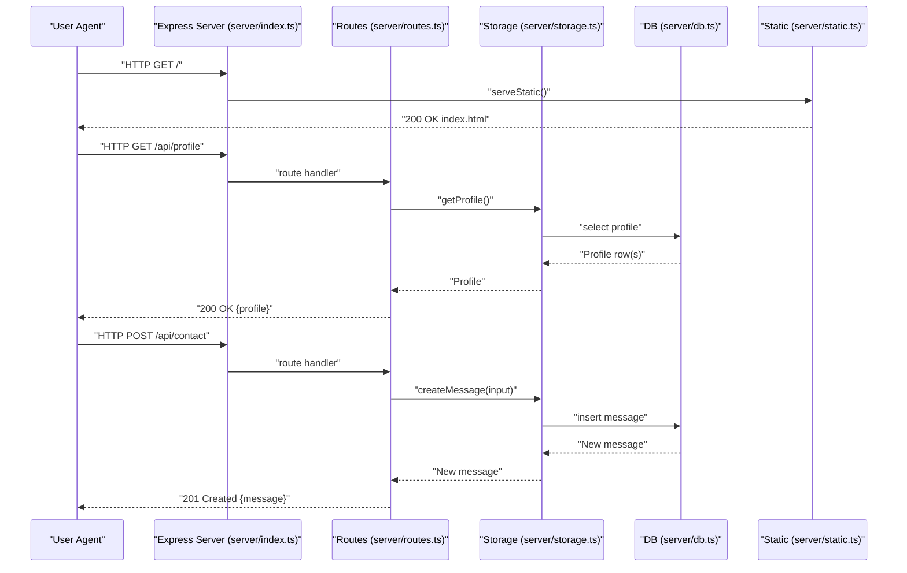
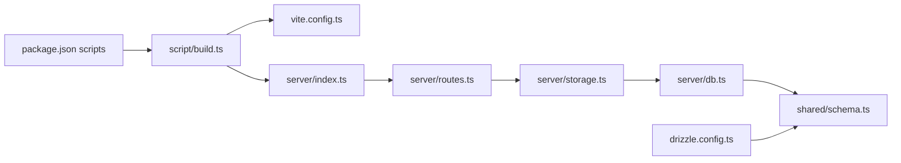

# Deployment and Operations

<cite>
**Referenced Files in This Document**
- [package.json](file://package.json)
- [README.md](file://README.md)
- [drizzle.config.ts](file://drizzle.config.ts)
- [vite.config.ts](file://vite.config.ts)
- [server/index.ts](file://server/index.ts)
- [server/db.ts](file://server/db.ts)
- [server/static.ts](file://server/static.ts)
- [script/build.ts](file://script/build.ts)
- [server/routes.ts](file://server/routes.ts)
- [server/storage.ts](file://server/storage.ts)
- [shared/schema.ts](file://shared/schema.ts)
- [shared/routes.ts](file://shared/routes.ts)
- [server/vite.ts](file://server/vite.ts)
- [tailwind.config.ts](file://tailwind.config.ts)
- [postcss.config.js](file://postcss.config.js)
</cite>

## Table of Contents
1. [Introduction](#introduction)
2. [Project Structure](#project-structure)
3. [Core Components](#core-components)
4. [Architecture Overview](#architecture-overview)
5. [Detailed Component Analysis](#detailed-component-analysis)
6. [Dependency Analysis](#dependency-analysis)
7. [Performance Considerations](#performance-considerations)
8. [Troubleshooting Guide](#troubleshooting-guide)
9. [Conclusion](#conclusion)
10. [Appendices](#appendices)

## Introduction
This document provides comprehensive deployment and operations guidance for the Personal Showcase portfolio application. It covers production deployment procedures, environment configuration, database setup and migration, static asset serving, the build and runtime pipeline, environment variable management, security considerations, monitoring strategies, maintenance procedures, scaling, performance optimization, and operational troubleshooting.

## Project Structure
The application is a full-stack Node.js/Express server hosting a React/Vite frontend. The backend exposes a REST API and serves the SPA in production. Database operations are handled via Drizzle ORM with optional PostgreSQL support and an in-memory fallback for local development.

**Diagram sources**
- [server/index.ts](file://server/index.ts#L1-L103)
- [server/routes.ts](file://server/routes.ts#L1-L66)
- [server/storage.ts](file://server/storage.ts#L1-L323)
- [server/db.ts](file://server/db.ts#L1-L12)
- [server/static.ts](file://server/static.ts#L1-L20)
- [server/vite.ts](file://server/vite.ts#L1-L59)
- [shared/schema.ts](file://shared/schema.ts#L1-L86)
- [shared/routes.ts](file://shared/routes.ts#L1-L112)
- [script/build.ts](file://script/build.ts#L1-L68)
- [vite.config.ts](file://vite.config.ts#L1-L41)
- [drizzle.config.ts](file://drizzle.config.ts#L1-L15)
- [package.json](file://package.json#L6-L12)

**Section sources**
- [README.md](file://README.md#L58-L71)
- [vite.config.ts](file://vite.config.ts#L22-L33)
- [server/index.ts](file://server/index.ts#L88-L102)

## Core Components
- Backend entrypoint and server lifecycle: Initializes Express, registers routes, sets up logging, error handling, and static serving in production.
- Routing and API: Defines REST endpoints for profile, education, experience, skills, awards, publications, and contact submission.
- Storage abstraction: Provides two implementations—PostgreSQL-backed via Drizzle ORM and an in-memory fallback—automatically selected based on environment.
- Build pipeline: Bundles the client with Vite and the server with esbuild into a single production artifact.
- Static asset serving: Production serves prebuilt client assets and falls back to index.html for SPA routing.
- Database configuration: Drizzle Kit configuration reads DATABASE_URL and generates migrations against a PostgreSQL schema.

**Section sources**
- [server/index.ts](file://server/index.ts#L1-L103)
- [server/routes.ts](file://server/routes.ts#L1-L66)
- [server/storage.ts](file://server/storage.ts#L1-L323)
- [script/build.ts](file://script/build.ts#L1-L68)
- [server/static.ts](file://server/static.ts#L1-L20)
- [drizzle.config.ts](file://drizzle.config.ts#L1-L15)

## Architecture Overview
The production runtime runs a single Express server listening on a configurable port. In production, the server serves prebuilt static assets from the client dist directory and proxies API requests to the backend. Development mode injects Vite’s SSR/HMR middleware and serves the SPA dynamically.

**Diagram sources**
- [server/index.ts](file://server/index.ts#L62-L102)
- [server/routes.ts](file://server/routes.ts#L15-L62)
- [server/storage.ts](file://server/storage.ts#L22-L58)
- [server/db.ts](file://server/db.ts#L1-L12)
- [server/static.ts](file://server/static.ts#L5-L19)

## Detailed Component Analysis

### Environment Configuration and Variables
- Required variables:
  - DATABASE_URL: PostgreSQL connection string for production database. If unset, the app uses an in-memory storage fallback.
  - PORT: TCP port for the server listener. Defaults to 5001 if unspecified.
- Development-specific:
  - NODE_ENV: Controls Vite middleware injection and logging behavior.
  - cross-env is used to ensure environment variables are set consistently across platforms.

Operational guidance:
- Set DATABASE_URL in production to enable persistent storage and migrations.
- Ensure PORT is exposed and reachable by your platform/container runtime.
- For containerized deployments, pass environment variables via orchestrator configuration.

**Section sources**
- [server/db.ts](file://server/db.ts#L7-L11)
- [server/index.ts](file://server/index.ts#L92-L98)
- [README.md](file://README.md#L46-L56)
- [package.json](file://package.json#L6-L12)

### Database Setup and Migration (npm run db:push)
- Drizzle Kit configuration:
  - Reads DATABASE_URL from the environment.
  - Uses shared schema definition under shared/schema.ts.
  - Generates migrations into ./migrations.
- Migration workflow:
  - Define schema changes in shared/schema.ts.
  - Run npm run db:push to apply changes to the database.
  - Drizzle Kit validates DATABASE_URL presence and throws if missing.

Maintenance note:
- Always back up the database before applying migrations in production.
- Test migrations on staging with a copy of production data.

**Section sources**
- [drizzle.config.ts](file://drizzle.config.ts#L1-L15)
- [shared/schema.ts](file://shared/schema.ts#L1-L86)
- [README.md](file://README.md#L46-L51)

### Build Process (npm run build)
- Client build:
  - Vite compiles the React app and outputs to dist/public.
  - Aliases for @, @shared, and @assets are configured for convenient imports.
- Server build:
  - esbuild bundles server/index.ts into dist/index.cjs.
  - Externalizes most dependencies to reduce cold-start overhead and bundle size.
  - NODE_ENV is forced to production during bundling.
- Output:
  - dist/public: Static SPA assets.
  - dist/index.cjs: Production server binary.

Operational guidance:
- Ensure dist/public exists before starting the production server.
- Keep build artifacts consistent across environments.

**Section sources**
- [script/build.ts](file://script/build.ts#L35-L61)
- [vite.config.ts](file://vite.config.ts#L22-L33)
- [package.json](file://package.json#L6-L12)

### Production Server Execution (npm run start)
- Runtime behavior:
  - Sets NODE_ENV to production.
  - Starts the Express server on host 0.0.0.0 and port from PORT.
  - Serves static assets from dist/public and falls back to index.html for SPA routing.
- Error handling:
  - Centralized error middleware returns structured JSON errors.
- Logging:
  - Request logging for /api endpoints with timing and response metadata.

Operational guidance:
- Ensure the process has read access to dist/public.
- Configure reverse proxy or platform to forward traffic to PORT.

**Section sources**
- [package.json](file://package.json#L9-L11)
- [server/index.ts](file://server/index.ts#L81-L101)
- [server/static.ts](file://server/static.ts#L5-L19)

### Frontend and Backend Asset Integration
- Development:
  - Vite SSR middleware serves the SPA and injects HMR.
  - The server dynamically renders index.html and applies transforms.
- Production:
  - Static assets are served directly from dist/public.
  - All unmatched routes fall back to index.html to support client-side routing.

**Section sources**
- [server/vite.ts](file://server/vite.ts#L11-L58)
- [server/static.ts](file://server/static.ts#L5-L19)
- [vite.config.ts](file://vite.config.ts#L29-L33)

### API Endpoints and Data Contracts
- Endpoints:
  - GET /api/profile
  - GET /api/education
  - GET /api/experience
  - GET /api/skills
  - GET /api/awards
  - GET /api/publications
  - POST /api/contact
- Validation:
  - Zod schemas define request/response contracts.
  - Validation errors return structured 400 responses with field hints.

**Section sources**
- [shared/routes.ts](file://shared/routes.ts#L32-L99)
- [server/routes.ts](file://server/routes.ts#L15-L62)

### Storage Abstraction and Seeding
- Implementations:
  - DatabaseStorage: Uses PostgreSQL via Drizzle ORM.
  - MemStorage: In-memory storage for local development.
- Selection:
  - If DATABASE_URL is present, DatabaseStorage is used; otherwise MemStorage is used.
- Seeding:
  - On startup, the storage layer seeds default data when the database is empty.

**Section sources**
- [server/storage.ts](file://server/storage.ts#L22-L323)
- [server/db.ts](file://server/db.ts#L7-L11)
- [README.md](file://README.md#L48-L51)

### Security Considerations
- Environment variables:
  - Store DATABASE_URL and any secrets in secure configuration systems.
  - Avoid committing secrets to version control.
- Network exposure:
  - The server binds to 0.0.0.0 on PORT. Ensure network policies restrict inbound access.
- Static assets:
  - Verify that sensitive files are not placed under dist/public.
- Input validation:
  - All API endpoints validate inputs using Zod to prevent malformed payloads.

**Section sources**
- [server/index.ts](file://server/index.ts#L65-L76)
- [server/routes.ts](file://server/routes.ts#L48-L62)
- [shared/routes.ts](file://shared/routes.ts#L88-L98)

### Monitoring Strategies
- Built-in logging:
  - Request logs for /api endpoints include method, path, status, and duration.
- Observability recommendations:
  - Add structured application metrics (request rates, latency, error rates).
  - Integrate with platform-native logging and tracing.
  - Monitor database health and connection pool utilization.

**Section sources**
- [server/index.ts](file://server/index.ts#L36-L60)

### Maintenance Procedures
- Database migrations:
  - Modify shared/schema.ts, then run npm run db:push to apply changes.
  - Back up the database before production migrations.
- Application updates:
  - Rebuild with npm run build and restart the server.
  - For zero-downtime deployments, use rolling restarts or blue/green strategies.
- Backup and recovery:
  - For PostgreSQL, use logical backups (e.g., pg_dump).
  - For in-memory mode, data is ephemeral; enable DATABASE_URL for persistence.

**Section sources**
- [drizzle.config.ts](file://drizzle.config.ts#L1-L15)
- [README.md](file://README.md#L46-L51)
- [server/db.ts](file://server/db.ts#L7-L11)

### Scaling Considerations
- Horizontal scaling:
  - Stateless server: scale replicas behind a load balancer.
  - Ensure shared state is externalized (PostgreSQL).
- Database scaling:
  - Use managed PostgreSQL with read replicas for read-heavy endpoints.
- Static assets:
  - Serve dist/public via CDN or platform-provided static hosting.

[No sources needed since this section provides general guidance]

### Performance Optimization Techniques
- Build-time:
  - esbuild bundles and minifies the server binary.
  - Externalizing dependencies reduces cold starts.
- Runtime:
  - Serve static assets directly from Express.
  - Minimize unnecessary middleware in production.
- Frontend:
  - Tailwind CSS and PostCSS are configured for efficient builds.

**Section sources**
- [script/build.ts](file://script/build.ts#L7-L33)
- [vite.config.ts](file://vite.config.ts#L30-L33)
- [tailwind.config.ts](file://tailwind.config.ts#L1-L108)
- [postcss.config.js](file://postcss.config.js#L1-L7)

## Dependency Analysis
The backend depends on Express, Drizzle ORM, and shared schema definitions. The build pipeline depends on Vite and esbuild. Drizzle Kit is used for migrations.

**Diagram sources**
- [package.json](file://package.json#L6-L12)
- [script/build.ts](file://script/build.ts#L1-L68)
- [vite.config.ts](file://vite.config.ts#L1-L41)
- [server/index.ts](file://server/index.ts#L1-L103)
- [server/routes.ts](file://server/routes.ts#L1-L66)
- [server/storage.ts](file://server/storage.ts#L1-L323)
- [server/db.ts](file://server/db.ts#L1-L12)
- [shared/schema.ts](file://shared/schema.ts#L1-L86)
- [drizzle.config.ts](file://drizzle.config.ts#L1-L15)

**Section sources**
- [package.json](file://package.json#L13-L113)
- [drizzle.config.ts](file://drizzle.config.ts#L1-L15)
- [shared/schema.ts](file://shared/schema.ts#L1-L86)

## Performance Considerations
- Cold start reduction:
  - esbuild externalization minimizes module loading overhead.
- Static delivery:
  - Direct static serving avoids unnecessary server processing for assets.
- Logging overhead:
  - API request logging is scoped to /api paths and includes timing.

**Section sources**
- [script/build.ts](file://script/build.ts#L7-L33)
- [server/index.ts](file://server/index.ts#L36-L60)
- [server/static.ts](file://server/static.ts#L13-L18)

## Troubleshooting Guide
- Build fails:
  - Ensure Vite and esbuild dependencies are installed.
  - Confirm dist/public is generated by npm run build.
- Production server does not start:
  - Verify PORT is set and accessible.
  - Confirm dist/public exists; otherwise, serveStatic will throw.
- Database errors:
  - Ensure DATABASE_URL is set and reachable.
  - Run npm run db:push to apply migrations.
- API validation errors:
  - Inspect 400 responses for field-level validation hints.
- SPA routing issues:
  - Confirm static serving is enabled in production and catch-all routes return index.html.

**Section sources**
- [server/static.ts](file://server/static.ts#L5-L19)
- [server/index.ts](file://server/index.ts#L81-L101)
- [server/routes.ts](file://server/routes.ts#L48-L62)
- [README.md](file://README.md#L46-L51)

## Conclusion
The Personal Showcase application is designed for straightforward production deployment. By configuring environment variables, preparing static assets, applying database migrations, and running the production server, you can reliably operate the application. Follow the maintenance and troubleshooting procedures outlined here to keep the system stable and performant.

## Appendices

### Environment Variable Reference
- DATABASE_URL: PostgreSQL connection string (required for persistent storage)
- PORT: Server port (default 5001)
- NODE_ENV: "production" enables static serving and disables development middleware

**Section sources**
- [server/db.ts](file://server/db.ts#L7-L11)
- [server/index.ts](file://server/index.ts#L92-L98)
- [package.json](file://package.json#L6-L12)