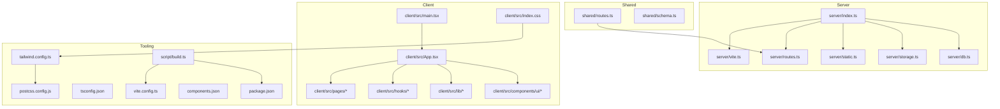
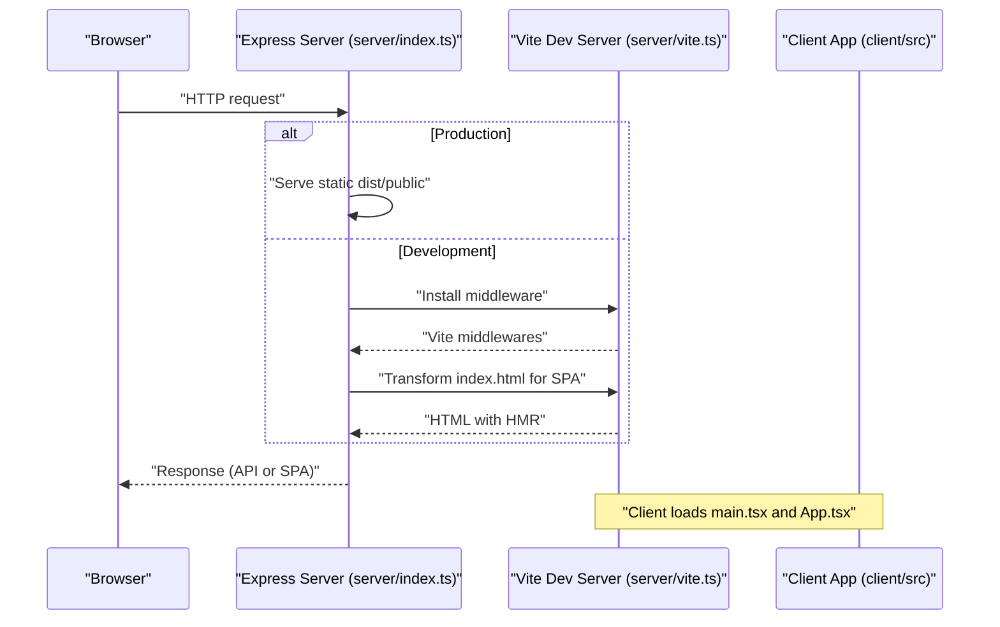
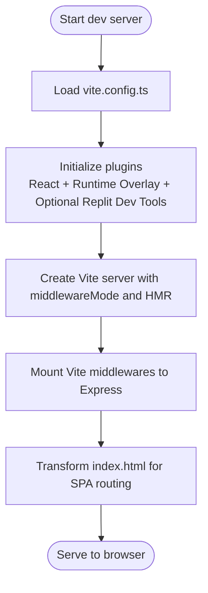
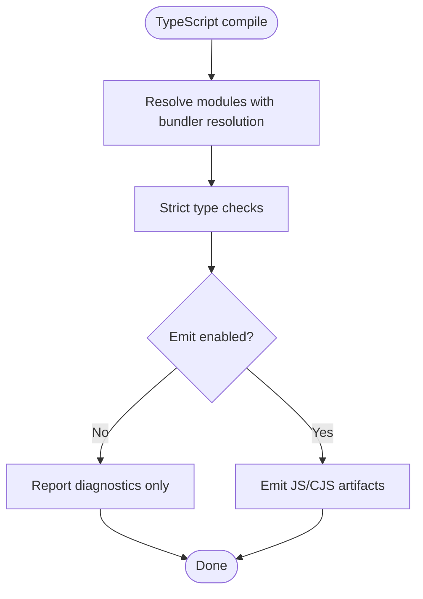
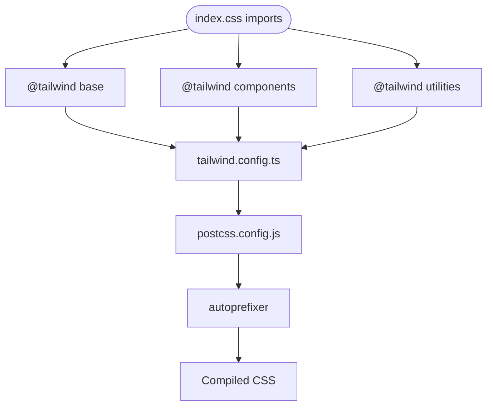
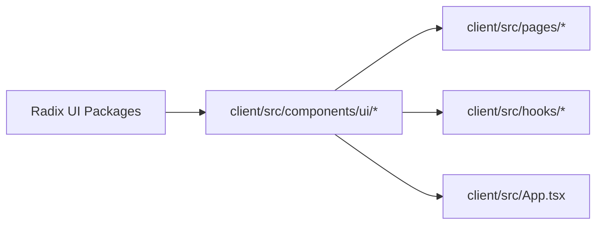
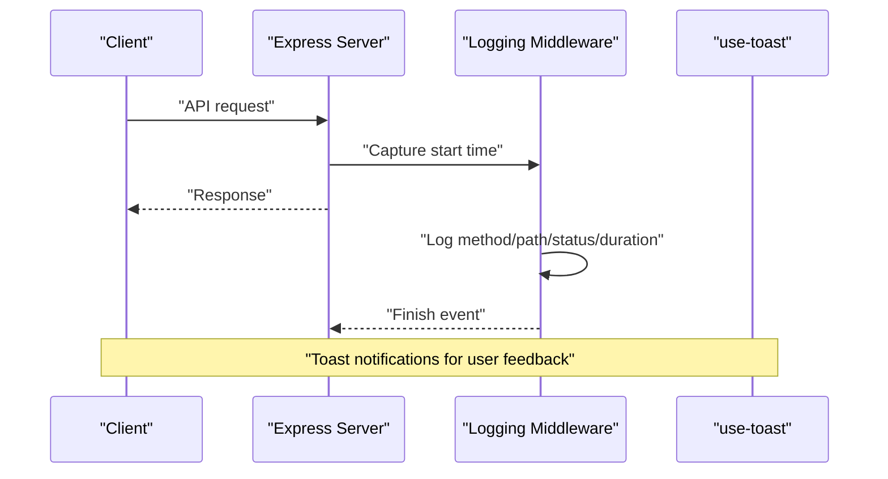
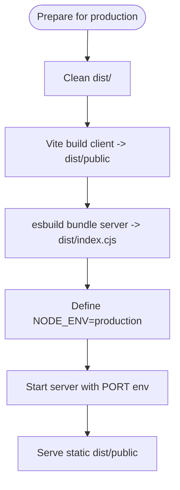
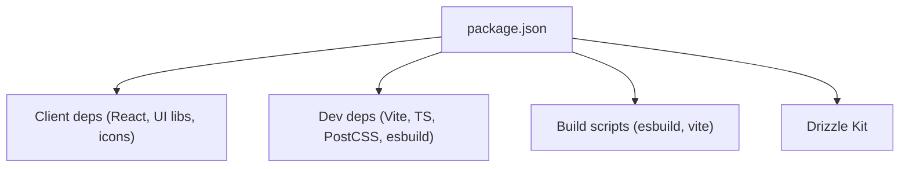

# Development Workflow

<cite>
**Referenced Files in This Document**
- [vite.config.ts](file://vite.config.ts)
- [package.json](file://package.json)
- [tsconfig.json](file://tsconfig.json)
- [tailwind.config.ts](file://tailwind.config.ts)
- [postcss.config.js](file://postcss.config.js)
- [components.json](file://components.json)
- [script/build.ts](file://script/build.ts)
- [README.md](file://README.md)
- [client/src/main.tsx](file://client/src/main.tsx)
- [client/src/App.tsx](file://client/src/App.tsx)
- [client/src/index.css](file://client/src/index.css)
- [server/index.ts](file://server/index.ts)
- [server/vite.ts](file://server/vite.ts)
- [drizzle.config.ts](file://drizzle.config.ts)
- [shared/routes.ts](file://shared/routes.ts)
- [client/src/hooks/use-toast.ts](file://client/src/hooks/use-toast.ts)
- [client/src/lib/utils.ts](file://client/src/lib/utils.ts)
- [client/src/pages/Home.tsx](file://client/src/pages/Home.tsx)
</cite>

## Table of Contents
1. [Introduction](#introduction)
2. [Project Structure](#project-structure)
3. [Core Components](#core-components)
4. [Architecture Overview](#architecture-overview)
5. [Detailed Component Analysis](#detailed-component-analysis)
6. [Dependency Analysis](#dependency-analysis)
7. [Performance Considerations](#performance-considerations)
8. [Troubleshooting Guide](#troubleshooting-guide)
9. [Conclusion](#conclusion)
10. [Appendices](#appendices)

## Introduction
This document describes the development workflow for the Personal Showcase portfolio application. It covers the Vite build system configuration, TypeScript compilation and type checking, styling with Tailwind CSS and PostCSS, component library integration via Radix UI, development tools, testing strategies, continuous integration approach, environment management, cross-platform considerations for Windows, and deployment preparation.

## Project Structure
The project follows a monorepo-like structure with a client (React + Vite), server (Express), shared schemas and routes, and build scripts. Key directories and files:
- client: React application with TypeScript, Tailwind CSS, and UI components
- server: Express server with development-time Vite integration and production static serving
- shared: Zod schemas and API route definitions
- script: Build orchestration using esbuild for server bundling and Vite for client
- Root configs: Vite, TypeScript, Tailwind, PostCSS, and component aliases

**Diagram sources**
- [vite.config.ts](file://vite.config.ts#L1-L41)
- [tsconfig.json](file://tsconfig.json#L1-L24)
- [tailwind.config.ts](file://tailwind.config.ts#L1-L108)
- [postcss.config.js](file://postcss.config.js#L1-L7)
- [components.json](file://components.json#L1-L20)
- [script/build.ts](file://script/build.ts#L1-L68)
- [client/src/main.tsx](file://client/src/main.tsx#L1-L6)
- [client/src/App.tsx](file://client/src/App.tsx#L1-L51)
- [client/src/index.css](file://client/src/index.css#L1-L101)
- [server/index.ts](file://server/index.ts#L1-L103)
- [server/vite.ts](file://server/vite.ts#L1-L59)
- [shared/routes.ts](file://shared/routes.ts#L1-L112)

**Section sources**
- [README.md](file://README.md#L58-L64)
- [package.json](file://package.json#L1-L114)

## Core Components
- Vite configuration defines plugins, aliases, root, build output, and server security/fs settings.
- TypeScript configuration enables strict mode, bundler resolution, JSX preservation, and path aliases.
- Tailwind CSS configuration extends design tokens, dark mode, animations, and typography plugin.
- PostCSS pipeline applies Tailwind directives and autoprefixer.
- Build script orchestrates client build via Vite and server bundling via esbuild with selective externalization.
- Server integrates Vite middleware in development and serves static assets in production.

**Section sources**
- [vite.config.ts](file://vite.config.ts#L1-L41)
- [tsconfig.json](file://tsconfig.json#L1-L24)
- [tailwind.config.ts](file://tailwind.config.ts#L1-L108)
- [postcss.config.js](file://postcss.config.js#L1-L7)
- [script/build.ts](file://script/build.ts#L1-L68)
- [server/index.ts](file://server/index.ts#L78-L87)

## Architecture Overview
The application runs a single Express server that serves both API endpoints and the SPA. In development, Vite handles SSR/HMR and serves the SPA shell. In production, the server serves prebuilt static assets.

**Diagram sources**
- [server/index.ts](file://server/index.ts#L78-L102)
- [server/vite.ts](file://server/vite.ts#L11-L58)
- [client/src/main.tsx](file://client/src/main.tsx#L1-L6)
- [client/src/App.tsx](file://client/src/App.tsx#L1-L51)

## Detailed Component Analysis

### Vite Build System and Development Server
- Plugins: React Fast Refresh, runtime error overlay, and optional Replit developer plugins in non-production environments.
- Aliases: @ for client/src, @shared for shared, and @assets for attached assets.
- Root and output: Client root and dist/public output directory.
- Security: Strict filesystem access and deny-list for sensitive files.
- Development integration: Vite middleware with HMR bound to the HTTP server; dynamic index.html transform and stacktrace fixes.

**Diagram sources**
- [vite.config.ts](file://vite.config.ts#L6-L40)
- [server/vite.ts](file://server/vite.ts#L11-L58)

**Section sources**
- [vite.config.ts](file://vite.config.ts#L6-L40)
- [server/vite.ts](file://server/vite.ts#L11-L58)

### TypeScript Compilation and Type Checking
- Strict mode enabled with DOM libs and JSX preservation.
- Bundler module resolution and path aliases match Vite config.
- No emit for dev; type-checking via dedicated script.
- Incremental builds and tsbuild info caching improve performance.

**Diagram sources**
- [tsconfig.json](file://tsconfig.json#L4-L22)

**Section sources**
- [tsconfig.json](file://tsconfig.json#L1-L24)
- [package.json](file://package.json#L10-L10)

### Styling Workflow: Tailwind CSS, PostCSS, and Radix UI Integration
- Tailwind configuration:
  - Dark mode via class strategy
  - Content scanning across client templates and components
  - Extends border radius, colors (including semantic status colors), fonts, keyframes, and animations
  - Plugins: tailwindcss-animate and @tailwindcss/typography
- PostCSS pipeline:
  - Tailwind directives and autoprefixer applied in order
- Component library:
  - Radix UI primitives integrated via npm packages
  - shadcn/ui configuration via components.json with TSX, aliases, and Tailwind CSS variables
- Utilities:
  - cn function merges classNames with Tailwind merge for predictable overrides

**Diagram sources**
- [client/src/index.css](file://client/src/index.css#L3-L5)
- [tailwind.config.ts](file://tailwind.config.ts#L1-L108)
- [postcss.config.js](file://postcss.config.js#L1-L7)

**Section sources**
- [tailwind.config.ts](file://tailwind.config.ts#L1-L108)
- [postcss.config.js](file://postcss.config.js#L1-L7)
- [components.json](file://components.json#L1-L20)
- [client/src/lib/utils.ts](file://client/src/lib/utils.ts#L1-L7)

### Component Library Integration (Radix UI)
- UI primitives are consumed directly from npm packages for dialogs, tooltips, forms, navigation, and more.
- Components are organized under client/src/components/ui and composed in pages and shared UI patterns.
- Consistent theming via Tailwind CSS variables and shadcn/ui configuration.

**Diagram sources**
- [package.json](file://package.json#L16-L77)
- [components.json](file://components.json#L13-L19)

**Section sources**
- [package.json](file://package.json#L16-L77)
- [components.json](file://components.json#L1-L20)

### Development Tools: Debugging, Error Tracking, and Performance Monitoring
- Runtime error overlay: Displays runtime errors in the browser during development.
- Replit developer plugins: Optional cartographer and dev banner in hosted environments.
- Logging middleware: Centralized logging for API requests with timing and response payloads.
- Toast notifications: Global toast manager with controlled queue and timeouts for user feedback.
- Performance considerations: esbuild server bundling minimizes cold start overhead by allowinglist and externalizing dependencies.

**Diagram sources**
- [server/index.ts](file://server/index.ts#L25-L60)
- [client/src/hooks/use-toast.ts](file://client/src/hooks/use-toast.ts#L1-L192)

**Section sources**
- [vite.config.ts](file://vite.config.ts#L4-L19)
- [server/index.ts](file://server/index.ts#L25-L76)
- [client/src/hooks/use-toast.ts](file://client/src/hooks/use-toast.ts#L1-L192)

### Testing Strategies and Manual Testing Guidelines
- Manual testing:
  - Verify routing across pages (Home, Education, Experience, Research, Awards, Contact).
  - Test interactive components (tooltips, dialogs, forms) and ensure keyboard accessibility.
  - Validate responsive breakpoints and dark mode toggling.
  - Confirm API endpoints via shared route definitions and error responses.
- Automated testing:
  - The repository does not include unit or integration test files in the provided structure. Consider adding tests for hooks, components, and API routes using a framework compatible with Vite and React Testing Library.

**Section sources**
- [shared/routes.ts](file://shared/routes.ts#L1-L112)
- [client/src/pages/Home.tsx](file://client/src/pages/Home.tsx#L1-L144)

### Continuous Integration Approach
- The repository does not include CI configuration files. Recommended approach:
  - Lint and type-check on pull requests
  - Run tests (unit/integration) and build verification
  - Deploy preview environments for PRs
  - Automated production deployments on main branch with artifact publishing

[No sources needed since this section provides general guidance]

### Environment Management and Cross-Platform Considerations (Windows)
- Environment variables:
  - cross-env ensures consistent environment variables across shells on Windows.
  - PORT defaults to 5001 to avoid permission issues on Windows.
- Database:
  - Automatic in-memory fallback if DATABASE_URL is not set.
  - Drizzle migrations supported via drizzle-kit with explicit DATABASE_URL requirement.

**Section sources**
- [README.md](file://README.md#L53-L57)
- [drizzle.config.ts](file://drizzle.config.ts#L1-L15)
- [server/index.ts](file://server/index.ts#L88-L98)

### Deployment Preparation Workflows
- Production build:
  - Client built via Vite to dist/public
  - Server bundled via esbuild with selective externalization to reduce bundle size and cold start
  - Environment variables NODE_ENV=production and PORT configured for runtime
- Static hosting:
  - In production, the server serves prebuilt static assets from dist/public
- Database:
  - Set DATABASE_URL and run migration push to prepare production schema

**Diagram sources**
- [script/build.ts](file://script/build.ts#L35-L61)
- [server/index.ts](file://server/index.ts#L81-L87)

**Section sources**
- [script/build.ts](file://script/build.ts#L1-L68)
- [server/index.ts](file://server/index.ts#L81-L98)
- [package.json](file://package.json#L6-L12)

## Dependency Analysis
- Client dependencies: React, Wouter router, TanStack Query, Framer Motion, Radix UI primitives, Tailwind-based UI components, and icons.
- Dev dependencies: Vite, React plugin, Tailwind CSS, PostCSS, TypeScript, esbuild, and Replit developer plugins.
- Build-time dependencies: esbuild for server bundling, Vite for client bundling.
- Database tooling: Drizzle Kit for migrations and schema management.

**Diagram sources**
- [package.json](file://package.json#L13-L113)

**Section sources**
- [package.json](file://package.json#L1-L114)

## Performance Considerations
- Client build: Vite provides fast incremental rebuilds and HMR.
- Server bundling: esbuild with allowlist and externalization reduces cold start and bundle size.
- Tailwind purging: Content paths in Tailwind config ensure unused styles are removed.
- CSS optimization: PostCSS autoprefixer ensures compatibility and reduces vendor prefixes.

[No sources needed since this section provides general guidance]

## Troubleshooting Guide
- Vite HMR not working:
  - Ensure Vite middleware is mounted in development and HMR server is configured.
  - Verify index.html transform and stacktrace fix are active.
- Runtime errors in browser:
  - Confirm runtime error overlay plugin is enabled in development.
- API errors:
  - Review centralized error handler logs and response payloads.
- Port conflicts on Windows:
  - Default to PORT 5001 to avoid permission issues.
- Database connectivity:
  - Ensure DATABASE_URL is set or rely on in-memory fallback; run migration push when using PostgreSQL.

**Section sources**
- [server/vite.ts](file://server/vite.ts#L11-L58)
- [vite.config.ts](file://vite.config.ts#L4-L19)
- [server/index.ts](file://server/index.ts#L65-L76)
- [README.md](file://README.md#L53-L57)
- [drizzle.config.ts](file://drizzle.config.ts#L1-L15)

## Conclusion
The Personal Showcase application leverages Vite for a fast development experience, TypeScript for robustness, Tailwind CSS with PostCSS for styling, and Radix UI for accessible component primitives. The server integrates Vite in development and serves static assets in production, with a streamlined build process using esbuild. Following the outlined workflows ensures efficient development, reliable testing, and smooth deployment across platforms.

## Appendices
- Getting started and scripts are documented in the repository’s README, including prerequisites, installation, development commands, and database seeding behavior.

**Section sources**
- [README.md](file://README.md#L18-L71)