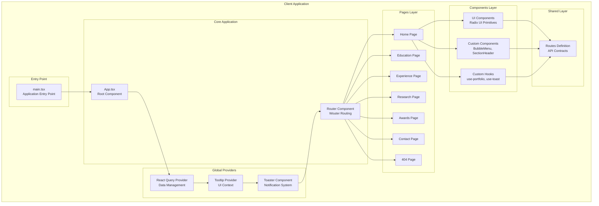
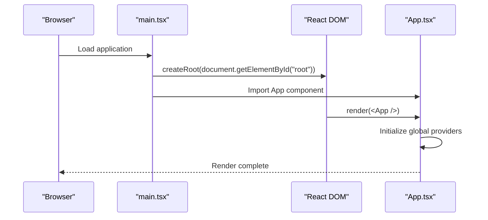
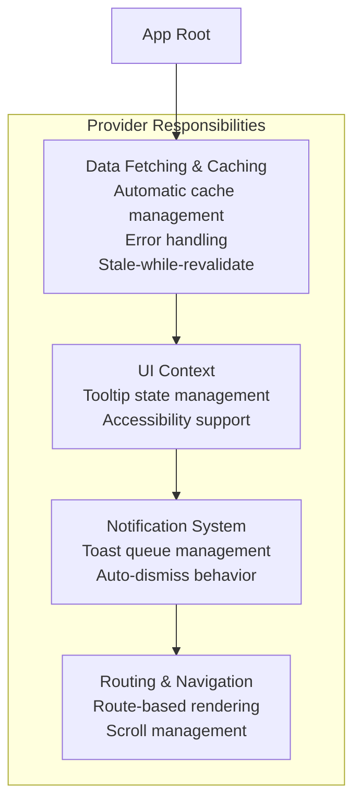
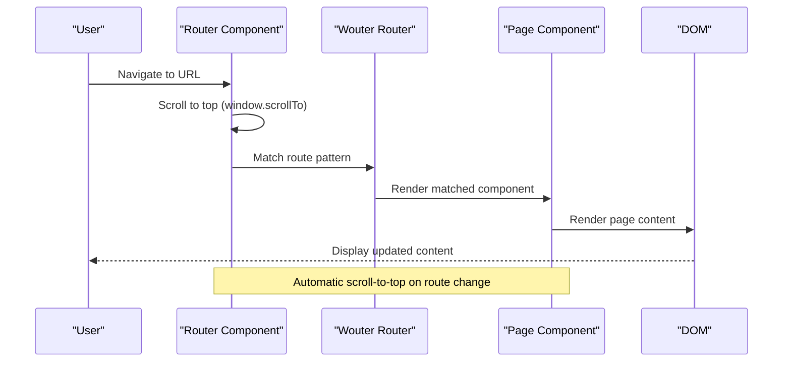
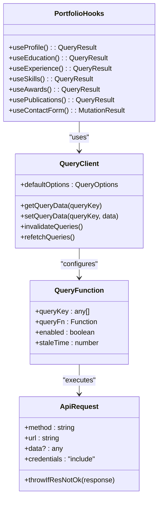
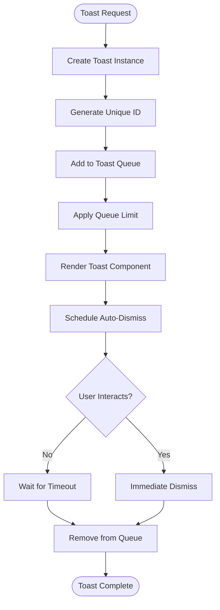
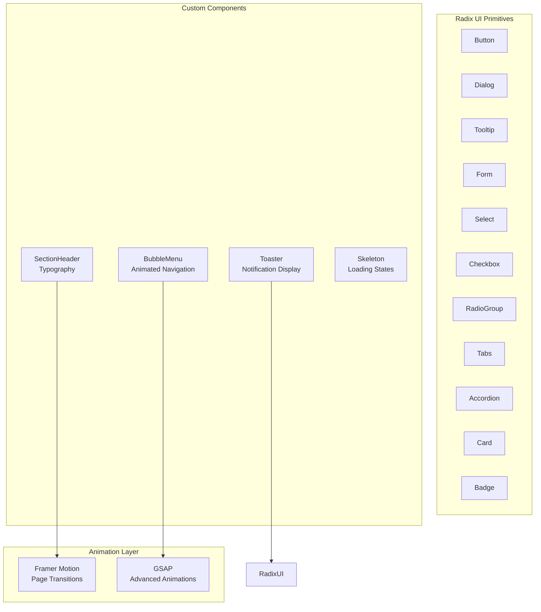
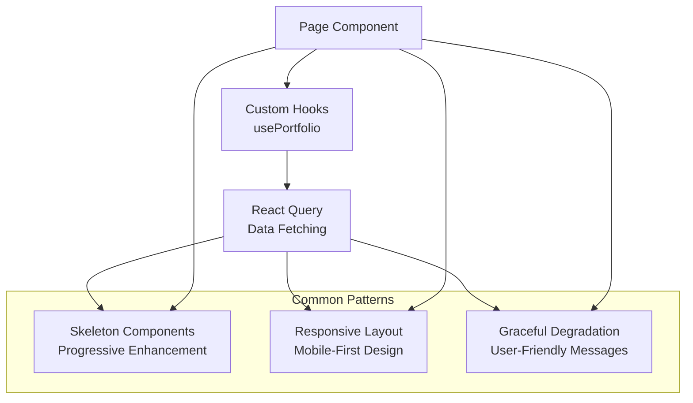
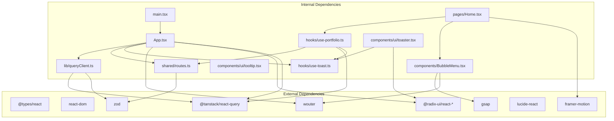

# Application Architecture

<cite>
**Referenced Files in This Document**
- [main.tsx](file://client/src/main.tsx)
- [App.tsx](file://client/src/App.tsx)
- [queryClient.ts](file://client/src/lib/queryClient.ts)
- [routes.ts](file://shared/routes.ts)
- [use-toast.ts](file://client/src/hooks/use-toast.ts)
- [toaster.tsx](file://client/src/components/ui/toaster.tsx)
- [tooltip.tsx](file://client/src/components/ui/tooltip.tsx)
- [Home.tsx](file://client/src/pages/Home.tsx)
- [not-found.tsx](file://client/src/pages/not-found.tsx)
- [use-portfolio.ts](file://client/src/hooks/use-portfolio.ts)
- [BubbleMenu.tsx](file://client/src/components/BubbleMenu.tsx)
- [index.css](file://client/src/index.css)
- [package.json](file://package.json)
- [vite.config.ts](file://vite.config.ts)
</cite>

## Table of Contents
1. [Introduction](#introduction)
2. [Project Structure](#project-structure)
3. [Core Components](#core-components)
4. [Architecture Overview](#architecture-overview)
5. [Detailed Component Analysis](#detailed-component-analysis)
6. [Dependency Analysis](#dependency-analysis)
7. [Performance Considerations](#performance-considerations)
8. [Troubleshooting Guide](#troubleshooting-guide)
9. [Conclusion](#conclusion)

## Introduction

This document provides comprehensive application architecture documentation for the React frontend of a personal showcase application. The application follows a modern React architecture pattern with a focus on component composition, global state management, and clean separation of concerns. The frontend utilizes Wouter for routing, React Query for data fetching and caching, Radix UI for accessible UI primitives, and a custom toast notification system.

The application is structured around a provider-based architecture where global state and UI contexts are managed through React's Context API and third-party libraries. The routing system provides seamless navigation between different sections of the portfolio while maintaining optimal user experience through automatic scroll-to-top behavior.

## Project Structure

The client application follows a well-organized structure that separates concerns across different layers:



**Diagram sources**
- [main.tsx](file://client/src/main.tsx#L1-L6)
- [App.tsx](file://client/src/App.tsx#L1-L51)
- [Home.tsx](file://client/src/pages/Home.tsx#L1-L144)

The project structure demonstrates a clear separation between presentation components, business logic, and infrastructure concerns. The architecture promotes reusability and maintainability through well-defined boundaries between layers.

**Section sources**
- [main.tsx](file://client/src/main.tsx#L1-L6)
- [App.tsx](file://client/src/App.tsx#L1-L51)
- [vite.config.ts](file://vite.config.ts#L1-L41)

## Core Components

### Application Entry Point

The application bootstraps through a minimal entry point that renders the root component:



**Diagram sources**
- [main.tsx](file://client/src/main.tsx#L1-L6)
- [App.tsx](file://client/src/App.tsx#L34-L48)

The entry point follows React 18's concurrent features by using the new root API, ensuring optimal hydration and streaming capabilities.

### Global Providers Stack

The application establishes a hierarchical provider stack that manages different aspects of the application state:



**Diagram sources**
- [App.tsx](file://client/src/App.tsx#L40-L47)
- [queryClient.ts](file://client/src/lib/queryClient.ts#L44-L57)

The provider stack ensures that each layer has access to the necessary context while maintaining clear separation of concerns. The ordering is crucial: React Query must wrap Tooltip Provider, which must wrap the Toaster, which must wrap the Router.

**Section sources**
- [main.tsx](file://client/src/main.tsx#L1-L6)
- [App.tsx](file://client/src/App.tsx#L34-L48)
- [queryClient.ts](file://client/src/lib/queryClient.ts#L44-L57)

## Architecture Overview

The application follows a layered architecture pattern with clear boundaries between presentation, business logic, and data management layers:

```mermaid
graph TB
subgraph "Presentation Layer"
Pages["Page Components<br/>Home, Education, Experience,<br/>Research, Awards, Contact"]
UI_Components["UI Primitive Components<br/>Buttons, Forms, Cards,<br/>Dialogs, Tooltips"]
Custom_Components["Custom Components<br/>BubbleMenu, SectionHeader"]
end
subgraph "Business Logic Layer"
Hooks["Custom Hooks<br/>use-portfolio, use-toast,<br/>use-mobile"]
Services["Data Services<br/>API Client, Validation,<br/>Caching Strategies"]
end
subgraph "Infrastructure Layer"
Providers["Global Providers<br/>React Query, Tooltip,<br/>Toast Notifications"]
Routing["Routing System<br/>Wouter Router<br/>Automatic Scroll-to-Top"]
State["Global State<br/>Context Management<br/>Local State"]
end
subgraph "External Dependencies"
RadixUI["@radix-ui/react-*<br/>Accessible UI Primitives"]
ReactQuery["@tanstack/react-query<br/>Data Fetching & Caching"]
FramerMotion["framer-motion<br/>Animations"]
GSAP["gsap<br/>Advanced Animations"]
end
Pages --> Hooks
UI_Components --> RadixUI
Custom_Components --> GSAP
Hooks --> ReactQuery
Services --> Providers
Providers --> Routing
Routing --> State
Hooks -.-> Services
Services -.-> External Dependencies
```

**Diagram sources**
- [App.tsx](file://client/src/App.tsx#L1-L51)
- [Home.tsx](file://client/src/pages/Home.tsx#L1-L144)
- [use-portfolio.ts](file://client/src/hooks/use-portfolio.ts#L1-L115)

The architecture emphasizes composability and reusability through well-defined interfaces and clear data flow patterns. Each layer has specific responsibilities and communicates through documented contracts.

## Detailed Component Analysis

### Routing System with Wouter

The routing system is implemented using Wouter, a lightweight routing library that provides declarative routing with automatic scroll-to-top behavior:



**Diagram sources**
- [App.tsx](file://client/src/App.tsx#L15-L32)

The Router component implements automatic scroll-to-top behavior by listening to focus events and scrolling to the top of the page whenever navigation occurs. This ensures a clean user experience when moving between different sections.

**Section sources**
- [App.tsx](file://client/src/App.tsx#L15-L32)

### React Query Integration

React Query provides comprehensive data fetching, caching, and state synchronization capabilities:



**Diagram sources**
- [queryClient.ts](file://client/src/lib/queryClient.ts#L1-L58)
- [use-portfolio.ts](file://client/src/hooks/use-portfolio.ts#L1-L115)

The React Query configuration implements custom error handling and authentication support through credential inclusion. The query functions handle HTTP status validation and provide structured error responses for different scenarios.

**Section sources**
- [queryClient.ts](file://client/src/lib/queryClient.ts#L1-L58)
- [use-portfolio.ts](file://client/src/hooks/use-portfolio.ts#L1-L115)

### Toast Notification System

The toast notification system provides a sophisticated notification mechanism with queue management and auto-dismiss functionality:



**Diagram sources**
- [use-toast.ts](file://client/src/hooks/use-toast.ts#L142-L169)
- [toaster.tsx](file://client/src/components/ui/toaster.tsx#L11-L33)

The toast system implements a finite queue with configurable limits and sophisticated timing controls. Each toast maintains its own lifecycle with individual dismissal timers and shared global actions.

**Section sources**
- [use-toast.ts](file://client/src/hooks/use-toast.ts#L1-L192)
- [toaster.tsx](file://client/src/components/ui/toaster.tsx#L1-L34)

### UI Component Architecture

The UI layer consists of two primary categories: Radix UI primitive components and custom application-specific components:



**Diagram sources**
- [BubbleMenu.tsx](file://client/src/components/BubbleMenu.tsx#L1-L242)
- [Home.tsx](file://client/src/pages/Home.tsx#L1-L144)

The custom components leverage advanced animation libraries for enhanced user experience while maintaining accessibility standards through Radix UI primitives.

**Section sources**
- [BubbleMenu.tsx](file://client/src/components/BubbleMenu.tsx#L1-L242)
- [Home.tsx](file://client/src/pages/Home.tsx#L1-L144)

### Page Components Organization

Each page component follows a consistent pattern for data fetching, loading states, and content presentation:



**Diagram sources**
- [Home.tsx](file://client/src/pages/Home.tsx#L10-L143)
- [use-portfolio.ts](file://client/src/hooks/use-portfolio.ts#L6-L16)

The page components demonstrate consistent patterns for handling loading states, error conditions, and responsive design while leveraging the shared UI component library.

**Section sources**
- [Home.tsx](file://client/src/pages/Home.tsx#L1-L144)
- [use-portfolio.ts](file://client/src/hooks/use-portfolio.ts#L1-L115)

## Dependency Analysis

The application maintains a clean dependency graph with clear separation between internal modules and external libraries:



**Diagram sources**
- [package.json](file://package.json#L13-L77)
- [vite.config.ts](file://vite.config.ts#L22-L28)

The dependency analysis reveals a well-structured architecture where internal modules depend on external libraries but maintain clear boundaries. The shared routes module serves as a central contract definition for API interactions.

**Section sources**
- [package.json](file://package.json#L1-L114)
- [vite.config.ts](file://vite.config.ts#L1-L41)

## Performance Considerations

The application architecture incorporates several performance optimization strategies:

### Data Fetching Optimization
- **Stale-while-revalidate**: Queries are configured with infinite stale time and manual invalidation
- **Selective refetching**: Disabled automatic refetching on window focus to prevent unnecessary network requests
- **Custom error handling**: Structured error responses prevent cascading failures

### Rendering Optimization
- **Component lazy loading**: Route-based rendering with automatic scroll-to-top prevents unnecessary re-renders
- **Skeleton loading**: Progressive enhancement with skeleton screens improves perceived performance
- **Animation optimization**: GSAP animations are carefully orchestrated to minimize layout thrashing

### Memory Management
- **Toast queue limits**: Finite toast queue prevents memory leaks from accumulating notifications
- **Cleanup patterns**: Proper cleanup of event listeners and animation timelines
- **Conditional rendering**: Efficient conditional rendering based on loading states

## Troubleshooting Guide

### Common Issues and Solutions

**Routing Issues**
- Verify Wouter installation and configuration
- Check route patterns match actual URLs
- Ensure automatic scroll-to-top is functioning correctly

**Data Fetching Problems**
- Validate API endpoint configurations in shared routes
- Check React Query provider setup
- Monitor network tab for failed requests

**Toast System Malfunctions**
- Verify use-toast hook is properly imported
- Check toast queue limits and timing configurations
- Ensure Toaster component is mounted within provider stack

**Build and Development Issues**
- Verify Vite configuration aliases
- Check TypeScript compilation settings
- Validate Tailwind CSS configuration

**Section sources**
- [App.tsx](file://client/src/App.tsx#L15-L32)
- [queryClient.ts](file://client/src/lib/queryClient.ts#L44-L57)
- [use-toast.ts](file://client/src/hooks/use-toast.ts#L8-L10)

## Conclusion

The React frontend application demonstrates a mature architectural approach that balances simplicity with powerful functionality. The provider-based architecture, combined with thoughtful component organization and robust data management, creates a maintainable and scalable foundation for the personal showcase application.

Key architectural strengths include:
- **Clean separation of concerns** through layered architecture
- **Comprehensive state management** via React Query and custom hooks
- **Accessible UI components** built on Radix UI primitives
- **Performance optimization** through careful data fetching and rendering strategies
- **Developer experience** enhancements through TypeScript and modern tooling

The application serves as an excellent example of modern React development practices, demonstrating how to effectively combine multiple libraries and patterns to create a cohesive, maintainable codebase. The architecture provides a solid foundation for future enhancements while maintaining excellent performance characteristics and developer productivity.