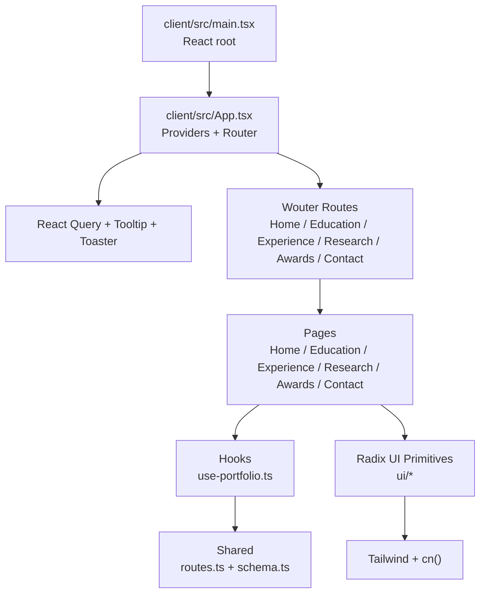
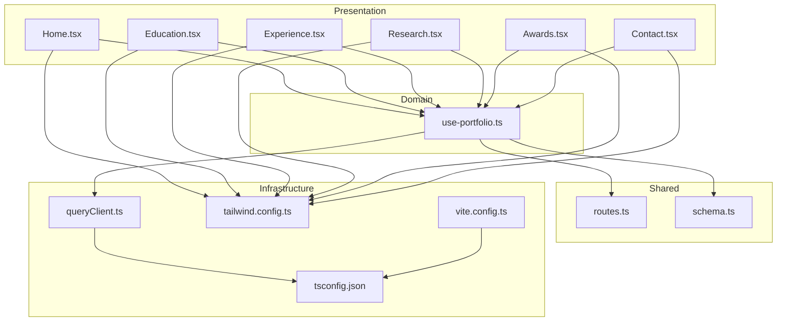
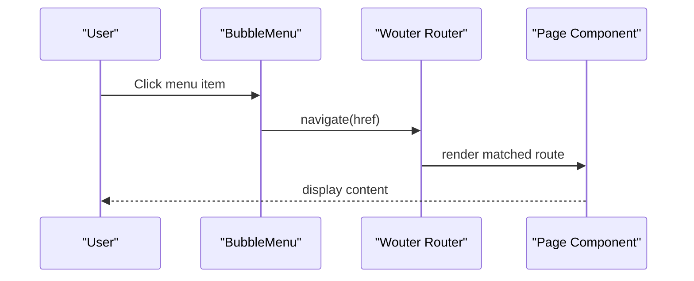
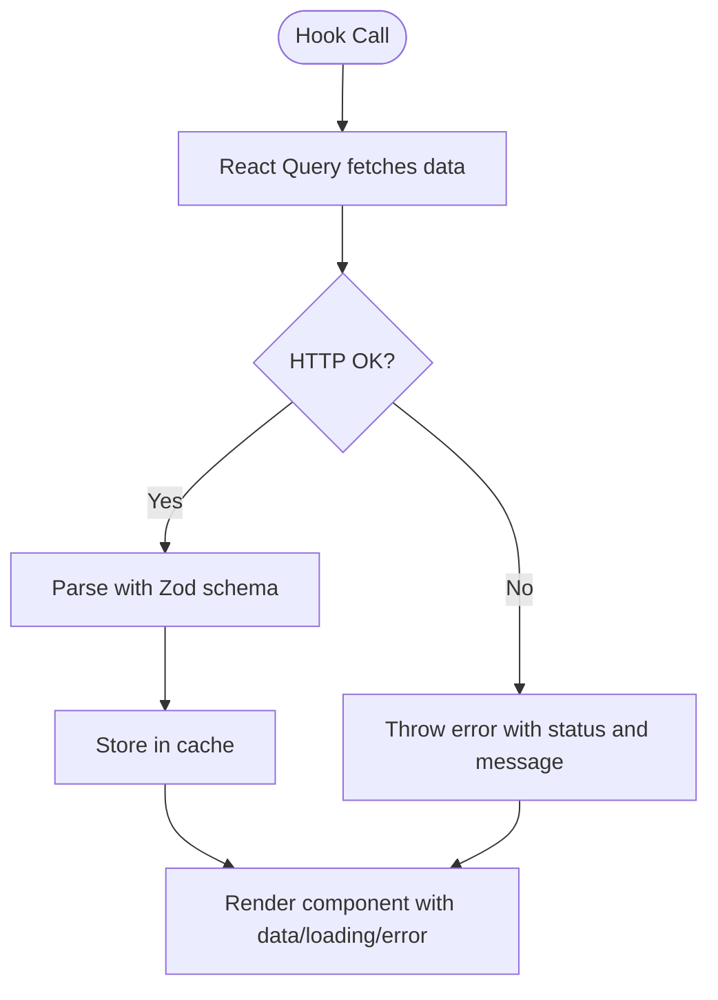
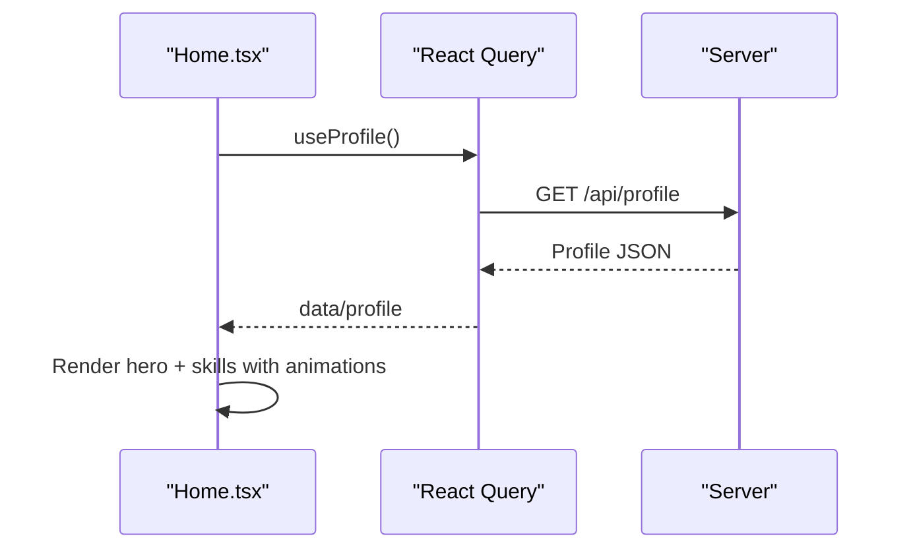
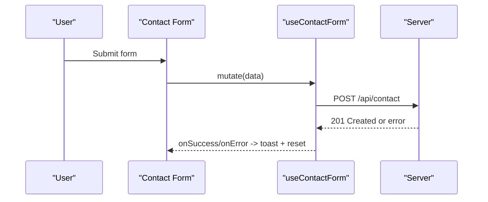
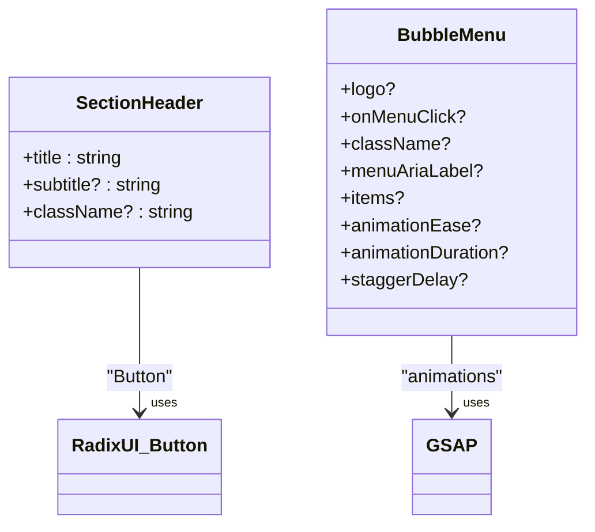
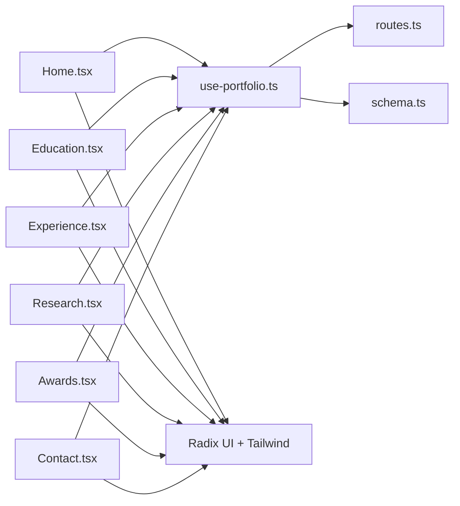

# Frontend Application

<cite>
**Referenced Files in This Document**
- [main.tsx](file://client/src/main.tsx)
- [App.tsx](file://client/src/App.tsx)
- [queryClient.ts](file://client/src/lib/queryClient.ts)
- [utils.ts](file://client/src/lib/utils.ts)
- [use-portfolio.ts](file://client/src/hooks/use-portfolio.ts)
- [use-toast.ts](file://client/src/hooks/use-toast.ts)
- [routes.ts](file://shared/routes.ts)
- [schema.ts](file://shared/schema.ts)
- [Home.tsx](file://client/src/pages/Home.tsx)
- [Education.tsx](file://client/src/pages/Education.tsx)
- [Experience.tsx](file://client/src/pages/Experience.tsx)
- [Research.tsx](file://client/src/pages/Research.tsx)
- [Awards.tsx](file://client/src/pages/Awards.tsx)
- [Contact.tsx](file://client/src/pages/Contact.tsx)
- [SectionHeader.tsx](file://client/src/components/SectionHeader.tsx)
- [BubbleMenu.tsx](file://client/src/components/BubbleMenu.tsx)
- [vite.config.ts](file://vite.config.ts)
- [tailwind.config.ts](file://tailwind.config.ts)
- [tsconfig.json](file://tsconfig.json)
- [package.json](file://package.json)
</cite>

## Table of Contents
1. [Introduction](#introduction)
2. [Project Structure](#project-structure)
3. [Core Components](#core-components)
4. [Architecture Overview](#architecture-overview)
5. [Detailed Component Analysis](#detailed-component-analysis)
6. [Dependency Analysis](#dependency-analysis)
7. [Performance Considerations](#performance-considerations)
8. [Troubleshooting Guide](#troubleshooting-guide)
9. [Conclusion](#conclusion)
10. [Appendices](#appendices)

## Introduction
This document describes the frontend application for a React-based personal portfolio. It covers the application structure, routing, state management via React Query, build configuration with Vite, TypeScript integration, UI components from Radix UI, page-based architecture, styling with Tailwind CSS, responsive design, animations with Framer Motion, and hook-based data fetching patterns including error handling and loading states.

## Project Structure
The frontend is organized into a clear feature-based layout under client/src:
- Entry point initializes the React root and renders the App shell.
- App sets up global providers (React Query, Radix UI tooltips, notifications) and defines routes.
- Pages implement dedicated sections for Home, Education, Experience, Research, Awards, and Contact.
- Hooks encapsulate data fetching and mutations with typed schemas from shared.
- UI primitives are provided by Radix UI and styled with Tailwind CSS.
- Utilities support Tailwind merging and class composition.

**Diagram sources**
- [main.tsx](file://client/src/main.tsx#L1-L6)
- [App.tsx](file://client/src/App.tsx#L1-L51)
- [Home.tsx](file://client/src/pages/Home.tsx#L1-L144)
- [Education.tsx](file://client/src/pages/Education.tsx#L1-L76)
- [Experience.tsx](file://client/src/pages/Experience.tsx#L1-L70)
- [Research.tsx](file://client/src/pages/Research.tsx#L1-L87)
- [Awards.tsx](file://client/src/pages/Awards.tsx#L1-L77)
- [Contact.tsx](file://client/src/pages/Contact.tsx#L1-L178)
- [use-portfolio.ts](file://client/src/hooks/use-portfolio.ts#L1-L115)
- [routes.ts](file://shared/routes.ts#L1-L112)
- [schema.ts](file://shared/schema.ts#L1-L86)

**Section sources**
- [main.tsx](file://client/src/main.tsx#L1-L6)
- [App.tsx](file://client/src/App.tsx#L1-L51)

## Core Components
- Application shell and routing:
  - Wouter-based routing with a Switch and per-page components.
  - Global providers: React Query client, Radix UI Tooltip provider, and Toaster for notifications.
  - Body base classes set min height and background color.
- Data fetching and caching:
  - Centralized React Query client with default options optimized for server-driven data.
  - Custom fetch wrapper validates response status and throws descriptive errors.
  - Typed query/mutation hooks consume shared API definitions and Zod schemas.
- UI primitives and utilities:
  - Radix UI components for accessible UI controls.
  - Tailwind utilities and cn() for class composition and theme tokens.
- Animations and interactions:
  - Framer Motion for page transitions and staggered list reveals.
  - GSAP for animated bubble menu interactions.

**Section sources**
- [App.tsx](file://client/src/App.tsx#L1-L51)
- [queryClient.ts](file://client/src/lib/queryClient.ts#L1-L58)
- [use-portfolio.ts](file://client/src/hooks/use-portfolio.ts#L1-L115)
- [utils.ts](file://client/src/lib/utils.ts#L1-L7)

## Architecture Overview
The app follows a layered architecture:
- Presentation layer: Pages and UI components.
- Domain layer: Hooks encapsulate data fetching and mutations.
- Shared layer: API route definitions and Zod schemas.
- Infrastructure layer: Vite build, TypeScript config, Tailwind configuration.

**Diagram sources**
- [Home.tsx](file://client/src/pages/Home.tsx#L1-L144)
- [Education.tsx](file://client/src/pages/Education.tsx#L1-L76)
- [Experience.tsx](file://client/src/pages/Experience.tsx#L1-L70)
- [Research.tsx](file://client/src/pages/Research.tsx#L1-L87)
- [Awards.tsx](file://client/src/pages/Awards.tsx#L1-L77)
- [Contact.tsx](file://client/src/pages/Contact.tsx#L1-L178)
- [use-portfolio.ts](file://client/src/hooks/use-portfolio.ts#L1-L115)
- [routes.ts](file://shared/routes.ts#L1-L112)
- [schema.ts](file://shared/schema.ts#L1-L86)
- [queryClient.ts](file://client/src/lib/queryClient.ts#L1-L58)
- [tailwind.config.ts](file://tailwind.config.ts#L1-L108)
- [vite.config.ts](file://vite.config.ts#L1-L41)
- [tsconfig.json](file://tsconfig.json#L1-L24)

## Detailed Component Analysis

### Routing and Navigation
- Router wraps the entire app and scrolls to top on route changes.
- Routes map to dedicated pages: Home, Education, Experience, Research, Awards, Contact.
- BubbleMenu provides animated navigation with GSAP and integrates with Wouter.

**Diagram sources**
- [App.tsx](file://client/src/App.tsx#L15-L32)
- [BubbleMenu.tsx](file://client/src/components/BubbleMenu.tsx#L72-L242)

**Section sources**
- [App.tsx](file://client/src/App.tsx#L1-L51)
- [BubbleMenu.tsx](file://client/src/components/BubbleMenu.tsx#L1-L242)

### State Management with React Query
- Centralized QueryClient with default options:
  - Infinite cache (staleTime: Infinity), no refetch on window focus, no retries.
  - Custom query function handles 401 behavior and throws descriptive errors.
- API request helper centralizes credentials and content-type handling.
- Hook patterns:
  - useProfile, useEducation, useExperience, useSkills, useAwards, usePublications for reads.
  - useContactForm for mutation with Zod validation and toast feedback.

**Diagram sources**
- [queryClient.ts](file://client/src/lib/queryClient.ts#L1-L58)
- [use-portfolio.ts](file://client/src/hooks/use-portfolio.ts#L1-L115)

**Section sources**
- [queryClient.ts](file://client/src/lib/queryClient.ts#L1-L58)
- [use-portfolio.ts](file://client/src/hooks/use-portfolio.ts#L1-L115)

### Page-Based Architecture

#### Home
- Displays profile hero and skills grid with staggered animations.
- Uses skeletons during loading and Framer Motion for entrance animations.
- Integrates BubbleMenu and navigation to other sections.

**Diagram sources**
- [Home.tsx](file://client/src/pages/Home.tsx#L1-L144)
- [use-portfolio.ts](file://client/src/hooks/use-portfolio.ts#L6-L16)

**Section sources**
- [Home.tsx](file://client/src/pages/Home.tsx#L1-L144)
- [SectionHeader.tsx](file://client/src/components/SectionHeader.tsx#L1-L30)

#### Education
- Timeline layout with animated entries using Framer Motion.
- Skeleton loader for loading states.
- Uses SectionHeader for consistent typography.

**Section sources**
- [Education.tsx](file://client/src/pages/Education.tsx#L1-L76)
- [SectionHeader.tsx](file://client/src/components/SectionHeader.tsx#L1-L30)

#### Experience
- Card-based layout with hover effects and staggered animations.
- Displays role, company, period, and description.

**Section sources**
- [Experience.tsx](file://client/src/pages/Experience.tsx#L1-L70)

#### Research
- Grid of publication cards with optional external links.
- Responsive layout and hover states.

**Section sources**
- [Research.tsx](file://client/src/pages/Research.tsx#L1-L87)

#### Awards
- Grid of award cards with decorative accents and animations.

**Section sources**
- [Awards.tsx](file://client/src/pages/Awards.tsx#L1-L77)

#### Contact
- Form built with react-hook-form and Zod resolver.
- Mutation hook handles submission, success/error toasts, and reset behavior.
- Displays profile contact info alongside the form.

**Diagram sources**
- [Contact.tsx](file://client/src/pages/Contact.tsx#L21-L38)
- [use-portfolio.ts](file://client/src/hooks/use-portfolio.ts#L78-L115)

**Section sources**
- [Contact.tsx](file://client/src/pages/Contact.tsx#L1-L178)
- [use-portfolio.ts](file://client/src/hooks/use-portfolio.ts#L78-L115)

### UI Components and Styling
- Radix UI primitives provide accessible, unstyled foundations (buttons, dialogs, tooltips, forms, etc.).
- Tailwind CSS config extends design tokens, keyframes, and plugins for animations and typography.
- Utility function cn() merges classes safely with Tailwind merge.

**Diagram sources**
- [SectionHeader.tsx](file://client/src/components/SectionHeader.tsx#L1-L30)
- [BubbleMenu.tsx](file://client/src/components/BubbleMenu.tsx#L1-L242)

**Section sources**
- [SectionHeader.tsx](file://client/src/components/SectionHeader.tsx#L1-L30)
- [BubbleMenu.tsx](file://client/src/components/BubbleMenu.tsx#L1-L242)
- [tailwind.config.ts](file://tailwind.config.ts#L1-L108)
- [utils.ts](file://client/src/lib/utils.ts#L1-L7)

### Build System and Development Workflow
- Vite configuration:
  - React plugin, runtime error overlay, and optional dev banners for local environments.
  - Path aliases for @/ and @shared/.
  - Output directory configured for SSR-friendly distribution.
- TypeScript configuration:
  - Strict mode, ESNext module, JSX preserve, bundler module resolution, and path aliases.
- Package scripts:
  - Development server via tsx.
  - Build via custom script.
  - Production start serving compiled assets.

**Section sources**
- [vite.config.ts](file://vite.config.ts#L1-L41)
- [tsconfig.json](file://tsconfig.json#L1-L24)
- [package.json](file://package.json#L6-L12)

## Dependency Analysis
- External libraries:
  - React Query for caching and invalidation.
  - Radix UI for accessible primitives.
  - Framer Motion for animations.
  - Tailwind plugins for animations and typography.
  - Zod for runtime validation and Drizzle ORM schemas.
- Internal dependencies:
  - Pages depend on hooks.
  - Hooks depend on shared routes and schemas.
  - UI components depend on Radix UI and Tailwind.

**Diagram sources**
- [Home.tsx](file://client/src/pages/Home.tsx#L1-L144)
- [Education.tsx](file://client/src/pages/Education.tsx#L1-L76)
- [Experience.tsx](file://client/src/pages/Experience.tsx#L1-L70)
- [Research.tsx](file://client/src/pages/Research.tsx#L1-L87)
- [Awards.tsx](file://client/src/pages/Awards.tsx#L1-L77)
- [Contact.tsx](file://client/src/pages/Contact.tsx#L1-L178)
- [use-portfolio.ts](file://client/src/hooks/use-portfolio.ts#L1-L115)
- [routes.ts](file://shared/routes.ts#L1-L112)
- [schema.ts](file://shared/schema.ts#L1-L86)

**Section sources**
- [package.json](file://package.json#L13-L78)

## Performance Considerations
- React Query defaults:
  - Infinite cache time avoids unnecessary refetches.
  - No automatic refetch on window focus reduces network churn.
  - Disabled retries prevent repeated failed requests.
- Loading states:
  - Skeleton loaders improve perceived performance during data fetches.
- Animations:
  - Staggered animations are delayed per item; consider viewport once to reduce re-renders.
- Build:
  - Vite’s fast refresh and tree-shaking minimize bundle sizes in development and production.

[No sources needed since this section provides general guidance]

## Troubleshooting Guide
- Network errors:
  - React Query throws descriptive errors when responses are not ok; check server endpoints and credentials.
- Validation errors:
  - Contact form mutation parses input with Zod; ensure payload matches schema.
- Toast notifications:
  - use-toast manages single toast limit and dismissal timers; verify toasts appear and auto-dismiss.
- Routing:
  - Ensure route paths match Switch definitions; verify BubbleMenu links.

**Section sources**
- [queryClient.ts](file://client/src/lib/queryClient.ts#L3-L8)
- [use-portfolio.ts](file://client/src/hooks/use-portfolio.ts#L82-L115)
- [use-toast.ts](file://client/src/hooks/use-toast.ts#L1-L192)
- [App.tsx](file://client/src/App.tsx#L21-L29)

## Conclusion
This portfolio application demonstrates a clean separation of concerns with a strong emphasis on developer experience: TypeScript, Vite, Radix UI, Tailwind CSS, and React Query. The page-based architecture, combined with hook-driven data fetching and thoughtful animations, delivers a responsive and accessible user experience.

[No sources needed since this section summarizes without analyzing specific files]

## Appendices

### API Definitions and Schemas
- API endpoints and response schemas are defined centrally and consumed by hooks.
- Zod schemas ensure runtime validation for both requests and responses.

**Section sources**
- [routes.ts](file://shared/routes.ts#L32-L99)
- [schema.ts](file://shared/schema.ts#L68-L86)