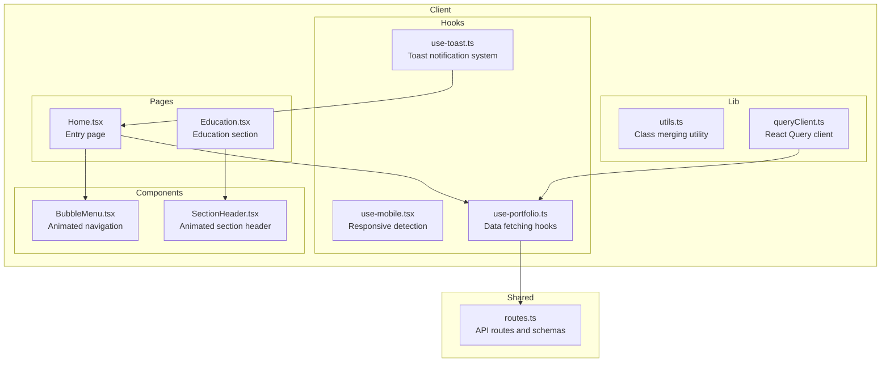
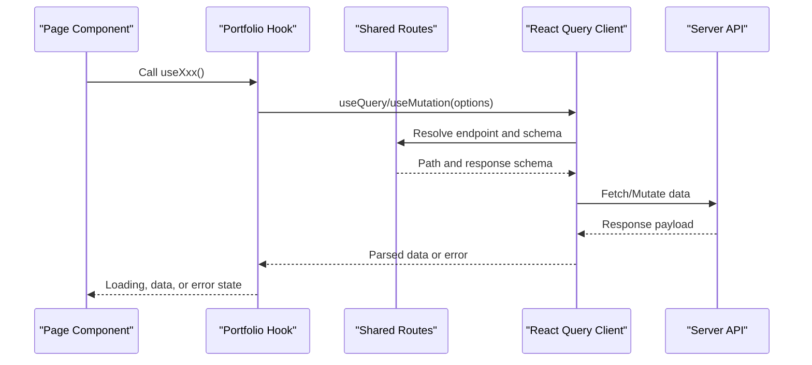
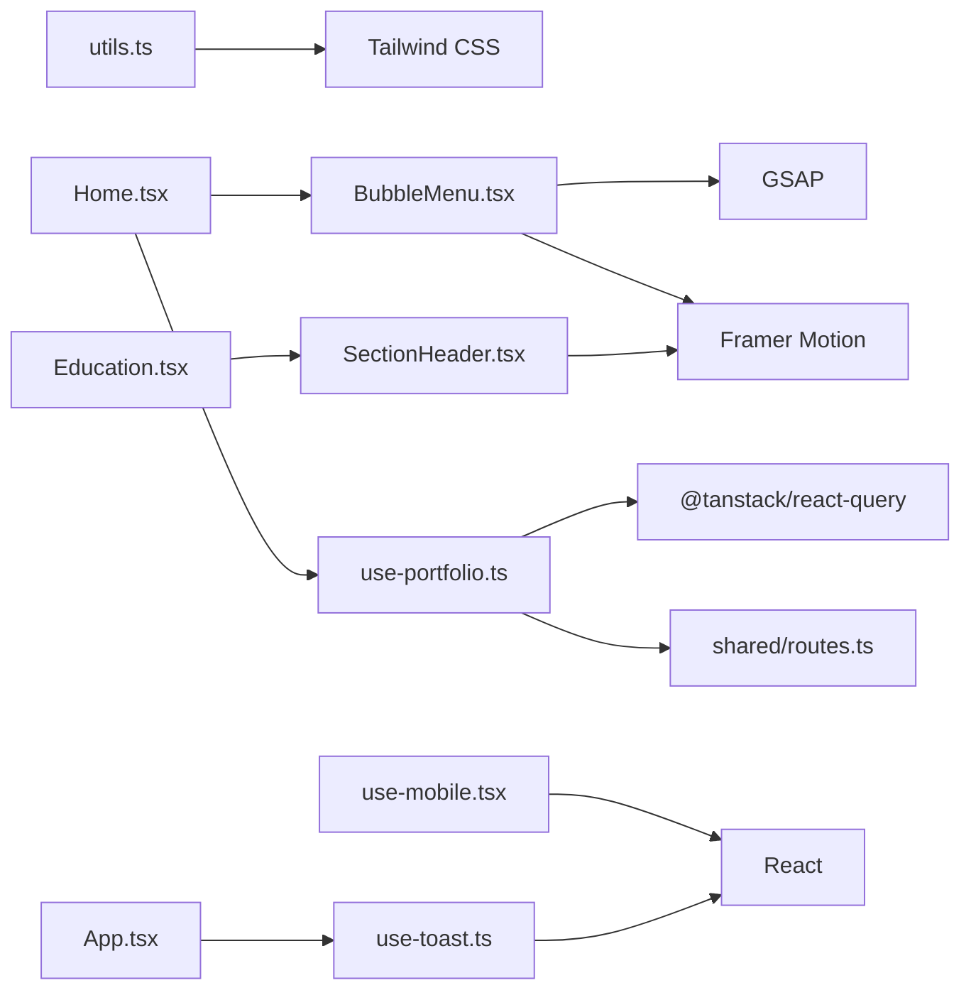

# Hooks and Utilities

<cite>
**Referenced Files in This Document**
- [utils.ts](file://client/src/lib/utils.ts)
- [use-mobile.tsx](file://client/src/hooks/use-mobile.tsx)
- [BubbleMenu.tsx](file://client/src/components/BubbleMenu.tsx)
- [BubbleMenu.css](file://client/src/components/BubbleMenu.css)
- [SectionHeader.tsx](file://client/src/components/SectionHeader.tsx)
- [use-portfolio.ts](file://client/src/hooks/use-portfolio.ts)
- [use-toast.ts](file://client/src/hooks/use-toast.ts)
- [queryClient.ts](file://client/src/lib/queryClient.ts)
- [routes.ts](file://shared/routes.ts)
- [Home.tsx](file://client/src/pages/Home.tsx)
- [Education.tsx](file://client/src/pages/Education.tsx)
- [App.tsx](file://client/src/App.tsx)
- [main.tsx](file://client/src/main.tsx)
</cite>

## Table of Contents
1. [Introduction](#introduction)
2. [Project Structure](#project-structure)
3. [Core Components](#core-components)
4. [Architecture Overview](#architecture-overview)
5. [Detailed Component Analysis](#detailed-component-analysis)
6. [Dependency Analysis](#dependency-analysis)
7. [Performance Considerations](#performance-considerations)
8. [Troubleshooting Guide](#troubleshooting-guide)
9. [Conclusion](#conclusion)

## Introduction
This document provides comprehensive documentation for the custom hooks and utility functions used throughout the Personal Showcase application. It focuses on:
- Utility functions in utils.ts for class merging and component composition
- Custom component implementations like BubbleMenu and SectionHeader
- Specialized hooks such as use-mobile for responsive behavior detection
- Portfolio-related hooks for data fetching and form submission
- Toast notification system for user feedback

The goal is to explain the purpose, implementation, and integration patterns of these utilities, enabling developers to understand how they contribute to the application’s functionality and maintainability.

## Project Structure
The hooks and utilities are organized under dedicated folders:
- client/src/lib: Shared utilities (e.g., class merging)
- client/src/hooks: Custom React hooks (responsive detection, data fetching, notifications)
- client/src/components: Reusable UI components (BubbleMenu, SectionHeader)
- shared: API route definitions and Zod schemas for type-safe requests

**Diagram sources**
- [utils.ts](file://client/src/lib/utils.ts#L1-L7)
- [use-mobile.tsx](file://client/src/hooks/use-mobile.tsx#L1-L20)
- [use-portfolio.ts](file://client/src/hooks/use-portfolio.ts#L1-L115)
- [use-toast.ts](file://client/src/hooks/use-toast.ts#L1-L192)
- [BubbleMenu.tsx](file://client/src/components/BubbleMenu.tsx#L1-L258)
- [SectionHeader.tsx](file://client/src/components/SectionHeader.tsx#L1-L30)
- [queryClient.ts](file://client/src/lib/queryClient.ts#L1-L58)
- [routes.ts](file://shared/routes.ts#L1-L112)
- [Home.tsx](file://client/src/pages/Home.tsx#L1-L154)
- [Education.tsx](file://client/src/pages/Education.tsx#L1-L70)

**Section sources**
- [utils.ts](file://client/src/lib/utils.ts#L1-L7)
- [use-mobile.tsx](file://client/src/hooks/use-mobile.tsx#L1-L20)
- [use-portfolio.ts](file://client/src/hooks/use-portfolio.ts#L1-L115)
- [use-toast.ts](file://client/src/hooks/use-toast.ts#L1-L192)
- [BubbleMenu.tsx](file://client/src/components/BubbleMenu.tsx#L1-L258)
- [SectionHeader.tsx](file://client/src/components/SectionHeader.tsx#L1-L30)
- [queryClient.ts](file://client/src/lib/queryClient.ts#L1-L58)
- [routes.ts](file://shared/routes.ts#L1-L112)
- [Home.tsx](file://client/src/pages/Home.tsx#L1-L154)
- [Education.tsx](file://client/src/pages/Education.tsx#L1-L70)

## Core Components
This section documents the primary utilities and hooks that power the application.

- Class merging utility (cn):
  - Purpose: Merge Tailwind CSS classes safely using clsx and twMerge to prevent conflicts.
  - Implementation: Accepts multiple inputs and returns a merged string.
  - Usage: Replace manual class concatenation with a robust utility that handles duplicates and overrides.
  - Integration: Used wherever dynamic class lists are constructed.

- Responsive detection hook (useIsMobile):
  - Purpose: Detect mobile devices based on a breakpoint and window media queries.
  - Implementation: Uses matchMedia and effect to track width changes and set state accordingly.
  - Usage: Determine responsive behavior for layout adjustments and feature toggles.
  - Integration: Can be used by components to adapt UI for small screens.

- Portfolio data hooks (useProfile, useEducation, useExperience, useSkills, useAwards, usePublications, useContactForm):
  - Purpose: Encapsulate data fetching and mutation logic for portfolio resources.
  - Implementation: Each hook uses React Query to manage caching, retries, and error handling.
  - Usage: Fetch lists or single records, and submit forms with Zod validation.
  - Integration: Pages consume these hooks to render content and handle user actions.

- Toast notification system (useToast, toast):
  - Purpose: Provide global toast notifications with controlled concurrency and dismissal.
  - Implementation: Custom reducer manages a queue of toasts with limits and timeouts.
  - Usage: Display success/error messages after form submissions or other events.
  - Integration: Hooks and pages trigger toasts via the exported functions.

**Section sources**
- [utils.ts](file://client/src/lib/utils.ts#L1-L7)
- [use-mobile.tsx](file://client/src/hooks/use-mobile.tsx#L1-L20)
- [use-portfolio.ts](file://client/src/hooks/use-portfolio.ts#L1-L115)
- [use-toast.ts](file://client/src/hooks/use-toast.ts#L1-L192)

## Architecture Overview
The hooks and utilities integrate with the application through a layered approach:
- Presentation layer: Pages and components (e.g., Home, Education)
- Domain layer: Portfolio hooks encapsulate API interactions
- Infrastructure layer: Query client and shared routes define data contracts
- Utility layer: Class merging and toast systems support cross-cutting concerns

**Diagram sources**
- [Home.tsx](file://client/src/pages/Home.tsx#L1-L154)
- [use-portfolio.ts](file://client/src/hooks/use-portfolio.ts#L1-L115)
- [routes.ts](file://shared/routes.ts#L1-L112)
- [queryClient.ts](file://client/src/lib/queryClient.ts#L1-L58)

## Detailed Component Analysis

### Utility Functions: Class Merging (cn)
- Purpose: Safely merge Tailwind classes with clsx and twMerge to avoid conflicts.
- Parameters: Accepts multiple inputs compatible with ClassValue.
- Behavior: Returns a single class string with duplicates removed and overrides applied.
- Usage examples:
  - Combine conditional classes with static ones.
  - Merge arrays of classes from props and computed values.
- Integration patterns:
  - Replace manual string concatenation in components.
  - Use with styled components or dynamic class builders.

Implementation highlights:
- Imports clsx and twMerge from external libraries.
- Exports a single function cn that merges inputs.

**Section sources**
- [utils.ts](file://client/src/lib/utils.ts#L1-L7)

### Custom Hook: Responsive Detection (useIsMobile)
- Purpose: Detect whether the current device is mobile-sized.
- Parameters: None.
- Behavior:
  - Initializes state to undefined.
  - Adds a media query listener on mount.
  - Updates state based on window width compared to breakpoint.
  - Cleans up event listener on unmount.
- Usage examples:
  - Conditionally render mobile-friendly layouts.
  - Toggle navigation modes based on screen size.
- Integration patterns:
  - Use in components to branch rendering logic.
  - Combine with other responsive utilities for consistent behavior.

Implementation highlights:
- Uses a fixed breakpoint constant.
- Leverages matchMedia for reliable detection.
- Returns a boolean derived from state.

**Section sources**
- [use-mobile.tsx](file://client/src/hooks/use-mobile.tsx#L1-L20)

### Custom Hook: Portfolio Data Fetching (use-portfolio)
- Purpose: Provide typed data fetching hooks for portfolio resources.
- Available hooks:
  - useProfile: Fetches profile data with 404 handling.
  - useEducation, useExperience, useSkills, useAwards, usePublications: List endpoints.
  - useContactForm: Mutation for form submission with Zod validation and error mapping.
- Parameters:
  - Query hooks: queryKey and queryFn configured via shared routes.
  - Mutation hook: accepts arbitrary data validated against contact schema.
- Behavior:
  - Query hooks cache responses with infinite stale time and no retries.
  - Mutation hook validates input, sends request, parses responses, and triggers toasts.
- Usage examples:
  - Render lists in dedicated sections (e.g., Education).
  - Submit contact forms with immediate user feedback.
- Integration patterns:
  - Consume hooks in pages to populate content.
  - Use shared routes for consistent endpoint definitions.

Implementation highlights:
- Uses @tanstack/react-query for caching and state management.
- Integrates with shared routes for endpoint paths and response schemas.
- Uses useToast for user feedback on success/error.

**Section sources**
- [use-portfolio.ts](file://client/src/hooks/use-portfolio.ts#L1-L115)
- [routes.ts](file://shared/routes.ts#L1-L112)
- [queryClient.ts](file://client/src/lib/queryClient.ts#L1-L58)

### Custom Hook: Toast Notifications (use-toast)
- Purpose: Centralized toast notification system with controlled concurrency.
- Parameters: None for hook; toast function accepts title, description, and variant.
- Behavior:
  - Maintains a reducer-driven state of toasts with a limit.
  - Automatically schedules removal after a long delay.
  - Provides dismiss and update functions.
- Usage examples:
  - Show success message after sending a contact form.
  - Display error messages with destructible variant.
- Integration patterns:
  - Wrap the app with Toaster provider.
  - Call toast in response to hook callbacks.

Implementation highlights:
- Custom reducer enforces a single-toast limit.
- Generates unique IDs and manages timeouts.
- Exposes both imperative toast and reactive useToast.

**Section sources**
- [use-toast.ts](file://client/src/hooks/use-toast.ts#L1-L192)
- [App.tsx](file://client/src/App.tsx#L1-L36)

### Component: Animated Navigation (BubbleMenu)
- Purpose: Provide an animated floating bubble menu with smooth animations and accessibility.
- Props:
  - logo, onMenuClick, className, style, menuAriaLabel, menuBg, menuContentColor, useFixedPosition, items, animationEase, animationDuration, staggerDelay.
- Behavior:
  - Toggles overlay visibility and animates items using GSAP timeline.
  - Smoothly scrolls to anchor targets on navigation clicks.
  - Closes menu on location change.
- Usage examples:
  - Include in the main page to navigate between sections.
  - Customize appearance with background and text colors.
- Integration patterns:
  - Consumed by Home page to enable intra-page navigation.
  - Styled via BubbleMenu.css for responsive layout and animations.

Implementation highlights:
- Uses GSAP for animations and Framer Motion for basic page transitions.
- Manages refs for overlay and menu items to orchestrate timelines.
- Supports custom items and default navigation list.

**Section sources**
- [BubbleMenu.tsx](file://client/src/components/BubbleMenu.tsx#L1-L258)
- [BubbleMenu.css](file://client/src/components/BubbleMenu.css#L1-L267)
- [Home.tsx](file://client/src/pages/Home.tsx#L1-L154)

### Component: Animated Section Header (SectionHeader)
- Purpose: Render a section header with entrance animation and optional subtitle.
- Props:
  - title: Required string.
  - subtitle: Optional string.
  - className: Optional string for additional styling.
- Behavior:
  - Uses Framer Motion to animate opacity and vertical translation.
  - Renders a decorative underline element.
- Usage examples:
  - Use in dedicated sections like Education to introduce content.
- Integration patterns:
  - Consumed by pages to establish section identity.

**Section sources**
- [SectionHeader.tsx](file://client/src/components/SectionHeader.tsx#L1-L30)
- [Education.tsx](file://client/src/pages/Education.tsx#L1-L70)

## Dependency Analysis
The hooks and utilities depend on external libraries and shared configurations:
- React Query: Provides caching, retries, and state management for data fetching.
- GSAP: Powers animations in BubbleMenu.
- Framer Motion: Handles entrance animations in SectionHeader.
- clsx and tailwind-merge: Manage class merging in utils.ts.
- Zod: Validates API inputs and responses via shared routes.

**Diagram sources**
- [utils.ts](file://client/src/lib/utils.ts#L1-L7)
- [use-mobile.tsx](file://client/src/hooks/use-mobile.tsx#L1-L20)
- [use-portfolio.ts](file://client/src/hooks/use-portfolio.ts#L1-L115)
- [use-toast.ts](file://client/src/hooks/use-toast.ts#L1-L192)
- [BubbleMenu.tsx](file://client/src/components/BubbleMenu.tsx#L1-L258)
- [SectionHeader.tsx](file://client/src/components/SectionHeader.tsx#L1-L30)
- [routes.ts](file://shared/routes.ts#L1-L112)
- [Home.tsx](file://client/src/pages/Home.tsx#L1-L154)
- [Education.tsx](file://client/src/pages/Education.tsx#L1-L70)
- [App.tsx](file://client/src/App.tsx#L1-L36)

**Section sources**
- [utils.ts](file://client/src/lib/utils.ts#L1-L7)
- [use-mobile.tsx](file://client/src/hooks/use-mobile.tsx#L1-L20)
- [use-portfolio.ts](file://client/src/hooks/use-portfolio.ts#L1-L115)
- [use-toast.ts](file://client/src/hooks/use-toast.ts#L1-L192)
- [BubbleMenu.tsx](file://client/src/components/BubbleMenu.tsx#L1-L258)
- [SectionHeader.tsx](file://client/src/components/SectionHeader.tsx#L1-L30)
- [routes.ts](file://shared/routes.ts#L1-L112)
- [Home.tsx](file://client/src/pages/Home.tsx#L1-L154)
- [Education.tsx](file://client/src/pages/Education.tsx#L1-L70)
- [App.tsx](file://client/src/App.tsx#L1-L36)

## Performance Considerations
- Class merging:
  - Using clsx and twMerge prevents redundant classes and reduces DOM bloat.
  - Prefer cn over manual concatenation for dynamic class lists.

- Responsive detection:
  - MatchMedia listeners are cleaned up to avoid leaks.
  - Initial state is undefined to defer decisions until hydration completes.

- Data fetching:
  - Infinite stale time avoids unnecessary refetches.
  - No retries reduce network pressure during development.
  - Custom query function centralizes error handling.

- Animations:
  - GSAP timelines are killed when unmounting to prevent lingering tweens.
  - Will-change and transforms leverage GPU acceleration.

- Toast system:
  - Single-toast limit prevents UI clutter.
  - Long removal delays ensure visibility without manual dismissal.

[No sources needed since this section provides general guidance]

## Troubleshooting Guide
- BubbleMenu animations not playing:
  - Verify GSAP is loaded and timelines are initialized when overlay and items are present.
  - Ensure refs are populated before starting animations.

- Navigation not scrolling to anchors:
  - Confirm target IDs match the href values and elements exist in the DOM.
  - Check that the menu closes after navigation to avoid conflicting state.

- Toast not appearing:
  - Ensure Toaster is rendered at the app root.
  - Verify useToast is called within the provider context.

- Portfolio data not loading:
  - Check endpoint paths in shared routes and server availability.
  - Inspect query keys and response schemas for mismatches.

**Section sources**
- [BubbleMenu.tsx](file://client/src/components/BubbleMenu.tsx#L129-L176)
- [BubbleMenu.css](file://client/src/components/BubbleMenu.css#L141-L176)
- [use-toast.ts](file://client/src/hooks/use-toast.ts#L171-L189)
- [App.tsx](file://client/src/App.tsx#L25-L32)
- [use-portfolio.ts](file://client/src/hooks/use-portfolio.ts#L1-L115)
- [routes.ts](file://shared/routes.ts#L32-L99)

## Conclusion
The hooks and utilities documented here form the backbone of the application’s responsiveness, data management, and user feedback systems. They promote:
- Consistent class handling with cn
- Reliable responsive behavior with useIsMobile
- Type-safe API interactions with portfolio hooks
- Unified toast notifications with useToast
- Engaging UI animations with BubbleMenu and SectionHeader

By leveraging these utilities, developers can maintain clean, predictable, and scalable component behavior across the application.