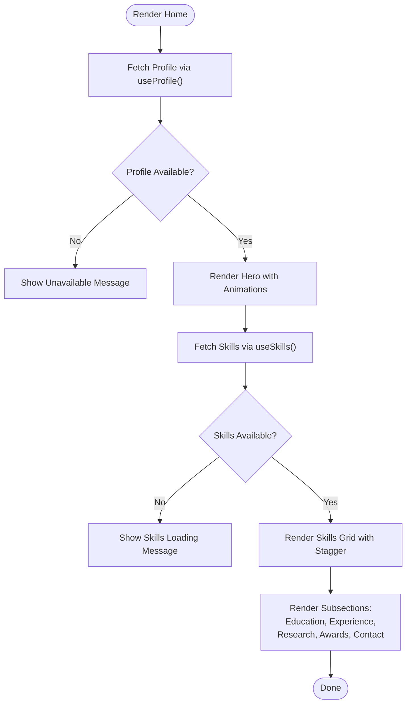

# Page Components

<cite>
**Referenced Files in This Document**
- [Home.tsx](file://client/src/pages/Home.tsx)
- [Education.tsx](file://client/src/pages/Education.tsx)
- [Experience.tsx](file://client/src/pages/Experience.tsx)
- [Research.tsx](file://client/src/pages/Research.tsx)
- [Awards.tsx](file://client/src/pages/Awards.tsx)
- [Contact.tsx](file://client/src/pages/Contact.tsx)
- [not-found.tsx](file://client/src/pages/not-found.tsx)
- [use-portfolio.ts](file://client/src/hooks/use-portfolio.ts)
- [SectionHeader.tsx](file://client/src/components/SectionHeader.tsx)
- [BubbleMenu.tsx](file://client/src/components/BubbleMenu.tsx)
- [App.tsx](file://client/src/App.tsx)
- [routes.ts](file://shared/routes.ts)
- [schema.ts](file://shared/schema.ts)
- [queryClient.ts](file://client/src/lib/queryClient.ts)
- [main.tsx](file://client/src/main.tsx)
</cite>

## Table of Contents
1. [Introduction](#introduction)
2. [Project Structure](#project-structure)
3. [Core Components](#core-components)
4. [Architecture Overview](#architecture-overview)
5. [Detailed Component Analysis](#detailed-component-analysis)
6. [Dependency Analysis](#dependency-analysis)
7. [Performance Considerations](#performance-considerations)
8. [Troubleshooting Guide](#troubleshooting-guide)
9. [Conclusion](#conclusion)
10. [Appendices](#appendices)

## Introduction
This document provides comprehensive documentation for the page components that compose the portfolio application. It covers the Home page and all portfolio sections: Education, Experience, Research, Awards, and Contact. It explains the page structure, data fetching patterns using React Query hooks, content organization, responsive design, component composition, animation systems, interactive elements, navigation patterns, route handling, integration with global application state, not-found page implementation, and error boundary handling. Examples of page-specific styling, content rendering, and user interaction patterns are included.

## Project Structure
The client-side application is organized around a set of page components under client/src/pages, each responsible for rendering a distinct section of the portfolio. Shared UI components live under client/src/components, and data-fetching logic is encapsulated in client/src/hooks. Routing is handled via Wouter, and global state is provided by React Query. The shared module defines API route definitions and Zod schemas used for runtime validation.

**Diagram sources**
- [App.tsx](file://client/src/App.tsx#L1-L36)
- [main.tsx](file://client/src/main.tsx#L1-L6)
- [Home.tsx](file://client/src/pages/Home.tsx#L1-L154)
- [Education.tsx](file://client/src/pages/Education.tsx#L1-L70)
- [Experience.tsx](file://client/src/pages/Experience.tsx#L1-L64)
- [Research.tsx](file://client/src/pages/Research.tsx#L1-L81)
- [Awards.tsx](file://client/src/pages/Awards.tsx#L1-L71)
- [Contact.tsx](file://client/src/pages/Contact.tsx#L1-L172)
- [not-found.tsx](file://client/src/pages/not-found.tsx#L1-L32)
- [use-portfolio.ts](file://client/src/hooks/use-portfolio.ts#L1-L115)
- [SectionHeader.tsx](file://client/src/components/SectionHeader.tsx#L1-L30)
- [BubbleMenu.tsx](file://client/src/components/BubbleMenu.tsx#L1-L242)
- [queryClient.ts](file://client/src/lib/queryClient.ts#L1-L58)
- [routes.ts](file://shared/routes.ts#L1-L112)
- [schema.ts](file://shared/schema.ts#L1-L86)

**Section sources**
- [App.tsx](file://client/src/App.tsx#L1-L36)
- [main.tsx](file://client/src/main.tsx#L1-L6)

## Core Components
- Home: Orchestrates hero, skills, and subsections (Education, Experience, Research, Awards, Contact). Uses React Query for profile and skills, Framer Motion for animations, and BubbleMenu for navigation.
- Education: Renders educational history with timeline layout and staggered animations.
- Experience: Displays professional roles with hover effects and responsive layout.
- Research: Shows publications with optional external links and year badges.
- Awards: Presents honors and awards in a grid with decorative accents.
- Contact: Implements a contact form with validation, submission via React Hook Form and React Query mutation, and toast notifications.
- not-found: Minimalistic 404 page with navigation back to home.
- use-portfolio: Centralized data hooks for profile, education, experience, skills, awards, publications, and contact form submission.
- SectionHeader: Reusable animated section header with title and subtitle.
- BubbleMenu: Animated floating bubble navigation with GSAP-driven animations and keyboard-friendly interactions.
- App: Root component with routing, React Query provider, tooltips, and toasts.

**Section sources**
- [Home.tsx](file://client/src/pages/Home.tsx#L1-L154)
- [Education.tsx](file://client/src/pages/Education.tsx#L1-L70)
- [Experience.tsx](file://client/src/pages/Experience.tsx#L1-L64)
- [Research.tsx](file://client/src/pages/Research.tsx#L1-L81)
- [Awards.tsx](file://client/src/pages/Awards.tsx#L1-L71)
- [Contact.tsx](file://client/src/pages/Contact.tsx#L1-L172)
- [not-found.tsx](file://client/src/pages/not-found.tsx#L1-L32)
- [use-portfolio.ts](file://client/src/hooks/use-portfolio.ts#L1-L115)
- [SectionHeader.tsx](file://client/src/components/SectionHeader.tsx#L1-L30)
- [BubbleMenu.tsx](file://client/src/components/BubbleMenu.tsx#L1-L242)
- [App.tsx](file://client/src/App.tsx#L1-L36)

## Architecture Overview
The application follows a unidirectional data flow:
- Pages depend on React Query hooks from use-portfolio to fetch data.
- Hooks use shared route definitions and Zod schemas for runtime validation.
- UI components are composed with Tailwind classes and animations via Framer Motion and GSAP.
- Routing is handled by Wouter with a single route to Home and a catch-all not-found fallback.
- Global providers (React Query, Toasts, Tooltips) are initialized in App.

**Diagram sources**
- [App.tsx](file://client/src/App.tsx#L1-L36)
- [Home.tsx](file://client/src/pages/Home.tsx#L1-L154)
- [use-portfolio.ts](file://client/src/hooks/use-portfolio.ts#L1-L115)
- [routes.ts](file://shared/routes.ts#L32-L99)

## Detailed Component Analysis

### Home Page
- Purpose: Primary landing page aggregating profile, skills, and portfolio sections.
- Data Fetching: Uses useProfile and useSkills to load profile metadata and categorized skills.
- Content Organization: Hero section with animated entrance, skills grid with staggered animations, followed by subsections.
- Animations: Framer Motion container/item variants for staggered entrance; Skeleton loaders during loading states.
- Interactive Elements: Links to Contact and Research sections; BubbleMenu overlay navigation.
- Responsive Design: Tailwind utilities for padding, typography, and grid layouts; mobile-first breakpoints.
- Composition: Imports and renders Education, Experience, Research, Awards, and Contact as child sections.

**Diagram sources**
- [Home.tsx](file://client/src/pages/Home.tsx#L14-L153)
- [use-portfolio.ts](file://client/src/hooks/use-portfolio.ts#L6-L16)
- [use-portfolio.ts](file://client/src/hooks/use-portfolio.ts#L43-L52)

**Section sources**
- [Home.tsx](file://client/src/pages/Home.tsx#L1-L154)
- [use-portfolio.ts](file://client/src/hooks/use-portfolio.ts#L1-L115)

### Education Page
- Purpose: Timeline-style presentation of academic history.
- Data Fetching: useEducation hook retrieves array of education entries.
- Content Organization: Vertical timeline with alternating dots and content cards.
- Animations: Framer Motion staggered entrance per item; hover effects on cards.
- Responsive Design: Timeline pseudo-element adapts to single-column on small screens and centered layout on larger screens.
- Styling: Cards with subtle shadows, borders, and hover states; iconography for metadata.

**Diagram sources**
- [Home.tsx](file://client/src/pages/Home.tsx#L143-L143)
- [Education.tsx](file://client/src/pages/Education.tsx#L7-L69)
- [use-portfolio.ts](file://client/src/hooks/use-portfolio.ts#L18-L28)

**Section sources**
- [Education.tsx](file://client/src/pages/Education.tsx#L1-L70)
- [use-portfolio.ts](file://client/src/hooks/use-portfolio.ts#L18-L28)

### Experience Page
- Purpose: Professional roles and contributions display.
- Data Fetching: useExperience hook retrieves array of experience entries.
- Content Organization: Clean cards with role/company, period badge, and description.
- Animations: Framer Motion entrance with vertical offset and delay per item.
- Responsive Design: Flex layout stacks on small screens; badges align right on larger screens.
- Styling: Hover elevation and border transitions; primary accent for company label.

**Section sources**
- [Experience.tsx](file://client/src/pages/Experience.tsx#L1-L64)
- [use-portfolio.ts](file://client/src/hooks/use-portfolio.ts#L30-L40)

### Research Page
- Purpose: Scholarly publications and links.
- Data Fetching: usePublications hook retrieves array of publication entries.
- Content Organization: Grid of cards with year badge, title, authors, journal, and optional link.
- Animations: Staggered entrance with slight upward offset.
- Interactions: External link buttons with icons; hover feedback.
- Styling: Minimalist cards with subtle hover states; serif-based typography for journal emphasis.

**Section sources**
- [Research.tsx](file://client/src/pages/Research.tsx#L1-L81)
- [use-portfolio.ts](file://client/src/hooks/use-portfolio.ts#L66-L76)

### Awards Page
- Purpose: Honors and awards recognition.
- Data Fetching: useAwards hook retrieves array of award entries.
- Content Organization: Two-column grid on medium+ screens; cards include issuer, date, and optional description.
- Animations: Staggered scale-in entrance; decorative award icon overlay.
- Styling: Elevated cards with decorative background; amber-themed accent color.

**Section sources**
- [Awards.tsx](file://client/src/pages/Awards.tsx#L1-L71)
- [use-portfolio.ts](file://client/src/hooks/use-portfolio.ts#L54-L64)

### Contact Page
- Purpose: Contact information and message submission form.
- Data Fetching: useProfile for contact info; useContactForm for submission mutation.
- Form Validation: React Hook Form with Zod resolver using shared schema.
- Submission Flow: Mutation handles validation, network errors, and success notifications via toast.
- Interactions: Animated form sections; disabled state during submission; reset after success.
- Styling: Split layout with contact details and form; prominent primary CTA.

**Diagram sources**
- [Contact.tsx](file://client/src/pages/Contact.tsx#L20-L37)
- [use-portfolio.ts](file://client/src/hooks/use-portfolio.ts#L78-L114)
- [routes.ts](file://shared/routes.ts#L88-L98)

**Section sources**
- [Contact.tsx](file://client/src/pages/Contact.tsx#L1-L172)
- [use-portfolio.ts](file://client/src/hooks/use-portfolio.ts#L78-L114)
- [schema.ts](file://shared/schema.ts#L58-L86)

### Navigation Patterns and Route Handling
- Routes: Single route to Home; catch-all route to not-found.
- Navigation: BubbleMenu provides anchor-based navigation to section IDs within the Home page.
- Integration: BubbleMenu uses Wouter’s Link internally and respects location changes to close the menu.

**Diagram sources**
- [App.tsx](file://client/src/App.tsx#L10-L17)
- [BubbleMenu.tsx](file://client/src/components/BubbleMenu.tsx#L32-L70)
- [Home.tsx](file://client/src/pages/Home.tsx#L39-L147)
- [not-found.tsx](file://client/src/pages/not-found.tsx#L1-L32)

**Section sources**
- [App.tsx](file://client/src/App.tsx#L1-L36)
- [BubbleMenu.tsx](file://client/src/components/BubbleMenu.tsx#L1-L242)
- [Home.tsx](file://client/src/pages/Home.tsx#L1-L154)

### Not Found Page Implementation
- Purpose: Friendly 404 page with a call-to-action to return home.
- Implementation: Uses shared UI card and button components; navigation via Wouter Link.

**Section sources**
- [not-found.tsx](file://client/src/pages/not-found.tsx#L1-L32)

### Error Boundary Handling
- Current Implementation: No explicit React error boundaries are present in the codebase.
- Indirect Handling: React Query throws on non-OK responses; mutation errors surface via toasts. The not-found route serves as a fallback for unmatched paths.

**Section sources**
- [use-portfolio.ts](file://client/src/hooks/use-portfolio.ts#L9-L15)
- [use-portfolio.ts](file://client/src/hooks/use-portfolio.ts#L82-L99)
- [App.tsx](file://client/src/App.tsx#L1-L36)

## Dependency Analysis
- Data Layer:
  - use-portfolio.ts depends on shared/routes.ts for endpoint definitions and Zod schemas for parsing.
  - queryClient.ts centralizes fetch behavior and error handling for queries.
- UI Layer:
  - Pages depend on shared components (SectionHeader) and UI primitives from client/src/components/ui.
  - BubbleMenu integrates GSAP for animations and Wouter for navigation.
- Routing and Providers:
  - App.tsx composes providers (React Query, Toasts, Tooltips) and mounts Wouter router.

**Diagram sources**
- [use-portfolio.ts](file://client/src/hooks/use-portfolio.ts#L1-L115)
- [routes.ts](file://shared/routes.ts#L32-L99)
- [queryClient.ts](file://client/src/lib/queryClient.ts#L1-L58)
- [Home.tsx](file://client/src/pages/Home.tsx#L1-L154)
- [BubbleMenu.tsx](file://client/src/components/BubbleMenu.tsx#L1-L242)
- [SectionHeader.tsx](file://client/src/components/SectionHeader.tsx#L1-L30)
- [Contact.tsx](file://client/src/pages/Contact.tsx#L1-L172)
- [schema.ts](file://shared/schema.ts#L58-L86)
- [App.tsx](file://client/src/App.tsx#L1-L36)

**Section sources**
- [use-portfolio.ts](file://client/src/hooks/use-portfolio.ts#L1-L115)
- [routes.ts](file://shared/routes.ts#L1-L112)
- [queryClient.ts](file://client/src/lib/queryClient.ts#L1-L58)
- [App.tsx](file://client/src/App.tsx#L1-L36)

## Performance Considerations
- Data Fetching:
  - Queries are configured with infinite staleTime and no refetch on window focus to minimize unnecessary requests.
  - Mutations disable retry to prevent repeated submissions.
- Rendering:
  - Skeleton loaders improve perceived performance during initial loads.
  - Framer Motion staggering is bounded by viewport once to avoid reflows.
- Animations:
  - BubbleMenu uses GSAP timelines; ensure cleanup on unmount to prevent memory leaks.
- Recommendations:
  - Consider caching strategies for frequently accessed sections.
  - Lazy-load heavy assets or images within cards if content grows.

[No sources needed since this section provides general guidance]

## Troubleshooting Guide
- Data Fetch Failures:
  - useProfile and other queries throw on non-OK responses; check network tab and server logs.
  - useContactForm surfaces validation errors from the backend; inspect toast messages.
- Form Submission Issues:
  - Ensure form values match insertMessageSchema; invalid fields trigger 400 responses.
- Navigation Problems:
  - Verify section IDs in Home match anchor targets used by BubbleMenu.
- Styling and Layout:
  - Confirm Tailwind utilities and breakpoints align with design tokens.
- Not Found Behavior:
  - Wouter’s fallback route renders not-found; ensure no typos in route definitions.

**Section sources**
- [use-portfolio.ts](file://client/src/hooks/use-portfolio.ts#L9-L15)
- [use-portfolio.ts](file://client/src/hooks/use-portfolio.ts#L82-L99)
- [routes.ts](file://shared/routes.ts#L19-L30)
- [schema.ts](file://shared/schema.ts#L58-L86)
- [App.tsx](file://client/src/App.tsx#L10-L17)

## Conclusion
The page components are structured around reusable patterns: centralized data fetching via React Query, consistent section headers, and animation-enhanced user experiences. The Home page orchestrates multiple subsections, each optimized for responsiveness and accessibility. The contact form integrates validation and feedback, while the not-found route ensures graceful handling of unmatched paths. The architecture supports scalability and maintainability through shared schemas, route definitions, and provider composition.

[No sources needed since this section summarizes without analyzing specific files]

## Appendices

### API Definitions and Schemas
- Endpoints:
  - GET /api/profile
  - GET /api/education
  - GET /api/experience
  - GET /api/skills
  - GET /api/awards
  - GET /api/publications
  - POST /api/contact (with validation)
- Validation:
  - Zod schemas define input/output shapes for all endpoints.

**Section sources**
- [routes.ts](file://shared/routes.ts#L32-L99)
- [schema.ts](file://shared/schema.ts#L66-L86)