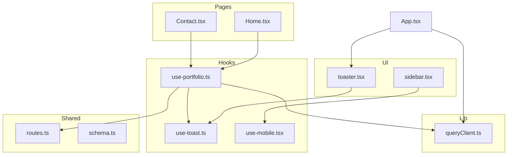
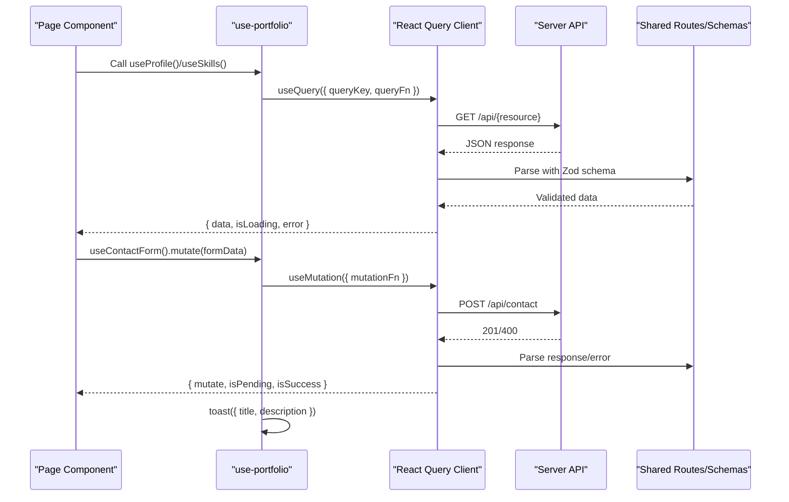
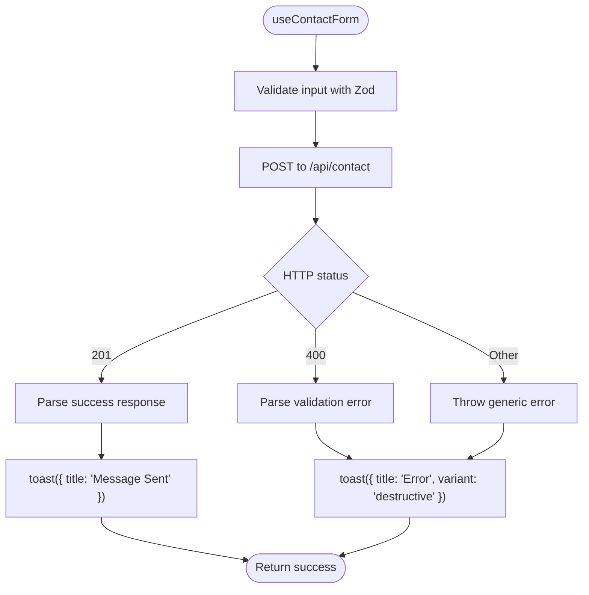
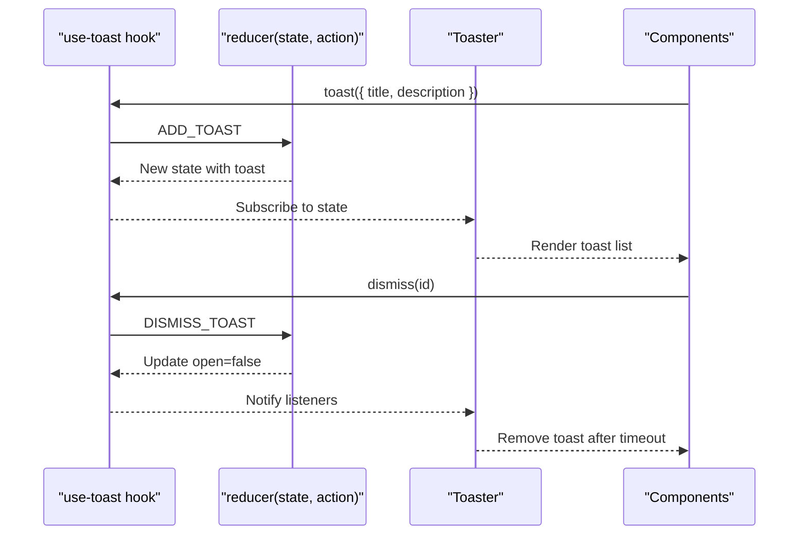
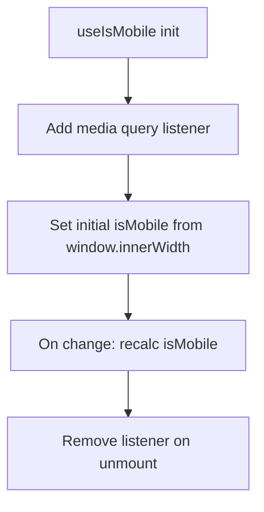
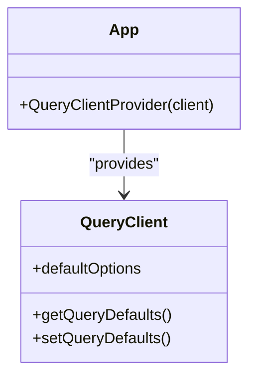
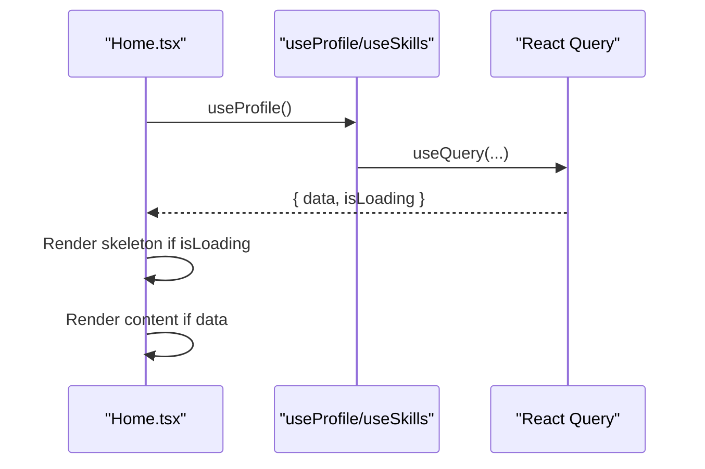
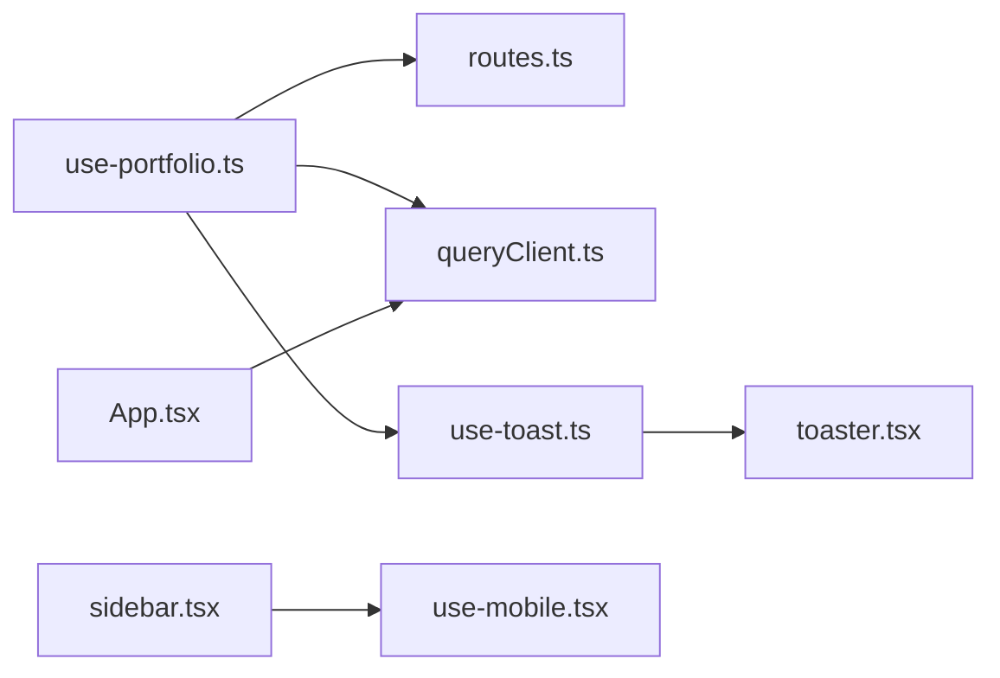

# State Management

<cite>
**Referenced Files in This Document**
- [use-portfolio.ts](file://client/src/hooks/use-portfolio.ts)
- [use-toast.ts](file://client/src/hooks/use-toast.ts)
- [use-mobile.tsx](file://client/src/hooks/use-mobile.tsx)
- [queryClient.ts](file://client/src/lib/queryClient.ts)
- [App.tsx](file://client/src/App.tsx)
- [routes.ts](file://shared/routes.ts)
- [schema.ts](file://shared/schema.ts)
- [Home.tsx](file://client/src/pages/Home.tsx)
- [Contact.tsx](file://client/src/pages/Contact.tsx)
- [toaster.tsx](file://client/src/components/ui/toaster.tsx)
- [sidebar.tsx](file://client/src/components/ui/sidebar.tsx)
</cite>

## Table of Contents
1. [Introduction](#introduction)
2. [Project Structure](#project-structure)
3. [Core Components](#core-components)
4. [Architecture Overview](#architecture-overview)
5. [Detailed Component Analysis](#detailed-component-analysis)
6. [Dependency Analysis](#dependency-analysis)
7. [Performance Considerations](#performance-considerations)
8. [Troubleshooting Guide](#troubleshooting-guide)
9. [Conclusion](#conclusion)
10. [Appendices](#appendices)

## Introduction
This document explains the React Query-based state management system powering the Personal Showcase application. It focuses on three custom hooks—use-portfolio for data fetching, use-toast for notifications, and use-mobile for responsive behavior—and documents the React Query configuration, caching, automatic refetching, error handling, data fetching patterns, mutation handling, optimistic updates, and how these pieces integrate with the overall app architecture.

## Project Structure
The state management stack is organized around:
- Custom hooks under client/src/hooks for domain-specific data and behavior
- A centralized React Query client under client/src/lib
- Shared API route and schema definitions under shared
- UI toast provider under client/src/components/ui
- Pages consuming hooks under client/src/pages

**Diagram sources**
- [App.tsx](file://client/src/App.tsx#L26-L31)
- [queryClient.ts](file://client/src/lib/queryClient.ts#L44-L57)
- [use-portfolio.ts](file://client/src/hooks/use-portfolio.ts#L1-L115)
- [use-toast.ts](file://client/src/hooks/use-toast.ts#L171-L189)
- [use-mobile.tsx](file://client/src/hooks/use-mobile.tsx#L5-L18)
- [routes.ts](file://shared/routes.ts#L32-L99)
- [schema.ts](file://shared/schema.ts#L68-L86)
- [toaster.tsx](file://client/src/components/ui/toaster.tsx#L11-L33)
- [sidebar.tsx](file://client/src/components/ui/sidebar.tsx#L69-L94)
- [Home.tsx](file://client/src/pages/Home.tsx#L1-L154)
- [Contact.tsx](file://client/src/pages/Contact.tsx#L1-L172)

**Section sources**
- [App.tsx](file://client/src/App.tsx#L19-L33)
- [queryClient.ts](file://client/src/lib/queryClient.ts#L1-L58)
- [routes.ts](file://shared/routes.ts#L32-L99)
- [schema.ts](file://shared/schema.ts#L68-L86)

## Core Components
- use-portfolio: Provides React Query-powered getters for profile, education, experience, skills, awards, and publications, plus a mutation for the contact form submission. It validates inputs and parses responses using shared Zod schemas and exposes loading/error states via React Query’s query keys and query functions.
- use-toast: A lightweight toast notification system with a reducer-driven store, queue-based dismissal, and a small limit to avoid toast overload. Exposes a hook to subscribe to state and imperative functions to add/update/dismiss notifications.
- use-mobile: A responsive detection hook that tracks media query changes and window width to determine mobile breakpoints, enabling adaptive UI behavior.

**Section sources**
- [use-portfolio.ts](file://client/src/hooks/use-portfolio.ts#L6-L115)
- [use-toast.ts](file://client/src/hooks/use-toast.ts#L171-L189)
- [use-mobile.tsx](file://client/src/hooks/use-mobile.tsx#L5-L18)

## Architecture Overview
React Query is initialized globally and provided at the root. Hooks encapsulate data fetching and mutations, while shared schemas define API contracts. The toast provider renders notifications, and responsive-aware components use the mobile hook.

**Diagram sources**
- [App.tsx](file://client/src/App.tsx#L26-L31)
- [queryClient.ts](file://client/src/lib/queryClient.ts#L44-L57)
- [use-portfolio.ts](file://client/src/hooks/use-portfolio.ts#L6-L115)
- [routes.ts](file://shared/routes.ts#L32-L99)
- [schema.ts](file://shared/schema.ts#L68-L86)
- [toaster.tsx](file://client/src/components/ui/toaster.tsx#L11-L33)

## Detailed Component Analysis

### use-portfolio: Data Fetching and Mutations
- Queries:
  - useProfile, useEducation, useExperience, useSkills, useAwards, usePublications wrap React Query’s useQuery with explicit query keys derived from shared API paths. Responses are parsed using Zod schemas defined in shared routes.
  - Error handling inside query functions throws when non-OK responses occur, leveraging React Query’s default error propagation.
- Mutation:
  - useContactForm wraps React Query’s useMutation. It validates inputs with Zod, sends a POST request, parses success or validation errors, and triggers toasts for success and error outcomes.

**Diagram sources**
- [use-portfolio.ts](file://client/src/hooks/use-portfolio.ts#L79-L115)
- [routes.ts](file://shared/routes.ts#L88-L98)
- [schema.ts](file://shared/schema.ts#L58-L64)

**Section sources**
- [use-portfolio.ts](file://client/src/hooks/use-portfolio.ts#L6-L115)
- [routes.ts](file://shared/routes.ts#L32-L99)
- [schema.ts](file://shared/schema.ts#L68-L86)

### use-toast: Notification Management
- Store and lifecycle:
  - Maintains an in-memory state with a reducer handling add/update/dismiss/remove actions.
  - Enforces a toast limit and schedules removal after a long timeout to prevent unbounded growth.
- Hook behavior:
  - Subscribes to state changes and exposes imperative functions to add, update, and dismiss notifications.
- Provider:
  - Toaster renders the current toasts and attaches close handlers.

**Diagram sources**
- [use-toast.ts](file://client/src/hooks/use-toast.ts#L74-L127)
- [use-toast.ts](file://client/src/hooks/use-toast.ts#L171-L189)
- [toaster.tsx](file://client/src/components/ui/toaster.tsx#L11-L33)

**Section sources**
- [use-toast.ts](file://client/src/hooks/use-toast.ts#L1-L192)
- [toaster.tsx](file://client/src/components/ui/toaster.tsx#L1-L34)

### use-mobile: Responsive Behavior Detection
- Detects mobile layout via a media query change listener and window width threshold.
- Returns a boolean indicating whether the viewport qualifies as mobile, enabling responsive components to adapt behavior and rendering.

**Diagram sources**
- [use-mobile.tsx](file://client/src/hooks/use-mobile.tsx#L5-L18)

**Section sources**
- [use-mobile.tsx](file://client/src/hooks/use-mobile.tsx#L1-L20)
- [sidebar.tsx](file://client/src/components/ui/sidebar.tsx#L69-L94)

### React Query Configuration and Caching
- Centralized client:
  - A single QueryClient is created with default options disabling automatic refetching and setting infinite stale time to avoid unnecessary network requests.
  - A shared query function enforces credential inclusion and standardized error handling.
- Provider:
  - The QueryClientProvider wraps the app, making cache and scheduling available globally.

**Diagram sources**
- [queryClient.ts](file://client/src/lib/queryClient.ts#L44-L57)
- [App.tsx](file://client/src/App.tsx#L26-L31)

**Section sources**
- [queryClient.ts](file://client/src/lib/queryClient.ts#L1-L58)
- [App.tsx](file://client/src/App.tsx#L19-L33)

### Data Fetching Patterns and Loading States
- Pages consume hooks and rely on React Query’s built-in loading, error, and data states.
- Example usage:
  - Home page reads profile and skills data and displays skeletons while loading.
  - Contact page uses the contact form mutation and disables the submit button during pending state.

**Diagram sources**
- [Home.tsx](file://client/src/pages/Home.tsx#L14-L103)
- [use-portfolio.ts](file://client/src/hooks/use-portfolio.ts#L6-L52)

**Section sources**
- [Home.tsx](file://client/src/pages/Home.tsx#L14-L154)
- [Contact.tsx](file://client/src/pages/Contact.tsx#L20-L37)

### Mutation Handling and Optimistic Updates
- Current behavior:
  - The contact form mutation performs server-side validation and parsing, then triggers toasts on success or error. There is no optimistic update in the current implementation.
- Recommended pattern:
  - To implement optimistic updates, call mutation.mutate with an updater function that updates the cache immediately, then rollback on error using onSettled or onError callbacks.

[No sources needed since this section provides general guidance]

### API Contracts and Validation
- Shared routes define HTTP methods, paths, input schemas, and response schemas.
- Hooks use these definitions to construct query keys, validate inputs, and parse responses, ensuring type-safe integrations.

**Section sources**
- [routes.ts](file://shared/routes.ts#L32-L99)
- [schema.ts](file://shared/schema.ts#L68-L86)

## Dependency Analysis
- use-portfolio depends on:
  - Shared routes for endpoint definitions and Zod schemas for validation/parsing
  - React Query client for caching and scheduling
  - use-toast for user feedback on mutations
- use-toast is decoupled and only depends on its own reducer/store and the toast UI components.
- use-mobile is standalone and used by responsive-aware components like the sidebar.

**Diagram sources**
- [use-portfolio.ts](file://client/src/hooks/use-portfolio.ts#L1-L3)
- [routes.ts](file://shared/routes.ts#L32-L99)
- [queryClient.ts](file://client/src/lib/queryClient.ts#L1-L58)
- [use-toast.ts](file://client/src/hooks/use-toast.ts#L1-L6)
- [toaster.tsx](file://client/src/components/ui/toaster.tsx#L1-L9)
- [sidebar.tsx](file://client/src/components/ui/sidebar.tsx#L8-L9)
- [use-mobile.tsx](file://client/src/hooks/use-mobile.tsx#L1-L3)
- [App.tsx](file://client/src/App.tsx#L26-L31)

**Section sources**
- [use-portfolio.ts](file://client/src/hooks/use-portfolio.ts#L1-L115)
- [routes.ts](file://shared/routes.ts#L32-L99)
- [queryClient.ts](file://client/src/lib/queryClient.ts#L1-L58)
- [use-toast.ts](file://client/src/hooks/use-toast.ts#L1-L192)
- [toaster.tsx](file://client/src/components/ui/toaster.tsx#L1-L34)
- [sidebar.tsx](file://client/src/components/ui/sidebar.tsx#L69-L94)
- [use-mobile.tsx](file://client/src/hooks/use-mobile.tsx#L1-L20)
- [App.tsx](file://client/src/App.tsx#L19-L33)

## Performance Considerations
- Infinite stale time avoids unnecessary refetches, reducing network usage.
- Disabled automatic refetching prevents redundant background updates.
- Centralized query function ensures consistent error handling and credential management.
- Toast limit prevents UI thrashing from excessive notifications.

[No sources needed since this section provides general guidance]

## Troubleshooting Guide
- Network errors:
  - Non-OK responses trigger errors in query functions. Inspect thrown errors and surface user-friendly messages via toasts.
- Validation errors:
  - Contact form mutation parses 400 responses using shared validation schemas. Ensure the UI displays field-specific messages when available.
- Toast not appearing:
  - Confirm the Toaster component is rendered and the useToast hook is called within the provider context.
- Mobile behavior:
  - Verify the media query listener is attached and window width thresholds match expectations.

**Section sources**
- [use-portfolio.ts](file://client/src/hooks/use-portfolio.ts#L10-L15)
- [use-portfolio.ts](file://client/src/hooks/use-portfolio.ts#L91-L97)
- [toaster.tsx](file://client/src/components/ui/toaster.tsx#L11-L33)
- [use-mobile.tsx](file://client/src/hooks/use-mobile.tsx#L8-L16)

## Conclusion
The state management system leverages React Query for robust caching and data fetching, Zod schemas for strict API contracts, and a minimal toast store for user feedback. The hooks encapsulate domain logic, while responsive-aware components use a dedicated mobile detection hook. Together, these patterns deliver predictable, maintainable state handling across the application.

## Appendices

### Implementing a New Hook
- Steps:
  - Define endpoint metadata and Zod schemas in shared routes and schema files.
  - Create a new hook using useQuery/useMutation with a stable queryKey and a queryFn/mutationFn that:
    - Uses fetch with credentials if needed
    - Throws on non-OK responses
    - Parses responses with Zod schemas
  - Consume the hook in pages and render loading/error states appropriately.
  - For mutations, trigger toasts in onSuccess/onError.

**Section sources**
- [routes.ts](file://shared/routes.ts#L32-L99)
- [schema.ts](file://shared/schema.ts#L68-L86)
- [queryClient.ts](file://client/src/lib/queryClient.ts#L10-L42)
- [use-portfolio.ts](file://client/src/hooks/use-portfolio.ts#L6-L115)

### Managing Loading States
- Use the returned isLoading and data properties from hooks to conditionally render skeletons or empty states.
- Combine with motion libraries or UI skeletons for smooth transitions.

**Section sources**
- [Home.tsx](file://client/src/pages/Home.tsx#L14-L103)

### Handling API Responses
- Parse success responses with Zod schemas defined in shared routes.
- Surface validation errors to users via toasts with appropriate severity.

**Section sources**
- [use-portfolio.ts](file://client/src/hooks/use-portfolio.ts#L10-L15)
- [use-portfolio.ts](file://client/src/hooks/use-portfolio.ts#L91-L99)