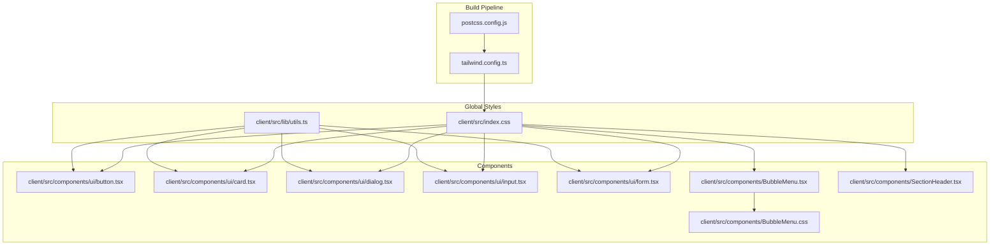
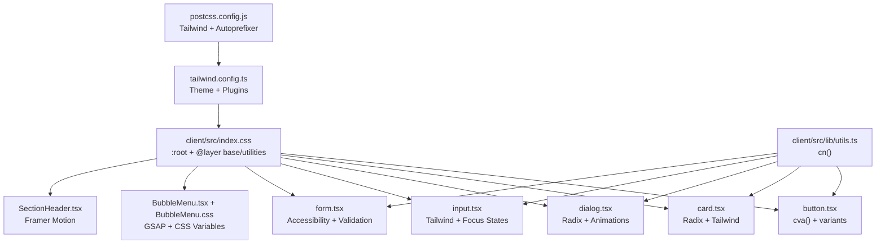
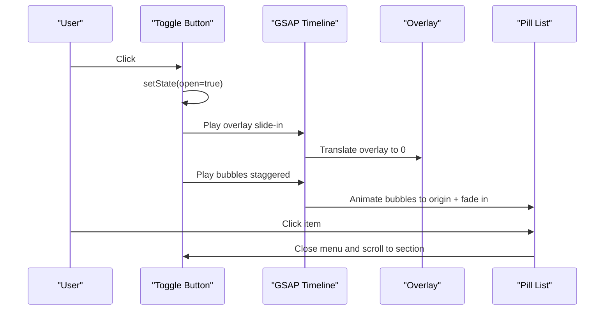
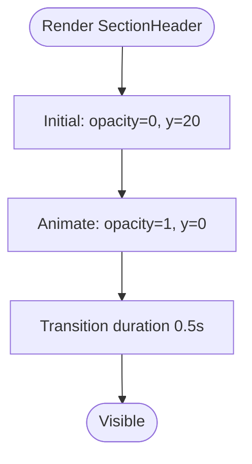
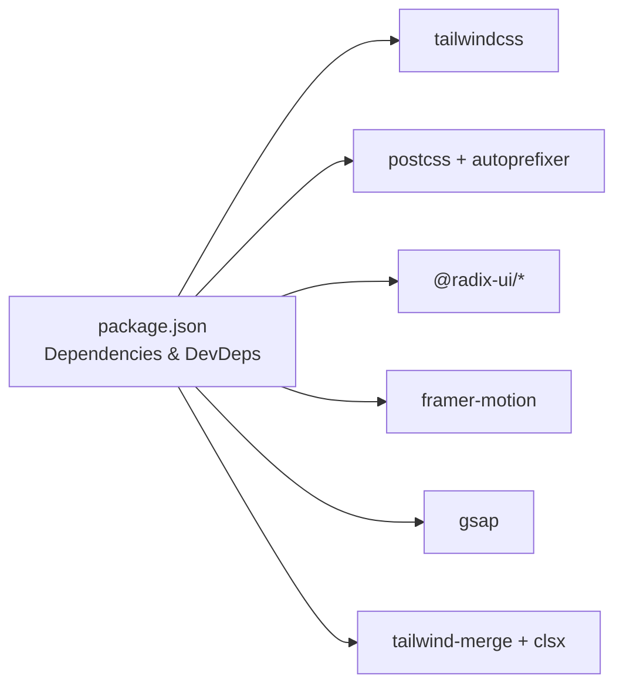

# Styling and Theming

<cite>
**Referenced Files in This Document**
- [tailwind.config.ts](file://tailwind.config.ts)
- [postcss.config.js](file://postcss.config.js)
- [index.css](file://client/src/index.css)
- [components.json](file://components.json)
- [utils.ts](file://client/src/lib/utils.ts)
- [BubbleMenu.tsx](file://client/src/components/BubbleMenu.tsx)
- [BubbleMenu.css](file://client/src/components/BubbleMenu.css)
- [SectionHeader.tsx](file://client/src/components/SectionHeader.tsx)
- [button.tsx](file://client/src/components/ui/button.tsx)
- [card.tsx](file://client/src/components/ui/card.tsx)
- [dialog.tsx](file://client/src/components/ui/dialog.tsx)
- [input.tsx](file://client/src/components/ui/input.tsx)
- [form.tsx](file://client/src/components/ui/form.tsx)
- [main.tsx](file://client/src/main.tsx)
- [package.json](file://package.json)
</cite>

## Table of Contents
1. [Introduction](#introduction)
2. [Project Structure](#project-structure)
3. [Core Components](#core-components)
4. [Architecture Overview](#architecture-overview)
5. [Detailed Component Analysis](#detailed-component-analysis)
6. [Dependency Analysis](#dependency-analysis)
7. [Performance Considerations](#performance-considerations)
8. [Troubleshooting Guide](#troubleshooting-guide)
9. [Conclusion](#conclusion)
10. [Appendices](#appendices)

## Introduction
This document describes the Tailwind CSS-based styling and theming system used in the project. It covers the Tailwind configuration, custom theme definitions, color schemes, typography, and responsive design. It also explains the utility-first approach, component-specific styling patterns, and how animations are integrated using Framer Motion and GSAP. Finally, it documents the BubbleMenu styling, SectionHeader customization, Radix UI integration, and guidelines for extending the design system while maintaining consistency.

## Project Structure
The styling system is organized around:
- Tailwind configuration and PostCSS pipeline
- Global CSS variables and base styles
- Utility-first components built with shadcn/ui and Radix UI primitives
- Animation libraries for micro-interactions and page transitions
- Specialized components like BubbleMenu and SectionHeader

**Diagram sources**
- [postcss.config.js](file://postcss.config.js#L1-L7)
- [tailwind.config.ts](file://tailwind.config.ts#L1-L108)
- [index.css](file://client/src/index.css#L1-L150)
- [utils.ts](file://client/src/lib/utils.ts#L1-L7)
- [button.tsx](file://client/src/components/ui/button.tsx#L1-L63)
- [card.tsx](file://client/src/components/ui/card.tsx#L1-L86)
- [dialog.tsx](file://client/src/components/ui/dialog.tsx#L1-L123)
- [input.tsx](file://client/src/components/ui/input.tsx#L1-L24)
- [form.tsx](file://client/src/components/ui/form.tsx#L1-L179)
- [BubbleMenu.tsx](file://client/src/components/BubbleMenu.tsx#L1-L258)
- [BubbleMenu.css](file://client/src/components/BubbleMenu.css#L1-L267)
- [SectionHeader.tsx](file://client/src/components/SectionHeader.tsx#L1-L30)

**Section sources**
- [postcss.config.js](file://postcss.config.js#L1-L7)
- [tailwind.config.ts](file://tailwind.config.ts#L1-L108)
- [index.css](file://client/src/index.css#L1-L150)
- [utils.ts](file://client/src/lib/utils.ts#L1-L7)

## Core Components
This section outlines the foundational styling elements and how they are composed.

- Tailwind configuration and dark mode
  - Dark mode is controlled via a class strategy and scans templates for class usage.
  - Theme extensions include custom border radii, color palette using CSS variables, fonts, keyframes, and animations.
  - Plugins include tailwindcss-animate and @tailwindcss/typography.

- Global CSS variables and base styles
  - CSS variables define the design tokens for primary, secondary, background, foreground, muted, accent, cards, borders, input, ring, and font families.
  - Base layer applies border utilities globally and sets body and heading styles using CSS variables.
  - Layer utilities define reusable patterns like glass panels, hover effects, section reveal, gradient backgrounds per section, GPU acceleration helpers, and a custom scrollbar.

- Utility merging helper
  - A centralized cn function merges Tailwind classes safely, resolving conflicts and deduplicating values.

- Radix UI integration
  - Components use Radix UI primitives with Tailwind classes for styling, ensuring accessibility and consistent animations.

**Section sources**
- [tailwind.config.ts](file://tailwind.config.ts#L3-L108)
- [index.css](file://client/src/index.css#L11-L124)
- [index.css](file://client/src/index.css#L126-L150)
- [utils.ts](file://client/src/lib/utils.ts#L4-L6)
- [dialog.tsx](file://client/src/components/ui/dialog.tsx#L17-L53)

## Architecture Overview
The styling architecture follows a layered approach:
- Build pipeline: PostCSS compiles Tailwind directives and autoprefixes output.
- Theme layer: Tailwind config defines colors, spacing, typography, and animations.
- Global layer: CSS variables and base utilities establish consistent defaults.
- Component layer: Reusable UI components combine Radix primitives with Tailwind utilities and CSS variables.
- Animation layer: Framer Motion and GSAP provide micro-interactions and page transitions.

**Diagram sources**
- [postcss.config.js](file://postcss.config.js#L1-L7)
- [tailwind.config.ts](file://tailwind.config.ts#L1-L108)
- [index.css](file://client/src/index.css#L1-L150)
- [utils.ts](file://client/src/lib/utils.ts#L1-L7)
- [button.tsx](file://client/src/components/ui/button.tsx#L7-L40)
- [card.tsx](file://client/src/components/ui/card.tsx#L5-L17)
- [dialog.tsx](file://client/src/components/ui/dialog.tsx#L17-L53)
- [input.tsx](file://client/src/components/ui/input.tsx#L5-L18)
- [form.tsx](file://client/src/components/ui/form.tsx#L75-L86)
- [BubbleMenu.tsx](file://client/src/components/BubbleMenu.tsx#L1-L258)
- [BubbleMenu.css](file://client/src/components/BubbleMenu.css#L1-L267)
- [SectionHeader.tsx](file://client/src/components/SectionHeader.tsx#L1-L30)

## Detailed Component Analysis

### Tailwind Configuration and Theme
- Dark mode strategy: class-based, enabling seamless light/dark switching.
- Content scanning: targets HTML and TypeScript/TSX files under the client directory.
- Theme extensions:
  - Border radius: custom sizes for lg, md, sm.
  - Color system: semantic tokens mapped to CSS variables for dynamic themes and per-component overrides.
  - Typography: font families bound to CSS variables for consistent type scale.
  - Animations: Radix Accordion keyframes and aliases for smooth transitions.
- Plugins: tailwindcss-animate for enhanced animation utilities; @tailwindcss/typography for prose styles.

**Section sources**
- [tailwind.config.ts](file://tailwind.config.ts#L3-L108)

### Global CSS Variables and Utilities
- Design tokens: primary, secondary, background/foreground, muted/accent, card, border, input, ring, and font families.
- Base layer: global border application and body/heading styles using CSS variables.
- Utilities layer: reusable patterns for glass panels, hover card effects, section reveal, gradient backgrounds per section, GPU acceleration, and a custom scrollbar.

**Section sources**
- [index.css](file://client/src/index.css#L11-L61)
- [index.css](file://client/src/index.css#L63-L124)
- [index.css](file://client/src/index.css#L126-L150)

### Utility Merging Helper
- cn merges Tailwind classes with clsx and twMerge to avoid duplicates and resolve conflicts.

**Section sources**
- [utils.ts](file://client/src/lib/utils.ts#L4-L6)

### Button Component (shadcn/ui + Variants)
- Uses class-variance-authority to define variants and sizes with consistent spacing and focus states.
- Integrates with Tailwind’s color system via CSS variables for primary/secondary/destructive/outline/ghost variants.
- Supports asChild pattern via Radix Slot for composition.

**Section sources**
- [button.tsx](file://client/src/components/ui/button.tsx#L7-L40)
- [button.tsx](file://client/src/components/ui/button.tsx#L48-L62)

### Card Component (shadcn/ui)
- Provides structured sections with header/title/description/content/footer slots.
- Uses CSS variables for card background, border, and foreground.

**Section sources**
- [card.tsx](file://client/src/components/ui/card.tsx#L5-L17)
- [card.tsx](file://client/src/components/ui/card.tsx#L20-L31)
- [card.tsx](file://client/src/components/ui/card.tsx#L32-L58)
- [card.tsx](file://client/src/components/ui/card.tsx#L59-L77)

### Dialog Component (Radix UI + Tailwind)
- Implements portal overlay and animated content transitions.
- Uses Tailwind utilities for positioning, shadows, and responsive adjustments.
- Integrates close button with icon and accessibility attributes.

**Section sources**
- [dialog.tsx](file://client/src/components/ui/dialog.tsx#L17-L53)
- [dialog.tsx](file://client/src/components/ui/dialog.tsx#L84-L109)

### Input Component (Radix UI + Tailwind)
- Matches button heights for consistent layouts.
- Focus states include ring and offset behavior for accessibility.

**Section sources**
- [input.tsx](file://client/src/components/ui/input.tsx#L5-L18)

### Form Component (Radix UI + react-hook-form)
- Provides context for labels, controls, descriptions, and messages.
- Applies error styling dynamically and manages ARIA attributes for accessibility.

**Section sources**
- [form.tsx](file://client/src/components/ui/form.tsx#L75-L86)
- [form.tsx](file://client/src/components/ui/form.tsx#L89-L104)
- [form.tsx](file://client/src/components/ui/form.tsx#L106-L126)
- [form.tsx](file://client/src/components/ui/form.tsx#L128-L143)
- [form.tsx](file://client/src/components/ui/form.tsx#L145-L167)

### BubbleMenu Styling and Behavior
- CSS-driven layout with CSS variables for bubble sizing and content.
- Responsive sizing and hover interactions with GPU acceleration.
- Overlay and pill list slide-in/out using transforms and backdrop blur.
- JavaScript-driven open/close animations powered by GSAP for overlay and bubbles.
- Accessibility: ARIA roles and labels for menu and items; keyboard-friendly interactions.

**Diagram sources**
- [BubbleMenu.tsx](file://client/src/components/BubbleMenu.tsx#L105-L176)
- [BubbleMenu.css](file://client/src/components/BubbleMenu.css#L141-L176)

**Section sources**
- [BubbleMenu.tsx](file://client/src/components/BubbleMenu.tsx#L1-L258)
- [BubbleMenu.css](file://client/src/components/BubbleMenu.css#L1-L267)

### SectionHeader Animation with Framer Motion
- Uses Framer Motion to animate section headings on mount.
- Smooth initial opacity and y-axis transitions with a defined duration.

**Diagram sources**
- [SectionHeader.tsx](file://client/src/components/SectionHeader.tsx#L12-L16)

**Section sources**
- [SectionHeader.tsx](file://client/src/components/SectionHeader.tsx#L1-L30)

### Radix UI Integration Patterns
- Components consistently use Radix UI primitives with Tailwind classes for styling and animations.
- Focus states, transitions, and portal rendering ensure accessible and performant UI.

**Section sources**
- [dialog.tsx](file://client/src/components/ui/dialog.tsx#L17-L53)
- [button.tsx](file://client/src/components/ui/button.tsx#L48-L62)
- [card.tsx](file://client/src/components/ui/card.tsx#L5-L17)

## Dependency Analysis
The styling system relies on:
- Tailwind CSS for utility generation and theme composition
- PostCSS for compilation and autoprefixing
- CSS variables for dynamic theming
- Radix UI for accessible primitives
- Framer Motion for page-level animations
- GSAP for precise micro-interactions

**Diagram sources**
- [package.json](file://package.json#L13-L78)
- [package.json](file://package.json#L79-L104)

**Section sources**
- [package.json](file://package.json#L13-L114)

## Performance Considerations
- GPU acceleration: utilities like will-change-transform and translateZ(0) improve animation performance.
- Will-change utilities: selectively apply will-change for opacity and transforms to reduce layout thrashing.
- CSS variables: centralize design tokens to minimize repaints during theme switches.
- Utility-first approach: avoid runtime style computations by composing classes at build time.
- Animation libraries: use Framer Motion for declarative page transitions and GSAP for fine-grained micro-interactions.

[No sources needed since this section provides general guidance]

## Troubleshooting Guide
- Tailwind classes not applying
  - Verify Tailwind directives are present in the global CSS and PostCSS is configured.
  - Ensure content paths in the Tailwind config include the relevant source files.

- Dark mode not toggling
  - Confirm the darkMode strategy is set to class and that the class is applied to the root element.

- CSS variable overrides not taking effect
  - Check that component classes reference the correct CSS variables and that :root variables are defined.

- Animations not smooth
  - Apply GPU acceleration utilities and avoid animating layout-affecting properties.

- BubbleMenu not animating
  - Ensure GSAP is imported and timelines are initialized on open state changes.

**Section sources**
- [tailwind.config.ts](file://tailwind.config.ts#L3-L5)
- [index.css](file://client/src/index.css#L11-L46)
- [BubbleMenu.tsx](file://client/src/components/BubbleMenu.tsx#L129-L176)

## Conclusion
The project employs a robust, utility-first styling system centered on Tailwind CSS, CSS variables, and Radix UI primitives. It integrates Framer Motion and GSAP for polished animations, enforces consistency through component variants and shared utilities, and supports theme customization via CSS variables. The BubbleMenu and SectionHeader exemplify how animations and interactivity are layered atop the design system. Following the extension guidelines below will help maintain consistency as the system evolves.

[No sources needed since this section summarizes without analyzing specific files]

## Appendices

### Tailwind Configuration Reference
- Dark mode: class-based
- Content scanning: HTML and TS/TSX under client
- Theme extensions: border radii, colors via CSS variables, fonts, keyframes, animations
- Plugins: tailwindcss-animate, @tailwindcss/typography

**Section sources**
- [tailwind.config.ts](file://tailwind.config.ts#L3-L108)

### Global CSS Variables Reference
- Semantic tokens: background, foreground, border, input, ring
- Component tokens: card, popover, primary, secondary, muted, accent, destructive, chart, sidebar
- Font families: sans, serif, mono
- UI tokens: radius, gradients per section

**Section sources**
- [index.css](file://client/src/index.css#L11-L46)

### Utility Classes Reference
- Glass panel: translucent backdrop blur with border
- Hover card effect: transition and elevation on hover
- Section reveal: opacity and translateY animation
- Gradient utilities: per-section backgrounds
- GPU acceleration: will-change and transform optimizations

**Section sources**
- [index.css](file://client/src/index.css#L63-L124)

### Component Styling Patterns
- Buttons: variants and sizes via class-variance-authority; integrate with CSS variables
- Cards: structured slots with Tailwind classes and CSS variables
- Dialogs: portal overlays with Radix animations and Tailwind transitions
- Inputs: consistent height and focus states with ring offsets
- Forms: accessibility-aware labels, controls, and validation messaging

**Section sources**
- [button.tsx](file://client/src/components/ui/button.tsx#L7-L40)
- [card.tsx](file://client/src/components/ui/card.tsx#L5-L17)
- [dialog.tsx](file://client/src/components/ui/dialog.tsx#L17-L53)
- [input.tsx](file://client/src/components/ui/input.tsx#L5-L18)
- [form.tsx](file://client/src/components/ui/form.tsx#L75-L86)

### Extending the Design System
- Add new tokens to :root in the global CSS
- Extend Tailwind colors and utilities in the Tailwind config
- Define new component variants using class-variance-authority
- Introduce new animations via keyframes and animation aliases
- Keep animations performant by leveraging GPU acceleration utilities
- Maintain accessibility by preserving ARIA attributes and keyboard navigation

**Section sources**
- [index.css](file://client/src/index.css#L11-L46)
- [tailwind.config.ts](file://tailwind.config.ts#L6-L104)
- [button.tsx](file://client/src/components/ui/button.tsx#L7-L40)