# UI Component Library

<cite>
**Referenced Files in This Document**
- [button.tsx](file://client/src/components/ui/button.tsx)
- [card.tsx](file://client/src/components/ui/card.tsx)
- [input.tsx](file://client/src/components/ui/input.tsx)
- [dialog.tsx](file://client/src/components/ui/dialog.tsx)
- [drawer.tsx](file://client/src/components/ui/drawer.tsx)
- [form.tsx](file://client/src/components/ui/form.tsx)
- [select.tsx](file://client/src/components/ui/select.tsx)
- [tabs.tsx](file://client/src/components/ui/tabs.tsx)
- [badge.tsx](file://client/src/components/ui/badge.tsx)
- [avatar.tsx](file://client/src/components/ui/avatar.tsx)
- [table.tsx](file://client/src/components/ui/table.tsx)
- [textarea.tsx](file://client/src/components/ui/textarea.tsx)
- [checkbox.tsx](file://client/src/components/ui/checkbox.tsx)
- [switch.tsx](file://client/src/components/ui/switch.tsx)
- [utils.ts](file://client/src/lib/utils.ts)
</cite>

## Table of Contents
1. [Introduction](#introduction)
2. [Project Structure](#project-structure)
3. [Core Components](#core-components)
4. [Architecture Overview](#architecture-overview)
5. [Detailed Component Analysis](#detailed-component-analysis)
6. [Dependency Analysis](#dependency-analysis)
7. [Performance Considerations](#performance-considerations)
8. [Troubleshooting Guide](#troubleshooting-guide)
9. [Conclusion](#conclusion)
10. [Appendices](#appendices)

## Introduction
This document describes the UI component library built on Radix UI primitives and styled with Tailwind CSS. It covers the component architecture, prop interfaces, styling patterns, accessibility features, and composition guidelines. The library emphasizes consistent spacing, typography, and interaction states while leveraging Radix UI’s accessibility-first APIs and Tailwind utility classes for themeable, composable components.

## Project Structure
The UI components live under client/src/components/ui and are grouped by function and primitive. Each component wraps a Radix UI primitive or native element, adds consistent styling via Tailwind utilities, and exposes a small, focused set of props. Shared utilities are centralized in client/src/lib/utils.ts.

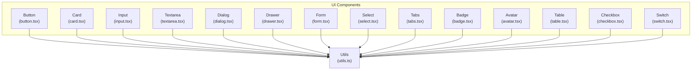

**Diagram sources**
- [button.tsx](file://client/src/components/ui/button.tsx#L1-L63)
- [card.tsx](file://client/src/components/ui/card.tsx#L1-L86)
- [input.tsx](file://client/src/components/ui/input.tsx#L1-L24)
- [textarea.tsx](file://client/src/components/ui/textarea.tsx#L1-L23)
- [dialog.tsx](file://client/src/components/ui/dialog.tsx#L1-L123)
- [drawer.tsx](file://client/src/components/ui/drawer.tsx#L1-L119)
- [form.tsx](file://client/src/components/ui/form.tsx#L1-L179)
- [select.tsx](file://client/src/components/ui/select.tsx#L1-L161)
- [tabs.tsx](file://client/src/components/ui/tabs.tsx#L1-L54)
- [badge.tsx](file://client/src/components/ui/badge.tsx#L1-L39)
- [avatar.tsx](file://client/src/components/ui/avatar.tsx#L1-L52)
- [table.tsx](file://client/src/components/ui/table.tsx#L1-L118)
- [checkbox.tsx](file://client/src/components/ui/checkbox.tsx#L1-L29)
- [switch.tsx](file://client/src/components/ui/switch.tsx#L1-L28)
- [utils.ts](file://client/src/lib/utils.ts#L1-L7)

**Section sources**
- [button.tsx](file://client/src/components/ui/button.tsx#L1-L63)
- [card.tsx](file://client/src/components/ui/card.tsx#L1-L86)
- [input.tsx](file://client/src/components/ui/input.tsx#L1-L24)
- [dialog.tsx](file://client/src/components/ui/dialog.tsx#L1-L123)
- [drawer.tsx](file://client/src/components/ui/drawer.tsx#L1-L119)
- [form.tsx](file://client/src/components/ui/form.tsx#L1-L179)
- [select.tsx](file://client/src/components/ui/select.tsx#L1-L161)
- [tabs.tsx](file://client/src/components/ui/tabs.tsx#L1-L54)
- [badge.tsx](file://client/src/components/ui/badge.tsx#L1-L39)
- [avatar.tsx](file://client/src/components/ui/avatar.tsx#L1-L52)
- [table.tsx](file://client/src/components/ui/table.tsx#L1-L118)
- [textarea.tsx](file://client/src/components/ui/textarea.tsx#L1-L23)
- [checkbox.tsx](file://client/src/components/ui/checkbox.tsx#L1-L29)
- [switch.tsx](file://client/src/components/ui/switch.tsx#L1-L28)
- [utils.ts](file://client/src/lib/utils.ts#L1-L7)

## Core Components
This section summarizes the primary categories of components and their roles in the library.

- Buttons: Variants and sizes with optional slot composition for semantic flexibility.
- Cards: Composite container with header, footer, title, description, and content slots.
- Inputs: Text inputs and textareas with consistent focus states and sizing.
- Forms: A controlled form stack integrating react-hook-form with accessible labels and messages.
- Selection: Select dropdown built on Radix UI with scroll areas, icons, and item indicators.
- Modals: Dialog and Drawer overlays with portals and close controls.
- Navigation: Tabs for switching content panes.
- Decorative: Badge, Avatar, and Table for labeling, identity, and tabular data.
- Controls: Checkbox and Switch for binary selections.

**Section sources**
- [button.tsx](file://client/src/components/ui/button.tsx#L42-L62)
- [card.tsx](file://client/src/components/ui/card.tsx#L5-L85)
- [input.tsx](file://client/src/components/ui/input.tsx#L5-L23)
- [textarea.tsx](file://client/src/components/ui/textarea.tsx#L5-L22)
- [form.tsx](file://client/src/components/ui/form.tsx#L18-L178)
- [select.tsx](file://client/src/components/ui/select.tsx#L9-L160)
- [dialog.tsx](file://client/src/components/ui/dialog.tsx#L9-L122)
- [drawer.tsx](file://client/src/components/ui/drawer.tsx#L8-L118)
- [tabs.tsx](file://client/src/components/ui/tabs.tsx#L6-L53)
- [badge.tsx](file://client/src/components/ui/badge.tsx#L28-L38)
- [avatar.tsx](file://client/src/components/ui/avatar.tsx#L8-L51)
- [table.tsx](file://client/src/components/ui/table.tsx#L5-L117)
- [checkbox.tsx](file://client/src/components/ui/checkbox.tsx#L7-L28)
- [switch.tsx](file://client/src/components/ui/switch.tsx#L6-L27)

## Architecture Overview
The UI library follows a consistent pattern:
- Each component wraps a Radix UI primitive or a native element.
- Styling is applied via Tailwind utility classes merged with a shared cn function.
- Variants and sizes are standardized using class-variance-authority for buttons and badges.
- Composition helpers (asChild via @radix-ui/react-slot) enable semantic markup flexibility.
- Accessibility attributes and keyboard interactions are preserved from Radix UI.

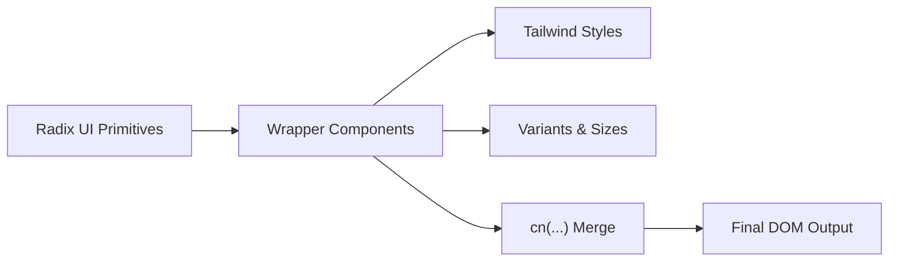

**Diagram sources**
- [button.tsx](file://client/src/components/ui/button.tsx#L7-L40)
- [utils.ts](file://client/src/lib/utils.ts#L4-L6)

**Section sources**
- [button.tsx](file://client/src/components/ui/button.tsx#L1-L63)
- [utils.ts](file://client/src/lib/utils.ts#L1-L7)

## Detailed Component Analysis

### Button
- Purpose: Primary action surfaces with consistent focus, hover, active, and disabled states.
- Props: Inherits base button attributes plus variant and size from class-variance-authority.
- Composition: Supports asChild to render alternative tags while preserving behavior.
- Accessibility: Inherits focus ring and disabled semantics from base button.

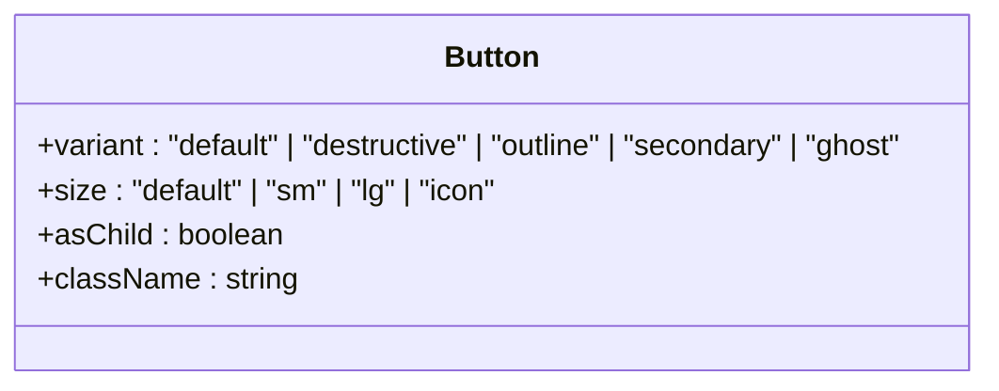

**Diagram sources**
- [button.tsx](file://client/src/components/ui/button.tsx#L42-L62)

**Section sources**
- [button.tsx](file://client/src/components/ui/button.tsx#L7-L62)

### Card
- Purpose: Content containers with header, title, description, content, and footer segments.
- Props: Standard HTML div attributes; composed via forwardRef.
- Styling: Uses card-specific tokens and spacing conventions.

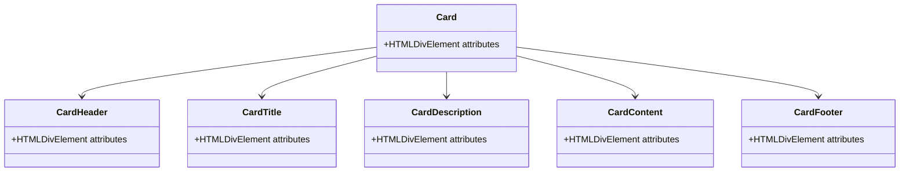

**Diagram sources**
- [card.tsx](file://client/src/components/ui/card.tsx#L5-L85)

**Section sources**
- [card.tsx](file://client/src/components/ui/card.tsx#L1-L86)

### Input and Textarea
- Purpose: Text entry fields with consistent focus states and sizing aligned with buttons.
- Props: Native input/textarea attributes; forwardRef-enabled.
- Styling: Unified ring and focus styles; responsive text sizing.

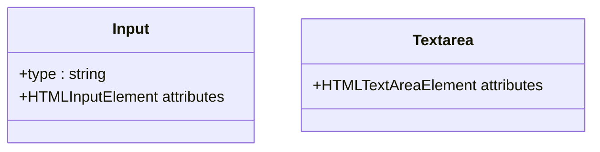

**Diagram sources**
- [input.tsx](file://client/src/components/ui/input.tsx#L5-L23)
- [textarea.tsx](file://client/src/components/ui/textarea.tsx#L5-L22)

**Section sources**
- [input.tsx](file://client/src/components/ui/input.tsx#L1-L24)
- [textarea.tsx](file://client/src/components/ui/textarea.tsx#L1-L23)

### Dialog
- Purpose: Modal overlays with animated transitions and close controls.
- Props: Root, Trigger, Portal, Overlay, Content, Header, Footer, Title, Description.
- Accessibility: Focus trapping, portal rendering, and screen-reader-friendly close label.

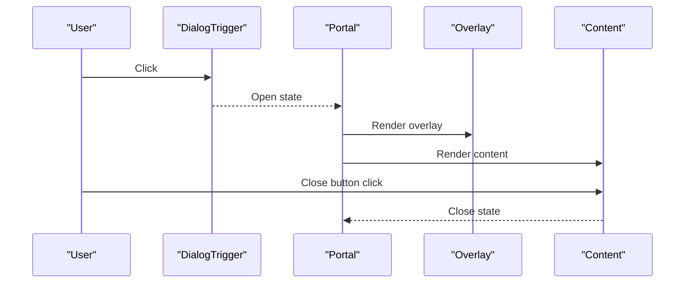

**Diagram sources**
- [dialog.tsx](file://client/src/components/ui/dialog.tsx#L9-L54)

**Section sources**
- [dialog.tsx](file://client/src/components/ui/dialog.tsx#L1-L123)

### Drawer
- Purpose: Mobile-friendly bottom sheet using vaul; similar composition to Dialog.
- Props: Root, Trigger, Portal, Overlay, Content, Header, Footer, Title, Description.

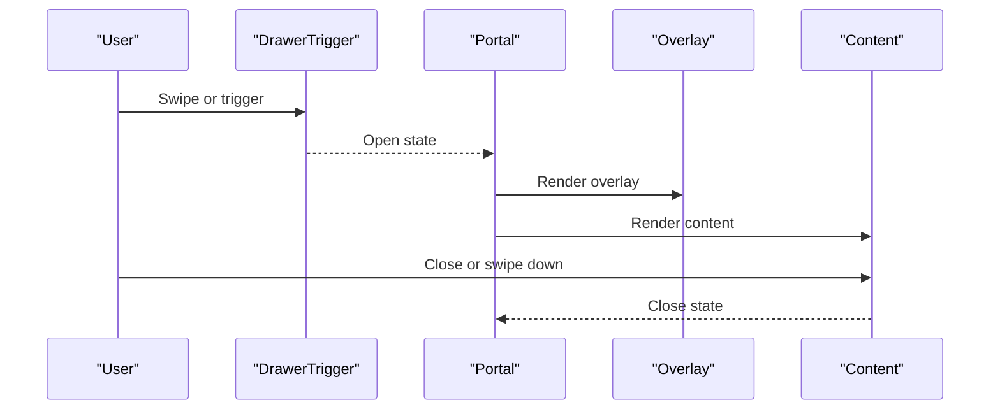

**Diagram sources**
- [drawer.tsx](file://client/src/components/ui/drawer.tsx#L8-L56)

**Section sources**
- [drawer.tsx](file://client/src/components/ui/drawer.tsx#L1-L119)

### Form
- Purpose: Integrates react-hook-form with accessible labels, descriptions, and error messaging.
- Composition: Form, FormField, FormItem, FormLabel, FormControl, FormDescription, FormMessage.
- Hooks: useFormField provides ids and state for accessibility.

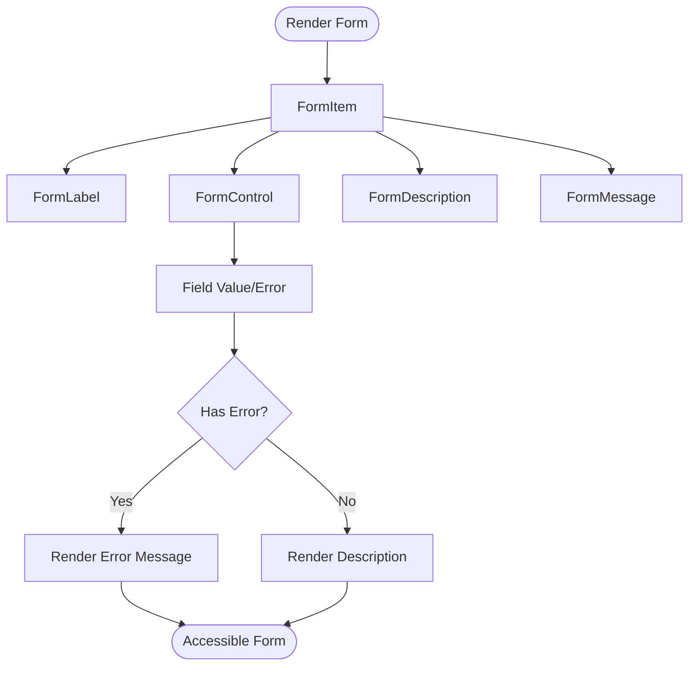

**Diagram sources**
- [form.tsx](file://client/src/components/ui/form.tsx#L18-L178)

**Section sources**
- [form.tsx](file://client/src/components/ui/form.tsx#L1-L179)

### Select
- Purpose: Dropdown selection with scroll areas, icons, and item indicators.
- Props: Root, Group, Value, Trigger, Content, Label, Item, Separator, ScrollUp/Down buttons.
- Behavior: Preserves Radix UI positioning and viewport sizing.

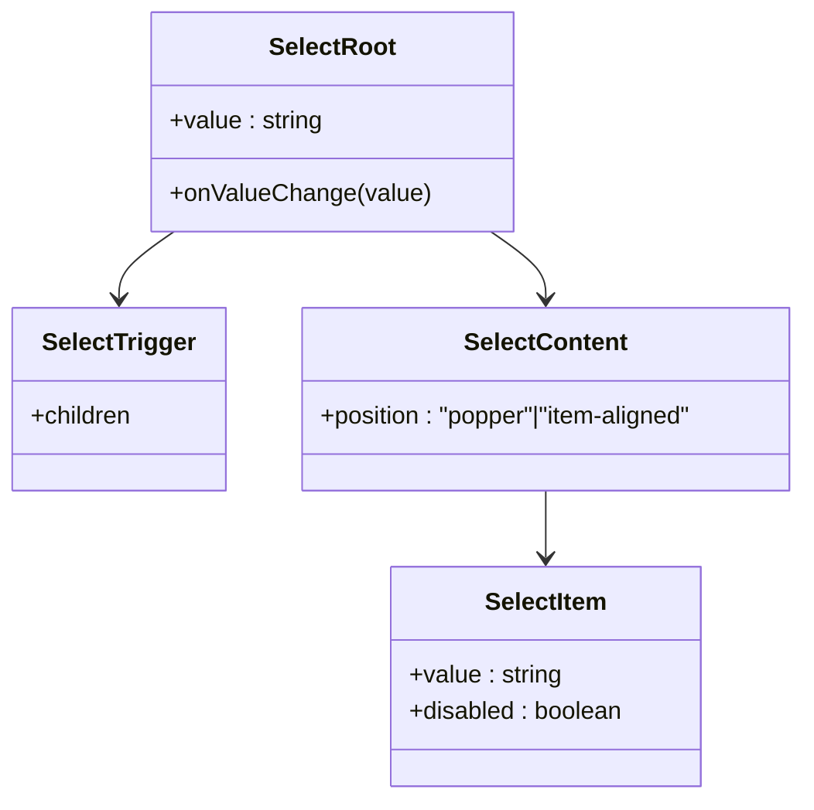

**Diagram sources**
- [select.tsx](file://client/src/components/ui/select.tsx#L9-L160)

**Section sources**
- [select.tsx](file://client/src/components/ui/select.tsx#L1-L161)

### Tabs
- Purpose: Switch between content panels with accessible keyboard navigation.
- Props: Root, List, Trigger, Content.

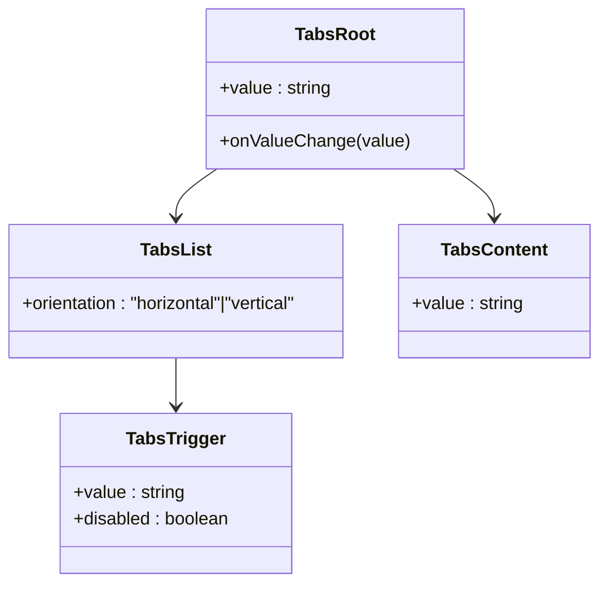

**Diagram sources**
- [tabs.tsx](file://client/src/components/ui/tabs.tsx#L6-L53)

**Section sources**
- [tabs.tsx](file://client/src/components/ui/tabs.tsx#L1-L54)

### Badge
- Purpose: Short labels for categorization or status.
- Props: Inherits base div attributes plus variant from class-variance-authority.

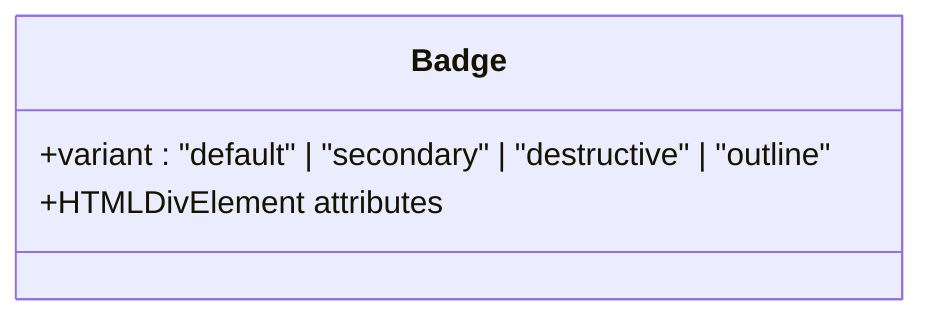

**Diagram sources**
- [badge.tsx](file://client/src/components/ui/badge.tsx#L28-L38)

**Section sources**
- [badge.tsx](file://client/src/components/ui/badge.tsx#L1-L39)

### Avatar
- Purpose: User identity with fallback visuals.
- Props: Root, Image, Fallback.

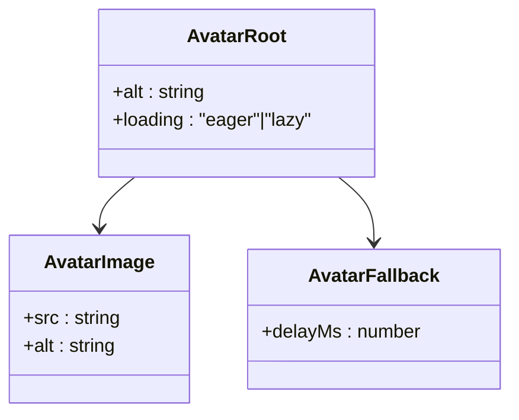

**Diagram sources**
- [avatar.tsx](file://client/src/components/ui/avatar.tsx#L8-L51)

**Section sources**
- [avatar.tsx](file://client/src/components/ui/avatar.tsx#L1-L52)

### Table
- Purpose: Structured data display with responsive wrapper.
- Props: Table, TableHeader, TableBody, TableFooter, TableRow, TableHead, TableCell, TableCaption.

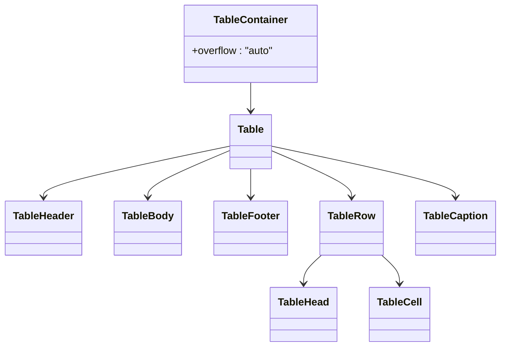

**Diagram sources**
- [table.tsx](file://client/src/components/ui/table.tsx#L5-L117)

**Section sources**
- [table.tsx](file://client/src/components/ui/table.tsx#L1-L118)

### Checkbox and Switch
- Purpose: Binary selection controls with accessible states.
- Props: Root, Indicator/Thumb.

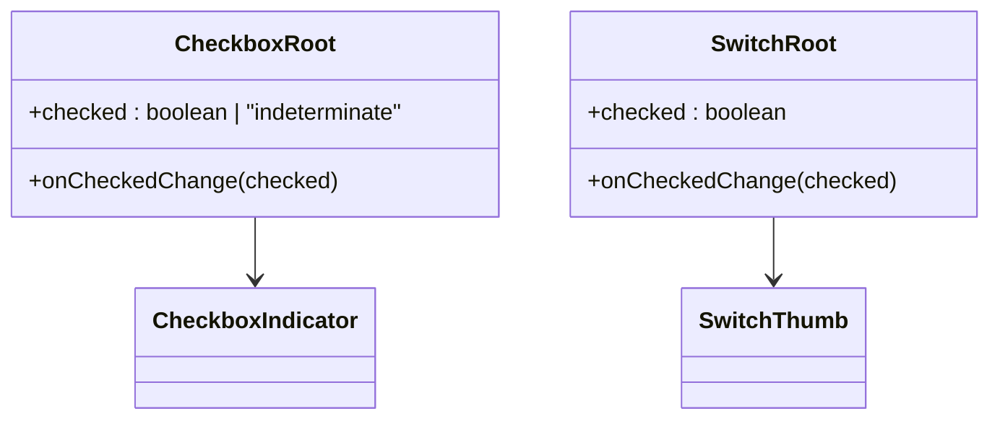

**Diagram sources**
- [checkbox.tsx](file://client/src/components/ui/checkbox.tsx#L7-L28)
- [switch.tsx](file://client/src/components/ui/switch.tsx#L6-L27)

**Section sources**
- [checkbox.tsx](file://client/src/components/ui/checkbox.tsx#L1-L29)
- [switch.tsx](file://client/src/components/ui/switch.tsx#L1-L28)

## Dependency Analysis
- Utility dependency: All components depend on cn(...) from utils.ts for merging Tailwind classes safely.
- Radix UI primitives: Components wrap primitives from @radix-ui/* packages, preserving accessibility and behavior.
- Composition patterns: asChild via @radix-ui/react-slot enables semantic composition (e.g., Button as anchor).
- Variant systems: class-variance-authority powers consistent variants for Button and Badge.

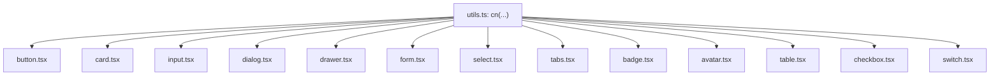

**Diagram sources**
- [utils.ts](file://client/src/lib/utils.ts#L4-L6)
- [button.tsx](file://client/src/components/ui/button.tsx#L5-L5)
- [card.tsx](file://client/src/components/ui/card.tsx#L3-L3)
- [input.tsx](file://client/src/components/ui/input.tsx#L3-L3)
- [dialog.tsx](file://client/src/components/ui/dialog.tsx#L7-L7)
- [drawer.tsx](file://client/src/components/ui/drawer.tsx#L6-L6)
- [form.tsx](file://client/src/components/ui/form.tsx#L15-L16)
- [select.tsx](file://client/src/components/ui/select.tsx#L7-L7)
- [tabs.tsx](file://client/src/components/ui/tabs.tsx#L4-L4)
- [badge.tsx](file://client/src/components/ui/badge.tsx#L4-L4)
- [avatar.tsx](file://client/src/components/ui/avatar.tsx#L6-L6)
- [table.tsx](file://client/src/components/ui/table.tsx#L3-L3)
- [checkbox.tsx](file://client/src/components/ui/checkbox.tsx#L5-L5)
- [switch.tsx](file://client/src/components/ui/switch.tsx#L4-L4)

**Section sources**
- [utils.ts](file://client/src/lib/utils.ts#L1-L7)
- [button.tsx](file://client/src/components/ui/button.tsx#L1-L63)
- [badge.tsx](file://client/src/components/ui/badge.tsx#L1-L39)

## Performance Considerations
- Prefer variant props over dynamic class concatenation to reduce re-renders.
- Use asChild to avoid unnecessary DOM wrappers when composing semantic elements.
- Keep animation-heavy components (Dialog, Drawer) behind portals to minimize layout thrash.
- Memoize heavy form fields or lists within Table to avoid unnecessary recalculation.

## Troubleshooting Guide
- Missing focus rings or disabled states: Verify Tailwind ring and disabled utilities are present on interactive elements.
- Incorrect label association: Ensure FormLabel uses htmlFor bound to the item id from useFormField.
- Select viewport sizing issues: Confirm SelectContent receives proper position and trigger dimensions.
- Drawer background scaling: Ensure shouldScaleBackground is enabled when needed for mobile UX.
- Button layout shifts: Use min-height variants and avoid fixed heights for flexible content.

**Section sources**
- [form.tsx](file://client/src/components/ui/form.tsx#L92-L125)
- [select.tsx](file://client/src/components/ui/select.tsx#L73-L99)
- [drawer.tsx](file://client/src/components/ui/drawer.tsx#L8-L16)
- [button.tsx](file://client/src/components/ui/button.tsx#L28-L33)

## Conclusion
The UI component library leverages Radix UI primitives for robust accessibility, Tailwind for consistent styling, and class-variance-authority for scalable variants. Components are composable, themeable, and designed for predictable behavior across desktop and mobile contexts. Following the patterns outlined here ensures consistency and extensibility across the application.

## Appendices

### Naming Conventions and File Organization
- File names mirror component names (e.g., button.tsx, dialog.tsx).
- Each component exports a default forwardRef component and related subcomponents where applicable.
- Variants and sizes are centralized in component files using class-variance-authority.

**Section sources**
- [button.tsx](file://client/src/components/ui/button.tsx#L1-L63)
- [card.tsx](file://client/src/components/ui/card.tsx#L1-L86)
- [badge.tsx](file://client/src/components/ui/badge.tsx#L1-L39)

### Prop Interfaces Summary
- Base: HTML attributes inherited from underlying elements/primitives.
- Variants: variant and size for Button and Badge.
- Composition: asChild for semantic composition.
- Form: useFormField for accessible integration with react-hook-form.

**Section sources**
- [button.tsx](file://client/src/components/ui/button.tsx#L42-L62)
- [badge.tsx](file://client/src/components/ui/badge.tsx#L28-L38)
- [form.tsx](file://client/src/components/ui/form.tsx#L44-L65)