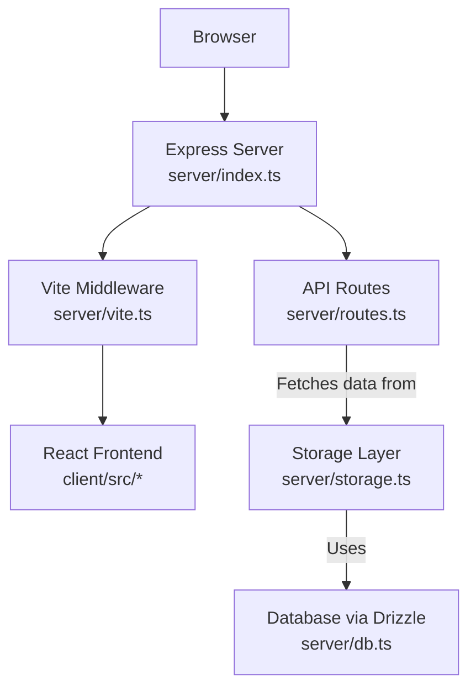
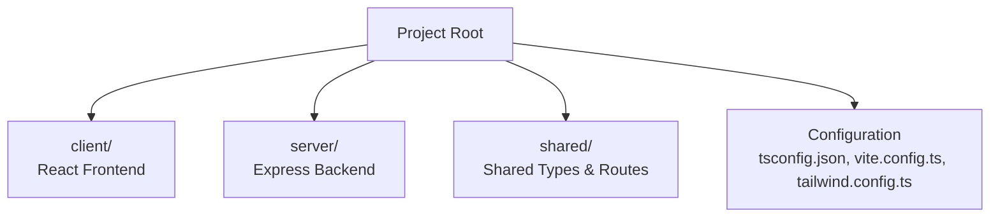
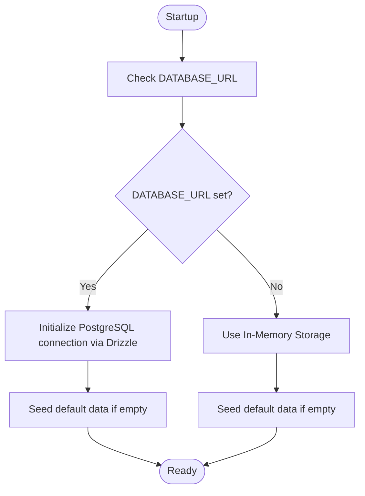

# Getting Started

<cite>
**Referenced Files in This Document**
- [README.md](file://README.md)
- [package.json](file://package.json)
- [server/index.ts](file://server/index.ts)
- [server/vite.ts](file://server/vite.ts)
- [vite.config.ts](file://vite.config.ts)
- [server/routes.ts](file://server/routes.ts)
- [shared/routes.ts](file://shared/routes.ts)
- [server/storage.ts](file://server/storage.ts)
- [server/db.ts](file://server/db.ts)
- [drizzle.config.ts](file://drizzle.config.ts)
- [client/requirements.md](file://client/requirements.md)
- [tsconfig.json](file://tsconfig.json)
- [tailwind.config.ts](file://tailwind.config.ts)
</cite>

## Table of Contents
1. [Introduction](#introduction)
2. [Prerequisites](#prerequisites)
3. [Installation](#installation)
4. [Development Server and Dual-Server Architecture](#development-server-and-dual-server-architecture)
5. [Windows-Specific Considerations](#windows-specific-considerations)
6. [Verification and First-Time Usage](#verification-and-first-time-usage)
7. [Project Structure Overview](#project-structure-overview)
8. [API Reference](#api-reference)
9. [Database Setup](#database-setup)
10. [Troubleshooting](#troubleshooting)

## Introduction
This guide helps you quickly set up and run the Personal Showcase portfolio application locally. It covers prerequisites, installation, running the development server, understanding the dual-server architecture, and verifying your setup. The application is designed for academic and professional showcasing with dynamic content fetched from a backend API.

## Prerequisites
Before you begin, ensure you have the following installed:
- Node.js (v18 or higher recommended; verified on v22.20.0)
- npm (usually comes with Node.js)

These requirements are essential for running the development server and building the application.

**Section sources**
- [README.md](file://README.md#L18-L23)

## Installation
Follow these steps to install and run the application locally:

1. **Clone or Open the Project**
   - Ensure you are in the project root directory where `package.json` is located.

2. **Install Dependencies**
   - Open your terminal (PowerShell or Command Prompt) and run:
     ```
     npm install
     ```

3. **Run the Development Server**
   - Start both the backend API and the frontend development server:
     ```
     npm run dev
     ```

4. **Access the Application**
   - The application will be available at:
     👉 http://localhost:5001

This single-command development setup orchestrates both the backend and frontend servers seamlessly.

**Section sources**
- [README.md](file://README.md#L24-L43)
- [package.json](file://package.json#L6-L12)

## Development Server and Dual-Server Architecture
The application uses a dual-server architecture during development:

- **Backend Server**: An Express server that handles API routes and serves the frontend via Vite middleware.
- **Frontend Development Server**: Vite manages the React frontend with hot module replacement (HMR).

How it works:
- The Express server initializes and registers API routes.
- In development mode, Vite middleware is injected to serve the React application and enable HMR.
- All requests to `/api/*` are handled by the backend routes, while other routes are served by the frontend.



**Diagram sources**
- [server/index.ts](file://server/index.ts#L1-L103)
- [server/vite.ts](file://server/vite.ts#L1-L59)
- [server/routes.ts](file://server/routes.ts#L1-L66)
- [server/storage.ts](file://server/storage.ts#L1-L323)
- [server/db.ts](file://server/db.ts#L1-L12)

Key implementation details:
- The Express server listens on port 5001 by default and binds to all interfaces for development convenience.
- Vite middleware is conditionally enabled in development to serve the React app and handle HMR.
- Static assets are served in production mode; development mode injects Vite middleware.

**Section sources**
- [server/index.ts](file://server/index.ts#L88-L102)
- [server/vite.ts](file://server/vite.ts#L11-L32)
- [vite.config.ts](file://vite.config.ts#L34-L40)

## Windows-Specific Considerations
- Environment Variables: The project uses `cross-env` to ensure environment variables work correctly on Windows.
- Port Configuration: The server runs on `localhost:5001` to avoid common Windows socket permission issues.

These considerations ensure consistent behavior across platforms.

**Section sources**
- [README.md](file://README.md#L53-L57)
- [package.json](file://package.json#L6-L12)
- [server/index.ts](file://server/index.ts#L92-L98)

## Verification and First-Time Usage
To verify your setup is working correctly:

1. **Confirm Development Server Startup**
   - After running `npm run dev`, check the terminal for logs indicating the server is listening on port 5001.

2. **Open the Application**
   - Navigate to http://localhost:5001 in your browser.

3. **Test API Endpoints**
   - The frontend expects to fetch data from the following endpoints:
     - GET `/api/profile`
     - GET `/api/education`
     - GET `/api/experience`
     - GET `/api/skills`
     - GET `/api/awards`
     - GET `/api/publications`
     - POST `/api/contact`
   - These endpoints are registered in the backend routes and backed by the storage layer.

4. **Contact Form Submission**
   - The contact form posts to `/api/contact`. Successful submissions return a 201 status with the created message.

Basic usage examples:
- View profile and academic details by navigating through the frontend sections.
- Submit the contact form to test the backend endpoint; responses are validated using Zod schemas.

**Section sources**
- [client/requirements.md](file://client/requirements.md#L7-L9)
- [server/routes.ts](file://server/routes.ts#L15-L62)
- [shared/routes.ts](file://shared/routes.ts#L32-L99)

## Project Structure Overview
The repository is organized into clear, feature-based directories:

- `/client`: React frontend application with components, pages, hooks, and styles.
- `/server`: Express backend, API routes, storage logic, and Vite integration.
- `/shared`: Shared schemas and route definitions used by both frontend and backend.
- Additional configuration files for TypeScript, Tailwind CSS, Vite, and Drizzle.



**Diagram sources**
- [tsconfig.json](file://tsconfig.json#L1-L24)
- [vite.config.ts](file://vite.config.ts#L1-L41)
- [tailwind.config.ts](file://tailwind.config.ts#L1-L108)

**Section sources**
- [README.md](file://README.md#L58-L64)

## API Reference
The backend exposes the following REST endpoints:

- GET `/api/profile` → Returns profile data
- GET `/api/education` → Returns education list
- GET `/api/experience` → Returns experience list
- GET `/api/skills` → Returns skills list
- GET `/api/awards` → Returns awards list
- GET `/api/publications` → Returns publications list
- POST `/api/contact` → Submits contact form data

Each endpoint response is documented in the shared routes definition, including success and error schemas.

**Section sources**
- [shared/routes.ts](file://shared/routes.ts#L32-L99)
- [server/routes.ts](file://server/routes.ts#L15-L62)

## Database Setup
The application supports both an in-memory storage and a PostgreSQL database:

- Automatic Fallback: If the `DATABASE_URL` environment variable is not set, the application uses in-memory storage and seeds default data on startup.
- Production/PostgreSQL: To use a real database, set the `DATABASE_URL` environment variable (e.g., in a `.env` file) and run `npm run db:push` to apply migrations.



**Diagram sources**
- [server/storage.ts](file://server/storage.ts#L60-L225)
- [server/db.ts](file://server/db.ts#L7-L11)
- [drizzle.config.ts](file://drizzle.config.ts#L3-L5)

Environment variables and scripts:
- `DATABASE_URL`: Connection string for PostgreSQL
- `npm run db:push`: Apply migrations using Drizzle Kit

**Section sources**
- [README.md](file://README.md#L46-L52)
- [server/storage.ts](file://server/storage.ts#L322-L323)
- [drizzle.config.ts](file://drizzle.config.ts#L1-L15)
- [package.json](file://package.json#L11-L11)

## Troubleshooting
Common issues and resolutions:

- Port Conflicts on Windows
  - The server runs on port 5001 to avoid socket permission issues. Ensure nothing else is using this port.
  - Verify the port binding in the server initialization.

- Environment Variables Not Applied on Windows
  - The project uses `cross-env` to ensure environment variables are set correctly on Windows. Confirm your terminal supports environment variable passing.

- Database Connectivity
  - If using PostgreSQL, ensure `DATABASE_URL` is set and accessible. Run `npm run db:push` to initialize the schema.

- Frontend Not Loading in Development
  - Confirm Vite middleware is active in development mode and that the React app is served from the correct root directory.

- API Validation Errors
  - The contact endpoint validates input using Zod. Ensure the submitted data matches the expected schema to avoid 400 errors.

**Section sources**
- [README.md](file://README.md#L53-L57)
- [server/index.ts](file://server/index.ts#L88-L102)
- [server/vite.ts](file://server/vite.ts#L11-L32)
- [server/routes.ts](file://server/routes.ts#L48-L62)
- [drizzle.config.ts](file://drizzle.config.ts#L3-L5)