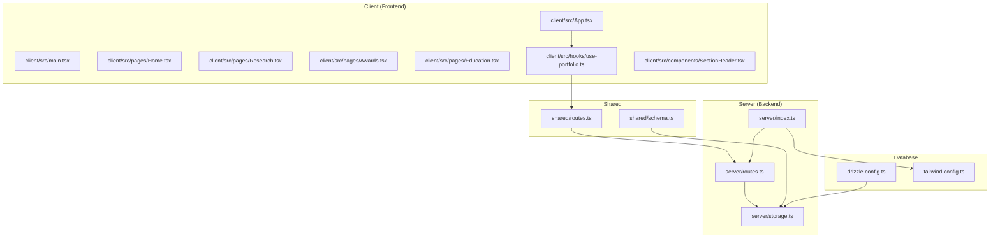
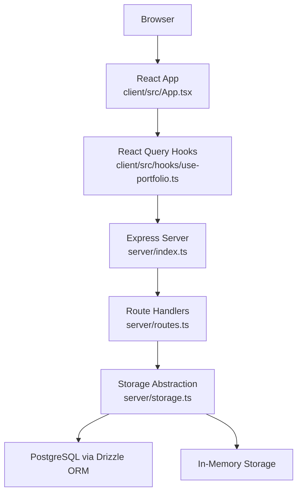
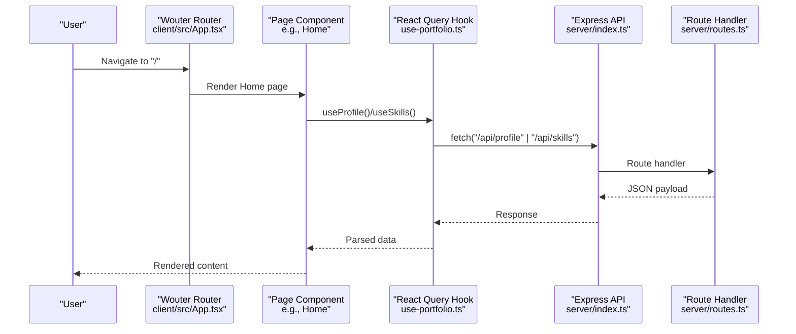
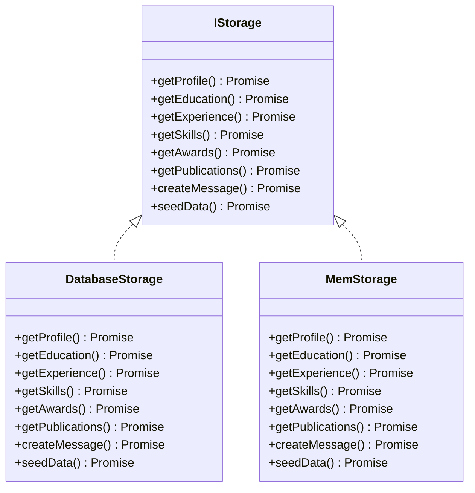
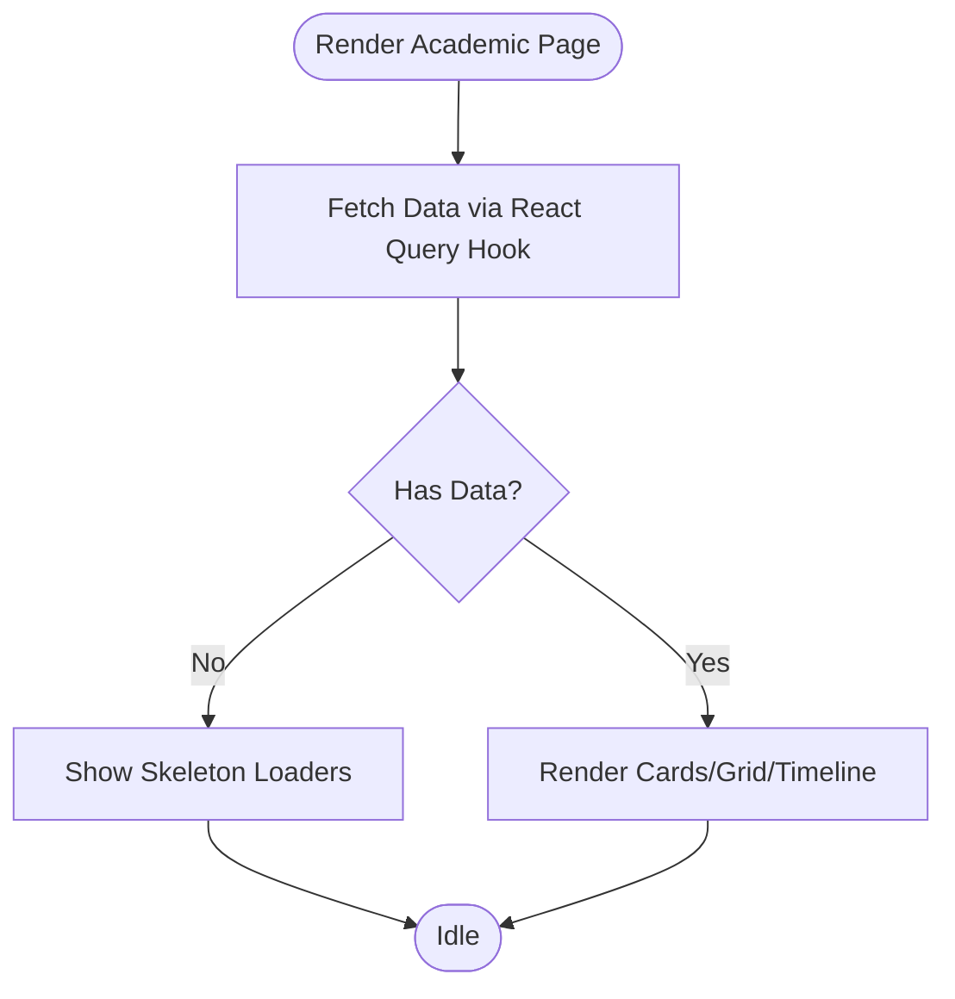
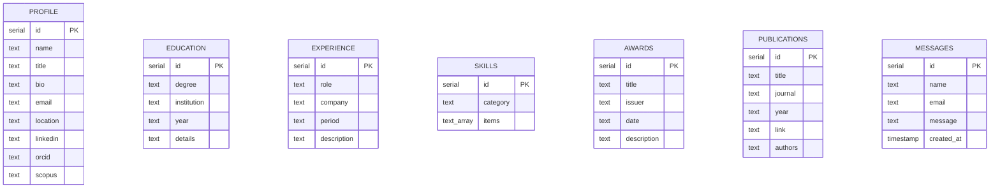
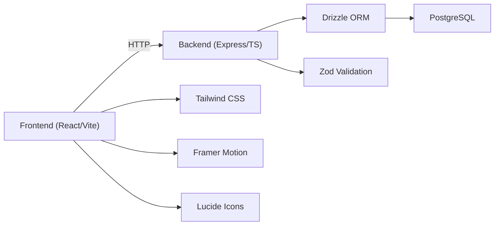

# Project Overview

<cite>
**Referenced Files in This Document**
- [README.md](file://README.md)
- [package.json](file://package.json)
- [drizzle.config.ts](file://drizzle.config.ts)
- [tailwind.config.ts](file://tailwind.config.ts)
- [client/src/App.tsx](file://client/src/App.tsx)
- [client/src/main.tsx](file://client/src/main.tsx)
- [client/src/pages/Home.tsx](file://client/src/pages/Home.tsx)
- [client/src/pages/Research.tsx](file://client/src/pages/Research.tsx)
- [client/src/pages/Awards.tsx](file://client/src/pages/Awards.tsx)
- [client/src/pages/Education.tsx](file://client/src/pages/Education.tsx)
- [client/src/hooks/use-portfolio.ts](file://client/src/hooks/use-portfolio.ts)
- [client/src/components/SectionHeader.tsx](file://client/src/components/SectionHeader.tsx)
- [server/index.ts](file://server/index.ts)
- [server/storage.ts](file://server/storage.ts)
- [server/routes.ts](file://server/routes.ts)
- [shared/schema.ts](file://shared/schema.ts)
- [shared/routes.ts](file://shared/routes.ts)
</cite>

## Table of Contents
1. [Introduction](#introduction)
2. [Project Structure](#project-structure)
3. [Core Components](#core-components)
4. [Architecture Overview](#architecture-overview)
5. [Detailed Component Analysis](#detailed-component-analysis)
6. [Dependency Analysis](#dependency-analysis)
7. [Performance Considerations](#performance-considerations)
8. [Troubleshooting Guide](#troubleshooting-guide)
9. [Conclusion](#conclusion)

## Introduction
This project is a modern, responsive academic and professional portfolio application designed to showcase a professional’s profile with a clean, high-contrast aesthetic that prioritizes readability and professional authority. It provides dedicated academic sections for research, publications, awards, and education, and integrates dynamic content fetched from a backend API. The system supports flexible storage, including PostgreSQL via Drizzle ORM and an automatic in-memory fallback for local development.

Target audience and use cases:
- Academic professionals and researchers seeking a polished digital presence
- Students and early-career scholars to highlight education, research, and achievements
- Anyone needing a fast-loading, accessible, and visually consistent portfolio site

## Project Structure
The repository follows a clear separation of concerns:
- Frontend (React + Vite) under client/
- Backend (Express + TypeScript) under server/
- Shared schema and API route definitions under shared/
- Database configuration and migrations under drizzle.config.ts
- Styling configuration under tailwind.config.ts

**Diagram sources**
- [client/src/App.tsx](file://client/src/App.tsx#L1-L51)
- [client/src/main.tsx](file://client/src/main.tsx#L1-L6)
- [client/src/pages/Home.tsx](file://client/src/pages/Home.tsx#L1-L144)
- [client/src/pages/Research.tsx](file://client/src/pages/Research.tsx#L1-L87)
- [client/src/pages/Awards.tsx](file://client/src/pages/Awards.tsx#L1-L77)
- [client/src/pages/Education.tsx](file://client/src/pages/Education.tsx#L1-L76)
- [client/src/hooks/use-portfolio.ts](file://client/src/hooks/use-portfolio.ts#L1-L115)
- [client/src/components/SectionHeader.tsx](file://client/src/components/SectionHeader.tsx#L1-L30)
- [server/index.ts](file://server/index.ts#L1-L103)
- [server/routes.ts](file://server/routes.ts#L1-L66)
- [server/storage.ts](file://server/storage.ts#L1-L323)
- [shared/schema.ts](file://shared/schema.ts#L1-L86)
- [shared/routes.ts](file://shared/routes.ts#L1-L112)
- [drizzle.config.ts](file://drizzle.config.ts#L1-L15)
- [tailwind.config.ts](file://tailwind.config.ts#L1-L108)

**Section sources**
- [README.md](file://README.md#L58-L63)
- [package.json](file://package.json#L1-L114)

## Core Components
- Frontend routing and layout: Wouter-based routing with a global provider for React Query, tooltips, and toasts.
- Academic-focused pages: Home, Education, Experience, Research, Awards, and Contact.
- Data fetching: TanStack React Query hooks that call shared API endpoints and parse responses with Zod schemas.
- Backend API: Express server exposing GET endpoints for profile, education, experience, skills, awards, publications, and a POST endpoint for contact submissions.
- Storage abstraction: Drizzle ORM-backed PostgreSQL storage with an in-memory fallback when DATABASE_URL is absent.
- Shared contracts: Strongly typed API route definitions and database schemas for consistency across client and server.

Key implementation references:
- Routing and providers: [client/src/App.tsx](file://client/src/App.tsx#L1-L51)
- Frontend entry point: [client/src/main.tsx](file://client/src/main.tsx#L1-L6)
- Academic pages and animations: [client/src/pages/Home.tsx](file://client/src/pages/Home.tsx#L1-L144), [client/src/pages/Research.tsx](file://client/src/pages/Research.tsx#L1-L87), [client/src/pages/Awards.tsx](file://client/src/pages/Awards.tsx#L1-L77), [client/src/pages/Education.tsx](file://client/src/pages/Education.tsx#L1-L76)
- Data hooks and contact form: [client/src/hooks/use-portfolio.ts](file://client/src/hooks/use-portfolio.ts#L1-L115)
- API routes and seeding: [server/routes.ts](file://server/routes.ts#L1-L66)
- Storage implementations: [server/storage.ts](file://server/storage.ts#L1-L323)
- Shared schemas and typed routes: [shared/schema.ts](file://shared/schema.ts#L1-L86), [shared/routes.ts](file://shared/routes.ts#L1-L112)

**Section sources**
- [client/src/App.tsx](file://client/src/App.tsx#L1-L51)
- [client/src/main.tsx](file://client/src/main.tsx#L1-L6)
- [client/src/pages/Home.tsx](file://client/src/pages/Home.tsx#L1-L144)
- [client/src/pages/Research.tsx](file://client/src/pages/Research.tsx#L1-L87)
- [client/src/pages/Awards.tsx](file://client/src/pages/Awards.tsx#L1-L77)
- [client/src/pages/Education.tsx](file://client/src/pages/Education.tsx#L1-L76)
- [client/src/hooks/use-portfolio.ts](file://client/src/hooks/use-portfolio.ts#L1-L115)
- [server/routes.ts](file://server/routes.ts#L1-L66)
- [server/storage.ts](file://server/storage.ts#L1-L323)
- [shared/schema.ts](file://shared/schema.ts#L1-L86)
- [shared/routes.ts](file://shared/routes.ts#L1-L112)

## Architecture Overview
The system uses a thin-client architecture:
- The React frontend consumes a REST-like API exposed by the Express backend.
- The backend reads from a unified storage layer that can target PostgreSQL or an in-memory store.
- Shared schemas and typed API definitions ensure consistency between client and server.

**Diagram sources**
- [client/src/App.tsx](file://client/src/App.tsx#L1-L51)
- [client/src/hooks/use-portfolio.ts](file://client/src/hooks/use-portfolio.ts#L1-L115)
- [server/index.ts](file://server/index.ts#L1-L103)
- [server/routes.ts](file://server/routes.ts#L1-L66)
- [server/storage.ts](file://server/storage.ts#L1-L323)
- [drizzle.config.ts](file://drizzle.config.ts#L1-L15)

## Detailed Component Analysis

### Frontend Application
- Routing and Providers: Wouter router wraps the app with React Query, tooltips, and toast providers. It renders pages for home, education, experience, research, awards, and contact.
- Page Composition: Each page leverages shared UI components and animations (Framer Motion) to present academic content in a readable, high-contrast layout.
- Data Fetching: Hooks encapsulate network requests to shared API endpoints and parse responses using Zod schemas defined in shared routes.

**Diagram sources**
- [client/src/App.tsx](file://client/src/App.tsx#L1-L51)
- [client/src/pages/Home.tsx](file://client/src/pages/Home.tsx#L1-L144)
- [client/src/hooks/use-portfolio.ts](file://client/src/hooks/use-portfolio.ts#L1-L115)
- [server/index.ts](file://server/index.ts#L1-L103)
- [server/routes.ts](file://server/routes.ts#L1-L66)

**Section sources**
- [client/src/App.tsx](file://client/src/App.tsx#L1-L51)
- [client/src/main.tsx](file://client/src/main.tsx#L1-L6)
- [client/src/pages/Home.tsx](file://client/src/pages/Home.tsx#L1-L144)
- [client/src/hooks/use-portfolio.ts](file://client/src/hooks/use-portfolio.ts#L1-L115)

### Backend API and Storage
- API Exposure: The Express server registers routes for profile, education, experience, skills, awards, publications, and contact submission. It logs API activity and serves static assets in production or Vite dev middleware otherwise.
- Storage Abstraction: A unified interface supports two implementations:
  - DatabaseStorage: Uses Drizzle ORM to query PostgreSQL tables defined in shared schema.
  - MemStorage: Provides in-memory data for local development and seeding.
- Seeding: On startup, the storage layer seeds default data (for NL. Swathi) when the database is empty or when using in-memory mode.

**Diagram sources**
- [server/storage.ts](file://server/storage.ts#L9-L323)

**Section sources**
- [server/index.ts](file://server/index.ts#L1-L103)
- [server/routes.ts](file://server/routes.ts#L1-L66)
- [server/storage.ts](file://server/storage.ts#L1-L323)
- [shared/schema.ts](file://shared/schema.ts#L1-L86)

### Academic-Focused Pages
- Home: Presents profile hero, contact links, and categorized skills with animated entries.
- Education: Timeline-style presentation of degrees and institutions.
- Research: Grid of publications with author, journal, year, and external links.
- Awards: Cards highlighting honors, issuers, dates, and descriptions.
- SectionHeader: Reusable animated header component used across academic pages.

**Diagram sources**
- [client/src/pages/Home.tsx](file://client/src/pages/Home.tsx#L1-L144)
- [client/src/pages/Education.tsx](file://client/src/pages/Education.tsx#L1-L76)
- [client/src/pages/Research.tsx](file://client/src/pages/Research.tsx#L1-L87)
- [client/src/pages/Awards.tsx](file://client/src/pages/Awards.tsx#L1-L77)
- [client/src/components/SectionHeader.tsx](file://client/src/components/SectionHeader.tsx#L1-L30)

**Section sources**
- [client/src/pages/Home.tsx](file://client/src/pages/Home.tsx#L1-L144)
- [client/src/pages/Education.tsx](file://client/src/pages/Education.tsx#L1-L76)
- [client/src/pages/Research.tsx](file://client/src/pages/Research.tsx#L1-L87)
- [client/src/pages/Awards.tsx](file://client/src/pages/Awards.tsx#L1-L77)
- [client/src/components/SectionHeader.tsx](file://client/src/components/SectionHeader.tsx#L1-L30)

### Data Model Overview
The shared schema defines tables for profile, education, experience, skills, awards, publications, and messages. These are used by the backend storage and validated on the client.

**Diagram sources**
- [shared/schema.ts](file://shared/schema.ts#L7-L64)

**Section sources**
- [shared/schema.ts](file://shared/schema.ts#L1-L86)

## Dependency Analysis
Technology stack highlights:
- Frontend: React, Vite, Tailwind CSS, Framer Motion, Lucide Icons, Radix UI primitives, React Query, Wouter.
- Backend: Node.js, Express, TypeScript, Drizzle ORM, PostgreSQL, Zod for validation.
- Tooling: cross-env, drizzle-kit, tsx, autoprefixer, Tailwind plugins.

**Diagram sources**
- [package.json](file://package.json#L13-L78)
- [server/index.ts](file://server/index.ts#L1-L103)
- [drizzle.config.ts](file://drizzle.config.ts#L1-L15)
- [tailwind.config.ts](file://tailwind.config.ts#L1-L108)

**Section sources**
- [package.json](file://package.json#L13-L78)
- [README.md](file://README.md#L12-L16)

## Performance Considerations
- Client-side caching: React Query manages caching and invalidation for academic data, reducing redundant network calls.
- Lightweight animations: Framer Motion is used selectively to maintain smooth interactions without heavy overhead.
- Tailwind utility-first CSS: Reduces CSS bundle size and improves render performance.
- Minimal backend footprint: Express handles lightweight route handlers with minimal middleware.

## Troubleshooting Guide
Common scenarios and resolutions:
- No database configured: If DATABASE_URL is missing, the app automatically falls back to in-memory storage and seeds default data on startup.
- API errors: The Express server centralizes error handling and responds with structured messages. Check logs for timing and response details.
- Validation failures: Contact form submissions are validated with Zod; invalid fields return a 400 with field-specific messages.
- Static assets in production: The server serves static files when NODE_ENV is production; ensure the build artifacts are generated.

Operational references:
- Environment-driven storage selection and seeding: [server/storage.ts](file://server/storage.ts#L322-L323), [server/routes.ts](file://server/routes.ts#L12-L13)
- Centralized error handling and logging: [server/index.ts](file://server/index.ts#L65-L76), [server/index.ts](file://server/index.ts#L36-L60)
- Database URL requirement for migrations: [drizzle.config.ts](file://drizzle.config.ts#L3-L5)
- Production static serving: [server/index.ts](file://server/index.ts#L81-L86)

**Section sources**
- [server/storage.ts](file://server/storage.ts#L322-L323)
- [server/routes.ts](file://server/routes.ts#L12-L13)
- [server/index.ts](file://server/index.ts#L36-L76)
- [drizzle.config.ts](file://drizzle.config.ts#L3-L5)

## Conclusion
This Personal Showcase portfolio delivers a modern, accessible academic and professional presentation with a focus on readability and authority. Its modular architecture separates frontend and backend concerns, while shared schemas and typed routes ensure reliability. The flexible storage model supports rapid local development and seamless migration to PostgreSQL, making it suitable for researchers, academics, and students who want a robust, scalable portfolio solution.