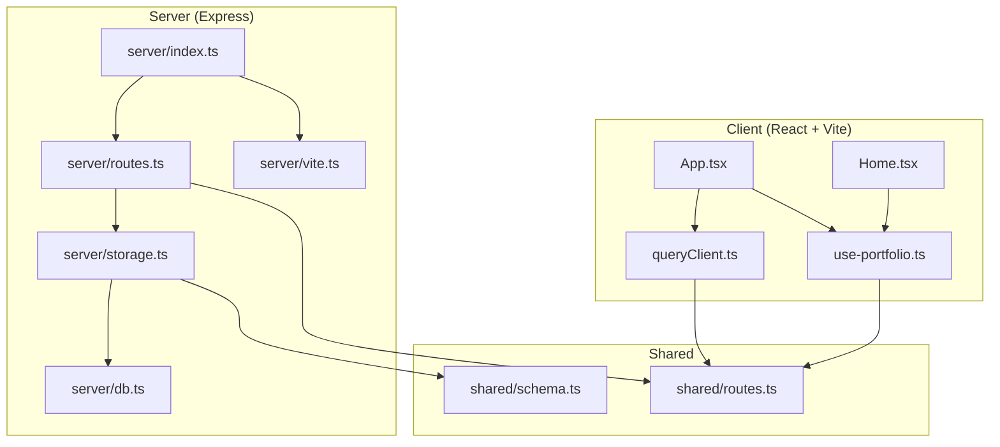
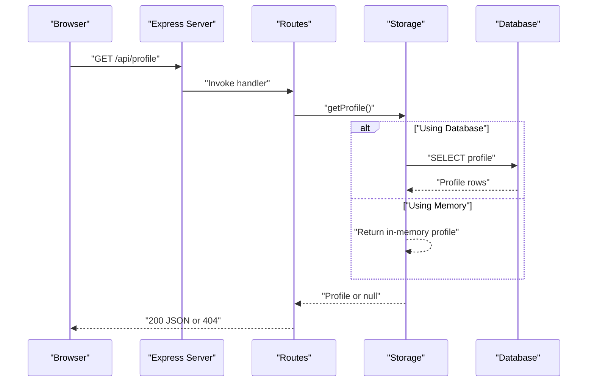
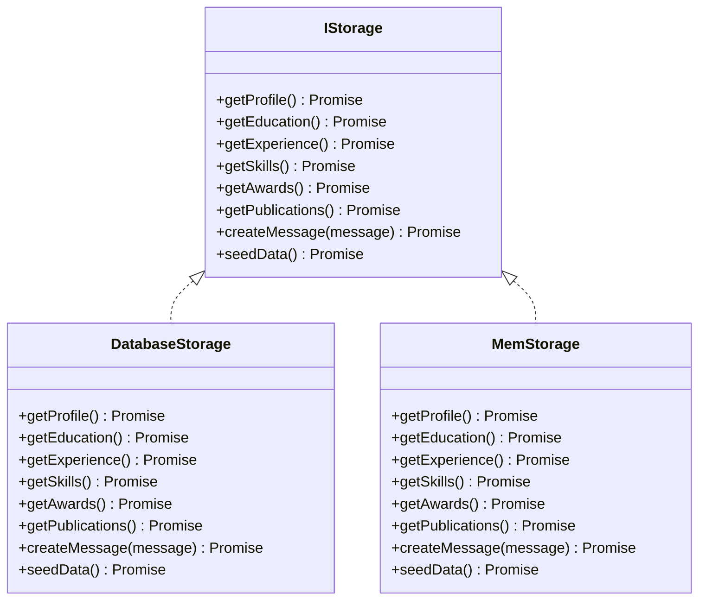
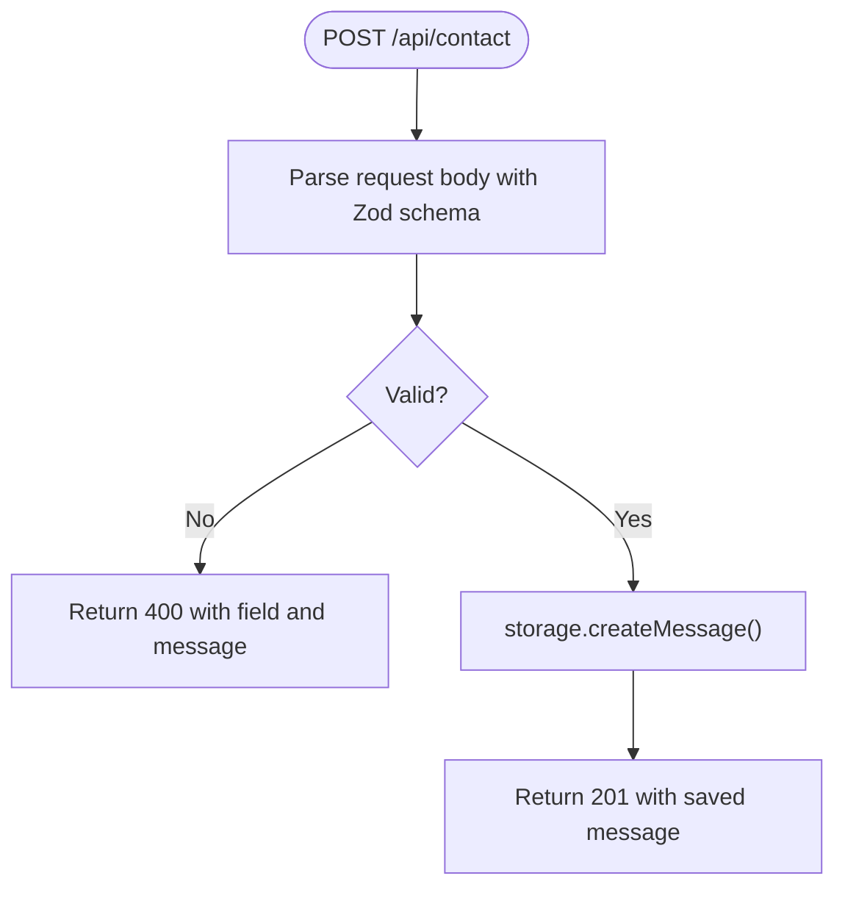
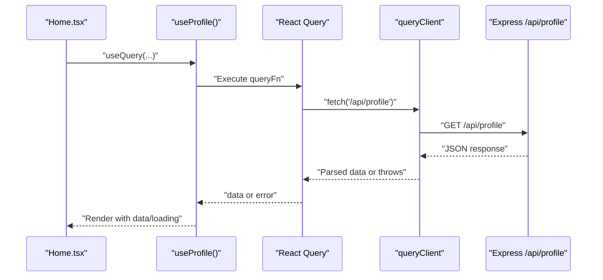
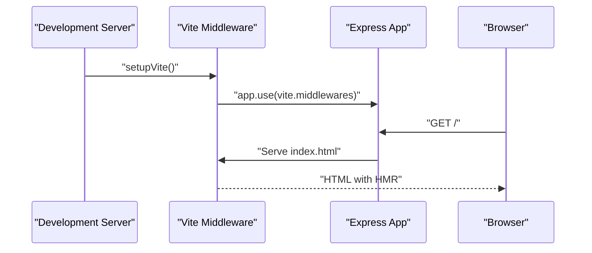
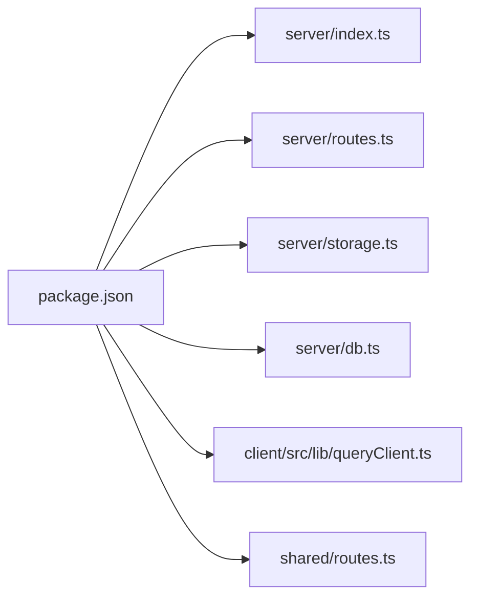

# Troubleshooting and FAQ

<cite>
**Referenced Files in This Document**
- [package.json](file://package.json)
- [README.md](file://README.md)
- [server/index.ts](file://server/index.ts)
- [server/db.ts](file://server/db.ts)
- [server/storage.ts](file://server/storage.ts)
- [server/routes.ts](file://server/routes.ts)
- [server/vite.ts](file://server/vite.ts)
- [vite.config.ts](file://vite.config.ts)
- [drizzle.config.ts](file://drizzle.config.ts)
- [shared/schema.ts](file://shared/schema.ts)
- [shared/routes.ts](file://shared/routes.ts)
- [client/src/lib/queryClient.ts](file://client/src/lib/queryClient.ts)
- [client/src/hooks/use-portfolio.ts](file://client/src/hooks/use-portfolio.ts)
- [client/src/pages/Home.tsx](file://client/src/pages/Home.tsx)
- [client/src/App.tsx](file://client/src/App.tsx)
</cite>

## Table of Contents
1. [Introduction](#introduction)
2. [Project Structure](#project-structure)
3. [Core Components](#core-components)
4. [Architecture Overview](#architecture-overview)
5. [Detailed Component Analysis](#detailed-component-analysis)
6. [Dependency Analysis](#dependency-analysis)
7. [Performance Considerations](#performance-considerations)
8. [Troubleshooting Guide](#troubleshooting-guide)
9. [Conclusion](#conclusion)
10. [Appendices](#appendices)

## Introduction
This document provides comprehensive troubleshooting and Frequently Asked Questions for the Personal Showcase portfolio application. It focuses on development environment setup, database connectivity, environment configuration, frontend build and Vite issues, React Query cache behavior, API connectivity and data loading, UI rendering, debugging/logging, and performance tuning. It also covers customization and extension topics.

## Project Structure
The application follows a dual-package structure:
- Frontend: React + Vite under client/
- Backend: Express server under server/, with database abstraction and API routes
- Shared: Types, schemas, and API route definitions under shared/

**Diagram sources**
- [client/src/App.tsx](file://client/src/App.tsx#L1-L51)
- [client/src/hooks/use-portfolio.ts](file://client/src/hooks/use-portfolio.ts#L1-L115)
- [client/src/lib/queryClient.ts](file://client/src/lib/queryClient.ts#L1-L58)
- [client/src/pages/Home.tsx](file://client/src/pages/Home.tsx#L1-L144)
- [server/index.ts](file://server/index.ts#L1-L103)
- [server/routes.ts](file://server/routes.ts#L1-L66)
- [server/storage.ts](file://server/storage.ts#L1-L323)
- [server/db.ts](file://server/db.ts#L1-L12)
- [server/vite.ts](file://server/vite.ts#L1-L59)
- [shared/routes.ts](file://shared/routes.ts#L1-L112)
- [shared/schema.ts](file://shared/schema.ts#L1-L86)

**Section sources**
- [README.md](file://README.md#L58-L71)
- [package.json](file://package.json#L1-L114)

## Core Components
- Backend server initializes logging, middleware, error handling, and conditionally mounts Vite in development. It listens on a configurable port and serves both API and client.
- Storage layer abstracts data access with two implementations: a database-backed implementation using Drizzle ORM and a memory-backed fallback when DATABASE_URL is absent.
- API routes expose endpoints for profile, education, experience, skills, awards, publications, and contact submission with Zod-based validation.
- Frontend uses React Query for data fetching, with a custom queryClient that centralizes error handling and caching behavior.
- Vite is integrated via middleware in development, serving the SPA shell and enabling HMR.

**Section sources**
- [server/index.ts](file://server/index.ts#L1-L103)
- [server/storage.ts](file://server/storage.ts#L1-L323)
- [server/routes.ts](file://server/routes.ts#L1-L66)
- [client/src/lib/queryClient.ts](file://client/src/lib/queryClient.ts#L1-L58)
- [server/vite.ts](file://server/vite.ts#L1-L59)

## Architecture Overview
The system integrates a React SPA with an Express API. The server logs requests, applies error handling, and serves static assets in production or Vite middleware in development. Data access is delegated to a storage abstraction that falls back to in-memory storage when no database is configured.

**Diagram sources**
- [server/index.ts](file://server/index.ts#L36-L60)
- [server/routes.ts](file://server/routes.ts#L15-L21)
- [server/storage.ts](file://server/storage.ts#L22-L58)
- [server/db.ts](file://server/db.ts#L1-L12)

## Detailed Component Analysis

### Database and Storage Layer
- Database availability is determined by the presence of DATABASE_URL. When present, a PostgreSQL connection is established via Drizzle ORM; otherwise, in-memory storage is used.
- The storage layer seeds default data on startup if the storage is empty.
- Drizzle configuration enforces DATABASE_URL presence for migrations.

**Diagram sources**
- [server/storage.ts](file://server/storage.ts#L9-L320)
- [server/db.ts](file://server/db.ts#L1-L12)

**Section sources**
- [server/storage.ts](file://server/storage.ts#L1-L323)
- [server/db.ts](file://server/db.ts#L1-L12)
- [drizzle.config.ts](file://drizzle.config.ts#L1-L15)

### API Routing and Validation
- Routes implement GET endpoints for profile, education, experience, skills, awards, and publications, plus a POST contact endpoint with Zod validation.
- Validation errors return structured 400 responses with field context.

**Diagram sources**
- [server/routes.ts](file://server/routes.ts#L48-L62)
- [shared/routes.ts](file://shared/routes.ts#L88-L98)

**Section sources**
- [server/routes.ts](file://server/routes.ts#L1-L66)
- [shared/routes.ts](file://shared/routes.ts#L1-L112)

### Frontend Data Fetching and React Query
- The queryClient centralizes request behavior, including credential inclusion, response validation, and default caching/stale behavior.
- Individual hooks encapsulate endpoint-specific queries and mutations, including contact form submission with Zod parsing and toast feedback.

**Diagram sources**
- [client/src/pages/Home.tsx](file://client/src/pages/Home.tsx#L10-L16)
- [client/src/hooks/use-portfolio.ts](file://client/src/hooks/use-portfolio.ts#L6-L16)
- [client/src/lib/queryClient.ts](file://client/src/lib/queryClient.ts#L27-L42)
- [server/routes.ts](file://server/routes.ts#L15-L21)

**Section sources**
- [client/src/lib/queryClient.ts](file://client/src/lib/queryClient.ts#L1-L58)
- [client/src/hooks/use-portfolio.ts](file://client/src/hooks/use-portfolio.ts#L1-L115)
- [client/src/pages/Home.tsx](file://client/src/pages/Home.tsx#L1-L144)

### Vite Development Server Integration
- In development, Vite runs as middleware, transforming the index.html and serving HMR. Runtime error overlays are enabled for better DX.
- The server listens on a fixed port suitable for Windows environments and avoids common permission issues.

**Diagram sources**
- [server/index.ts](file://server/index.ts#L83-L86)
- [server/vite.ts](file://server/vite.ts#L11-L32)
- [vite.config.ts](file://vite.config.ts#L1-L41)

**Section sources**
- [server/vite.ts](file://server/vite.ts#L1-L59)
- [vite.config.ts](file://vite.config.ts#L1-L41)
- [README.md](file://README.md#L53-L57)

## Dependency Analysis
- The backend depends on Express, Drizzle ORM, PostgreSQL driver, and session/state stores. Development relies on Vite and tsx.
- Frontend depends on React, React Query, and UI primitives. Shared schemas and routes are consumed by both client and server.

**Diagram sources**
- [package.json](file://package.json#L1-L114)
- [server/index.ts](file://server/index.ts#L1-L103)
- [server/routes.ts](file://server/routes.ts#L1-L66)
- [server/storage.ts](file://server/storage.ts#L1-L323)
- [server/db.ts](file://server/db.ts#L1-L12)
- [client/src/lib/queryClient.ts](file://client/src/lib/queryClient.ts#L1-L58)
- [shared/routes.ts](file://shared/routes.ts#L1-L112)

**Section sources**
- [package.json](file://package.json#L1-L114)

## Performance Considerations
- React Query defaults disable refetch on window focus and retries, and set infinite stale time to reduce unnecessary network calls. Consider adjusting these defaults per feature needs.
- The server logs API durations and responses for quick profiling of slow endpoints.
- In-memory storage avoids database overhead during local development but does not persist across process restarts.

[No sources needed since this section provides general guidance]

## Troubleshooting Guide

### Development Environment Setup
- Node.js version: The project recommends Node.js v18 or higher and has been verified on v22. Ensure your environment matches these versions to avoid engine-related issues.
- Windows-specific notes: The server runs on localhost:5001 to avoid socket permission issues, and cross-env is used to manage environment variables reliably.

Common symptoms and fixes:
- Port conflicts or permission errors on Windows: Change the PORT environment variable to another value or run as administrator. The server binds to 0.0.0.0 and respects the PORT environment variable.
- Environment variables not applied on Windows: Use cross-env in scripts to ensure consistent behavior across shells.

**Section sources**
- [README.md](file://README.md#L18-L57)
- [server/index.ts](file://server/index.ts#L88-L98)

### Dependency Installation Issues
- If dependency installation fails, verify:
  - Node.js and npm versions meet prerequisites.
  - You are running the install command from the project root containing package.json.
  - No proxy or registry issues block packages.
- If Vite or React plugin issues occur, clear node_modules and reinstall, ensuring TypeScript and Vite versions align with the project’s devDependencies.

**Section sources**
- [README.md](file://README.md#L18-L33)
- [package.json](file://package.json#L79-L104)

### Database Connection and Seeding
- Automatic fallback: If DATABASE_URL is not set, the application uses in-memory storage and seeds default data on startup.
- Production/PostgreSQL: Set DATABASE_URL and run the migration script to initialize schema and seed data.
- Migration failures: Ensure DATABASE_URL is present; the migration config requires DATABASE_URL.

Symptoms and fixes:
- Empty data in development: Confirm in-memory seeding executed on startup.
- Migration errors: Provide a valid DATABASE_URL and rerun the migration script.

**Section sources**
- [README.md](file://README.md#L46-L51)
- [server/storage.ts](file://server/storage.ts#L60-L225)
- [drizzle.config.ts](file://drizzle.config.ts#L3-L5)
- [server/db.ts](file://server/db.ts#L7-L11)

### Environment Variable Configuration
- Required variables:
  - DATABASE_URL: Enables PostgreSQL mode; omit to use in-memory storage.
  - PORT: Controls the listening port; defaults to 5001 if unset.
- Verify variables are loaded in your shell or via a .env file. On Windows, cross-env ensures consistent behavior.

**Section sources**
- [server/db.ts](file://server/db.ts#L7-L11)
- [server/index.ts](file://server/index.ts#L92-L98)
- [README.md](file://README.md#L48-L51)

### Frontend Build and Vite Issues
- Vite middleware in development: If the SPA route returns a 404 or HMR fails, confirm Vite middleware is registered before catch-all routes and that the index.html path resolution is correct.
- Runtime error overlay: Errors are surfaced in the browser with stack traces; fix the underlying TS/JS issue and refresh.
- Aliases and build paths: Ensure @, @shared, and @assets aliases match actual folder locations.

**Section sources**
- [server/index.ts](file://server/index.ts#L83-L86)
- [server/vite.ts](file://server/vite.ts#L11-L59)
- [vite.config.ts](file://vite.config.ts#L22-L33)

### API Endpoint Connectivity and Data Loading
- API base path: All endpoints are prefixed with /api and defined centrally.
- Contact form validation: Zod errors return structured 400 responses with field context; ensure client-side validation mirrors server expectations.
- React Query behavior: Queries throw on non-OK responses; handle errors in components or via global error handlers.

Common issues and resolutions:
- 404 on profile or lists: Verify the storage implementation and that seeding occurred.
- 400 on contact: Inspect the returned field and message to correct input.
- UI blank or loading: Check React Query query keys and ensure endpoints are reachable.

**Section sources**
- [shared/routes.ts](file://shared/routes.ts#L32-L98)
- [server/routes.ts](file://server/routes.ts#L15-L62)
- [client/src/hooks/use-portfolio.ts](file://client/src/hooks/use-portfolio.ts#L78-L115)
- [client/src/lib/queryClient.ts](file://client/src/lib/queryClient.ts#L3-L8)

### React Query Cache and UI Rendering
- Default behavior: Infinite staleTime, disabled refetchOnWindowFocus, and no retries reduce network churn. If you expect frequent updates, adjust defaults per feature.
- Unauthorized handling: The generic query function supports returning null or throwing on 401 depending on configuration.
- UI rendering: Components render skeletons while data is loading; ensure query keys match server endpoints.

**Section sources**
- [client/src/lib/queryClient.ts](file://client/src/lib/queryClient.ts#L44-L57)
- [client/src/pages/Home.tsx](file://client/src/pages/Home.tsx#L37-L98)

### Logging and Debugging Strategies
- Server logs: Requests to /api include method, path, status, duration, and response payload for quick diagnosis.
- Error handling: Centralized error handler returns JSON with a message and preserves previous status codes.
- Vite logger: Errors during SSR transform exit the process to surface issues early.

**Section sources**
- [server/index.ts](file://server/index.ts#L25-L76)
- [server/vite.ts](file://server/vite.ts#L21-L26)

### Performance Troubleshooting
- Reduce unnecessary refetches: Keep infinite staleTime for static content; enable refetchOnWindowFocus only for dynamic data.
- Monitor API durations: Use server logs to identify slow endpoints and optimize queries or database indexes.
- Memory vs. database: In-memory storage is fast but ephemeral; switch to PostgreSQL for persistence and advanced queries.

**Section sources**
- [client/src/lib/queryClient.ts](file://client/src/lib/queryClient.ts#L44-L57)
- [server/index.ts](file://server/index.ts#L47-L56)

### Frequently Asked Questions

Q: How do I switch from in-memory storage to PostgreSQL?
A: Set DATABASE_URL to a valid PostgreSQL connection string and run the migration script to initialize schema and seed data.

Q: Can I customize the seeded data?
A: Yes. Modify the seed methods in the storage implementation to reflect your own profile and content.

Q: How can I integrate external services (e.g., analytics)?
A: Add service initialization in the server bootstrap and expose endpoints or hooks in the frontend as needed. Keep environment variables scoped and documented.

Q: Why does the app run on port 5001?
A: The server listens on the PORT environment variable with a default of 5001 to avoid Windows socket permission issues.

Q: How do I extend the portfolio sections?
A: Add new endpoints in the routes, update the shared schema and route definitions, implement storage methods, and wire them into React hooks and pages.

Q: What is the purpose of the shared schema and routes?
A: They provide type-safe contracts between client and server, ensuring consistent validation and reducing integration errors.

**Section sources**
- [README.md](file://README.md#L48-L57)
- [server/storage.ts](file://server/storage.ts#L60-L225)
- [shared/schema.ts](file://shared/schema.ts#L1-L86)
- [shared/routes.ts](file://shared/routes.ts#L1-L112)

## Conclusion
This guide consolidates practical steps to diagnose and resolve common issues in the Personal Showcase application. By aligning environment configuration, understanding the storage fallback, leveraging React Query defaults, and using server-side logging, most problems can be quickly identified and resolved. For extensions and integrations, rely on the shared schema and route definitions to maintain type safety and consistency.

[No sources needed since this section summarizes without analyzing specific files]

## Appendices

### Quick Checklist
- Node.js version meets prerequisites
- DATABASE_URL configured for PostgreSQL or omitted for in-memory
- PORT set appropriately (default 5001)
- Run migrations if using PostgreSQL
- Clear caches and reinstall dependencies if builds fail
- Use server logs and Vite overlays for debugging

[No sources needed since this section provides general guidance]